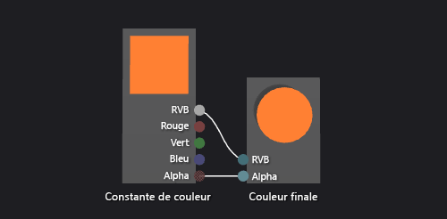

# Procédure : Créer un nuanceur de couleur de base

Cet article montre comment utiliser le concepteur Shader et DGSL (Directed Graph Shader Language) pour créer un nuanceur de couleurs simples. Ce nuanceur définit la couleur finale sur une valeur de couleur RVB de constante.

## Pour créer un nuanceur de couleurs simples

Vous pouvez implémenter un nuanceur de couleur plat en écrivant la valeur de couleur d’une constante de couleur RVB sur la couleur de sortie finale.

Avant de commencer, assurez-vous que la fenêtre **Propriétés** et la **Boîte à outils** sont affichées.

1.  Créez un shader DGSL à utiliser. Pour plus d’informations sur l’ajout d’un nuanceur DGSL à votre projet, consultez la section Prise en main de l’article [Concepteur de nuanceur](../designers/shader-designer.md).

2.  Supprimez le nœud **Couleur du point**. À l’aide de l’outil **Sélection**, sélectionnez le nœud **Couleur du point** puis, dans la barre de menus, choisissez **Modifier** > **Supprimer**.

3.  Ajoutez un nœud **Constante de couleur** au graphique. Dans la **Boîte à outils**, sous **Constantes**, sélectionnez **Constante de couleur** et déplacez-la vers l’aire de conception.

4.  Spécifiez une valeur de couleur pour le nœud **Constante de couleur**. À l’aide de l’outil **Sélection**, sélectionnez le nœud **Constante de couleur**, puis, dans la fenêtre **Propriétés**, dans la propriété **Sortie**, spécifiez une valeur de couleur. Pour l’orange, spécifiez la valeur (1,0, 0,5, 0,2, 1,0).

5.  Connectez la constante de couleur à la couleur finale. Pour créer les connexions, déplacez le terminal **RVB** du nœud **Constante de couleur** vers le terminal **RVB** du nœud **Couleur finale**, puis le terminal **Alpha** du nœud **Constante de couleur** vers le terminal **Alpha** du nœud **Couleur finale**. Ces connexions définissent la couleur finale sur la constante de couleur définie à l’étape précédente.

L’illustration suivante présente le graphique du nuanceur terminé ainsi qu’un aperçu du nuanceur appliqué à un cube.

> [!NOTE]
> Une couleur orange a été spécifiée dans l’illustration pour mettre en évidence l’effet du nuanceur.

Certaines formes peuvent fournir de meilleurs aperçus pour certains nuanceurs. Pour plus d’informations sur l’aperçu des nuanceurs dans le concepteur de nuanceur, consultez l’article [Concepteur de nuanceur](../designers/shader-designer.md).

## Voir aussi

- [Guide pratique pour appliquer un nuanceur à un modèle 3D](../designers/how-to-apply-a-shader-to-a-3-d-model.md)
- [Guide pratique pour exporter un nuanceur](../designers/how-to-export-a-shader.md)
- [Concepteur Shader](../designers/shader-designer.md)
- [Nœuds du concepteur Shader](../designers/shader-designer-nodes.md)