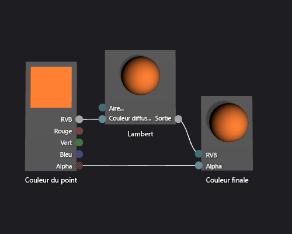

# Proc&#233;dure&#160;: cr&#233;er un nuanceur Lambert de base
[!INCLUDE[vs2017banner](../code-quality/includes/vs2017banner.md)]

Ce document montre comment utiliser le concepteur Shader et le langage DGSL \(Directed Graph Shader Language\) pour créer un nuanceur d'éclairage qui implémente le modèle d'éclairage Lambert classique.  
  
 Ce document démontre les activités suivantes :  
  
-   Ajout de nœuds dans un graphique shader  
  
-   Déconnexion de nœuds  
  
-   Connexion de nœuds  
  
## Le modèle d'éclairage Lambert  
 Le modèle d'éclairage Lambert incorpore un éclairage ambiant et directionnel pour ombrer des objets dans une scène 3D.  Le composant ambiant fournit un niveau d'illumination de base dans la scène 3D.  Le composant directionnel fournit une illumination supplémentaire à partir d'une source de lumière directionnelle \(éloignée\).  L'illumination ambiante affecte toutes les surfaces de la scène de façon égale, indépendamment de leur orientation.  Pour une surface donnée, il s'agit du produit de la couleur ambiante de la surface et de la couleur, ainsi que de l'intensité de l'éclairage ambiant dans la scène.  L'éclairage directionnel affecte chaque surface de la scène différemment, selon l'orientation de la surface par rapport à la direction de la source de lumière.  Il s'agit d'un produit de la couleur diffuse et de l'orientation de la surface et de la couleur, de l'intensité et de la direction des sources de lumière.  Les surfaces qui sont directement orientées vers la source de lumière reçoivent la contribution maximale et celles qui sont éloignées ne reçoivent pas de contribution.  Sous le modèle d'éclairage Lambert, le composant ambiant et un ou plusieurs composants directionnels sont combinés pour déterminer la contribution de la couleur diffuse sur chaque point de l'objet.  
  
 Avant de commencer, assurez\-vous que la fenêtre **Propriétés** et que la **Boîte à outils** sont affichées.  
  
#### Pour créer un shader Lambert  
  
1.  Créez un shader DGSL à utiliser.  Pour plus d'informations sur l'ajout d'un shader DGSL à votre projet, consultez la section Mise en route dans [Concepteur Shader](../designers/shader-designer.md).  
  
2.  Déconnectez le nœud **Couleur du point** du nœud **Couleur finale**.  Choisissez le terminal **RGB** du nœud **Couleur du point**, puis choisissez **Rompre les liaisons**.  Laissez le terminal **Alpha** connecté.  
  
3.  Ajoutez un nœud **Lambert** au graphique.  Dans **Boîte à outils**, sous **Utilitaire**, sélectionnez **Lambert** et faites glisser cette option sur l'aire de conception.  Le nœud Lambert calcule le total des contributions de couleur diffuse sur le pixel, en fonction de les paramètres ambiants et diffus d'éclairage.  
  
4.  Connectez le nœud **Couleur du point** au nœud **Lambert**.  En mode **Sélectionner**, déplacez le terminal **RVB** du nœud **Couleur du point** au terminal **Couleur diffuse** du nœud **Lambert**.  Cette connexion fournit au nœud Lambert la couleur interpolée diffuse du pixel.  
  
5.  Connectez la valeur de couleur calculée à la couleur finale.  Déplacez le terminal **Sortie** du nœud **Lambert** vers le terminal **RVB** du nœud **Couleur finale**.  
  
 L'illustration suivante montre le graphique de nuanceur terminé et un aperçu du nuanceur appliqué à un modèle de théière.  
  
> [!NOTE]
>  Pour imieux illustrer l'effet du shader dans cette illustration, une couleur orange a été spécifiée à l'aide du paramètre **MaterialDiffuse** du shader.  Un jeu ou une application peut utiliser ce paramètre pour fournir une valeur de couleur unique pour chaque objet.  Pour plus d'informations sur les paramètres matériels, consultez la section affichage d'un aperçu shaders dans [Concepteur Shader](../designers/shader-designer.md).  
  
   
  
 Certaines formes peuvent fournir de meilleurs aperçus pour certains nuanceurs.  Pour plus d'informations sur la façon d'afficher un aperçu des shaders dans Shader Designer consultez la section affichage d'un aperçu shader dans [Concepteur Shader](../designers/shader-designer.md)  
  
 L'illustration suivante montre le shader décrit dans ce document appliqué à un modèle 3D.  
  
   
  
 Pour plus d'informations sur l'application d'un nuanceur à un modèle 3D, consultez [Comment : appliquer un nuanceur à un modèle 3D](../designers/how-to-apply-a-shader-to-a-3-d-model.md).  
  
## Voir aussi  
 [Comment : appliquer un nuanceur à un modèle 3D](../designers/how-to-apply-a-shader-to-a-3-d-model.md)   
 [Procédure : exporter un nuanceur](../designers/how-to-export-a-shader.md)   
 [Comment : créer un nuanceur Phong de base](../designers/how-to-create-a-basic-phong-shader.md)   
 [Concepteur Shader](../designers/shader-designer.md)   
 [Nœuds du concepteur Shader](../designers/shader-designer-nodes.md)