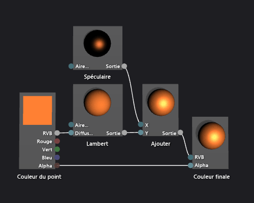

# Comment&#160;: cr&#233;er un nuanceur Phong de base
[!INCLUDE[vs2017banner](../code-quality/includes/vs2017banner.md)]

Ce document montre comment utiliser le concepteur Shader et le langage DGSL \(Directed Graph Shader Language\) pour créer un nuanceur d'éclairage qui implémente le modèle d'éclairage Phong classique.  
  
 Ce document démontre les activités suivantes :  
  
-   Ajout de nœuds dans un graphique shader  
  
-   Déconnexion de nœuds  
  
-   Connexion de nœuds  
  
## Le modèle d'éclairage Phong  
 Le modèle d'éclairage Phong étend le modèle d'éclairage Lambert pour inclure la mise en surbrillance spéculaire, qui simule les propriétés de réflexion d'une surface.  Le composant spéculaire fournit une illumination supplémentaire par la même source de lumière directionnelle utilisé dans le modèle d'éclairage Lambert, mais sa contribution à la couleur finale est traitée différemment.  L'éclairage spéculaire affecte chaque surface de la scène différemment, selon la relation entre la direction de la vue, celle de la source de lumière, et l'orientation de la surface.  Il s'agit d'un produit de la couleur spéculaire, de la puissance spéculaire, et de l'orientation de la surface, et de la couleur, de l'intensité et de la direction de la source de lumière.  Les surfaces qui reflètent la source de lumière directement à celui qui regarde reçoivent la contribution spéculaire maximale et celles qui reflètent la source de lumière loin de celui ci ne reçoivent pas de contribution.  Sous le modèle d'éclairage Phong, un ou plusieurs composants spéculaires sont combinés pour déterminer la couleur et l'intensité de la mise en surbrillance spéculaire de chaque point sur l'objet, puis elles sont ajoutées au résultat du modèle d'éclairage Lambert afin de produire la couleur finale.  
  
 Pour plus d'informations sur le modèle d'éclairage Lambert, consultez [Procédure : créer un nuanceur Lambert de base](../designers/how-to-create-a-basic-lambert-shader.md).  
  
 Avant de commencer, assurez\-vous que la fenêtre **Propriétés** et que la **Boîte à outils** sont affichées.  
  
#### Pour créer un shader Phong  
  
1.  Créez un shader Lambert, comme décrit dans [Procédure : créer un nuanceur Lambert de base](../designers/how-to-create-a-basic-lambert-shader.md).  
  
2.  Déconnectez le nœud **Lambert** du nœud **Couleur finale**.  Choisissez le terminal **RVB** du nœud **Lambert**, puis choisissez **Rompre les liaisons**.  Le nœud ajouté à l'étape suivante bénéficie ainsi d'un espace supplémentaire.  
  
3.  Ajouter un nœud **Ajouter** au graphique.  Dans **Boîte à outils**, sous **Math**, sélectionnez **Ajouter** et faites glisser cette option sur l'aire de conception.  
  
4.  Ajoutez un nœud **Spéculaire** au graphique.  Dans **Boîte à outils**, sous **Utilitaire**, sélectionnez **Spéculaire** et faites glisser cette option sur l'aire de conception.  
  
5.  Ajoutez la contribution spéculaire.  Déplacez le terminal **Sortie** du nœud **Spéculaire** vers le terminal **X** du nœud **Ajouter**, puis déplacez le terminal **Sortie** du nœud **Lambert** vers le terminal **Y** du nœud **Ajouter**.  Ces connexions combinent les contributions diffuses et spéculaires de couleur pour le pixel.  
  
6.  Connectez la valeur de couleur calculée à la couleur finale.  Déplacez le terminal **Sortie** du nœud **Ajouter** vers le terminal **RVB** du nœud **Couleur finale**.  
  
 L'illustration suivante montre le graphique de nuanceur terminé et un aperçu du nuanceur appliqué à un modèle de théière.  
  
> [!NOTE]
>  Pour illustrer mieux l'effet du shader dans cette illustration, une couleur orange a été spécifiée à l'aide du paramètre **MaterialDiffuse** du shader, et un rendu métallique a été spécifié à l'aide des paramètres **MaterialSpecular** et **MaterialSpecularPower**.  Pour plus d'informations sur les paramètres matériels, consultez la section affichage d'un aperçu shaders dans [Concepteur Shader](../designers/shader-designer.md).  
  
   
  
 Certaines formes peuvent fournir de meilleurs aperçus pour certains nuanceurs.  Pour plus d'informations sur la façon d'afficher un aperçu des shaders dans Shader Designer consultez la section affichage d'un aperçu shaders dans [Concepteur Shader](../designers/shader-designer.md)  
  
 L'illustration suivante montre le shader décrit dans ce document appliqué à un modèle 3D.  La propriété **MaterialSpecular** est définie sur \(1,00, 0,50, 0,20, 0,00\), et sa propriété  **MaterialSpecularPower** sur 16.  
  
> [!NOTE]
>  La propriété **MaterialSpecular** détermine la fin apparente du matériel externe.  Une surface brillante telle que le verre ou le plastique a tendance à avoir une couleur spéculaire correspondant à un blanc vif.  Une surface métallique a tendance à avoir une couleur spéculaire proche de sa couleur diffuse.  Une surface satinée a tendance à avoir une couleur spéculaire correspondant à un gris foncé.  
>   
>  La propriété **MaterialSpecularPower** détermine l'intensité des reflets spéculaires.  Les puissances spéculaires fortes simulent des éclairages plus ternes et plus localisés.  Les puissances spéculaires peu élevées simulent des surbrillances intenses et balayantes qui peuvent saturer et masquer la couleur de toute la surface.  
  
   
  
 Pour plus d'informations sur l'application d'un nuanceur à un modèle 3D, consultez [Comment : appliquer un nuanceur à un modèle 3D](../designers/how-to-apply-a-shader-to-a-3-d-model.md).  
  
## Voir aussi  
 [Comment : appliquer un nuanceur à un modèle 3D](../designers/how-to-apply-a-shader-to-a-3-d-model.md)   
 [Procédure : exporter un nuanceur](../designers/how-to-export-a-shader.md)   
 [Procédure : créer un nuanceur Lambert de base](../designers/how-to-create-a-basic-lambert-shader.md)   
 [Concepteur Shader](../designers/shader-designer.md)   
 [Nœuds du concepteur Shader](../designers/shader-designer-nodes.md)