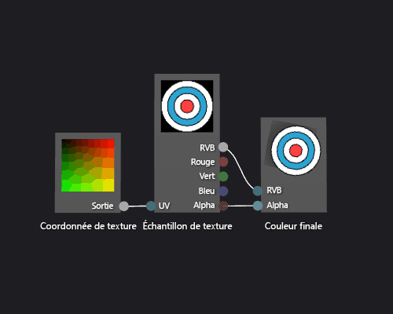

# Guide pratique pour créer un nuanceur de texture de base

Cet article montre comment utiliser le concepteur Shader et DGSL (Directed Graph Shader Language) pour créer un nuanceur de texture unique. Ce nuanceur définit la couleur finale directement sur les valeurs RVB et alpha échantillonnées à partir de la texture.

## Créer un nuanceur de texture de base

Vous pouvez implémenter un nuanceur de texture unique de base en écrivant les valeurs de couleur et alpha d’un échantillon de texture directement dans la couleur de sortie finale.

Avant de commencer, veillez à ce que la fenêtre **Propriétés** et la **Boîte à outils** soient affichées.

1. Créez un shader DGSL à utiliser. Pour plus d’informations sur l’ajout d’un nuanceur DGSL à votre projet, consultez la section Prise en main de l’article [Concepteur de nuanceur](../designers/shader-designer.md).

2. Supprimez le nœud **Couleur du point**. En mode **Sélection**, sélectionnez le nœud **Couleur du point** puis, dans la barre de menus, choisissez **Modifier** > **Supprimer**. Le nœud ajouté à l'étape suivante bénéficie ainsi d'un espace supplémentaire.

3. Ajoutez un nœud **Échantillon de texture** au graphique. Dans la **Boîte à outils**, sous **Texture**, sélectionnez **Échantillon de texture** et déplacez-le vers l’aire de conception.

4. Ajoutez un nœud **Coordonnée de texture** au graphique. Dans la **Boîte à outils**, sous **Texture**, sélectionnez **Coordonnée de texture** et déplacez-la vers l’aire de conception.

5. Choisissez une texture à appliquer. En mode **Sélection**, sélectionnez le nœud **Échantillon de texture**, puis, dans la fenêtre **Propriétés**, spécifiez la texture que vous souhaitez utiliser à l’aide de la propriété **Nom de fichier**.

6. Rendez la texture publiquement accessible. Sélectionnez le nœud **Échantillon de texture**, puis, dans la fenêtre **Propriétés**, définissez la propriété **Accès** sur **Public**. À présent, vous pouvez définir la texture à partir d’un autre outil, par exemple l’**Éditeur de modèle**.

7. Connectez les coordonnées de texture à l’échantillon de texture. En mode **Sélection**, déplacez le terminal **Sortie** du nœud **Coordonnée de texture** vers le terminal **UV** du nœud **Échantillon de texture**. Cette connexion échantillonne la texture aux coordonnées spécifiées.

8. Connectez l’échantillon de texture à la couleur finale. Déplacez le terminal **RVB** du nœud **Échantillon de texture** vers le terminal **RVB** du nœud **Couleur finale**, puis le terminal **Alpha** du nœud **Échantillon de texture** vers le terminal **Alpha** du nœud **Couleur finale**.

L’illustration suivante présente le graphique du nuanceur terminé ainsi qu’un aperçu du nuanceur appliqué à un cube.

> [!NOTE]
> Dans cette illustration, un plan est utilisé comme forme d’aperçu, et une texture a été spécifiée pour mettre en évidence l’effet du nuanceur.

Certaines formes peuvent fournir de meilleurs aperçus pour certains nuanceurs. Pour plus d’informations sur l’aperçu des nuanceurs dans le concepteur de nuanceur, consultez [Shader designer](../designers/shader-designer.md) .

## Voir aussi

- [Comment : appliquer un nuanceur à un modèle 3D](../designers/how-to-apply-a-shader-to-a-3-d-model.md)
- [Éditeur d’images](../designers/image-editor.md)
- [Concepteur Shader](../designers/shader-designer.md)
- [Nœuds du concepteur Shader](../designers/shader-designer-nodes.md)
