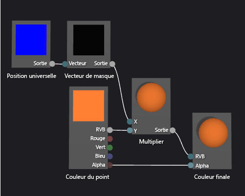

# Guide pratique pour créer un nuanceur de géométrie dégradé

Cet article montre comment utiliser le concepteur Shader et DGSL (Directed Graph Shader Language) pour créer un nuanceur de dégradés basé sur la géométrie. Ce nuanceur met à l’échelle une valeur de couleur RVB de constante en fonction de la hauteur de chaque point d’un objet dans l’espace universel.

## Pour créer un nuanceur de dégradés basé sur la géométrie

Vous pouvez implémenter un nuanceur de géométrie en incorporant la position du pixel dans votre nuanceur. Dans les langages d’ombrage, un pixel contient plus d’informations que sa couleur et son emplacement sur un écran 2D. Un pixel, appelé *fragment* dans certains systèmes, est une collection de valeurs qui décrivent la surface correspondant à un pixel. Le nuanceur décrit dans ce document utilise la hauteur de chaque pixel d’un objet 3D dans l’espace universel pour affecter la couleur de sortie finale du fragment.

Avant de commencer, veillez à ce que la fenêtre **Propriétés** et la **Boîte à outils** soient affichées.

1. Créez un nuanceur DGSL à utiliser. Pour plus d’informations sur l’ajout d’un nuanceur DGSL à votre projet, consultez la section Prise en main de l’article [Concepteur de nuanceur](../designers/shader-designer.md).

2. Déconnectez le nœud **Couleur du point** du nœud **Couleur finale**. Choisissez le terminal **RVB** du nœud **Couleur du point**, puis choisissez **Rompre les liaisons**. Le nœud ajouté à l'étape suivante bénéficie ainsi d'un espace supplémentaire.

3. Ajouter un nœud **Multiplier** au graphique. Dans la **Boîte à outils**, sous **Math**, sélectionnez **Multiplier** et déplacez-le vers l’aire de conception.

4. Ajoutez un nœud **Vecteur de masque** au graphique. Dans la **Boîte à outils**, sous **Utilitaire**, sélectionnez **Vecteur de masque** et déplacez-le vers l’aire de conception.

5. Spécifiez des valeurs de masque pour le nœud **Vecteur de masque**. En mode **Sélection**, sélectionnez le nœud **Vecteur de masque**, puis, dans la fenêtre **Propriétés**, définissez la propriété **Vert / Y** sur **True**, puis les propriétés **Rouge / X**, **Bleu / Z** et **Alpha / W** sur **False**. Dans cet exemple, les propriétés **Rouge / X**, **Vert / Y** et **Bleu / Z** correspondent aux composants x, y et z du nœud **Position universelle**, et la propriété **Alpha / W** n’est pas utilisée. Comme seule la propriété **Vert / Y** est définie sur **True**, seul le composant y du vecteur d’entrée demeure après le masquage.

6. Ajoutez un nœud **Position universelle** au graphique. Dans la **Boîte à outils**, sous **Constantes**, sélectionnez **Position universelle** et déplacez-la vers l’aire de conception.

7. Masquez la position du fragment dans l’espace universel. En mode **Sélection**, déplacez le terminal **Sortie** du nœud **Position universelle** vers le terminal **Vecteur** du nœud **Vecteur de masque**. Cette connexion masque la position du fragment pour ignorer les composants x et z.

8. Multipliez la constante de couleur RVB par la position masquée dans l’espace universel. Déplacez le terminal **RVB** du nœud **Couleur du point** vers le terminal **Y** du nœud **Multiplier**, puis le terminal **Sortie** du nœud **Vecteur de masque** vers le terminal **X** du nœud **Multiplier**. Cette connexion met à l’échelle la valeur de couleur en fonction de la hauteur du pixel dans l’espace universel.

9. Connectez la valeur de couleur mise à l’échelle à la couleur finale. Déplacez le terminal **Sortie** du nœud **Multiplier** vers le terminal **RVB** du nœud **Couleur finale**.

L’illustration suivante présente le graphique du nuanceur terminé ainsi qu’un aperçu du nuanceur appliqué à une sphère.

> [!NOTE]
> Dans cette illustration, la couleur orange est spécifiée pour mettre en évidence l’effet du nuanceur, mais comme la forme d’aperçu n’a pas de position dans l’espace universel, le nuanceur ne peut pas être entièrement visualisé dans le concepteur de nuanceur. Le nuanceur doit être visualisé dans une scène réelle pour montrer l’effet réel.

Certaines formes peuvent fournir de meilleurs aperçus pour certains nuanceurs. Pour plus d’informations sur l’aperçu des nuanceurs dans le concepteur de nuanceur, consultez la section **Aperçu des nuanceurs** de l’article [Concepteur de nuanceur](../designers/shader-designer.md).

L’illustration suivante montre le nuanceur, décrit dans ce document, appliqué à la scène 3D qui est illustrée dans [Guide pratique pour modéliser un terrain 3D](../designers/how-to-model-3-d-terrain.md). L’intensité de la couleur augmente avec la hauteur du point dans l’espace universel.

Pour plus d’informations sur l’application d’un nuanceur à un modèle 3D, consultez [Guide pratique pour appliquer un nuanceur à un modèle 3D](../designers/how-to-apply-a-shader-to-a-3-d-model.md).

## Voir aussi

- [Guide pratique pour appliquer un nuanceur à un modèle 3D](../designers/how-to-apply-a-shader-to-a-3-d-model.md)
- [Guide pratique pour exporter un nuanceur](../designers/how-to-export-a-shader.md)
- [Guide pratique pour modéliser un terrain 3D](../designers/how-to-model-3-d-terrain.md)
- [Guide pratique pour créer un nuanceur de texture avec nuances de gris](../designers/how-to-create-a-grayscale-texture-shader.md)
- [Concepteur de nuanceur](../designers/shader-designer.md)
- [Nœuds du concepteur Shader](../designers/shader-designer-nodes.md)
