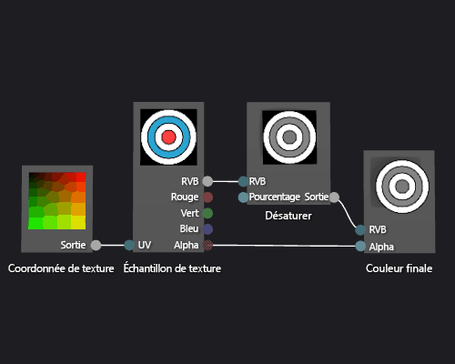

# Guide pratique pour créer un nuanceur de texture avec nuances de gris

Cet article montre comment utiliser le concepteur Shader et DGSL (Directed Graph Shader Language) pour créer un nuanceur de texture avec nuances de gris. Ce nuanceur modifie la valeur de couleur RVB de l’échantillon de texture, puis l’utilise avec la valeur alpha non modifiée pour définir la couleur finale.

## Créer un nuanceur de texture avec nuances de gris

Vous pouvez implémenter un nuanceur de texture avec nuances de gris en modifiant la valeur de couleur d’un échantillon de texture avant de l’écrire dans la couleur de sortie finale.

Avant de commencer, veillez à ce que la fenêtre **Propriétés** et la **Boîte à outils** soient affichées.

1. Créez un nuanceur de texture de base en suivant la description de l’article [Guide pratique pour créer un nuanceur de texture de base](../designers/how-to-create-a-basic-texture-shader.md).

2. Déconnectez le terminal **RVB** du nœud **Échantillon de texture** à partir du terminal **RVB** du nœud **Couleur finale** . En mode **Sélection** , choisissez le terminal **RVB** du nœud **Échantillon de texture** , puis **Rompre les liaisons** . Le nœud ajouté à l'étape suivante bénéficie ainsi d'un espace supplémentaire.

3. Ajoutez un nœud **Désaturer** au graphique. Dans la **Boîte à outils** , sous **Filtres** , sélectionnez **Désaturer** et déplacez-le vers l’aire de conception.

4. Calculez la valeur de nuances de gris à l’aide du nœud **Désaturer** . En mode **Sélection** , déplacez le terminal **RVB** du nœud **Échantillon de texture** vers le terminal **RVB** du nœud **Désaturer** .

    > [!NOTE]
    > Par défaut, le nœud **Désaturer** désature entièrement la couleur d’entrée et utilise les pondérations de luminance standard pour la conversion des nuances de gris. Vous pouvez modifier le comportement du nœud **Désaturer** en changeant la valeur de la propriété **Luminance** ou en ne désaturant que partiellement la couleur d’entrée. Pour désaturer partiellement la couleur d’entrée, indiquez une valeur scalaire comprise dans la plage [0,1] pour le terminal **Pour cent** du nœud **Désaturer** .

5. Connectez la valeur de couleur de nuances de gris à la couleur finale. Déplacez le terminal **Sortie** du nœud **Désaturer** vers le terminal **RVB** du nœud **Couleur finale** .

L’illustration suivante présente le graphique du nuanceur terminé ainsi qu’un aperçu du nuanceur appliqué à un cube.

> [!NOTE]
> Dans cette illustration, un plan est utilisé comme forme d’aperçu, et une texture a été spécifiée pour mettre en évidence l’effet du nuanceur.

Certaines formes peuvent fournir de meilleurs aperçus pour certains nuanceurs. Pour plus d’informations sur l’aperçu des nuanceurs dans le concepteur de nuanceur, consultez l’article [Concepteur de nuanceur](../designers/shader-designer.md).

## Voir aussi

- [Comment : appliquer un nuanceur à un modèle 3D](../designers/how-to-apply-a-shader-to-a-3-d-model.md)
- [Comment : exporter un nuanceur](../designers/how-to-export-a-shader.md)
- [Éditeur d’images](../designers/image-editor.md)
- [Concepteur Shader](../designers/shader-designer.md)
- [Nœuds du concepteur Shader](../designers/shader-designer-nodes.md)
