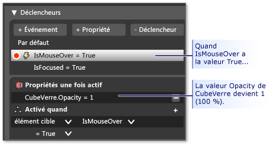

# Insérer des contrôles et modifier leur comportement dans le concepteur XAML

Les contrôles permettent aux utilisateurs d'interagir avec votre application. Elles peuvent s'avérer utiles pour collecter des informations et effectuer des actions, comme animer un objet ou interroger une source de données.

## Ajouter des contrôles à la planche graphique

Vous pouvez faire glisser des contrôles du panneau **Composants** vers la **planche graphique**, puis les modifier dans la fenêtre **Propriétés** .

### Créer un contrôle à partir d’une image, d’une forme ou d’un tracé

Vous pouvez transformer n'importe quel objet en contrôle.

Par exemple, imaginez une image de téléviseur au milieu d'une page. Vous pourriez créer des contrôles à partir de petites images représentant des boutons de téléviseur. Les utilisateurs pourraient ensuite cliquer sur ces boutons pour changer de chaîne.

Cela serait possible, car les boutons seraient dès lors des contrôles. Les contrôles permettent de répondre aux interactions de l'utilisateur (dans ce cas, le clic de l'utilisateur sur un bouton).

Pour créer un contrôle, sélectionnez un objet. Ensuite, dans le menu **Outils** , cliquez sur **Créer un contrôle**.

## Rendre les contrôles actifs

Les contrôles peuvent effectuer des actions quand les utilisateurs interagissent avec eux. Par exemple, ils peuvent démarrer une animation, mettre à jour une source de données ou lire une vidéo.

Pour rendre des contrôles actifs, vous devez utiliser des *déclencheurs*, des *comportements*et des *événements* .

### déclencheurs

Un *déclencheur* modifie une propriété ou effectue une tâche en réponse à un événement ou à une modification apporté à une autre propriété. Par exemple, vous pouvez faire en sorte qu'un bouton change de couleur quand les utilisateurs le pointent avec la souris.

### comportements

Un *comportement* est un ensemble de code réutilisable. Il permet de faire un peu plus que modifier les propriétés. Il permet d'effectuer certaines actions, comme interroger un service de données. Blend propose une petite collection de comportements, mais vous pouvez en ajouter d’autres. Faites glisser un comportement sur un objet dans la planche graphique, puis personnalisez-le en définissant des propriétés.

**Regarder une vidéo :**  [Blend tips: Intro to using behaviors Part 1](http://www.bing.com/videos/search?q=Expression%20blend%20behaviors&qs=n&form=QBVR&pq=expression%20blend%20behavior&sc=4-25&sp=-1&sk=#view=detail&mid=CF0DD797ED84DE740904CF0DD797ED84DE740904).

### Événements

Pour un maximum de souplesse, traitez un *événement*. Vous devrez écrire un peu de code.