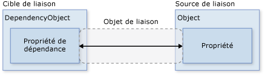

# <a name="introduction-to-wpf"></a>Présentation de WPF
Windows Presentation Foundation (WPF) vous permet de créer des applications clientes de bureau pour Windows avec des expériences utilisateur visuellement surprenantes.  
  
   
  
 Le cœur de WPF est un moteur de rendu vectoriel et indépendant de toute résolution, créé pour tirer parti du matériel graphique moderne. WPF étend le cœur avec un ensemble complet de fonctionnalités de développement d’applications qui incluent XAML (Extensible Application Markup Language), des contrôles, la liaison de données, la disposition, les graphiques 2D et 3D, l’animation, les styles, les modèles, les documents, les médias, le texte et la typographie. WPF étant inclus dans le .NET Framework, vous pouvez développer des applications qui incorporent d’autres éléments de la bibliothèque de classes .NET Framework.  
  
 Cette vue d’ensemble est destinée aux utilisateurs inexpérimentés ; elle couvre les fonctions et les concepts clés de WPF.  
  
##  <a name="Programming_with_WPF"></a> Programmation avec WPF  
 WPF constitue un sous-ensemble de types .NET Framework qui sont pour la plupart situés dans l’espace de noms <xref:System.Windows>. Si vous avez déjà créé des applications avec .NET Framework à l’aide de technologies managées comme ASP.NET et Windows Forms, l’expérience de programmation WPF doit vous sembler familière ; vous instanciez des classes, définissez des propriétés, appelez des méthodes et gérez des événements, le tout en utilisant votre langage de programmation .NET préféré, tel que C# ou Visual Basic.  
  
 WPF inclut des constructions de programmation supplémentaires qui améliorent les propriétés et événements : les [propriétés de dépendance](https://msdn.microsoft.com/en-us/library/ms752914\(v=vs.100\).aspx) et [événements routés](https://msdn.microsoft.com/en-us/library/ms742806\(v=vs.100\).aspx).  
  
##  <a name="Markup_And_Codebehind"></a> Balisage et code-behind  
 WPF vous permet de développer une application en utilisant à la fois le *balisage* et le *code-behind*, une expérience avec laquelle les développeurs ASP.NET sont censés être familiarisés. Vous utilisez généralement le balisage XAML pour implémenter l’apparence d’une application et les langages de programmation managés (code-behind) pour implémenter son comportement. Cette séparation de l’apparence et du comportement présente les avantages suivants :  
  
-   Les coûts de développement et de maintenance sont réduits, car le balisage spécifique à l’apparence n’est pas fortement couplé avec le code spécifique au comportement.  
  
-   Le développement est plus efficace, car les concepteurs peuvent implémenter l’apparence d’une application en même temps que les développeurs qui implémentent le comportement de l’application.  
  
-   La[globalisation et la localisation](https://msdn.microsoft.com/en-us/library/ms788718\(v=vs.100\).aspx) des applications WPF sont simplifiées.  
  
 Les éléments suivants constituent une brève introduction au balisage et au code-behind WPF.  
  
### <a name="markup"></a>balisage  
 XAML est un langage de balisage fondé sur XML qui est utilisé pour implémenter l’apparence d’une application de façon déclarative. Il est généralement utilisé pour créer des fenêtres, des boîtes de dialogue, des pages et des contrôles utilisateur, et pour les remplir avec des contrôles, des formes et des graphiques.  
  
 L’exemple suivant utilise XAML pour implémenter l’apparence d’une fenêtre qui contient un seul bouton.  
  
```xaml  
<Window  
    xmlns="http://schemas.microsoft.com/winfx/2006/xaml/presentation"  
    Title="Window with Button"  
    Width="250" Height="100">  
  
  <!-- Add button to window -->  
  <Button Name="button">Click Me!</Button>  
  
</Window>  
```  
  
 Plus précisément, ce code XAML définit une fenêtre et un bouton à l’aide des éléments `Window` et `Button` , respectivement. Chaque élément est configuré avec des attributs, tels que l’attribut `Window` de l’élément `Title` pour spécifier le texte de la barre de titre de la fenêtre. Pendant l’exécution, WPF convertit les éléments et les attributs définis dans le balisage en instances des classes WPF. Par exemple, l’élément `Window` est converti en une instance de la classe <xref:System.Windows.Window> dont la propriété <xref:System.Windows.Window.Title%2A> est la valeur de l’attribut `Title`.  
  
 L’illustration suivante montre l’interface utilisateur définie par XAML dans l’exemple précédent.  
  
   
  
 Comme XAML est basé sur XML, l’interface utilisateur que vous composez avec est assemblée dans une hiérarchie d’éléments imbriqués, connue sous le nom d’ [arborescence des éléments](https://msdn.microsoft.com/en-us/library/ms753391\(v=vs.100\).aspx). L’arborescence des éléments offre un moyen logique et intuitif de créer et gérer des interfaces utilisateur.  
  
### <a name="code-behind"></a>code-behind  
 Le comportement principal d’une application est d’implémenter les fonctionnalités qui répondent aux interventions de l’utilisateur, y compris la gestion des événements (par exemple, un clic sur un menu, une barre d’outils ou un bouton) et, en réponse, l’appel à la logique métier et à la logique d’accès aux données. Dans WPF, ce comportement est généralement implémenté dans le code associé au balisage. Ce type de code est appelé code-behind. L’exemple suivant montre le code-behind et le balisage mis à jour par rapport à l’exemple précédent.  
  
```xaml  
<Window  
    xmlns="http://schemas.microsoft.com/winfx/2006/xaml/presentation"  
    xmlns:x="http://schemas.microsoft.com/winfx/2006/xaml"  
    x:Class="SDKSample.AWindow"  
    Title="Window with Button"  
    Width="250" Height="100">  
  
  <!-- Add button to window -->  
  <Button Name="button" Click="button_Click">Click Me!</Button>  
  
</Window>  
```  
  
```c#  
using System.Windows; // Window, RoutedEventArgs, MessageBox   
  
namespace SDKSample  
{  
    public partial class AWindow : Window  
    {  
        public AWindow()  
        {  
            // InitializeComponent call is required to merge the UI   
            // that is defined in markup with this class, including    
            // setting properties and registering event handlers  
            InitializeComponent();  
        }  
  
        void button_Click(object sender, RoutedEventArgs e)  
        {  
            // Show message box when button is clicked  
            MessageBox.Show("Hello, Windows Presentation Foundation!");  
        }  
    }  
}  
```  
  
```vb  
Namespace SDKSample  
  
    Partial Public Class AWindow  
        Inherits System.Windows.Window  
  
        Public Sub New()  
  
            ' InitializeComponent call is required to merge the UI   
            ' that is defined in markup with this class, including    
            ' setting properties and registering event handlers  
            InitializeComponent()  
  
        End Sub   
  
        Private Sub button_Click(ByVal sender As Object, ByVal e As RoutedEventArgs)  
  
            ' Show message box when button is clicked  
            MessageBox.Show("Hello, Windows Presentation Foundation!")  
  
        End Sub   
  
    End Class   
  
End Namespace  
  
```  
  
 Dans cet exemple, le code-behind implémente une classe qui dérive de la classe <xref:System.Windows.Window>. L’attribut `x:Class` est utilisé pour associer le balisage à la classe code-behind. `InitializeComponent` est appelé depuis le constructeur de la classe code-behind pour fusionner l’interface utilisateur définie dans le balisage avec la classe code-behind. (`InitializeComponent` est généré pour vous lors de la génération de votre application, c’est pourquoi vous n’avez pas besoin de l’implémenter manuellement.) La combinaison de `x:Class` et `InitializeComponent` garantit la bonne initialisation de votre implémentation chaque fois qu’elle est créée. La classe code-behind implémente également un gestionnaire d’événements pour l’événement <xref:System.Windows.Controls.Primitives.ButtonBase.Click> du bouton. Quand vous cliquez sur le bouton, le gestionnaire d’événements affiche un message en appelant la méthode <xref:System.Windows.MessageBox.Show%2A?displayProperty=fullName>.  
  
 L’illustration suivante affiche le résultat obtenu quand vous cliquez sur le bouton.  
  
   
  
##  <a name="Controls"></a> Contrôles  
 Les expériences utilisateur fournies par le modèle d’application sont des contrôles construits Dans WPF, « contrôle » est un terme général qui s’applique à une catégorie de classes WPF qui sont hébergées dans une fenêtre ou une page, qui ont une interface utilisateur et qui implémentent un certain comportement.  
  
 Pour plus d’informations, consultez [Contrôles](http://msdn.microsoft.com/Library/3f255a8a-35a8-4712-9065-472ff7d75599).  
  
### <a name="wpf-controls-by-function"></a>Contrôles WPF par fonction  
 Les contrôles WPF intégrés sont répertoriés ici.  
  
-   **Boutons** : <xref:System.Windows.Controls.Button> et <xref:System.Windows.Controls.Primitives.RepeatButton>.  
  
-   **Affichage de données** : <xref:System.Windows.Controls.DataGrid>, <xref:System.Windows.Controls.ListView> et <xref:System.Windows.Controls.TreeView>.  
  
-   **Affichage et sélection de date** : <xref:System.Windows.Controls.Calendar> et <xref:System.Windows.Controls.DatePicker>.  
  
-   **Boîtes de dialogue** : <xref:Microsoft.Win32.OpenFileDialog>, <xref:System.Windows.Controls.PrintDialog> et <xref:Microsoft.Win32.SaveFileDialog>.  
  
-   **Encre numérique** : <xref:System.Windows.Controls.InkCanvas> et <xref:System.Windows.Controls.InkPresenter>.  
  
-   **Documents** : <xref:System.Windows.Controls.DocumentViewer>, <xref:System.Windows.Controls.FlowDocumentPageViewer>, <xref:System.Windows.Controls.FlowDocumentReader>, <xref:System.Windows.Controls.FlowDocumentScrollViewer> et <xref:System.Windows.Controls.StickyNoteControl>.  
  
-   **Entrée** : <xref:System.Windows.Controls.TextBox>, <xref:System.Windows.Controls.RichTextBox> et <xref:System.Windows.Controls.PasswordBox>.  
  
-   **Disposition** : <xref:System.Windows.Controls.Border>, <xref:System.Windows.Controls.Primitives.BulletDecorator>, <xref:System.Windows.Controls.Canvas>, <xref:System.Windows.Controls.DockPanel>, <xref:System.Windows.Controls.Expander>, <xref:System.Windows.Controls.Grid>, <xref:System.Windows.Controls.GridView>, <xref:System.Windows.Controls.GridSplitter>, <xref:System.Windows.Controls.GroupBox>, <xref:System.Windows.Controls.Panel>, <xref:System.Windows.Controls.Primitives.ResizeGrip>, <xref:System.Windows.Controls.Separator>, <xref:System.Windows.Controls.Primitives.ScrollBar>, <xref:System.Windows.Controls.ScrollViewer>, <xref:System.Windows.Controls.StackPanel>, <xref:System.Windows.Controls.Primitives.Thumb>, <xref:System.Windows.Controls.Viewbox>, <xref:System.Windows.Controls.VirtualizingStackPanel>, <xref:System.Windows.Window> et <xref:System.Windows.Controls.WrapPanel>.  
  
-   **Médias** : <xref:System.Windows.Controls.Image>, <xref:System.Windows.Controls.MediaElement> et <xref:System.Windows.Controls.SoundPlayerAction>.  
  
-   **Menus** : <xref:System.Windows.Controls.ContextMenu>, <xref:System.Windows.Controls.Menu> et <xref:System.Windows.Controls.ToolBar>.  
  
-   **Navigation** : <xref:System.Windows.Controls.Frame>, <xref:System.Windows.Documents.Hyperlink>, <xref:System.Windows.Controls.Page>, <xref:System.Windows.Navigation.NavigationWindow>, et <xref:System.Windows.Controls.TabControl>.  
  
-   **Sélection** : <xref:System.Windows.Controls.CheckBox>, <xref:System.Windows.Controls.ComboBox>, <xref:System.Windows.Controls.ListBox>, <xref:System.Windows.Controls.RadioButton> et <xref:System.Windows.Controls.Slider>.  
  
-   **Informations utilisateur** : <xref:System.Windows.Controls.AccessText>, <xref:System.Windows.Controls.Label>, <xref:System.Windows.Controls.Primitives.Popup>, <xref:System.Windows.Controls.ProgressBar>, <xref:System.Windows.Controls.Primitives.StatusBar>, <xref:System.Windows.Controls.TextBlock> et <xref:System.Windows.Controls.ToolTip>.  
  
##  <a name="Input_And_Commanding"></a> Entrée et commande  
 Les contrôles détectent le plus souvent l’entrée utilisateur et y répondent. Le [système d’entrée WPF](https://msdn.microsoft.com/en-us/library/ms754010\(v=vs.100\).aspx) utilise des événements directs et routés pour prendre en charge la saisie de texte, la gestion du focus et la position de la souris.  
  
 Les applications ont souvent des spécifications d’entrée complexes. WPF fournit un [système de commande](https://msdn.microsoft.com/en-us/library/ms752308\(v=vs.100\).aspx) qui sépare les actions d’entrée utilisateur du code qui répond à ces actions.  
  
##  <a name="Layout"></a> Disposition  
 Quand vous créez une interface utilisateur, réorganisez vos contrôles par emplacement et par taille pour former une disposition. L’une des spécifications clés de toute disposition est de s’adapter aux modifications de la taille de la fenêtre et des paramètres d’affichage. Plutôt que de vous forcer à écrire le code pour vous adapter à une disposition, WPF vous fournit un système de disposition extensible de première classe.  
  
 Le positionnement relatif est l’élément essentiel du système de disposition. Il augmente la capacité d’adaptation aux modifications des conditions d’affichage et de disposition des fenêtres. De plus, le système de disposition gère la négociation entre les contrôles pour déterminer la disposition. La négociation est un processus qui s’effectue en deux étapes : premièrement, un contrôle informe son parent de l’emplacement et de la taille dont il a besoin ; deuxièmement, le parent informe le contrôle de l’espace dont il peut disposer.  
  
 Le système de disposition est exposé aux contrôles enfants par des classes WPF de base. Pour des dispositions courantes telles que les grilles, l’empilement et l’ancrage, WPF comprend plusieurs contrôles de disposition :  
  
-   <xref:System.Windows.Controls.Canvas> : les contrôles enfants fournissent leur propre disposition.  
  
-   <xref:System.Windows.Controls.DockPanel> :  les contrôles enfants sont alignés aux bords du panneau.  
  
-   <xref:System.Windows.Controls.Grid> : les contrôles enfants sont positionnés en lignes et en colonnes.  
  
-   <xref:System.Windows.Controls.StackPanel> : les contrôles enfants sont empilés verticalement ou horizontalement.  
  
-   <xref:System.Windows.Controls.VirtualizingStackPanel> : les contrôles enfants sont virtualisés et réorganisés sur une seule ligne, verticale ou horizontale.  
  
-   <xref:System.Windows.Controls.WrapPanel> : les contrôles enfants sont positionnés de gauche à droite et renvoyés à la ligne suivante lorsqu’il y a plus de contrôles sur la ligne actuelle que l’espace ne l’autorise.  
  
 L’exemple suivant utilise un <xref:System.Windows.Controls.DockPanel> pour disposer plusieurs contrôles <xref:System.Windows.Controls.TextBox>.  
  
 [!code-xml[IntroToWPFSnippets#LayoutMARKUP](../designers/codesnippet/Xaml/introduction-to-wpf_1.xaml)]  
  
 Le <xref:System.Windows.Controls.DockPanel> autorise les contrôles <xref:System.Windows.Controls.TextBox> enfants à lui dire comment les réorganiser. Pour cela, le <xref:System.Windows.Controls.DockPanel> implémente une propriété <xref:System.Windows.Controls.DockPanel.Dock%2A> exposée aux contrôles enfants pour permettre à chacun d’eux de spécifier un style d’ancrage.  
  
> [!NOTE]
>  Une propriété implémentée par un contrôle parent pour une utilisation par des contrôles enfants est une construction WPF appelée [propriété attachée](https://msdn.microsoft.com/en-us/library/ms749011\(v=vs.100\).aspx).  
  
 L’illustration suivante affiche le résultat du balisage XAML dans l’exemple précédent.  
  
   
  
##  <a name="Data_Binding"></a> Liaison de données  
 La plupart des applications sont créées pour permettre aux utilisateurs d’afficher et de modifier des données. Pour les applications WPF, le travail de stockage et d’accès aux données est déjà fourni par des technologies telles que Microsoft SQL Server et ADO.NET. Après avoir accédé aux données et les avoir chargées dans les objets managés d’une application, les difficultés commencent pour les applications WPF. Cela implique essentiellement deux opérations :  
  
1.  La copie des données depuis les objets managés vers des contrôles, où les données pourront être affichées et modifiées.  
  
2.  La garantie que les modifications apportées aux données à l’aide des contrôles sont recopiées vers les objets managés.  
  
 Pour simplifier le développement d’applications, WPF fournit un moteur de liaison de données pour effectuer automatiquement ces étapes. La principale unité du moteur de liaison de données est la classe <xref:System.Windows.Data.Binding> dont le rôle est de lier un contrôle (la cible de liaison) à un objet de données (la source de liaison). Cette relation est illustrée ci-dessous.  
  
   
  
 L’exemple suivant montre comment lier une <xref:System.Windows.Controls.TextBox> à une instance d’un objet `Person` personnalisé. Le code suivant montre l’implémentation `Person` .  
  
 [!code-vb[SimpleDataBindingSnippets#PersonClassCODE](../designers/codesnippet/VisualBasic/introduction-to-wpf_2.vb)] [!code-cs[SimpleDataBindingSnippets#PersonClassCODE](../designers/codesnippet/CSharp/introduction-to-wpf_2.cs)]  
  
 Le balisage suivant lie la <xref:System.Windows.Controls.TextBox> à une instance d’un objet `Person` personnalisé.  
  
 [!code-xml[SimpleDataBindingSnippets#DataBindingMARKUP1](../designers/codesnippet/Xaml/introduction-to-wpf_3.xaml)]  
[!code-xml[SimpleDataBindingSnippets#DataBindingMARKUP2](../designers/codesnippet/Xaml/introduction-to-wpf_4.xaml)]  
[!code-xml[SimpleDataBindingSnippets#DataBindingMARKUP3](../designers/codesnippet/Xaml/introduction-to-wpf_5.xaml)]  
  
 [!code-vb[SimpleDataBindingSnippets#DataBindingCODEBEHIND](../designers/codesnippet/VisualBasic/introduction-to-wpf_6.vb)] [!code-cs[SimpleDataBindingSnippets#DataBindingCODEBEHIND](../designers/codesnippet/CSharp/introduction-to-wpf_6.cs)]  
  
 Dans cet exemple, la classe `Person` est instanciée en code-behind et définie comme contexte de données de `DataBindingWindow`. Dans le balisage, la propriété <xref:System.Windows.Controls.TextBox.Text%2A> de la <xref:System.Windows.Controls.TextBox> est liée à la propriété `Person.Name` (à l’aide de la syntaxe XAML `{Binding ... }`). Ce code XAML demande à WPF de lier le contrôle <xref:System.Windows.Controls.TextBox> à l’objet `Person` stocké dans la propriété <xref:System.Windows.FrameworkElement.DataContext%2A> de la fenêtre.  
  
 Le moteur de liaison de données WPF fournit une prise en charge supplémentaire qui inclut la validation, le tri, le filtrage et le regroupement En outre, la liaison de données prend en charge l’utilisation de modèles de données afin de créer une interface utilisateur personnalisée pour les données liées quand l’interface utilisateur affichée par les contrôles WPF standard n’est pas appropriée.  
  
 Pour plus d’informations, consultez [Vue d’ensemble de la liaison de données](https://msdn.microsoft.com/en-us/library/ms752347\(v=vs.100\).aspx).  
  
##  <a name="Graphics"></a> Graphiques  
 WPF présente un ensemble de fonctionnalités graphiques étendu, évolutif et flexible possédant les avantages suivants :  
  
-   **Graphiques indépendants du périphérique et de toute résolution**. L’unité de mesure de base du système graphique WPF est le pixel indépendant du périphérique, soit 1/96e d’un pouce, quelle que soit la résolution réelle de l’écran. Elle sert de base au rendu indépendant du périphérique et de toute résolution. Chaque pixel indépendant du périphérique est automatiquement mis à l’échelle pour correspondre au paramètre de points par pouce (ppp) du système de restitution.  
  
-   **Précision améliorée**. Le système de coordonnées WPF est mesuré avec des nombres à virgule flottante double précision plutôt que simple précision. Les transformations et valeurs d’opacité sont également exprimées sous la forme de valeurs double précision. WPF prend également en charge une vaste gamme de couleurs (scRGB) et assure la prise en charge intégrée de la gestion des entrées issues de différents espaces de couleurs.  
  
-   **Graphiques avancés et prise en charge de l’animation**. WPF simplifie la programmation graphique en gérant les scènes d’animation à votre place ; ainsi, vous n’avez pas besoin de vous préoccuper du traitement des scènes, du rendu des boucles ni de l’interpolation bilinéaire. En outre, WPF fournit une prise en charge du test de recherche et une prise en charge complète de la composition alpha.  
  
-   **Accélération matérielle**. Le système graphique WPF profite du matériel vidéo pour réduire l’utilisation du processeur.  
  
### <a name="2-d-shapes"></a>Formes 2D  
 WPF fournit une bibliothèque de formes vectorielles courantes 2D, telles que les rectangles et ellipses présentés dans l’illustration suivante.  
  
   
  
 Les formes ont notamment pour intérêt de ne pas servir uniquement à l’affichage ; elles implémentent la majorité des fonctionnalités que vous attendez des contrôles, y compris l’entrée au clavier et à la souris. L’exemple suivant montre l’événement <xref:System.Windows.UIElement.MouseUp> d’une <xref:System.Windows.Shapes.Ellipse> gérée.  
  
 [!code-xml[IntroToWPFSnippets#HandleEllipseMouseUpEventMARKUP](../designers/codesnippet/Xaml/introduction-to-wpf_7.xaml)]  
  
 [!code-vb[IntroToWPFSnippets#HandleEllipseMouseUpEventCODEBEHIND](../designers/codesnippet/VisualBasic/introduction-to-wpf_8.vb)] [!code-cs[IntroToWPFSnippets#HandleEllipseMouseUpEventCODEBEHIND](../designers/codesnippet/CSharp/introduction-to-wpf_8.cs)]  
  
 L’illustration suivante montre ce qui est produit par le code précédent.  
  
   
  
 Pour plus d’informations, consultez [Vue d’ensemble des formes et dessins de base dans WPF](https://msdn.microsoft.com/en-us/library/ms747393\(v=vs.100\).aspx).  
  
### <a name="2-d-geometries"></a>Géométries 2D  
 Les formes 2D fournies par WPF couvrent le jeu standard des formes de base. Toutefois, vous pouvez avoir besoin de créer des formes personnalisées afin de faciliter la conception d’une interface utilisateur personnalisée. Pour cela, WPF fournit des géométries. L’illustration suivante montre l’utilisation de géométries pour créer une forme personnalisée qui peut être dessinée directement, utilisée comme pinceau ou pour découper d’autres formes et contrôles.  
  
 Les objets <xref:System.Windows.Shapes.Path> peuvent être utilisés pour dessiner des formes fermées ou ouvertes, plusieurs formes et même des formes courbées.  
  
 Les objets <xref:System.Windows.Media.Geometry> peuvent être utilisés pour le découpage, les tests de recherche et le rendu de données graphiques 2D.  
  
   
  
 Pour plus d’informations, consultez [Vue d’ensemble de Geometry](https://msdn.microsoft.com/en-us/library/ms751808\(v=vs.100\).aspx).  
  
### <a name="2-d-effects"></a>Effets 2D  
 Un sous-ensemble de fonctions 2D WPF inclut des effets visuels tels que des dégradés, des bitmaps, des dessins, la peinture avec des vidéos, la rotation, la mise à l’échelle et l’inclinaison. Ces derniers sont tous réalisés avec des pinceaux ; l’illustration suivante montre quelques exemples.  
  
   
  
 Pour plus d’informations, consultez [Vue d’ensemble des pinceaux WPF](https://msdn.microsoft.com/en-us/library/aa970904\(v=vs.100\).aspx).  
  
### <a name="3-d-rendering"></a>Rendu 3D  
 WPF comprend également des fonctionnalités de rendu 3D s’intégrant aux graphiques 2D, permettant ainsi la création d’interfaces utilisateur plus intéressantes. Par exemple, l’illustration suivante montre des images 2D restituées sur des formes 3D.  
  
   
  
 Pour plus d’informations, consultez [Vue d’ensemble des graphiques 3D](https://msdn.microsoft.com/en-us/library/ms747437\(v=vs.100\).aspx).  
  
##  <a name="Animation"></a> Animation  
 La prise en charge d’animations WPF vous permet d’agrandir, de faire bouger, de faire pivoter et de réaliser des fondus avec les contrôles pour créer des transitions de page intéressantes, et plus encore. Vous pouvez animer la plupart des classes WPF, même les classes personnalisées. L’illustration suivante montre une animation simple en action.  
  
   
  
 Pour plus d’informations, consultez [Vue d’ensemble de l’animation](https://msdn.microsoft.com/en-us/library/ms752312\(v=vs.100\).aspx).  
  
##  <a name="Media"></a> Médias  
 L’un des moyens d’acheminer un contenu riche est d’utiliser des médias audiovisuels. WPF fournit une prise en charge spéciale pour les images, les vidéos et l’audio.  
  
### <a name="images"></a>Images  
 Les images sont communes à la plupart des applications et WPF fournit plusieurs façons de les utiliser. L’illustration suivante montre une interface utilisateur avec une zone de liste qui contient des images miniatures. Lorsque vous sélectionnez une miniature, l’image s’affiche en grand.  
  
   
  
 Pour plus d’informations, consultez [Vue d’ensemble de la création d’images](https://msdn.microsoft.com/en-us/library/ms748873\(v=vs.100\).aspx).  
  
### <a name="video-and-audio"></a>Audio et vidéo  
 Le contrôle <xref:System.Windows.Controls.MediaElement> peut lire des vidéos et de l’audio, et est assez flexible pour servir de base à un lecteur multimédia personnalisé. Le balisage XAML suivant implémente un lecteur multimédia.  
  
 [!code-xml[IntroToWPFSnippets#MediaElementMARKUP](../designers/codesnippet/Xaml/introduction-to-wpf_9.xaml)]  
  
 La fenêtre de l’illustration suivante montre le contrôle <xref:System.Windows.Controls.MediaElement> en action.  
  
   
  
 Pour plus d’informations, consultez [Vue d’ensemble des médias, de l’animation et des graphiques WPF](https://msdn.microsoft.com/en-us/library/ms742562\(v=vs.100\).aspx).  
  
##  <a name="Text_and_Typography"></a> Texte et typographie  
 Pour faciliter un rendu de texte de qualité optimale, WPF offre les fonctionnalités suivantes :  
  
-   Prise en charge de la police OpenType.  
  
-   Améliorations ClearType.  
  
-   Performances élevées tirant parti de l’accélération matérielle.  
  
-   Intégration de texte avec des médias, des graphiques et des animations.  
  
-   Prise en charge de polices internationales et de mécanismes de secours.  
  
 Comme démonstration d’une intégration de texte avec des graphiques, l’illustration suivante montre l’application d’un ornement de texte.  
  
   
  
 Pour plus d’informations, consultez [Typographie dans WPF](https://msdn.microsoft.com/en-us/library/ms742190\(v=vs.100\).aspx).  
  
##  <a name="WPF_Customization"></a> Personnalisation des applications WPF  
 Jusqu’à présent, vous avez vu les principaux blocs de construction de WPF pour le développement des applications. Vous utilisez le modèle d’application pour héberger et transmettre le contenu de l’application, principalement composé de contrôles. Pour simplifier l’organisation des contrôles dans une interface utilisateur et garantir la conservation de cette organisation face aux modifications de la taille de la fenêtre et des paramètres d’affichage, vous utilisez le système de disposition WPF. Étant donné que la plupart des applications permettent aux utilisateurs d’interagir avec les données, vous utilisez la liaison de données pour réduire le travail de l’intégration de votre interface utilisateur avec des données. Pour améliorer l’apparence visuelle de votre application, vous utilisez la gamme complète de graphiques, d’animations et de prise en charge des supports fournie par WPF.  
  
 Les concepts de base ne sont pourtant pas tout le temps suffisants pour créer et gérer une expérience utilisateur vraiment particulière et visuellement surprenante. Il est possible que les contrôles WPF standard ne s’intègrent pas à l’apparence souhaitée de votre application. Les données risquent de ne pas s’afficher de la manière la plus efficace. L’expérience utilisateur globale de votre application peut ne pas être adaptée à l’apparence par défaut des thèmes Windows. À bien des égards, une technologie de présentation a autant besoin d’une extensibilité visuelle que de tout autre type d’extensibilité.  
  
 C’est pourquoi WPF fournit différents mécanismes pour créer des expériences utilisateur uniques, y compris un modèle de contenu riche pour les contrôles, les déclencheurs, les modèles de contrôles et de données, les styles, les ressources d’interface utilisateur, les thèmes et les apparences.  
  
### <a name="content-model"></a>Modèle de contenu  
 L’objectif principal d’une majorité des contrôles WPF est d’afficher du contenu. Dans WPF, le type et le nombre d’éléments qui peuvent constituer le contenu d’un contrôle sont appelés *modèle de contenu*du contrôle. Certains contrôles peuvent contenir un seul élément et un seul type de contenu ; par exemple, le contenu d’une <xref:System.Windows.Controls.TextBox> est une valeur de chaîne assignée à la propriété <xref:System.Windows.Controls.TextBox.Text%2A>. L’exemple suivant définit le contenu d’une <xref:System.Windows.Controls.TextBox>.  
  
 [!code-xml[IntroToWPFSnippets#TextBoxContentMARKUP1](../designers/codesnippet/Xaml/introduction-to-wpf_10.xaml)]  
[!code-xml[IntroToWPFSnippets#TextBoxContentMARKUP2](../designers/codesnippet/Xaml/introduction-to-wpf_11.xaml)]  
[!code-xml[IntroToWPFSnippets#TextBoxContentMARKUP3](../designers/codesnippet/Xaml/introduction-to-wpf_12.xaml)]  
  
 L’illustration suivante affiche le résultat.  
  
   
  
 Toutefois, d’autres contrôles peuvent contenir plusieurs éléments de différents types de contenu ; le contenu d’un <xref:System.Windows.Controls.Button>, spécifié par la propriété <xref:System.Windows.Controls.ContentControl.Content%2A>, peut contenir différents éléments, y compris des contrôles de disposition, du texte, des images et des formes. L’exemple suivant montre un <xref:System.Windows.Controls.Button> avec du contenu qui inclut un <xref:System.Windows.Controls.DockPanel>, une <xref:System.Windows.Controls.Label>, une <xref:System.Windows.Controls.Border> et un <xref:System.Windows.Controls.MediaElement>.  
  
 [!code-xml[IntroToWPFSnippets#ButtonContentMARKUP1](../designers/codesnippet/Xaml/introduction-to-wpf_13.xaml)]  
[!code-xml[IntroToWPFSnippets#ButtonContentMARKUP2](../designers/codesnippet/Xaml/introduction-to-wpf_14.xaml)]  
[!code-xml[IntroToWPFSnippets#ButtonContentMARKUP3](../designers/codesnippet/Xaml/introduction-to-wpf_15.xaml)]  
  
 L’illustration suivante montre le contenu de ce bouton.  
  
   
  
 Pour plus d’informations sur les types de contenu pris en charge par différents contrôles, consultez [Modèle de contenu WPF](https://msdn.microsoft.com/en-us/library/bb613548\(v=vs.100\).aspx).  
  
### <a name="triggers"></a>Déclencheurs  
 Bien que l’objectif principal du balisage XAML soit d’implémenter l’apparence d’une application, vous pouvez également utiliser XAML pour implémenter certains aspects du comportement d’une application. Vous pouvez, par exemple, utiliser des déclencheurs pour modifier l’apparence d’une application à partir des interventions de l’utilisateur. Pour plus d’informations, consultez [Application d’un style et création de modèles](https://msdn.microsoft.com/en-us/library/ms745683\(v=vs.100\).aspx).  
  
### <a name="control-templates"></a>Modèles de contrôle  
 Les interfaces utilisateur par défaut pour les contrôles WPF sont en général construites à partir d’autres formes et contrôles. Par exemple, un <xref:System.Windows.Controls.Button> est composé de contrôles <xref:Microsoft.Windows.Themes.ButtonChrome> et <xref:System.Windows.Controls.ContentPresenter>. Le <xref:Microsoft.Windows.Themes.ButtonChrome> fournit l’apparence du bouton standard, alors que le <xref:System.Windows.Controls.ContentPresenter> affiche le contenu du bouton, comme spécifié par la propriété <xref:System.Windows.Controls.ContentControl.Content%2A>.  
  
 Parfois, l’apparence par défaut d’un contrôle peut être incompatible avec l’apparence globale d’une application. Dans ce cas, vous pouvez utiliser un <xref:System.Windows.Controls.ControlTemplate> pour modifier l’apparence de l’interface utilisateur du contrôle sans modifier ni son contenu, ni son comportement.   
  
 L’exemple suivant indique comment modifier l’apparence d’un <xref:System.Windows.Controls.Button> à l’aide d’un <xref:System.Windows.Controls.ControlTemplate>.  
  
 [!code-xml[IntroToWPFSnippets#ButtonControlTemplateWindowMARKUP](../designers/codesnippet/Xaml/introduction-to-wpf_16.xaml)]  
  
 [!code-cs[IntroToWPFSnippets#ButtonControlTemplateWindowCODEBEHIND](../designers/codesnippet/CSharp/introduction-to-wpf_17.cs)] [!code-vb[IntroToWPFSnippets#ButtonControlTemplateWindowCODEBEHIND](../designers/codesnippet/VisualBasic/introduction-to-wpf_17.vb)]  
  
 Dans cet exemple, l’interface utilisateur du bouton par défaut a été remplacée par une <xref:System.Windows.Shapes.Ellipse> aux bords bleu foncé remplie à l’aide d’un <xref:System.Windows.Media.RadialGradientBrush>. Le contrôle <xref:System.Windows.Controls.ContentPresenter> affiche le contenu du <xref:System.Windows.Controls.Button>, « Click Me! ». Quand l’utilisateur clique sur <xref:System.Windows.Controls.Button>, l’événement <xref:System.Windows.Controls.Primitives.ButtonBase.Click> est toujours déclenché dans le cadre du comportement par défaut du contrôle <xref:System.Windows.Controls.Button>. Le résultat est affiché dans l’illustration suivante.  
  
   
  
### <a name="data-templates"></a>Modèles de données  
 Alors qu’un modèle de contrôle vous permet de spécifier l’apparence d’un contrôle, un modèle de données vous permet de spécifier l’apparence du contenu d’un contrôle. Les modèles de données sont souvent utilisés pour améliorer l’affichage des données liées. L’illustration suivante montre l’apparence par défaut d’une <xref:System.Windows.Controls.ListBox> liée à une collection d’objets `Task`, où chaque tâche a un nom, une description et une priorité.  
  
   
  
 L’apparence par défaut correspond à ce que vous pourriez attendre d’une <xref:System.Windows.Controls.ListBox>. Toutefois, l’apparence par défaut de chaque tâche ne contient que le nom de la tâche. Pour afficher le nom, la description et la priorité de la tâche, l’apparence par défaut des éléments de liste liés du contrôle <xref:System.Windows.Controls.ListBox> doit être modifiée à l’aide d’un <xref:System.Windows.DataTemplate>. Le code XAML suivant définit ce type de <xref:System.Windows.DataTemplate> appliqué à chaque tâche à l’aide de l’attribut <xref:System.Windows.Controls.ItemsControl.ItemTemplate%2A>.  
  
 [!code-xml[IntroToWPFSnippets#DataTemplateMARKUP1](../designers/codesnippet/Xaml/introduction-to-wpf_18.xaml)]  
[!code-xml[IntroToWPFSnippets#DataTemplateMARKUP2](../designers/codesnippet/Xaml/introduction-to-wpf_19.xaml)]  
[!code-xml[IntroToWPFSnippets#DataTemplateMARKUP3](../designers/codesnippet/Xaml/introduction-to-wpf_20.xaml)]  
[!code-xml[IntroToWPFSnippets#DataTemplateMARKUP4](../designers/codesnippet/Xaml/introduction-to-wpf_21.xaml)]  
  
 L’illustration suivante montre l’effet de ce code.  
  
   
  
 Notez que la <xref:System.Windows.Controls.ListBox> a conservé son comportement et son apparence globale ; seule l’apparence du contenu affiché par la zone de liste a été modifiée.  
  
 Pour plus d’informations, consultez [Vue d’ensemble des modèles de données](https://msdn.microsoft.com/en-us/library/ms742521\(v=vs.100\).aspx).  
  
### <a name="styles"></a>Styles  
 Les styles permettent aux développeurs et aux concepteurs de standardiser leur produit avec une apparence particulière. WPF fournit un modèle de style fort, dont la fondation est l’élément <xref:System.Windows.Style>. L’exemple suivant crée un style qui définit la couleur d’arrière-plan `Orange` pour tous les éléments <xref:System.Windows.Controls.Button> d’une fenêtre.  
  
 [!code-xml[IntroToWPFSnippets#StyleMARKUP1](../designers/codesnippet/Xaml/introduction-to-wpf_22.xaml)]  
[!code-xml[IntroToWPFSnippets#StyleMARKUP2](../designers/codesnippet/Xaml/introduction-to-wpf_23.xaml)]  
[!code-xml[IntroToWPFSnippets#StyleMARKUP3](../designers/codesnippet/Xaml/introduction-to-wpf_24.xaml)]  
[!code-xml[IntroToWPFSnippets#StyleMARKUP4](../designers/codesnippet/Xaml/introduction-to-wpf_25.xaml)]  
  
 Étant donné que ce style cible tous les contrôles <xref:System.Windows.Controls.Button>, le style est automatiquement appliqué à tous les boutons de la fenêtre, comme indiqué dans l’illustration suivante.  
  
   
  
 Pour plus d’informations, consultez [Application d’un style et création de modèles](https://msdn.microsoft.com/en-us/library/ms745683\(v=vs.100\).aspx).  
  
### <a name="resources"></a>Ressources  
 Les contrôles d’une application doivent partager la même apparence, ce qui peut tout inclure, depuis les polices et les couleurs d’arrière-plan jusqu’aux modèles de contrôle, modèles de données et styles. Vous pouvez utiliser la prise en charge de WPF pour les ressources d’interface utilisateur afin d’encapsuler ces ressources dans un emplacement unique en vue d’une réutilisation.  
  
 L’exemple suivant définit une couleur d’arrière-plan commune partagée par un <xref:System.Windows.Controls.Button> et une <xref:System.Windows.Controls.Label>.  
  
 [!code-xml[IntroToWPFSnippets#ResourceWindowMARKUP1](../designers/codesnippet/Xaml/introduction-to-wpf_26.xaml)]  
[!code-xml[IntroToWPFSnippets#ResourceWindowMARKUP2](../designers/codesnippet/Xaml/introduction-to-wpf_27.xaml)]  
[!code-xml[IntroToWPFSnippets#ResourceWindowMARKUP3](../designers/codesnippet/Xaml/introduction-to-wpf_28.xaml)]  
  
 Cet exemple implémente une ressource de couleur d’arrière-plan à l’aide de l’élément de propriété `Window.Resources` . Cette ressource est disponible pour tous les enfants de la <xref:System.Windows.Window>. Il existe différentes portées de ressource, dont les suivantes, répertoriées dans l’ordre dans lequel elles sont résolues :   
  
1.  Un contrôle individuel (à l’aide de la propriété <xref:System.Windows.FrameworkElement.Resources%2A?displayProperty=fullName> héritée).  
  
2.  Une <xref:System.Windows.Window> ou une <xref:System.Windows.Controls.Page> (également à l’aide de la propriété <xref:System.Windows.FrameworkElement.Resources%2A?displayProperty=fullName> héritée).  
  
3.  Une <xref:System.Windows.Application> (à l’aide de la propriété <xref:System.Windows.Application.Resources%2A?displayProperty=fullName>).  
  
 Les diverses portées offrent une grande flexibilité en ce qui concerne la manière de définir et partager vos ressources.  
  
 Au lieu d’associer directement vos ressources à une portée précise, vous pouvez empaqueter une ou plusieurs ressources à l’aide d’un <xref:System.Windows.ResourceDictionary> séparé qui peut être référencé dans d’autres parties d’une application L’exemple suivant définit une couleur d’arrière-plan par défaut dans un dictionnaire de ressources.  
  
 [!code-xml[IntroToWPFSnippets#ResourceDictionaryMARKUP1](../designers/codesnippet/Xaml/introduction-to-wpf_29.xaml)]  
[!code-xml[IntroToWPFSnippets#ResourceDictionaryMARKUP2](../designers/codesnippet/Xaml/introduction-to-wpf_30.xaml)]  
  
 L’exemple suivant référence le dictionnaire de ressources défini dans l’exemple précédent afin qu’il soit partagé dans une application.  
  
 [!code-xml[IntroToWPFSnippets#ApplicationScopedResourceDictionaryMARKUP1](../designers/codesnippet/Xaml/introduction-to-wpf_31.xaml)]  
[!code-xml[IntroToWPFSnippets#ApplicationScopedResourceDictionaryMARKUP2](../designers/codesnippet/Xaml/introduction-to-wpf_32.xaml)]  
  
 Les ressources et les dictionnaires de ressources constituent la fondation de la prise en charge WPF pour les thèmes et les apparences.  
  
 Pour plus d’informations, consultez [Vue d’ensemble des ressources](https://msdn.microsoft.com/en-us/library/ms750613\(v=vs.100\).aspx).  
  
### <a name="custom-controls"></a>Contrôles personnalisés  
 Bien que WPF fournisse un hôte de prise en charge de la personnalisation, vous pouvez rencontrer des situations dans lesquelles des contrôles WPF existants ne satisfont pas les besoins de votre application ou de ses utilisateurs. Cela peut se produire lorsque :  
  
-   l’interface utilisateur dont vous avez besoin ne peut pas être créée en personnalisant l’apparence des implémentations WPF existantes ;  
  
-   le comportement dont vous avez besoin n’est pas pris en charge (ou difficilement) par les implémentations WPF existantes.  
  
 Toutefois, à ce stade, vous pouvez tirer parti de l’un des trois modèles WPF pour créer un contrôle. Chaque modèle cible un scénario spécifique et requiert que votre contrôle personnalisé dérive d’une classe de base WPF spécifique. Les trois modèles sont répertoriés ici :  
  
-   **Modèle de contrôle utilisateur**. Un contrôle personnalisé dérive d’<xref:System.Windows.Controls.UserControl> et est composé d’un ou de plusieurs autres contrôles.  
  
-   **Modèle de contrôle**. Un contrôle personnalisé dérive du <xref:System.Windows.Controls.Control> et est utilisé pour générer des implémentations qui séparent leur comportement de leur apparence à l’aide de modèles, comme la majorité des contrôles WPF. Le fait qu’il dérive du <xref:System.Windows.Controls.Control> offre une plus grande liberté pour créer une interface utilisateur personnalisée que des contrôles utilisateur, mais peut nécessiter plus d’effort.  
  
-   **Modèle de l’élément de framework**. Un contrôle personnalisé dérive de <xref:System.Windows.FrameworkElement> quand son apparence est définie par une logique de rendu personnalisé (et non des modèles).  
  
 L’exemple suivant montre un contrôle NumericUpDown personnalisé dérivé de <xref:System.Windows.Controls.UserControl>.  
  
 [!code-xml[IntroToWPFSnippets#UserControlMARKUP](../designers/codesnippet/Xaml/introduction-to-wpf_33.xaml)]  
  
 [!code-cs[IntroToWPFSnippets#UserControlCODEBEHIND1](../designers/codesnippet/CSharp/introduction-to-wpf_34.cs)] [!code-vb[IntroToWPFSnippets#UserControlCODEBEHIND1](../designers/codesnippet/VisualBasic/introduction-to-wpf_34.vb)]  
  
 L’exemple suivant illustre le code XAML requis pour incorporer le contrôle utilisateur dans une <xref:System.Windows.Window>.  
  
 [!code-xml[IntroToWPFSnippets#UserControlWindowMARKUP1](../designers/codesnippet/Xaml/introduction-to-wpf_37.xaml)]  
  
 L’illustration suivante montre le contrôle `NumericUpDown` hébergé dans une <xref:System.Windows.Window>.  
  
   
  
 Pour plus d’informations sur les contrôles personnalisés, consultez [Vue d’ensemble de la création de contrôles](https://msdn.microsoft.com/en-us/library/ms745025\(v=vs.100\).aspx).  
  
##  <a name="WPF_Best_Practices"></a> Meilleures pratiques WPF  
 Comme pour toute plateforme de développement, WPF peut être utilisé de différentes manières pour obtenir le résultat souhaité. Afin de garantir que vos applications WPF fournissent l’expérience utilisateur requise et répondent aux demandes du public en général, il existe des meilleures pratiques pour l’accessibilité, la globalisation, la localisation et les performances. Pour plus d’informations, consultez :  
  
-   [Meilleures pratiques d’accessibilité](https://msdn.microsoft.com/en-us/library/aa350483\(v=vs.100\).aspx)Meilleures pratiques d’accessibilité  
  
-   [Vue d’ensemble de la globalisation et de la localisation WPF](https://msdn.microsoft.com/en-us/library/ms788718\(v=vs.100\).aspx)  
  
-   [Optimisation des performances des applications WPF](https://msdn.microsoft.com/en-us/library/aa970683\(v=vs.100\).aspx)  
  
-   [Sécurité (WPF)](https://msdn.microsoft.com/en-us/library/aa970906\(v=vs.100\).aspx)  
  
##  <a name="Summary"></a> Résumé  
 WPF est une technologie de présentation complète pour générer une large gamme d’applications clientes visuellement surprenantes. Cette introduction a passé en revue les fonctionnalités clés de WPF.  
  
 L’étape suivante consiste à générer des applications WPF !  
  
 Pendant la génération de ces applications, vous pourrez revenir à cette introduction pour un petit rappel des fonctionnalités clés et pour rechercher des détails sur certaines fonctionnalités traitées dans cette introduction.  
  
## <a name="see-also"></a>Voir aussi  
 [Bien démarrer avec WPF](../designers/getting-started-with-wpf.md)   
 [Créer des applications pour ordinateur modernes avec Windows Presentation Foundation](../designers/create-modern-desktop-applications-with-windows-presentation-foundation.md)   
 [Windows Presentation Foundation](https://msdn.microsoft.com/en-us/library/ms754130\(v=vs.100\).aspx)
