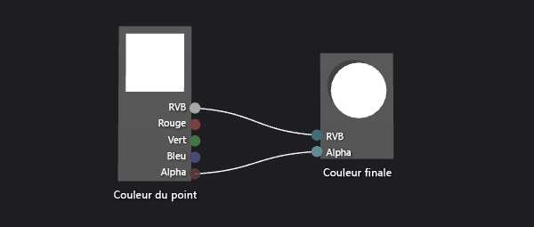
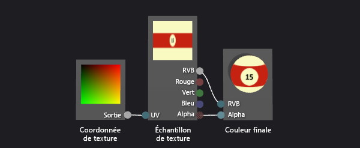
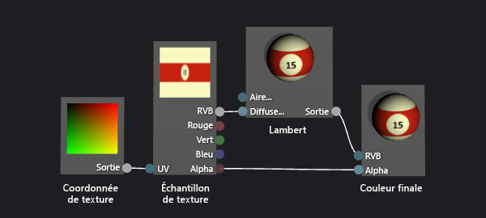
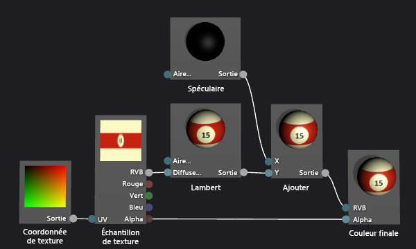
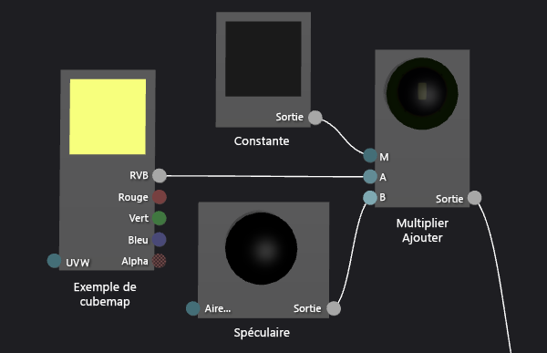
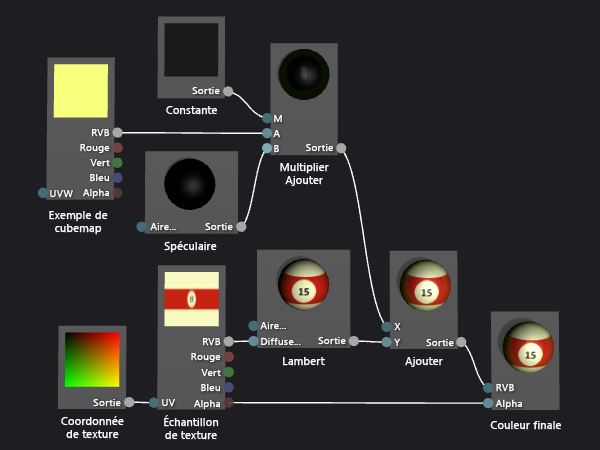

# Proc&#233;dure pas &#224; pas&#160;: cr&#233;ation d&#39;une boule de billard 3D r&#233;aliste
[!INCLUDE[vs2017banner](../code-quality/includes/vs2017banner.md)]

Cette procédure pas à pas montre comment créer une balle de billard 3D réaliste en utilisant le concepteur Shader et l'Éditeur d'images dans [!INCLUDE[vsprvs](../code-quality/includes/vsprvs_md.md)].  L'apparence 3D de la boule de billard s'obtient en combinant plusieurs techniques de nuanceur avec les ressources appropriées en texture.  
  
 Ce document démontre les activités suivantes :  
  
-   Création de l'apparence de base d'une boule de billard à l'aide des outils de forme et de texture.  
  
-   Ajout de profondeur à l'aide du modèle d'éclairage Lambert.  
  
-   Amélioration de l'apparence de base à l'aide des surbrillances spéculaires.  
  
-   Création d'un sens de l'espace en reflétant l'environnement.  
  
## Composants requis  
 Pour effectuer cette procédure pas à pas, vous aurez besoin des composants et compétences suivants :  
  
-   Outil d'assemblage de textures dans un mappage de cube, tel que l'outil de texture DirectX qui est inclus dans le Kit de développement logiciel DirectX de juin 2010.  
  
-   Connaissance de l'Éditeur d'images dans [!INCLUDE[vsprvs](../code-quality/includes/vsprvs_md.md)].  
  
-   Connaissance du Concepteur shader dans [!INCLUDE[vsprvs](../code-quality/includes/vsprvs_md.md)].  
  
## Création de l'apparence de base avec les outils de forme et de texture  
 En infographie, les éléments d'apparence les plus basiques sont la forme et la couleur.  Dans une simulation sur l'ordinateur, il est courant d'utiliser un modèle 3D pour représenter la forme d'un objet réel.  Le détail des couleurs est ensuite appliqué à la surface du modèle à l'aide d'une carte de texture.  
  
 En général, vous devrez peut\-être demander à un artiste de créer un modèle 3D que vous pourrez utiliser, mais étant donné qu'une balle de billard est une forme commune \(une sphère\), le concepteur Shader a déjà un modèle approprié intégré.  
  
 La sphère est la forme d'aperçu par défaut dans le concepteur Shader. Si vous utilisez actuellement une forme différente pour prévisualiser votre nuanceur, basculez de nouveau vers la sphère.  
  
#### Pour afficher un aperçu du shader à l'aide d'une sphère  
  
-   Dans la barre d'outils du concepteur Shader, choisissez **Aperçu avec la sphère**.  
  
 Dans l'étape suivante, vous allez créer un programme de nuanceur qui applique une texture au modèle, mais vous devez commencer par créer une texture que vous pouvez utiliser.  Cette procédure pas à pas montre comment créer la texture à l'aide de l'Éditeur d'images, qui fait partie de [!INCLUDE[vsprvs](../code-quality/includes/vsprvs_md.md)], mais vous pouvez utiliser n'importe quel éditeur d'images capable d'enregistrer la texture dans un format approprié.  
  
 Assurez\-vous que la fenêtre **Propriétés** et la **Boîte à outils** sont affichées.  
  
#### Pour créer une texture de balle de billard à l'aide de l'Éditeur d'images  
  
1.  Créez une texture à utiliser.  Pour obtenir des informations sur l'ajout d'une texture à votre projet, consultez la section Mise en route dans [Éditeur d'images](../designers/image-editor.md).  
  
2.  Définissez la taille de l'image afin que sa largeur soit deux fois supérieure à sa hauteur. Cela est nécessaire du fait du mode de mappage de la texture à la surface sphérique de la boule de billard.  Pour redimensionner l'image, dans la fenêtre **Propriétés**, spécifiez les nouvelles valeurs des propriétés **Largeur** et **Hauteur**.  Par exemple, définissez la largeur sur 512 et la hauteur sur 256.  
  
3.  Dessinez une texture pour la boule de billard, en conservant à l'esprit la façon dont une texture est mappée à une sphère.  
  
     La texture doit être similaire à ce qui suit :  
  
       
  
4.  Vous pouvez éventuellement réduire les exigences en matière de stockage de cette texture.  Vous pouvez le faire en réduisant la largeur de la texture pour correspondre à sa hauteur.  Cela compresse la texture par rapport à sa largeur, mais en raison de la manière dont la texture est mappé à la sphère, elle sera développée lorsque la balle de billard est restituée.  Après le redimensionnement, la texture doit se présenter comme suit :  
  
       
  
 Maintenant vous pouvez créer un nuanceur qui applique cette texture au modèle.  
  
#### Pour créer un nuanceur de texture de base  
  
1.  Créez un shader DGSL à utiliser.  Pour plus d'informations sur l'ajout d'un shader DGSL à votre projet, consultez la section Mise en route dans [Concepteur Shader](../designers/shader-designer.md).  
  
     Par défaut, un graphique de nuanceur se présente comme suit :  
  
       
  
2.  Modifiez le nuanceur par défaut pour qu'il applique la valeur d'un exemple de texture au pixel actuel.  Le graphe de nuanceur doit ressembler à ceci :  
  
       
  
3.  Appliquez la texture que vous avez créée dans la procédure précédente en configurant les propriétés de texture.  Définissez la valeur de la propriété **Texture** du nœud **Échantillon de texture** sur **Texture1**, puis spécifiez le fichier de texture en utilisant la propriété **Nom de fichier** du groupe de propriétés **Texture1** de la même fenêtre de propriétés.  
  
 Pour plus d'informations sur la manière d'appliquer une texture dans votre nuanceur, consultez [Procédure : créer un nuanceur de texture de base](../designers/how-to-create-a-basic-texture-shader.md).  
  
 La boule de billard doit maintenant ressembler à ceci :  
  
   
  
## Création d'une profondeur avec le modèle d'éclairage Lambert  
 Jusqu'à présent, vous avez créé une boule de billard facilement reconnaissable.  Toutefois, elle apparaît plate et inintéressante, plus comme une représentation de boule de billard dans un dessin animé, qu'une réplique convaincante.  L'apparence à deux dimensions résulte du nuanceur simpliste, qui se comporte comme si chaque pixel à la surface de la boule de billard recevait la même quantité de lumière.  
  
 Dans la réalité, la lumière est plus lumineuse sur les surfaces qui font directement face à une source de lumière et moins lumineuse sur les surfaces qui font un angle oblique avec la source de lumière.  C'est parce que l'énergie des rayons de lumière est distribuée sur la plus petite surface lorsque la surface fait directement face la source de lumière.  Lorsque la surface s'éloigne de la source de lumière, le même quantité d'énergie est distribuée sur une surface de plus en plus plus grande.  Une surface qui ne fait pas face à une source de lumière ne reçoit aucune énergie lumineuse, ce qui donne un aspect complètement sombre.  Cette variation de luminosité sur la surface d'un objet est une aide visuelle importante qui indique la forme d'un objet. À défaut, l'objet s'affiche sous une forme à deux dimensions.  
  
 En infographie, les *modèles d'éclairage* \(approximations simplifiées d'interactions d'éclairage réel complexe\) sont utilisés pour reproduire l'apparence de l'éclairage réel.  Le modèle d'éclairage Lambert varie la quantité de lumière diffusée sur la surface d'un objet, tel que décrit dans le paragraphe précédent.  Vous pouvez ajouter le modèle d'éclairage Lambert à votre nuanceur pour donner à la boule de billard une apparence 3D plus convaincante.  
  
#### Pour ajouter l'éclairage Lambert à votre nuanceur  
  
-   Modifiez votre nuanceur pour moduler la valeur de l'exemple de texture par la valeur d'éclairage Lambert.  Votre graphe de nuanceur doit ressembler à ceci :  
  
       
  
-   Vous pouvez éventuellement ajuster la manière dont l'éclairage se comporte en configurant la propriété **MaterialDiffuse** du graphique de nuanceur.  Pour accéder aux propriétés du graphique Shader, choisissez une zone vide de l'aire de conception, puis dans la fenêtre **Propriétés**, recherchez la propriété à laquelle vous souhaitez accéder.  
  
 Pour plus d'informations sur la manière d'appliquer l'éclairage Lambert dans votre nuanceur, consultez [Procédure : créer un nuanceur Lambert de base](../designers/how-to-create-a-basic-lambert-shader.md).  
  
 Lorsqu'un éclairage Lambert est appliqué, la boule de billard doit ressembler à ceci :  
  
   
  
## Amélioration de l'apparence de base avec les surbrillances spéculaires  
 Le modèle d'éclairage Lambert fournit le sens de la forme et des dimensions absentes du nuanceur réservé à la texture.  Toutefois, la boule de billard a toujours une apparence quelque peu mate.  
  
 Une vraie balle de billard a généralement une finition brillante qui reflète une partie de la lumière qui y est projetée.  Une partie de la lumière réfléchie est répercutée en surbrillances spéculaires, qui simulent des propriétés reflétantes d'une surface.  En fonction des propriétés de la finition, les surbrillances peuvent être localisées ou étendues, intenses ou subtiles.  Ces réflexions spéculaires sont modelées à l'aide de la relation entre une source de lumière, l'orientation de la surface et la position de l'appareil photo. La surbrillance est plus intense lorsque l'orientation de la surface reflète la source de lumière directement dans l'appareil photo et moins intense lorsque la réflexion est moins directe.  
  
 Le modèle d'éclairage Phong repose sur le modèle d'éclairage Lambert pour inclure des surbrillances spéculaires, comme décrit dans le paragraphe précédent.  Vous pouvez ajouter le modèle d'éclairage Phong à votre nuanceur pour donner à la boule de billard une finition simulée entraînant une apparence plus intéressante.  
  
#### Pour ajouter des surbrillances spéculaires à votre nuanceur  
  
1.  Modifiez votre nuanceur pour y inclure la contribution spéculaire en utilisant une combinaison d'additifs.  Votre graphe de nuanceur doit ressembler à ceci :  
  
       
  
2.  Vous pouvez éventuellement ajuster la manière dont la surbrillance spéculaire se comporte en configurant les propriétés spéculaires \(**MaterialSpecular** et **MaterialSpecularPower**\) du graphique de nuanceur.  Pour accéder aux propriétés du graphique Shader, choisissez une zone vide de l'aire de conception, puis dans la fenêtre **Propriétés**, recherchez la propriété à laquelle vous souhaitez accéder.  
  
 Pour plus d'informations sur la manière d'appliquer les surbrillances spéculaires dans votre nuanceur, consultez [Comment : créer un nuanceur Phong de base](../designers/how-to-create-a-basic-phong-shader.md).  
  
 Lorsqu'une mise en surbrillance spéculaire est appliquée, la boule de billard doit ressembler à ceci :  
  
   
  
## Création d'un sens de l'espace en reflétant l'environnement  
 Lorsque des mises en surbrillances spéculaires sont appliquées, la boule de billard semble plutôt convaincante.  Elle a la bonne forme, le bon travail de peinture et le bon fini.  Toutefois, il existe encore une technique qui donnera à votre boule de billard une apparence tout à fait intégrée à son environnement.  
  
 Si vous examinez une vraie boule de billard attentivement, vous pouvez voir que sa surface brillante n'affiche pas simplement des surbrillances spéculaires, mais qu'elle reflète également faiblement une image du monde autour d'elle.  Vous pouvez simuler cette réflexion en utilisant une image de l'environnement comme texture et en la combinant avec la propre texture du modèle afin de déterminer la couleur finale de chaque pixel.  Selon le type de finition que vous souhaitez, vous pouvez combiner plus ou moins la texture de réflexion avec le reste du nuanceur.  Par exemple, un nuanceur qui simule une surface fortement réfléchissante comme un miroir peut utiliser uniquement la texture de réflexion, mais un nuanceur qui simule une réflexion plus subtile comme celle d'une boule de billard, ne peut combiner qu'une petite partie de la valeur de la texture de réflexion avec le reste du calcul de nuanceur.  
  
 Bien sûr, vous ne pouvez pas simplement appliquer l'image reflétée dans le modèle de la même façon que vous appliquez le mappage de la texture du modèle.  Si vous avez effectué l'opération, la réflexion du monde se déplacerait avec la boule de billard comme si la réflexion y était collée.  Étant donné qu'une réflexion peut provenir de n'importe quelle direction, vous avez besoin de fournir une carte de réflexion de chaque perspective, et d'un moyen de conserver la carte de réflexion orientée selon le monde.  Pour répondre à ces exigences, vous pouvez utiliser un type spécial de carte de texture, appelé *mappage de cube*, qui fournit six textures organisées pour former les côtés d'un cube.  À l'intérieur de ce cube, vous pouvez pointer vers n'importe quelle direction pour rechercher une valeur de texture.  Si les textures de chaque côté du cube contiennent des images de l'environnement, vous pouvez simuler une réflexion en échantillonnant l'emplacement approprié sur la surface du cube.  En conservant le cube aligné sur le monde, vous obtenez une réflexion précise de l'environnement.  Pour déterminer où le cube doit être échantillonné, vous calculez uniquement la réflexion du vecteur de la caméra en dehors de la surface de l'objet, puis l'utilisez ensuite comme coordonnées de texture 3D.  L'utilisation des cartes de cube de cette manière est une technique courante appelée *le mappage d'environnement*.  
  
 Le mappage d'environnement fournit une approximation efficace des vraies réflexions comme décrit dans les paragraphes précédents.  Vous pouvez fusionner des réflexions mappés en environnement dans votre nuanceur pour donner à la boule de billard une finition simulée qui donne l'impression qu'elle est davantage ancrée dans la scène.  
  
 La première étape consiste à créer une texture de mappage de cube.  Dans de nombreux types d'applications, le contenu du mappage de cube ne doit pas être parfait pour être efficace, surtout lorsque la réflexion est subtile ou n'occupe pas un espace significatif sur l'écran.  Par exemple, de nombreux jeux utilisent des cartes de cube précalculés pour le mappage d'environnement et n'utilisent que les plus proches de chaque objet réfléchi, bien que cela signifie que la réflexion n'est pas correcte.  Même une approximation est relativement acceptable pour convaincre.  
  
#### Pour créer des textures pour un mappage d'environnement à l'aide de l'Éditeur d'images  
  
1.  Créez une texture à utiliser.  Pour obtenir des informations sur l'ajout d'une texture à votre projet, consultez la section Mise en route dans [Éditeur d'images](../designers/image-editor.md).  
  
2.  Définissez la taille de l'image afin que sa largeur soit égale à sa hauteur, et qu'elle soit une puissance de deux ; cela est nécessaire en raison de la façon dont un mappage de cube est indexé.  Pour redimensionner l'image, dans la fenêtre **Propriétés**, spécifiez les nouvelles valeurs des propriétés **Largeur** et **Hauteur**.  Par exemple, définissez les propriétés **Width** et **Height** sur 256.  
  
3.  Utilisez une couleur unie pour remplir la texture.  Cette texture sera le bas du mappage de cube, qui correspond à la surface de la table de billard.  Gardez en mémoire la couleur que vous avez utilisée pour la texture suivante.  
  
4.  Créez une deuxième texture qui a la même taille que la première.  Cette texture est répétée pour les quatre côtés du mappage de cube, qui correspondent à la surface et aux côtés d'une table de billard, ainsi que pour la zone autour de le tableau de billard.  Veillez à dessiner la surface de la table de billard dans cette texture en utilisant la même couleur que dans la texture du bas.  La texture doit être similaire à ce qui suit :  
  
       
  
     N'oubliez pas qu'un mappage de réflexion ne doit pas être photoréaliste pour être efficace ; par exemple, le mappage du cube utilisé pour créer des images dans cet article contient seulement quatre poches au lieu de six.  
  
5.  Créez une troisième texture qui a la même taille que les autres.  Cette texture sera le haut du mappage de cube, qui correspond au plafond situé au\-dessus de la table de billard.  Pour rendre cette partie de la réflexion plus intéressante, vous pouvez dessiner une lumière de surcharge pour renforcer les surbrillances spéculaires que vous avez ajoutées au shader dans la procédure précédente.  La texture doit être similaire à ce qui suit :  
  
       
  
 Maintenant que vous avez créé des textures individuelles pour les côtés du mappage de cube, vous pouvez utiliser un outil pour les assembler en un mappage de cube qui peut être stocké dans une texture .dds unique.  Vous pouvez utiliser le programme que vous voulez pour créer le mappage de cube tant qu'il peut enregistrer le mappage de cube au format de texture .dds.  Cette procédure pas à pas montre comment créer la texture à l'aide de l'outil de texture DirectX qui fait partie du kit de développement logiciel de juin 2010.  
  
#### Pour assembler un mappage de cube à l'aide de l'outil DirectX Texture  
  
1.  Dans l'outil de texture DirectX, dans le menu principal, choisissez **Fichier**, **Nouvelle texture**.  La boîte de dialogue **Nouvelle texture** apparaît.  
  
2.  Dans le groupe **Type de texture**, choisissez **Texture de mappage de cube**.  
  
3.  Dans le groupe **Dimensions**, entrez la valeur correcte pour **Largeur** et **Hauteur**, puis choisissez **OK**.  Un nouveau document de texture apparaît.  Par défaut, la texture affichée en premier dans le document de texture correspond à la police de cube **X positif**.  
  
4.  Charge la texture que vous avez créée pour le côté du cube de texture sur la police de cube.  Dans le menu principal, choisissez **Fichier**, **Ouvrir sur cette face de mappage de cube**, sélectionnez la texture que vous avez créée pour le côté du cube, puis choisissez **Ouvrir**.  
  
5.  Répétez l'étape 4 pour les valeurs **X négatives**, **Z positives**, et les faces de cube **Z négatives**.  Pour cela, vous devez afficher la face à charger.  Pour afficher une face de mappage de cube différente, dans le menu principal, choisissez **Affichage**, **Face de mappage de cube**, puis sélectionnez la face que vous souhaitez afficher.  
  
6.  Pour la police de cube **Y positif**, chargez la texture que vous avez créée pour le haut du cube de texture.  
  
7.  Pour la police de cube **Y négatif**, chargez la texture que vous avez créée pour le bas du cube de texture.  
  
8.  Enregistrez la texture.  
  
 Vous pouvez imaginer la disposition du mappage cubique comme suit :  
  
   
  
 L'image en haut est la face de cube Y positif \(\+Y\) ; au milieu, de gauche à droite, il s'agit des faces de cube –X, \+Z, \+X et –Z ; en bas il s'agit de la face de cube \-Y.  
  
 Maintenant vous pouvez modifier le nuanceur pour fusionner l'exemple de mappage de cube dans le reste du nuanceur.  
  
#### Pour ajouter un mappage d'environnement à votre nuanceur  
  
1.  Modifiez votre nuanceur pour y inclure la contribution de mappage d'environnement en utilisant une combinaison d'additifs.  Votre graphe de nuanceur doit ressembler à ceci :  
  
       
  
     Notez que vous pouvez utiliser un nœud **Multiplier\-Ajouter** pour simplifier le graphique de nuanceur.  
  
     Voici une vue plus détaillée des nœuds de nuanceurs qui implémentent le mappage d'environnement :  
  
       
  
2.  Appliquez la texture que vous avez créée dans la procédure précédente en configurant les propriétés de texture du mappage de cube.  Définissez la valeur de la propriété **Texture** du nœud **Exemple de cubemap** sur **Texture2**, puis spécifiez le fichier de texture en utilisant la propriété **Nom de fichier** du groupe de propriétés **Texture2**.  
  
3.  Vous pouvez éventuellement ajuster la réflectivité de la boule de billard en configurant la propriété **Sortie** du nœud **Constante** .  Pour accéder aux propriétés du nœud, sélectionnez\-le puis dans la fenêtre **Propriétés**, recherchez la propriété à laquelle vous souhaitez accéder.  
  
 Lorsqu'un mappage d'environnement est appliqué, la boule de billard doit ressembler à ceci :  
  
   
  
 Dans cette image finale, notez comment les effets que vous avez ajoutés se combinent pour créer une boule de billard très convaincante.  La forme, la texture et l'éclairage créent l'apparence de base d'un objet 3D. Les reflets et les réflexions spéculaires rendent la boule de billard plus intéressante et intégrée à l'environnement.  
  
## Voir aussi  
 [Procédure : exporter un nuanceur](../designers/how-to-export-a-shader.md)   
 [Comment : appliquer un nuanceur à un modèle 3D](../designers/how-to-apply-a-shader-to-a-3-d-model.md)   
 [Concepteur Shader](../designers/shader-designer.md)   
 [Éditeur d'images](../designers/image-editor.md)   
 [Nœuds du concepteur Shader](../designers/shader-designer-nodes.md)