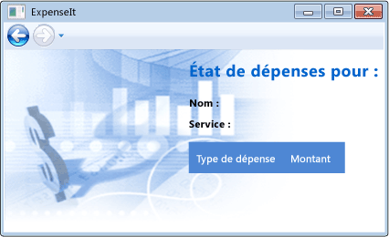
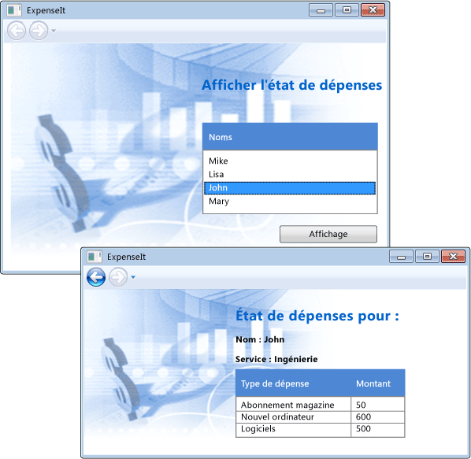

# <a name="walkthrough-my-first-wpf-desktop-application"></a>Procédure pas à pas : ma première application de bureau WPF
Cette procédure pas à pas offre une introduction au développement d’une application Windows Presentation Foundation (WPF). Vous allez créer une application de base qui inclut des éléments communs à la plupart des applications de bureau WPF : balisage XAML, code-behind, définitions d’application, contrôles, disposition, liaison de données et styles.  
  
## <a name="creating-the-application-project"></a>Création du projet d’application  
Dans cette section, vous allez créer l’infrastructure de l’application, c’est-à-dire le projet et une fenêtre principale ou un formulaire.  
  
#### <a name="to-create-the-project"></a>Pour créer le projet  
  
1.  Dans la barre de menus, sélectionnez **Fichier**, **Nouveau**, **Projet**.  
  
2.  Dans la boîte de dialogue **Nouveau projet** , développez le nœud **Visual C#** ou **Visual Basic** et choisissez le nœud **Windows** , puis développez le nœud **Windows** et choisissez le nœud **Bureau classique** .  
  
3.  Dans la liste de modèles, choisissez le modèle **Application WPF** .  
  
4.  Dans la boîte de dialogue **Nom** , entrez `ExpenseIt`, puis choisissez le bouton **OK** .  
  
     Le projet est créé et les fichiers de projet sont ajoutés à l’ **Explorateur de solutions**, et le concepteur pour la fenêtre d’application par défaut nommé **MainWindow.xaml** s’affiche.  
  
#### <a name="to-modify-the-main-window"></a>Pour modifier la fenêtre principale  
  
1.  Dans le concepteur, choisissez l’onglet **MainWindow.xaml** s’il n’est pas déjà actif.  
  
2.  Si vous utilisez C#, recherchez la ligne `<Window x:Class="ExpenseIt.MainWindow"` et remplacez-la par `<NavigationWindow x:Class="ExpenseIt.MainWindow"`.  
  
     Si vous utilisez Visual Basic, recherchez la ligne `<Window x:Class=" MainWindow"` et remplacez-la par `<NavigationWindow x:Class="MainWindow"`.  
  
     Notez aussi que lorsque vous remplacez la balise `<Window` par `<NavigationWindow`, Intellisense remplace automatiquement la balise de fermeture par `</NavigationWindow>` .  
  
    > [!NOTE]
    >  Après modification de la balise, il est possible que vous constatiez la présence de plusieurs erreurs dans la fenêtre **Liste d’erreurs** si celle-si est ouverte. Ne vous inquiétez pas, car les modifications que vous allez apporter au cours des étapes suivantes vont les faire disparaître.  
  
3.  Choisissez les balises `<Grid>` et `</Grid>` et supprimez-les.  
  
     **NavigationWindow** ne peut pas contenir d’autres éléments d’interface utilisateur comme une **Grille**.  
  
4.  Dans la boîte de dialogue **Propriétés** , développez le nœud de catégorie **Commun** et choisissez la propriété **Titre** , puis entrez `ExpenseIt` et appuyez sur la touche **Entrée** .  
  
     Notez que l’élément **Title** de la fenêtre XAML est remplacé par la nouvelle valeur. Vous pouvez modifier des propriétés XAML dans la fenêtre XAML ou la fenêtre **Propriétés** , les modifications sont synchronisées.  
  
5.  Dans la fenêtre XAML, définissez la valeur de l’élément **Height** sur `375`et la valeur de la propriété **Width** sur `500`.  
  
     Ces éléments correspondent aux propriétés **Hauteur** et **Largeur** de la catégorie **Disposition** de la fenêtre **Propriétés** .  
  
     Votre fichier **MainWindow.xaml** doit maintenant ressembler à ceci en C# :  
  
    ```xaml  
    <NavigationWindow x:Class="ExpenseIt.MainWindow"  
            xmlns="http://schemas.microsoft.com/winfx/2006/xaml/presentation"  
            xmlns:x="http://schemas.microsoft.com/winfx/2006/xaml"  
            xmlns:d="http://schemas.microsoft.com/expression/blend/2008"  
            xmlns:mc="http://schemas.openxmlformats.org/markup-compatibility/2006"  
            xmlns:local="clr-namespace:ExpenseIt"  
            mc:Ignorable="d"  
            Title="ExpenseIt" Height="375" Width="500">    
    </NavigationWindow>  
    ```  
  
     Ou à cela en Visual Basic :  
  
    ```xaml  
    <NavigationWindow x:Class="MainWindow"  
            xmlns="http://schemas.microsoft.com/winfx/2006/xaml/presentation"  
            xmlns:x="http://schemas.microsoft.com/winfx/2006/xaml"  
            xmlns:d="http://schemas.microsoft.com/expression/blend/2008"  
            xmlns:mc="http://schemas.openxmlformats.org/markup-compatibility/2006"  
            xmlns:local="clr-namespace:ExpenseIt"  
            mc:Ignorable="d"  
            Title="ExpenseIt" Height="375" Width="500">    
    </NavigationWindow>  
    ```  
  
#### <a name="to-modify-the-code-behind-file-c"></a>Pour modifier le fichier code-behind (C#)  
  
1.  Dans l’ **Explorateur de solutions**, développez le nœud **MainWindow.xaml** et ouvrez le fichier **MainWindow.xaml.cs** .  
  
2.  Recherchez la ligne `public partial class MainWindow : Window` et remplacez-la par `public partial class MainWindow : NavigationWindow`.  
  
     La classe `MainWindow` dérive alors de `NavigationWindow`. Dans Visual Basic, cela se produit automatiquement quand vous modifiez la fenêtre en XAML. Aucune modification de code n’est donc nécessaire.  
  
## <a name="adding-files-to-the-application"></a>Ajout de fichiers à l’application  
 Dans cette section, vous allez ajouter deux pages et une image à l’application.  
  
#### <a name="to-add-a-home-screen"></a>Pour ajouter un écran d’accueil  
  
1.  Dans l’ **Explorateur de solutions**, ouvrez le menu contextuel du nœud **ExpenseIt** , puis choisissez **Ajouter**, **Page**.  
  
2.  Dans la boîte de dialogue **Ajouter un nouvel élément** , choisissez la zone de texte **Nom** et entrez `ExpenseItHome`, puis choisissez le bouton **Ajouter** .  
  
     Cette page est la première fenêtre qui s’affiche au lancement de l’application.  
  
3.  Dans le concepteur, choisissez l’onglet **ExpenseItHome.xaml** s’il n’est pas déjà actif.  
  
4.  Choisissez l’élément `<Title>` et remplacez le titre par **ExpenseIt - Home**.  
  
     Votre fichier **ExpenseItHome.xaml** doit maintenant ressembler à ceci en C# :  
  
    ```xaml  
    <Page x:Class="ExpenseIt.ExpenseItHome"  
          xmlns="http://schemas.microsoft.com/winfx/2006/xaml/presentation"  
          xmlns:x="http://schemas.microsoft.com/winfx/2006/xaml"  
          xmlns:mc="http://schemas.openxmlformats.org/markup-compatibility/2006"   
          xmlns:d="http://schemas.microsoft.com/expression/blend/2008"   
          xmlns:local="clr-namespace:ExpenseIt"  
          mc:Ignorable="d"   
          d:DesignHeight="300" d:DesignWidth="300"  
          Title="ExpenseIt - Home">    
        <Grid>  
  
        </Grid>  
    </Page>  
    ```  
  
    En Visual Basic, la première ligne sera légèrement différente :  
  
    ```xaml  
    <Page x:Class="ExpenseItHome"  
    ```  
  
5.  Dans le concepteur, choisissez l’onglet **MainWindow.xaml** .  
  
6.  Recherchez l’élément `Title="ExpenseIt" Height="375" Width="500">` de ligne et ajoutez une propriété `Source="ExpenseItHome.xaml"` .  
  
     **ExpenseItHome.xaml** est alors la première page ouverte au démarrage de l’application. Votre fichier **MainWindow.xaml** doit maintenant ressembler à ceci en C# :  
  
    ```xaml  
    <NavigationWindow x:Class="ExpenseIt.MainWindow"  
            xmlns="http://schemas.microsoft.com/winfx/2006/xaml/presentation"  
            xmlns:x="http://schemas.microsoft.com/winfx/2006/xaml"  
            xmlns:d="http://schemas.microsoft.com/expression/blend/2008"  
            xmlns:mc="http://schemas.openxmlformats.org/markup-compatibility/2006"  
            xmlns:local="clr-namespace:ExpenseIt"  
            mc:Ignorable="d"  
            Title="ExpenseIt" Height="375" Width="500" Source="ExpenseItHome.xaml">    
    </NavigationWindow>  
    ```  
  
    En Visual Basic, la première ligne sera légèrement différente :  
  
    ```xaml  
    <NavigationWindow x:Class="MainWindow"
    ```  
  
     Comme pour les propriétés définies précédemment, vous pouvez aussi définir la propriété `Source` dans la catégorie **Divers** de la fenêtre **Propriétés** .  
  
#### <a name="to-add-a-details-window"></a>Pour ajouter une fenêtre de détails  
  
1.  Dans l’ **Explorateur de solutions**, ouvrez le menu contextuel du nœud **ExpenseIt** , puis choisissez **Ajouter**, **Page**.  
  
2.  Dans la boîte de dialogue **Ajouter un nouvel élément** , choisissez la zone de texte **Nom** et entrez `ExpenseReportPage`, puis choisissez le bouton **Ajouter** .  
  
     Cette fenêtre affiche une note de frais individuelle.  
  
3.  Dans le concepteur, choisissez l’onglet **ExpenseReportPage.xaml** s’il n’est pas déjà actif.  
  
4.  Choisissez l’élément `<Title>` et remplacez le titre par **ExpenseIt - View Expense**.  
  
     Votre fichier ExpenseReportPage.xaml doit maintenant ressembler à ceci en C# :  
  
    ```xaml  
    <Page x:Class="ExpenseIt.ExpenseReportPage"  
          xmlns="http://schemas.microsoft.com/winfx/2006/xaml/presentation"  
          xmlns:x="http://schemas.microsoft.com/winfx/2006/xaml"  
          xmlns:mc="http://schemas.openxmlformats.org/markup-compatibility/2006"   
          xmlns:d="http://schemas.microsoft.com/expression/blend/2008"   
          xmlns:local="clr-namespace:ExpenseIt"  
          mc:Ignorable="d"   
          d:DesignHeight="300" d:DesignWidth="300"  
          Title="ExpenseIt - View Expense">    
        <Grid>  
  
        </Grid>  
    </Page>  
    ```  
  
    En Visual Basic, la première ligne sera légèrement différente :  
  
    ```xaml  
    <Page x:Class="ExpenseReportPage"  
    ```  
  
5.  Dans la barre de menus, choisissez **Déboguer**, **Démarrer le débogage** (ou appuyez sur F5) pour exécuter l’application.  
  
     L’illustration suivante montre l’application avec les boutons de la fenêtre de navigation.  
  
       
  
6.  Fermez l’application pour repasser en mode de conception.  
  
## <a name="creating-the-user-interface"></a>Création de l’interface utilisateur  
 La catégorie Disposition vous permet de placer des éléments de manière ordonnée. Elle gère aussi la taille et la position de ces éléments quand un formulaire est redimensionné. Dans cette section, vous allez créer une grille comportant une colonne et trois lignes. Vous allez ajouter des contrôles aux deux pages, ajouter du code et enfin définir des styles réutilisables pour les contrôles.  
  
#### <a name="to-create-the-layout"></a>Pour créer la disposition  
  
1.  Ouvrez **ExpenseItHome.xaml** et choisissez l’élément `<Grid>` .  
  
2.  Dans la boîte de dialogue **Propriétés** , développez le nœud de catégorie **Disposition** , puis affectez à **Marge** les valeurs `10`, `10`, `0`et `10`(celles-ci correspondent aux marges gauche, droite, haut et bas).  
  
     L’élément `Margin="10,0,10,10"` est ajouté à l’élément `<Grid>` dans le code XAML. Là encore, vous pouvez aboutir au même résultat en entrant ces valeurs directement dans le code XAML et non pas dans la fenêtre **Propriétés** .  
  
3.  Ajoutez le code XAML suivant à l’élément `Grid` pour créer les définitions de ligne et de colonne :  
  
    ```xaml  
    <Grid.ColumnDefinitions>  
        <ColumnDefinition />  
    </Grid.ColumnDefinitions>  
    <Grid.RowDefinitions>  
        <RowDefinition Height="Auto"/>  
        <RowDefinition />  
        <RowDefinition Height="Auto"/>  
    </Grid.RowDefinitions>  
    ```  
  
#### <a name="to-add-controls"></a>Pour ajouter des contrôles  
  
1.  Ouvrez **ExpenseItHome.xaml**.  
  
2.  Ajoutez le code XAML suivant juste au-dessus de la balise `</Grid>` pour créer les contrôles `Border`, `ListBox` et `Button` :  
  
    ```xaml  
    <!-- People list -->  
      <Border Grid.Column="0" Grid.Row="0" Height="35" Padding="5" Background="#4E87D4">  
          <Label VerticalAlignment="Center" Foreground="White">Names</Label>  
      </Border>  
      <ListBox Name="peopleListBox" Grid.Column="0" Grid.Row="1">  
          <ListBoxItem>Mike</ListBoxItem>  
          <ListBoxItem>Lisa</ListBoxItem>  
          <ListBoxItem>John</ListBoxItem>  
          <ListBoxItem>Mary</ListBoxItem>  
      </ListBox>  
  
      <!-- View report button -->  
      <Button Grid.Column="0" Grid.Row="2" Margin="0,10,0,0" Width="125"  
    Height="25" HorizontalAlignment="Right">View</Button>    
    ```  
  
     Notez que les contrôles apparaissent dans la fenêtre de conception. Vous pouvez également créer les contrôles en les faisant glisser de la fenêtre **Boîte à outils** jusqu’à la fenêtre de conception et en définissant leurs propriétés dans la fenêtre **Propriétés** .  
  
3.  Générez et exécutez l’application. L’illustration suivante montre l’apparence au moment de l’exécution des contrôles créés par le code XAML dans cette procédure.  
  
       
  
4.  Fermez l’application pour repasser en mode de conception.  
  
#### <a name="to-add-a-background-image"></a>Pour ajouter une image d’arrière-plan  
  
1.  Choisissez l’image suivante et enregistrez-la sous `watermark.png`.  
  
       
  
    > [!NOTE]
    >  Vous pouvez également créer votre propre image et l’enregistrer sous `watermark.png`.  
  
2.  Dans l’ **Explorateur de solutions**, ouvrez le menu contextuel du nœud **ExpenseIt** , puis choisissez **Ajouter**, **Élément existant**.  
  
3.  Dans la boîte de dialogue **Ajouter un élément existant** , recherchez l’image **watermark.png** que vous venez d’ajouter, sélectionnez-la, puis choisissez le bouton **Ajouter** .  
  
    > [!NOTE]
    >  Vous devrez peut-être développer la liste **Types de fichiers** et choisir **Fichiers image**.  
  
4.  Ouvrez le fichier **ExpenseItHome.xaml** et ajoutez le code XAML suivant juste au-dessus de la balise `</Grid>` pour créer une image d’arrière-plan :  
  
    ```xaml  
    <Grid.Background>  
        <ImageBrush ImageSource="watermark.png"/>  
    </Grid.Background>    
    ```  
  
#### <a name="to-add-a-title"></a>Pour ajouter un titre  
  
1.  Ouvrez **ExpenseItHome.xaml**.  
  
2.  Recherchez la ligne `<Grid.ColumnDefinitions>` et ajoutez ce qui suit juste en dessous :  
  
    ```xaml  
    <ColumnDefinition Width="230" />    
    ```  
  
     Une colonne supplémentaire d’une largeur fixe de 230 pixels est créée à gauche des autres colonnes.  
  
3.  Recherchez la ligne `<Grid.RowDefinitions>` et ajoutez ce qui suit juste en dessous :  
  
    ```xaml  
    <RowDefinition />    
    ```  
  
     Une ligne est ajoutée en haut de la grille.  
  
4.  Déplacez les contrôles vers la deuxième colonne en affectant à `Grid.Column` la valeur 1. Déplacez chaque contrôle d’une ligne vers le bas en augmentant chaque valeur `Grid.Row` d’une unité.  
  
    1.  Recherchez la ligne `<Border Grid.Column="0" Grid.Row="0" Height="35" Padding="5" Background="#4E87D4">`. Remplacez `Grid.Column="0"` par `Grid.Column="1"` et `Grid.Row="0"` par `Grid.Row="1"`.  
  
    2.  Recherchez la ligne `<ListBox Name="peopleListBox" Grid.Column="0" Grid.Row="1"`. Remplacez `Grid.Column="0"` par `Grid.Column="1"` et `Grid.Row="1"` par `Grid.Row="2"`.  
  
    3.  Recherchez la ligne `<Button Grid.Column="0" Grid.Row="2" Margin="0,10,0,0" Width="125"`. Remplacez `Grid.Column="0"` par `Grid.Column="1"` et `Grid.Row="2"` par `Grid.Row="3"`.  
  
5.  Juste avant l’élément `<Border` , ajoutez le code XAML suivant pour afficher le titre :  
  
    ```xaml  
    <Label Grid.Column="1" VerticalAlignment="Center" FontFamily="Trebuchet MS"   
            FontWeight="Bold" FontSize="18" Foreground="#0066cc">  
        View Expense Report  
    </Label>    
    ```  
  
     Le contenu du fichier **ExpenseItHome.xaml** doit maintenant ressembler à ceci en C# :  
  
    ```xaml  
    <Page x:Class="ExpenseIt.ExpenseItHome"  
          xmlns="http://schemas.microsoft.com/winfx/2006/xaml/presentation"  
          xmlns:x="http://schemas.microsoft.com/winfx/2006/xaml"  
          xmlns:mc="http://schemas.openxmlformats.org/markup-compatibility/2006"   
          xmlns:d="http://schemas.microsoft.com/expression/blend/2008"   
          xmlns:local="clr-namespace:ExpenseIt"  
          mc:Ignorable="d"   
          d:DesignHeight="300" d:DesignWidth="300"  
          Title="ExpenseIt - Home">  
        <Grid Margin="10,0,10,10">  
            <Grid.ColumnDefinitions>  
                <ColumnDefinition Width="230" />  
                <ColumnDefinition />  
            </Grid.ColumnDefinitions>  
            <Grid.RowDefinitions>  
                <RowDefinition />  
                <RowDefinition Height="Auto"/>  
                <RowDefinition />  
                <RowDefinition Height="Auto"/>  
            </Grid.RowDefinitions>  
            <Border Grid.Column="1" Grid.Row="1" Height="35" Padding="5" Background="#4E87D4">  
                <Label VerticalAlignment="Center" Foreground="White">Names</Label>  
            </Border>  
            <!-- People list -->  
            <Label Grid.Column="1" VerticalAlignment="Center" FontFamily="Trebuchet MS"   
            FontWeight="Bold" FontSize="18" Foreground="#0066cc">  
                View Expense Report  
            </Label>  
            <ListBox Name="peopleListBox" Grid.Column="1" Grid.Row="2">  
                <ListBoxItem>Mike</ListBoxItem>  
                <ListBoxItem>Lisa</ListBoxItem>  
                <ListBoxItem>John</ListBoxItem>  
                <ListBoxItem>Mary</ListBoxItem>  
            </ListBox>  
  
            <!-- View report button -->  
            <Button Grid.Column="1" Grid.Row="3" Margin="0,10,0,0" Width="125"  
    Height="25" HorizontalAlignment="Right">View</Button>  
            <Grid.Background>  
                <ImageBrush ImageSource="watermark.png"/>  
            </Grid.Background>  
        </Grid>  
    </Page>  
    ```  
  
    En Visual Basic, la première ligne sera légèrement différente :  
  
    ```xaml  
    <Page x:Class="ExpenseItHome"  
    ```  
  
6.  Si vous générez et exécutez l’application à ce stade, elle doit ressembler à l’illustration suivante :  
  
       
  
#### <a name="to-add-code-to-the-button"></a>Pour ajouter du code au bouton  
  
1.  Ouvrez **ExpenseItHome.xaml**.  
  
2.  Choisissez l’élément `Button` et ajoutez le code XAML suivant immédiatement après l’élément `HorizontalAlignment="Right"` : `Click="Button_Click"`.  
  
     Un gestionnaire d’événements est ajouté pour l’événement `Click` du bouton. Le code de l’élément **Button** doit maintenant ressembler à ceci :  
  
    ```xaml  
    <!-- View report button -->  
      <Button Grid.Column="1" Grid.Row="3" Margin="0,10,0,0" Width="125"  
    Height="25" HorizontalAlignment="Right" Click="Button_Click">View</Button>  
    ```  
  
3.  Ouvrez le fichier **ExpenseItHome.xaml.cs** ou **ExpenseItHome.xaml.vb** .  
  
4.  Ajoutez le code suivant à la classe `ExpenseItHome` :  
  
    ```csharp  
    private void Button_Click(object sender, RoutedEventArgs e)  
    {  
        // View Expense Report  
        ExpenseReportPage expenseReportPage = new ExpenseReportPage();  
        this.NavigationService.Navigate(expenseReportPage);    
    }  
    ```  
  
    ```vb  
    Private Sub Button_Click(ByVal sender As Object, ByVal e As RoutedEventArgs)  
        ' View Expense Report  
        Dim expenseReportPage As New ExpenseReportPage()  
    Me.NavigationService.Navigate(expenseReportPage)  
    End Sub  
    ```  
  
     Ce gestionnaire d’événements ouvre la page de note de frais quand l’utilisateur clique sur le bouton.  
  
#### <a name="to-create-the-ui-for-the-report-page"></a>Pour créer l’interface utilisateur de la page de note de frais  
  
1.  Ouvrez **ExpenseReportPage.xaml**.  
  
     Cette page affiche la note de frais pour la personne sélectionnée dans la page d’accueil.  
  
2.  Ajoutez le code XAML suivant entre les balises `<Grid>` et `</Grid>` :  
  
    ```xaml  
    <Grid.Background>  
        <ImageBrush ImageSource="watermark.png" />  
    </Grid.Background>  
    <Grid.ColumnDefinitions>  
        <ColumnDefinition Width="230" />  
        <ColumnDefinition />  
    </Grid.ColumnDefinitions>  
    <Grid.RowDefinitions>  
        <RowDefinition Height="Auto" />  
        <RowDefinition />  
    </Grid.RowDefinitions>  
  
    <Label Grid.Column="1" VerticalAlignment="Center" FontFamily="Trebuchet MS"   
    FontWeight="Bold" FontSize="18" Foreground="#0066cc">  
        Expense Report For:  
    </Label>  
    <Grid Margin="10" Grid.Column="1" Grid.Row="1">  
  
        <Grid.ColumnDefinitions>  
            <ColumnDefinition />  
            <ColumnDefinition />  
        </Grid.ColumnDefinitions>  
        <Grid.RowDefinitions>  
            <RowDefinition Height="Auto" />  
            <RowDefinition Height="Auto" />  
            <RowDefinition />  
        </Grid.RowDefinitions>  
  
        <!-- Name -->  
        <StackPanel Grid.Column="0" Grid.ColumnSpan="2" Grid.Row="0" Orientation="Horizontal">  
            <Label Margin="0,0,0,5" FontWeight="Bold">Name:</Label>  
            <Label Margin="0,0,0,5" FontWeight="Bold"></Label>  
        </StackPanel>  
  
        <!-- Department -->  
        <StackPanel Grid.Column="0" Grid.ColumnSpan="2" Grid.Row="1" Orientation="Horizontal">  
            <Label Margin="0,0,0,5" FontWeight="Bold">Department:</Label>  
            <Label Margin="0,0,0,5" FontWeight="Bold"></Label>  
        </StackPanel>  
  
        <Grid Grid.Column="0" Grid.ColumnSpan="2" Grid.Row="2" VerticalAlignment="Top"   
              HorizontalAlignment="Left">  
            <!-- Expense type and Amount table -->  
            <DataGrid  AutoGenerateColumns="False" RowHeaderWidth="0" >  
                <DataGrid.ColumnHeaderStyle>  
                    <Style TargetType="{x:Type DataGridColumnHeader}">  
                        <Setter Property="Height" Value="35" />  
                        <Setter Property="Padding" Value="5" />  
                        <Setter Property="Background" Value="#4E87D4" />  
                        <Setter Property="Foreground" Value="White" />  
                    </Style>  
                </DataGrid.ColumnHeaderStyle>  
                <DataGrid.Columns>  
                    <DataGridTextColumn Header="ExpenseType" />  
                    <DataGridTextColumn Header="Amount"  />  
                </DataGrid.Columns>  
            </DataGrid>  
        </Grid>  
    </Grid>  
    ```  
  
     Cette interface utilisateur est similaire à celle créée pour la page d’accueil, mais les données de la note de frais sont affichées dans un contrôle **DataGrid** .  
  
3.  Générez et exécutez l’application.  
  
4.  Choisissez le bouton **View** .  
  
     La page de note de frais s’affiche.  
  
     L’illustration suivante présente la page de note de frais. Notez que le bouton de navigation Précédent est activé.  
  
       
  
#### <a name="to-style-controls"></a>Pour appliquer un style aux contrôles  
  
1.  Ouvrez le fichier **App.xaml** (C#) ou **Application.xaml** (Visual Basic).  
  
2.  Ajoutez le code XAML suivant entre les balises `<Application.Resources>` et `</Application.Resources>` :  
  
    ```xaml  
    <!-- Header text style -->  
    <Style x:Key="headerTextStyle">  
        <Setter Property="Label.VerticalAlignment" Value="Center"></Setter>  
        <Setter Property="Label.FontFamily" Value="Trebuchet MS"></Setter>  
        <Setter Property="Label.FontWeight" Value="Bold"></Setter>  
        <Setter Property="Label.FontSize" Value="18"></Setter>  
        <Setter Property="Label.Foreground" Value="#0066cc"></Setter>  
    </Style>  
  
    <!-- Label style -->  
    <Style x:Key="labelStyle" TargetType="{x:Type Label}">  
        <Setter Property="VerticalAlignment" Value="Top" />  
        <Setter Property="HorizontalAlignment" Value="Left" />  
        <Setter Property="FontWeight" Value="Bold" />  
        <Setter Property="Margin" Value="0,0,0,5" />  
    </Style>  
  
    <!-- DataGrid header style -->  
    <Style x:Key="columnHeaderStyle" TargetType="{x:Type DataGridColumnHeader}">  
        <Setter Property="Height" Value="35" />  
        <Setter Property="Padding" Value="5" />  
        <Setter Property="Background" Value="#4E87D4" />  
        <Setter Property="Foreground" Value="White" />  
    </Style>  
  
    <!-- List header style -->  
    <Style x:Key="listHeaderStyle" TargetType="{x:Type Border}">  
        <Setter Property="Height" Value="35" />  
        <Setter Property="Padding" Value="5" />  
        <Setter Property="Background" Value="#4E87D4" />  
    </Style>  
  
    <!-- List header text style -->  
    <Style x:Key="listHeaderTextStyle" TargetType="{x:Type Label}">  
        <Setter Property="Foreground" Value="White" />  
        <Setter Property="VerticalAlignment" Value="Center" />  
        <Setter Property="HorizontalAlignment" Value="Left" />  
    </Style>  
  
    <!-- Button style -->  
    <Style x:Key="buttonStyle" TargetType="{x:Type Button}">  
        <Setter Property="Width" Value="125" />  
        <Setter Property="Height" Value="25" />  
        <Setter Property="Margin" Value="0,10,0,0" />  
        <Setter Property="HorizontalAlignment" Value="Right" />  
    </Style>  
    ```  
  
     Ce code XAML ajoute les styles suivants :  
  
    -   `headerTextStyle`: pour mettre en forme le titre de la page `Label`.  
  
    -   `labelStyle`: pour mettre en forme les contrôles `Label` .  
  
    -   `columnHeaderStyle`: pour mettre en forme `DataGridColumnHeader`.  
  
    -   `listHeaderStyle`: pour mettre en forme les contrôles `Border` de l’en-tête de liste.  
  
    -   `listHeaderTextStyle`: pour mettre en forme l’élément **Label**de l’en-tête de liste.  
  
    -   `buttonStyle`: pour mettre en forme l’élément `Button` dans la page **ExpenseItHome.xaml** .  
  
3.  Ouvrez **ExpenseItHome.xaml** et remplacez tout ce qui se trouve entre les éléments `<Grid>` et `</Grid>` par le code XAML suivant :  
  
    ```xaml  
    <Grid.ColumnDefinitions>  
                <ColumnDefinition Width="230" />  
                <ColumnDefinition />  
            </Grid.ColumnDefinitions>  
  
            <Grid.RowDefinitions>  
                <RowDefinition/>  
                <RowDefinition Height="Auto"/>  
                <RowDefinition />  
                <RowDefinition Height="Auto"/>  
            </Grid.RowDefinitions>  
            <Label Grid.Column="1" Style="{StaticResource headerTextStyle}" >  
                View Expense Report  
            </Label>  
            <!-- People list -->  
                  <Border Grid.Column="1" Grid.Row="1" Style="{StaticResource listHeaderStyle}">  
                <Label Style="{StaticResource listHeaderTextStyle}">Names</Label>  
            </Border>  
            <ListBox Name="peopleListBox" Grid.Column="1" Grid.Row="2">  
                <ListBoxItem>Mike</ListBoxItem>  
                <ListBoxItem>Lisa</ListBoxItem>  
                <ListBoxItem>John</ListBoxItem>  
                <ListBoxItem>Mary</ListBoxItem>  
            </ListBox>  
  
            <!-- View report button -->  
            <Button Grid.Column="1" Grid.Row="3" Click="Button_Click" Style="{StaticResource buttonStyle}">View</Button>  
            <Grid.Background>  
                <ImageBrush ImageSource="watermark.png"  />  
            </Grid.Background>  
    ```  
  
     Les propriétés qui définissent l’apparence de chaque contrôle, comme `VerticalAlignment` et `FontFamily` , sont supprimées et remplacées lors de l’application de styles.  
  
4.  Ouvrez **ExpenseReportPage.xaml** et remplacez tout ce qui se trouve entre l’élément `<Grid>` et l’élément `</Grid>` final par le code XAML suivant :  
  
    ```xaml  
    <Grid.Background>  
        <ImageBrush ImageSource="watermark.png" />  
    </Grid.Background>  
    <Grid.ColumnDefinitions>  
        <ColumnDefinition Width="230" />  
        <ColumnDefinition />  
    </Grid.ColumnDefinitions>  
    <Grid.RowDefinitions>  
        <RowDefinition Height="Auto" />  
        <RowDefinition />  
    </Grid.RowDefinitions>  
    <Label Grid.Column="1" Style="{StaticResource headerTextStyle}">  
        Expense Report For:  
    </Label>  
    <Grid Margin="10" Grid.Column="1" Grid.Row="1">  
        <Grid.ColumnDefinitions>  
            <ColumnDefinition />  
            <ColumnDefinition />  
        </Grid.ColumnDefinitions>  
        <Grid.RowDefinitions>  
            <RowDefinition Height="Auto" />  
            <RowDefinition Height="Auto" />  
            <RowDefinition />  
        </Grid.RowDefinitions>  
  
        <!-- Name -->  
        <StackPanel Grid.Column="0" Grid.ColumnSpan="2" Grid.Row="0" Orientation="Horizontal">  
            <Label Style="{StaticResource labelStyle}">Name:</Label>  
            <Label Style="{StaticResource labelStyle}"></Label>  
        </StackPanel>  
  
        <!-- Department -->  
        <StackPanel Grid.Column="0" Grid.ColumnSpan="2" Grid.Row="1"   
    Orientation="Horizontal">  
            <Label Style="{StaticResource labelStyle}">Department:</Label>  
            <Label Style="{StaticResource labelStyle}"></Label>  
        </StackPanel>  
  
        <Grid Grid.Column="0" Grid.ColumnSpan="2" Grid.Row="2" VerticalAlignment="Top"   
              HorizontalAlignment="Left">  
            <!-- Expense type and Amount table -->  
            <DataGrid ColumnHeaderStyle="{StaticResource columnHeaderStyle}"   
                      AutoGenerateColumns="False" RowHeaderWidth="0" >  
                <DataGrid.Columns>  
                    <DataGridTextColumn Header="ExpenseType" />  
                    <DataGridTextColumn Header="Amount"  />  
                </DataGrid.Columns>  
            </DataGrid>  
        </Grid>  
    </Grid>    
    ```  
  
     Des styles sont ajoutés aux éléments `<Label>` et `<Border>` .  
  
## <a name="connecting-to-data"></a>Connexion aux données  
 Dans cette section, vous allez créer un fournisseur de données et un modèle de données, puis connecter les contrôles pour afficher les données.  
  
#### <a name="to-bind-data-to-a-control"></a>Pour lier les données à un contrôle  
  
1.  Ouvrez **ExpenseItHome.xaml** et choisissez l’élément `<Grid>` .  
  
2.  Ajoutez le code XAML suivant :  
  
    ```xaml    
    <Grid.Resources>  
    <!-- Expense Report Data -->  
    <XmlDataProvider x:Key="ExpenseDataSource" XPath="Expenses">  
        <x:XData>  
            <Expenses xmlns="">  
                <Person Name="Mike" Department="Legal">  
                    <Expense ExpenseType="Lunch" ExpenseAmount="50" />  
                    <Expense ExpenseType="Transportation" ExpenseAmount="50" />  
                </Person>  
                <Person Name="Lisa" Department="Marketing">  
                    <Expense ExpenseType="Document printing"  
          ExpenseAmount="50"/>  
                    <Expense ExpenseType="Gift" ExpenseAmount="125" />  
                </Person>  
                <Person Name="John" Department="Engineering">  
                    <Expense ExpenseType="Magazine subscription"   
         ExpenseAmount="50"/>  
                    <Expense ExpenseType="New machine" ExpenseAmount="600" />  
                    <Expense ExpenseType="Software" ExpenseAmount="500" />  
                </Person>  
                <Person Name="Mary" Department="Finance">  
                    <Expense ExpenseType="Dinner" ExpenseAmount="100" />  
                </Person>  
            </Expenses>  
        </x:XData>  
    </XmlDataProvider>  
    </Grid.Resources>  
    ```  
  
     Ce code crée une classe `XmlDataProvider` qui contient les données pour chaque personne. Les données sont normalement chargées en tant que fichier, mais pour des raisons pratiques, elles sont ajoutées inline.  
  
3.  À l’intérieur de l’élément `<Grid.Resources>` , ajoutez le code XAML suivant :  
  
    ```xaml  
    <!-- Name item template -->  
    <DataTemplate x:Key="nameItemTemplate">  
        <Label Content="{Binding XPath=@Name}"/>  
    </DataTemplate>  
    ```  
  
     Un `Data Template` qui définit le mode d’affichage des données dans **ListBox**est ajouté.  
  
4.  Remplacez l’élément `<ListBox>` existant par le code XAML suivant :  
  
    ```xaml  
    <ListBox Name="peopleListBox" Grid.Column="1" Grid.Row="2"   
             ItemsSource="{Binding Source={StaticResource ExpenseDataSource}, XPath=Person}"  
             ItemTemplate="{StaticResource nameItemTemplate}">  
    </ListBox>  
    ```  
  
     Ce code lie la propriété `ItemsSource` de `ListBox` à la source de données et applique le modèle de données en tant que `ItemTemplate`.  
  
#### <a name="to-connect-data-to-controls"></a>Pour connecter les données aux contrôles  
  
1.  Ouvrez **ExpenseReportPage.xaml.vb** ou **ExpenseReportPage.xaml.cs**.  
  
2.  En C#, ajoutez le constructeur suivant à la classe **ExpenseReportPage** . En Visual Basic, remplacez la classe existante par la suivante :  
  
    ```csharp  
    // Custom constructor to pass expense report data  
    public ExpenseReportPage(object data):this()  
    {  
        // Bind to expense report data.  
        this.DataContext = data;  
    }  
    ```  
  
    ```vb  
    Partial Public Class ExpenseReportPage  
    Inherits Page  
        Public Sub New()  
        InitializeComponent()  
        End Sub  
  
        ' Custom constructor to pass expense report data  
        Public Sub New(ByVal data As Object)  
            Me.New()  
            ' Bind to expense report data.  
            Me.DataContext = data  
        End Sub    
    End Class  
    ```  
  
     Ce constructeur accepte un objet de données en tant que paramètre. Dans ce cas, l’objet de données contient le nom de la personne sélectionnée.  
  
3.  Ouvrez **ExpenseItHome.xaml.vb** ou **ExpenseItHome.xaml.cs**.  
  
4.  Remplacez le code du gestionnaire d’événements `Click` par le code suivant :  
  
    ```csharp  
    private void Button_Click(object sender, RoutedEventArgs e)  
    {  
        // View Expense Report  
        ExpenseReportPage expenseReportPage = new ExpenseReportPage(this.peopleListBox.SelectedItem);  
        this.NavigationService.Navigate(expenseReportPage);    
    }  
    ```  
  
    ```vb  
    Private Sub Button_Click(ByVal sender As Object, ByVal e As RoutedEventArgs)  
        ' View Expense Report  
        Dim expenseReportPage As New ExpenseReportPage(Me.peopleListBox.SelectedItem)  
        Me.NavigationService.Navigate(expenseReportPage)  
    End Sub  
    ```  
  
     Ce code appelle le nouveau constructeur.  
  
#### <a name="to-update-the-ui-with-data-templates"></a>Pour mettre à jour l’interface utilisateur avec les modèles de données  
  
1.  Ouvrez **ExpenseReportPage.xaml**.  
  
2.  Remplacez le code XAML pour les éléments **Nom** et **et**`<StackPanel` par le code suivant :  
  
    ```xaml  
    <!-- Name -->  
    <StackPanel Grid.Column="0" Grid.ColumnSpan="2" Grid.Row="0" Orientation="Horizontal">  
        <Label Style="{StaticResource labelStyle}">Name:</Label>  
        <Label Style="{StaticResource labelStyle}" Content="{Binding XPath=@Name}"></Label>  
    </StackPanel>  
  
    <!-- Department -->  
    <StackPanel Grid.Column="0" Grid.ColumnSpan="2" Grid.Row="1" Orientation="Horizontal">  
        <Label Style="{StaticResource labelStyle}">Department:</Label>  
        <Label Style="{StaticResource labelStyle}" Content="{Binding XPath=@Department}"></Label>  
    </StackPanel>    
    ```  
  
     Les contrôles **Label** sont alors liés aux propriétés de la source de données appropriée.  
  
3.  Ajoutez le code XAML suivant à l’intérieur de l’élément `<Grid>` :  
  
    ```xaml  
    <!--Templates to display expense report data-->  
    <Grid.Resources>  
        <!-- Reason item template -->  
        <DataTemplate x:Key="typeItemTemplate">  
            <Label Content="{Binding XPath=@ExpenseType}"/>  
        </DataTemplate>  
        <!-- Amount item template -->  
        <DataTemplate x:Key="amountItemTemplate">  
            <Label Content="{Binding XPath=@ExpenseAmount}"/>  
        </DataTemplate>  
    </Grid.Resources>    
    ```  
  
     Ce code définit le mode d’affichage des données de la note de frais.  
  
4.  Remplacez l’élément `<DataGrid>` par le suivant :  
  
    ```xaml  
    <!-- Expense type and Amount table -->  
    <DataGrid ItemsSource="{Binding XPath=Expense}" ColumnHeaderStyle="{StaticResource columnHeaderStyle}" AutoGenerateColumns="False" RowHeaderWidth="0" >  
  
        <DataGrid.Columns>  
            <DataGridTextColumn Header="ExpenseType" Binding="{Binding XPath=@ExpenseType}"  />  
            <DataGridTextColumn Header="Amount" Binding="{Binding XPath=@ExpenseAmount}" />  
        </DataGrid.Columns>  
  
    </DataGrid>  
    ```  
  
     Un **ItemSource** est ajouté et les liaisons pour les éléments de dépense sont définies.  
  
5.  Générez et exécutez l’application.  
  
6.  Choisissez une personne, puis le bouton **View** .  
  
     L’illustration suivante montre les deux pages de l’application ExpenseIt avec les contrôles, la disposition, les styles, la liaison de données et les modèles de données appliqués.  
  
       
  
##  <a name="Best_Practices"></a> Meilleures pratiques  
 Cet exemple, dont le but est d’illustrer les principes de base de WPF, ne respecte pas les bonnes pratiques en matière de développement d’applications. Pour obtenir des informations complètes sur les bonnes pratiques en matière de développement d’applications WPF et .NET Framework, consultez les rubriques suivantes :  
  
-   Accessibilité - [Meilleures pratiques en matière d’accessibilité](/dotnet/framework/ui-automation/accessibility-best-practices)  
  
-   Sécurité - [Sécurité dans Windows Presentation Foundation](/dotnet/framework/wpf/security-wpf)  
  
-   Localisation - [Vue d’ensemble de la globalisation et de la localisation WPF](/dotnet/framework/wpf/advanced/wpf-globalization-and-localization-overview)  
  
-   Performances - [Optimisation des performances des applications WPF](/dotnet/framework/wpf/advanced/optimizing-wpf-application-performance)  
  
##  <a name="Whats_Next"></a> Étapes suivantes  
 Vous disposez à présent d’un certain nombre de techniques pour créer une application de bureau à l’aide de WPF. Vous devriez maintenant connaître les principales composantes d’une application WPF liée à des données. Cette rubrique est loin d’être exhaustive, mais j’espère qu’elle vous incitera à découvrir par vous-même d’autres techniques au-delà de celles traitées ici.  
  
 Pour plus d’informations sur les modèles d’architecture et de programmation WPF, consultez les rubriques suivantes :  
  
-   [Architecture de WPF](/dotnet/framework/wpf/advanced/wpf-architecture)  
  
-   [Vue d’ensemble du langage XAML](/dotnet/framework/wpf/advanced/xaml-overview-wpf)  
  
-   [Vue d’ensemble des propriétés de dépendance](/dotnet/framework/wpf/advanced/dependency-properties-overview)  
  
-   [Système de disposition](/dotnet/framework/wpf/advanced/layout)  
  
-   [Styles et modèles](/dotnet/framework/wpf/controls/styles-and-templates)  
  
 Pour plus d’informations sur la création d’applications, consultez les rubriques suivantes :  
  
-   [Vue d’ensemble du développement d’applications](/dotnet/framework/wpf/app-development/index)  
  
-   [Vue d’ensemble des contrôles](/dotnet/framework/wpf/controls/index)  
  
-   [Vue d’ensemble de la liaison de données](/dotnet/framework/wpf/data/data-binding-overview)  
  
-   [Vue d’ensemble des médias, de l’animation et du graphisme WPF](https://msdn.microsoft.com/en-us/library/ms742562)  
  
-   [Documents dans WPF](/dotnet/framework/wpf/advanced/documents-in-wpf)  
  
## <a name="see-also"></a>Voir aussi  
[Créer des applications de bureau modernes à l’aide de Windows Presentation Foundation](../designers/create-modern-desktop-applications-with-windows-presentation-foundation.md)
