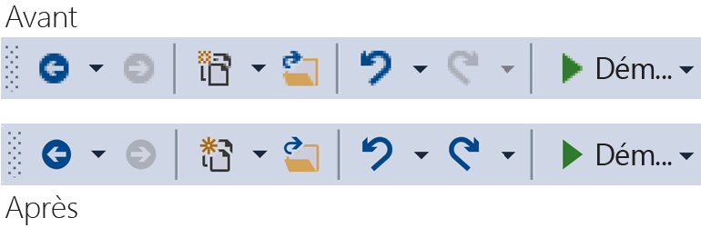
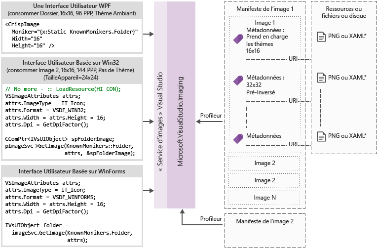

# <a name="image-service-and-catalog"></a>Catalogue et le Service d’images
Ce guide contient des conseils et meilleures pratiques pour arrêter le Service d’images Visual Studio et le catalogue d’Image introduite dans Visual Studio 2015.  
  
 Le service d’images introduit dans Visual Studio 2015 permet aux développeurs d’obtenir les meilleures images pour l’appareil et le thème sélectionné de l’utilisateur pour afficher l’image, y compris les thèmes correct pour le contexte dans lequel ils sont affichés. Arrêter le service d’images aidera à éliminer les principaux points faibles liés à la gestion des actifs, mise à l’échelle HDPI et thèmes.  
  
|||  
|-|-|  
|**Problèmes aujourd'hui**|**Solutions**|  
|Fusion de la couleur d’arrière-plan|Fusion alpha intégrés|  
|Images de thèmes (certains)|Métadonnées de thème|  
|Mode de contraste élevé|Autres ressources de contraste élevé|  
|Besoin de plusieurs ressources pour les différents modes de PPP|Ressources sélectionnables avec vectorielle de secours|  
|Images dupliquées|Un seul identificateur par le concept d’image|  
  
 Pourquoi adopter le service d’images ?  
  
-   Toujours obtenir la dernière image « pixel parfaite » à partir de Visual Studio  
  
-   Vous pouvez envoyer et utiliser vos propres images  
  
-   Pas nécessaire de tester vos images out lorsque Windows ajoute la nouvelle échelle en PPP  
  
-   Ancien obstacles architecturales dans vos implémentations d’adresses  
  
 Le Visual Studio shell barre d’outils avant et après l’utilisation du service de l’image :  
  
   
  
## <a name="how-it-works"></a>Son fonctionnement  
 Le service d’images peut fournir une image bitmap appropriée pour une infrastructure d’interface utilisateur pris en charge :  
  
-   WPF : BitmapSource  
  
-   Windows Forms : System.Drawing.Bitmap  
  
-   Win32 : HBITMAP  
  
 Image du diagramme de flux de service  
  
   
  
 **Monikers d’image**  
  
 Un moniker d’image (ou moniker pour la forme courte) est une paire GUID/ID qui identifie de façon unique un composant de l’image ou le composant de liste l’image dans la bibliothèque d’images.  
  
 **Monikers connus**  
  
 L’ensemble des monikers image contenue dans le catalogue d’images Visual Studio et publiquement consommable par n’importe quel composant de Visual Studio ou l’extension.  
  
 **Fichiers manifestes d’image**  
  
 Les fichiers image manifeste (.imagemanifest) sont des fichiers XML qui définissent un ensemble de composants de l’image, les monikers qui représentent ces ressources et l’image réelle ou des images qui représentent chaque élément multimédia. Manifestes d’images peuvent définir des images autonomes ou les listes d’images pour la prise en charge héritée de l’interface utilisateur. En outre, il existe des attributs qui peuvent être définies sur l’élément multimédia ou sur des images individuelles derrière chaque élément multimédia pour modifier quand et comment ces éléments sont affichés.  
  
 **Schéma de manifeste d’image**  
  
 Un manifeste de l’image complète ressemble à ceci :  
  
```xml  
<ImageManifest>  
      <!-- zero or one Symbols elements -->  
      <Symbols>  
        <!-- zero or more Import, Guid, ID, or String elements -->  
      </Symbols>  
      <!-- zero or one Images elements -->  
      <Images>  
        <!-- zero or more Image elements -->  
      </Images>  
      <!-- zero or one ImageLists elements -->  
      <ImageLists>  
        <!-- zero or more ImageList elements -->  
      </ImageLists>  
</ImageManifest>  
```  
  
 **Symboles**  
  
 Faciliter la lisibilité et la maintenance, le manifeste de l’image permet les symboles pour les valeurs d’attribut. Symboles qui sont définis comme suit :  
  
```xml  
<Symbols>  
      <Import Manifest="manifest" />  
      <Guid Name="ShellCommandGuid" Value="8ee4f65d-bab4-4cde-b8e7-ac412abbda8a" />  
      <ID Name="cmdidSaveAll" Value="1000" />  
      <String Name="AssemblyName" Value="Microsoft.VisualStudio.Shell.UI.Internal" />  
</Symbols>  
```  
  
|||  
|-|-|  
|**Sous-élément**|**Définition**|  
|Import|Importe les symboles du fichier manifeste donné pour une utilisation dans le manifeste actuel|  
|GUID|Le symbole représente un GUID et doit correspondre au GUID de mise en forme|  
|Id|Le symbole représente un ID et doit être un entier non négatif|  
|Chaîne|Le symbole représente une valeur de chaîne arbitraire|  
  
 Symboles respectent la casse et référencés à l’aide de la syntaxe de $(symbol-name) :  
  
```xml  
<Image Guid="$(ShellCommandGuid)" ID="$(cmdidSaveAll)" >  
      <Source Uri="/$(AssemblyName);Component/Resources/image.xaml" />  
</Image>  
```  
  
 Certains symboles sont prédéfinis pour tous les manifestes. Ils peuvent être utilisés dans l’attribut Uri de la \<Source > ou \<importation > élément aux chemins d’accès de référence sur l’ordinateur local.  
  
|||  
|-|-|  
|**Symbole**|**Description**|  
|CommonProgramFiles|La valeur de la variable d’environnement % %CommonProgramFiles|  
|LocalAppData|La valeur de la variable d’environnement % LocalAppData|  
|ManifestFolder|Le dossier contenant le fichier manifest|  
|Mes documents|Le chemin d’accès complet du dossier Mes Documents de l’utilisateur actuel|  
|ProgramFiles|La valeur de la variable d’environnement % ProgramFiles|  
|Système|Le dossier Windows\System32|  
|WinDir|La valeur de la variable d’environnement % WinDir %|  
  
 **Image**  
  
 Le \<Image > élément définit une image qui peut être référencée par un moniker. Le GUID et l’ID d’ensemble forment le moniker d’image. Le moniker de l’image doit être unique dans la bibliothèque de l’intégralité de l’image. Si plusieurs images a un moniker donné, la première rencontré lors de la génération de la bibliothèque est celui qui est conservé.  
  
 Il doit contenir au moins une source. Indépendant de la taille des sources donnera les meilleurs résultats sur un large éventail de tailles, mais ils ne sont pas requis. Si le service est demandé pour une image d’une taille non définie dans le \<Image > élément et qu’aucune source indépendant de la taille, le service de choisir la meilleure source spécifique à la taille et mettre à l’échelle à la taille demandée.  
  
```xml  
<Image Guid="guid" ID="int" AllowColorInversion="true/false">  
      <Source ... />  
      <!-- optional additional Source elements -->  
</Image>  
```  
  
|||  
|-|-|  
|**Attribut**|**Définition**|  
|GUID|[Obligatoire] Le GUID du moniker d’image|  
|Id|[Obligatoire] La partie de l’ID du moniker d’image|  
|AllowColorInversion|[Facultatif, par défaut la valeur true] Indique si l’image peut avoir ses couleurs inversées par programmation les lorsqu’il est utilisé sur un arrière-plan sombre.|  
  
 **Source**  
  
 Le \<Source > élément définit une seule source ressource (XAML et PNG).  
  
```xml  
<Source Uri="uri" Background="background">  
      <!-- optional NativeResource element -->  
 </Source>  
```  
  
|||  
|-|-|  
|**Attribut**|**Définition**|  
|URI|[Obligatoire] URI qui définit où l’image peut être chargée à partir de. Il peut avoir l'une des valeurs suivantes :<br /><br /> -A [URI à en-tête Pack](http://msdn.microsoft.com/en-US/library/aa970069\(v=vs.100\).aspx) à l’aide de l’application : / / / autorité<br />-Une référence de ressource du composant absolu<br />: Un chemin d’accès à un fichier contenant une ressource native|  
|Présentation|[Facultatif] Indique quel type d’arrière-plan de que la source est destinée à être utilisée.<br /><br /> Il peut avoir l'une des valeurs suivantes :<br /><br /> *Lumière :* la source peut être utilisée sur un arrière-plan clair.<br /><br /> *Dark :*la source peut être utilisée sur un arrière-plan sombre.<br /><br /> *Contraste élevé :* la source peut être utilisée sur n’importe quel arrière-plan en mode contraste élevé.<br /><br /> *HighContrastLight :* la source peut être utilisée sur un arrière-plan clair en mode de contraste élevé.<br /><br /> *HighContrastDark :* la source peut être utilisée sur un arrière-plan sombre dans le mode de contraste élevé.<br /><br /> Si l’attribut de l’arrière-plan est omis, la source peut être utilisée sur n’importe quel arrière-plan.<br /><br /> Si l’arrière-plan est *Light*, *foncé*, *HighContrastLight*, ou *HighContrastDark*, les couleurs de la source ne sont jamais inversés. Si l’arrière-plan est omis ou a la valeur *contraste élevé*, l’inversion des couleurs de la source est contrôlée par l’image **AllowColorInversion** attribut.|  
|||  
  
 A \<Source > élément peut avoir un seul des sous-éléments facultatives suivantes :  
  
||||  
|-|-|-|  
|**Élément**|**Attributs (tous requis)**|**Définition**|  
|\<Taille >|Value|La source est utilisée pour les images de la taille donnée (en unités de l’appareil). L’image sera carrée.|  
|\<SizeRange >|MinSize, MaxSize|La source servira pour les images à partir de MinSize à MaxSize (en unités de périphérique) (inclus). L’image sera carrée.|  
|\<Dimensions >|Largeur, hauteur|La source est utilisée pour les images de donnée de largeur et hauteur (en unités de l’appareil).|  
|\<DimensionRange >|MinWidth, MinHeight,<br /><br /> MaxWidth, MaxHeight|La source servira pour les images à partir de la largeur/hauteur minimale de la largeur/hauteur maximale (en unités de périphérique) (inclus).|  
  
 A \<Source > élément peut également avoir facultatif \<NativeResource > sous-élément qui définit un \<Source > qui est chargé à partir d’un assembly natif plutôt qu’un assembly managé.  
  
```xml  
<NativeResource Type="type" ID="int" />  
```  
  
|||  
|-|-|  
|**Attribut**|**Définition**|  
|Type|[Obligatoire] Le type de la ressource native, XAML ou PNG|  
|Id|[Obligatoire] La partie ID entier de la ressource native|  
  
 **ImageList**  
  
 Le \<ImageList > élément définit une collection d’images qui peuvent être retournées dans une bande unique. La bande est basée sur la demande, en fonction des besoins.  
  
```xml  
<ImageList>  
      <ContainedImage Guid="guid" ID="int" External="true/false" />  
      <!-- optional additional ContainedImage elements -->  
 </ImageList>  
```  
  
|||  
|-|-|  
|**Attribut**|**Définition**|  
|GUID|[Obligatoire] Le GUID du moniker d’image|  
|Id|[Obligatoire] La partie de l’ID du moniker d’image|  
|Ressource externe|[Facultatif, false de valeur par défaut] Indique si le moniker d’image fait référence à une image dans le manifeste actuel.|  
  
 Le moniker de l’image de relation contenant-contenu n’a pas à faire référence à une image définie dans le manifeste en cours. Si l’image de relation contenant-contenu est introuvable dans la bibliothèque d’images, une image d’espace réservé vide sera utilisée à la place.  
  
## <a name="using-the-image-service"></a>À l’aide du service d’images  
  
### <a name="first-steps-managed"></a>Premières étapes (gérées)  
 Pour utiliser le service d’images, vous devez ajouter des références à certains ou tous les assemblys suivants à votre projet :  
  
-   **Microsoft.VisualStudio.ImageCatalog.dll**  
  
    -   Requis si vous utilisez le catalogue de l’image intégrée KnownMonikers  
  
-   **Microsoft.VisualStudio.Imaging.dll**  
  
    -   Requis si vous utilisez **CrispImage** et **ImageThemingUtilities** dans votre UI WPF  
  
-   **Microsoft.VisualStudio.Imaging.Interop.14.0.DesignTime.dll**  
  
    -   Requis si vous utilisez la **ImageMoniker** et **ImageAttributes** types  
  
    -   **EmbedInteropTypes** doit être définie sur true  
  
-   **Microsoft.VisualStudio.Shell.Interop.14.0.DesignTime**  
  
    -   Requis si vous utilisez la **IVsImageService2** type  
  
    -   **EmbedInteropTypes** doit être définie sur true  
  
-   **Microsoft.VisualStudio.Utilities.dll**  
  
    -   Requis si vous utilisez la **BrushToColorConverter** pour le ImageThemingUtilities. **ImageBackgroundColor** dans votre interface utilisateur WPF  
  
-   **Microsoft.VisualStudio.Shell. \<VSVersion >.0**  
  
    -   Requis si vous utilisez la **IVsUIObject** type  
  
-   **Microsoft.VisualStudio.Shell.Interop.10.0.dll**  
  
    -   Requis si vous utilisez les programmes d’assistance de l’interface utilisateur associée WinForms  
  
    -   **EmbedInteropTypes** doit être définie sur true  
  
### <a name="first-steps-native"></a>Premières étapes (natif)  
 Pour utiliser le service d’images, vous devez inclure certains ou tous les en-têtes suivants à votre projet :  
  
-   **KnownImageIds.h**  
  
    -   Requis si vous utilisez le catalogue de l’image intégrée **KnownMonikers**, mais vous ne pouvez pas utiliser le **ImageMoniker** type, par exemple lorsque des valeurs de retour à partir de **IVsHierarchy GetGuidProperty**ou **GetProperty** appels.  
  
-   **KnownMonikers.h**  
  
    -   Requis si vous utilisez le catalogue de l’image intégrée **KnownMonikers**.  
  
-   **ImageParameters140.h**  
  
    -   Requis si vous utilisez la **ImageMoniker** et **ImageAttributes** types.  
  
-   **VSShell140.h**  
  
    -   Requis si vous utilisez la **IVsImageService2** type.  
  
-   **ImageThemingUtilities.h**  
  
    -   Requis si vous ne pouvez pas le service d’images permettent de gérer les thèmes pour vous.  
  
    -   Si le service d’images peut gérer les thèmes de votre image, n’utilisez pas cet en-tête.  
  
-   **VSUIDPIHelper.h**  
  
    -   Requis si vous utilisez les programmes d’assistance PPP pour obtenir la résolution en cours.  
  
## <a name="how-do-i-write-new-wpf-ui"></a>Comment écrire les nouvelles WPF UI ?  
  
1.  Commencez par ajouter les références d’assembly requises ci-dessus tout d’abord les étapes de section pour votre projet. Vous n’avez pas besoin de tous les ajouter, ajoutez simplement les références que vous avez besoin. (Remarque : Si vous utilisez ou que vous avez accès à **couleurs** au lieu de **pinceaux**, vous pouvez ignorer la référence à **utilitaires**, car vous n’avez pas besoin du convertisseur.)  
  
2.  Sélectionnez l’image souhaitée et obtenir son nom. Utiliser un **KnownMoniker**, ou utiliser votre propre si vous disposez de vos propres images personnalisées et les monikers.  
  
3.  Ajouter **CrispImages** à votre code XAML. (Voir exemple ci-dessous).  
  
4.  Définir le **ImageThemingUtilities.ImageBackgroundColor** propriété dans votre hiérarchie de l’interface utilisateur. (Elle doit être définie à l’emplacement où la couleur d’arrière-plan est connue, pas nécessairement sur le **CrispImage**.) (Voir exemple ci-dessous).  
  
```xaml  
<Window  
  x:Class="WpfApplication.MainWindow"  
  xmlns="http://schemas.microsoft.com/winfx/2006/xaml/presentation"  
  xmlns:x="http://schemas.microsoft.com/winfx/2006/xaml"  
  xmlns:imaging="clr-namespace:Microsoft.VisualStudio.Imaging;assembly=Microsoft.VisualStudio.Imaging"  
  xmlns:theming="clr-namespace:Microsoft.VisualStudio.PlatformUI;assembly=Microsoft.VisualStudio.Imaging"  
  xmlns:utilities="clr-namespace:Microsoft.Internal.VisualStudio.Imaging;assembly=Microsoft.VisualStudio.Imaging"  
  xmlns:catalog="clr-namespace:Microsoft.VisualStudio.Imaging;assembly=Microsoft.VisualStudio.ImageCatalog"  
  Title="MainWindow" Height="350" Width="525" UseLayoutRounding="True">  
  <Window.Resources>  
    <utilities:BrushToColorConverter x:Key="BrushToColorConverter"/>  
  </Window.Resources>  
  <StackPanel Background="White" VerticalAlignment="Center"   
    theming:ImageThemingUtilities.ImageBackgroundColor="{Binding Background, RelativeSource={RelativeSource Self}, Converter={StaticResource BrushToColorConverter}}">  
    <imaging:CrispImage Width="16" Height="16" Moniker="{x:Static catalog:KnownMonikers.MoveUp}" />  
  </StackPanel>  
</Window>  
```  
  
 **Comment mettre à jour existant WPF UI ?**  
  
 Mise à jour existant WPF UI est un processus relativement simple qui se compose de trois étapes de base :  
  
1.  Remplacer tout \<Image > éléments dans votre interface utilisateur avec \<CrispImage > éléments  
  
2.  Modifier tous les attributs de Source aux attributs du Moniker  
  
    -   Si l’image ne change jamais et que vous utilisez **KnownMonikers**, puis lier statiquement cette propriété à la **KnownMoniker**. (Consultez l’exemple ci-dessus.)  
  
    -   Si l’image ne change jamais et que vous utilisez votre propre image personnalisée, puis lier statiquement à votre propre moniker.  
  
    -   Si l’image peut changer, lier l’attribut de nom à une propriété de code qui notifie des modifications de propriété.  
  
3.  Quelque part dans la hiérarchie de l’interface utilisateur, définissez **ImageThemingUtilities.ImageBackgroundColor** pour rendre l’inversion des couleurs que fonctionne correctement.  
  
    -   Cela peut nécessiter l’utilisation de la **BrushToColorConverter** classe. (Consultez l’exemple ci-dessus.)  
  
## <a name="how-do-i-update-win32-ui"></a>Comment mettre à jour l’interface utilisateur Win32 ?  
 Ajoutez le code suivant à votre code, le cas échéant remplacer le brut lors du chargement des images. Passer des valeurs de retour HBITMAP et HICONs et HIMAGELIST en fonction des besoins.  
  
 **Obtenir le service d’images**  
  
```cpp  
CComPtr<IVsImageService2> spImgSvc;  
CGlobalServiceProvider::HrQueryService(SID_SVsImageService, &spImgSvc);  
```  
  
 **Demande de l’image**  
  
```cpp  
ImageAttributes attr = { 0 };  
attr.StructSize      = sizeof(attributes);  
attr.Format          = DF_Win32;  
// IT_Bitmap for HBITMAP, IT_Icon for HICON, IT_ImageList for HIMAGELIST  
attr.ImageType       = IT_Bitmap;  
attr.LogicalWidth    = 16;  
attr.LogicalHeight   = 16;  
attr.Dpi             = VsUI::DpiHelper::GetDeviceDpiX();  
attr.Background      = 0xFFFFFFFF;  
// Desired RGBA color, if you don't use this, don't set IAF_Background below  
attr.Flags           = IAF_RequiredFlags | IAF_Background;  
  
CComPtr<IVsUIObject> spImg;  
// Replace this KnownMoniker with your desired ImageMoniker  
spImgSvc->GetImage(KnownMonikers::Blank, attributes, &spImg);  
  
```  
  
## <a name="how-do-i-update-winforms-ui"></a>Comment mettre à jour WinForms UI ?  
 Ajoutez le code suivant à votre code, le cas échéant remplacer le brut lors du chargement des images. Passer des valeurs de retour des Bitmaps et icônes en fonction des besoins.  
  
 **Utile à l’aide d’instruction**  
  
```csharp  
using GelUtilities = Microsoft.Internal.VisualStudio.PlatformUI.Utilities;  
```  
  
 **Obtenir le service d’images**  
  
```csharp  
// This or your preferred way of querying for Visual Studio services  
IVsImageService2 imageService = (IVsImageService2)Package.GetGlobalService(typeof(SVsImageService));  
  
```  
  
 **Demande de l’image**  
  
```csharp  
ImageAttributes attributes = new ImageAttributes  
{  
    StructSize    = Marshal.SizeOf(typeof(ImageAttributes)),  
    // IT_Bitmap for Bitmap, IT_Icon for Icon  
    ImageType     = (uint)_UIImageType.IT_Bitmap,  
    Format        = (uint)_UIDataFormat.DF_WinForms,  
    LogicalWidth  = 16,  
    LogicalHeight = 16,  
    // Desired RGBA color, if you don't use this, don't set IAF_Background below  
    Background    = 0xFFFFFFFF,  
    Flags = (uint)_ImageAttributesFlags.IAF_RequiredFlags | _ImageAttributesFlags.IAF_Background,  
};  
  
// Replace this KnownMoniker with your desired ImageMoniker  
IVsUIObject uIObj = imageService.GetImage(KnownMonikers.Blank, attributes);  
  
Bitmap bitmap = (Bitmap)GelUtilities.GetObjectData(uiObj); // Use this if you need a bitmap  
// Icon icon = (Icon)GelUtilities.GetObjectData(uiObj); // Use this if you need an icon  
  
```  
  
## <a name="how-do-i-use-image-monikers-in-a-new-tool-window"></a>Utilisation de monikers de l’image dans une nouvelle fenêtre outil  
 Le modèle de projet de package VSIX a été mis à jour pour Visual Studio 2015. Pour créer une nouvelle fenêtre outil, avec le bouton droit sur le projet VSIX, puis sélectionnez « Ajouter un élément nouveau... » (Ctrl + Maj + A). Sous le nœud d’extensibilité pour le langage du projet, sélectionnez « Fenêtre de l’outil personnalisé », donnez un nom à la fenêtre outil, appuyez sur le bouton « Ajouter ».  
  
 Ce sont les emplacements de clé à utiliser les monikers dans une fenêtre outil. Suivez les instructions pour chacun :  
  
1.  L’onglet de fenêtre outil lorsque les onglets obtenez small suffisamment (également utilisé dans le sélecteur de fenêtre Ctrl + Tab).  
  
     Ajoutez cette ligne au constructeur de la classe qui dérive de la **ToolWindowPane** type :  
  
    ```csharp  
    // Replace this KnownMoniker with your desired ImageMoniker  
    this.BitmapImageMoniker = KnownMonikers.Blank;  
    ```  
  
2.  La commande pour ouvrir la fenêtre outil.  
  
     Dans le fichier .vsct pour le package, modifiez le bouton de commande de la fenêtre d’outil :  
  
    ```xml  
    <Button guid="guidPackageCmdSet" id="CommandId" priority="0x0100" type="Button">  
      <Parent guid="guidSHLMainMenu" id="IDG_VS_WNDO_OTRWNDWS1"/>  
      <!-- Replace this KnownMoniker with your desired ImageMoniker -->  
      <Icon guid="ImageCatalogGuid" id="Blank" />  
      <!-- Add this -->  
      <CommandFlag>IconIsMoniker</CommandFlag>  
      <Strings>  
        <ButtonText>MyToolWindow</ButtonText>  
      </Strings>  
    </Button>  
    ```  
  
 **Comment utiliser les monikers de l’image dans une fenêtre outil existante ?**  
  
 Mise à jour d’une fenêtre outil existante pour utiliser les monikers de l’image est semblable à la procédure de création d’une nouvelle fenêtre outil.  
  
 Ce sont les emplacements de clé à utiliser les monikers dans une fenêtre outil. Suivez les instructions pour chacun :  
  
1.  L’onglet de fenêtre outil lorsque les onglets obtenez small suffisamment (également utilisé dans le sélecteur de fenêtre Ctrl + Tab).  
  
    1.  Supprimez ces lignes (s’ils existent) dans le constructeur de la classe qui dérive de la **ToolWindowPane** type :  
  
        ```csharp  
        this.BitmapResourceID = <Value>;  
        this.BitmapIndex = <Value>;  
        ```  
  
    2.  Consultez l’étape #1 de la « Comment utiliser les Monikers Image dans une nouvelle fenêtre outil ? » section ci-dessus.  
  
2.  La commande pour ouvrir la fenêtre outil.  
  
    -   Consultez l’étape #2 de la « Comment utiliser les Monikers Image dans une nouvelle fenêtre outil ? » section ci-dessus.  
  
## <a name="how-do-i-use-image-monikers-in-a-vsct-file"></a>Comment utiliser des monikers de l’image dans un fichier .vsct ?  
 Mettre à jour votre fichier .vsct comme indiqué par les lignes commentées ci-dessous :  
  
```xml  
<?xml version="1.0" encoding="utf-8"?>  
<CommandTable xmlns="http://schemas.microsoft.com/VisualStudio/2005-10-18/CommandTable" xmlns:xs="http://www.w3.org/2001/XMLSchema">  
  <!--  Include the definitions for images included in the VS image catalog -->  
  <Include href="KnownImageIds.vsct"/>  
  <Commands package="guidMyPackage">  
    <Buttons>  
      <Button guid="guidMyCommandSet" id="cmdidMyCommand" priority="0x0000" type="Button">  
        <!-- Add an Icon element, changing the attributes to match the image moniker you want to use.  
             In this case, we're using the Guid for the VS image catalog.  
             Change the id attribute to be the ID of the desired image moniker. -->  
        <Icon guid="ImageCatalogGuid" id="OpenFolder" />  
        <CommandFlag>DynamicVisibility</CommandFlag>  
        <CommandFlag>DefaultInvisible</CommandFlag>  
        <CommandFlag>DefaultDisabled</CommandFlag>  
        <CommandFlag>CommandWellOnly</CommandFlag>  
        <CommandFlag>IconAndText</CommandFlag>  
        <!-- Add the IconIsMoniker CommandFlag -->  
        <CommandFlag>IconIsMoniker</CommandFlag>  
        <Strings>  
          <ButtonText>Quick Fixes...</ButtonText>  
          <CommandName>Show Quick Fixes</CommandName>  
          <CanonicalName>ShowQuickFixes</CanonicalName>  
          <LocCanonicalName>ShowQuickFixes</LocCanonicalName>  
        </Strings>  
      </Button>  
    </Buttons>  
  </Commands>  
  <!-- It is recommended that you remove <Bitmap> elements that are no longer used in the vsct file -->  
  <Symbols>  
    <GuidSymbol name="guidMyPackage"    value="{1491e936-6ffe-474e-8371-30e5920d8fdd}" />  
    <GuidSymbol name="guidMyCommandSet" value="{10347de4-69a9-47f4-a950-d3301f6d2bc7}">  
      <IDSymbol name="cmdidMyCommand" value="0x9437" />  
    </GuidSymbol>  
  </Symbols>  
</CommandTable>  
```  
  
 **Que se passe-t-il si mon fichier .vsct doit également être lu par des versions antérieures de Visual Studio ?**  
  
 Les versions antérieures de Visual Studio ne reconnaissent pas le **IconIsMoniker** indicateur de commande. Vous pouvez utiliser des images à partir du service d’images sur des versions de Visual Studio qui prennent en charge, mais continuent à utiliser des images de style ancien sur des versions antérieures de Visual Studio. Pour ce faire, vous conservez le fichier .vsct inchangée (et par conséquent, compatible avec les versions antérieures de Visual Studio) et créer un fichier CSV (valeurs séparées par des virgules) qui est mappé à partir des paires/ID GUID définis dans un fichier de .vsct \<Bitmaps > élément d’image paires GUID/ID de moniker.  
  
 Le format du fichier CSV de mappage est :  
  
```  
Icon guid, Icon id, Moniker guid, Moniker id  
b714fcf7-855e-4e4c-802a-1fd87144ccad,1,fda30684-682d-421c-8be4-650a2967058e,100  
b714fcf7-855e-4e4c-802a-1fd87144ccad,2,fda30684-682d-421c-8be4-650a2967058e,200  
```  
  
 Le fichier CSV est déployé avec le package et son emplacement est spécifié par le **IconMappingFilename** propriété de la **ProvideMenuResource** attribut package :  
  
```csharp  
[ProvideMenuResource("MyPackage.ctmenu", 1, IconMappingFilename="IconMappings.csv")]  
```  
  
 Le **IconMappingFilename** est un chemin d’accès relatif enraciné implicitement à $ $PackageFolder (comme dans l’exemple ci-dessus), ou un chemin d’accès absolu explicitement située dans le répertoire défini par une variable d’environnement, telles que @"%UserProfile%\ dir1\dir2\MyMappingFile.csv ».  
  
## <a name="how-do-i-port-a-project-system"></a>Comment de port d’un système de projet  
 **Comment fournir ImageMonikers pour un projet**  
  
1.  Implémentez **VSHPROPID_SupportsIconMonikers** sur du projet **IVsHierarchy**et retourne la valeur true.  
  
2.  Implémenter le **VSHPROPID_IconMonikerImageList** (si le projet d’origine utilisé **VSHPROPID_IconImgList**) ou **VSHPROPID_IconMonikerGuid**,  **VSHPROPID_IconMonikerId**, **VSHPROPID_OpenFolderIconMonikerGuid**, **VSHPROPID_OpenFolderIconMonikerId** (si le projet d’origine utilisé  **VSHPROPID_IconHandle** et **VSHPROPID_OpenFolderIconHandle**).  
  
3.  Modifier l’implémentation des VSHPROPIDs d’origine pour les icônes pour créer des versions « héritées » des icônes si des points d’extension font la demande. **IVsImageService2** fournit les fonctionnalités nécessaires pour obtenir ces icônes  
  
 **Exigences supplémentaires pour VB / C# types**  
  
 Uniquement implémenter **VSHPROPID_SupportsIconMonikers** si vous détectez que votre projet est la **flavor extérieur**. Dans le cas contraire, la version extérieur réelle n’acceptent pas les monikers de l’image en réalité, et votre version de base peut-être efficacement « masquer » des images personnalisées.  
  
 **Comment utiliser les monikers de l’image dans le CPS ?**  
  
 Définition des images personnalisées dans une déclaration CPS (système de projet commun) peut être effectuée manuellement ou via un modèle d’élément qui est fourni avec le Kit de développement d’extensibilité de système de projet.  
  
 **À l’aide de l’extensibilité de système de projet SDK**  
  
 Suivez les instructions à [fournir des icônes personnalisées pour le type de projet/élément de Type](https://github.com/Microsoft/VSProjectSystem/blob/master/doc/scenario/provide_custom_icons_for_the_project_or_item_type.md) pour personnaliser les images de votre déclaration CPS. Vous trouverez plus d’informations sur la déclaration CPS sur [Documentation d’extensibilité de système de projet Visual Studio](https://github.com/Microsoft/VSProjectSystem)  
  
 **Utiliser manuellement ImageMonikers**  
  
1.  Implémentez et exportez le **IProjectTreeModifier** interface dans votre système de projet.  
  
2.  Déterminer quelles **KnownMoniker** ou moniker d’image personnalisée à utiliser.  
  
3.  Dans le **ApplyModifications** (méthode), procédez comme suit quelque part dans la méthode avant de retourner la nouvelle arborescence, similaire à l’exemple ci-dessous :  
  
    ```csharp  
    // Replace this KnownMoniker with your desired ImageMoniker  
    tree = tree.SetIcon(KnownMonikers.Blank.ToProjectSystemType());  
    ```  
  
4.  Si vous créez une nouvelle arborescence, vous pouvez définir des images personnalisées en passant les monikers souhaités dans la méthode NewTree, similaire à l’exemple ci-dessous :  
  
    ```csharp  
    // Replace this KnownMoniker with your desired ImageMoniker  
    ProjectImageMoniker icon         = KnownMonikers.FolderClosed.ToProjectSystemType();  
    ProjectImageMoniker expandedIcon = KnownMonikers.FolderOpened.ToProjectSystemType();  
  
    return this.ProjectTreeFactory.Value.NewTree(/*caption*/<value>,  
                                                 /*filePath*/<value>,  
                                                 /*browseObjectProperties*/<value>,  
                                                 icon,  
                                                 expandedIcon);  
    ```  
  
## <a name="how-do-i-convert-from-a-real-image-strip-to-a-moniker-based-image-strip"></a>Comment convertir à partir d’une bande d’images réelle pour une bande basée sur le moniker de l’image ?  
 **J’ai besoin prendre en charge HIMAGELISTs**  
  
 S’il existe une bande d’image existant pour votre code que vous souhaitez mettre à jour pour utiliser le service d’images, mais vous êtes limité par les API qui nécessitent de passer des listes d’images, vous pouvez toujours obtenir les avantages du service de l’image. Pour créer une bande basée sur le moniker de l’image, suivez les étapes ci-dessous pour créer un manifeste à partir des monikers existants.  
  
1.  Exécutez le **ManifestFromResources** outil, en lui passant la bande d’images. Cette opération génère un manifeste pour la bande.  
  
    -   Recommandé : fournir un nom non par défaut pour le manifeste en fonction de son utilisation.  
  
2.  Si vous utilisez uniquement **KnownMonikers**, puis procédez comme suit :  
  
    -   Remplacez le \<Images > section du manifeste avec \<Images / >.  
  
    -   Supprimer tous les ID de sous-image (n’est pas défini avec \<imagestrip nom > _ ##).  
  
    -   Recommandé : renommer le symbole de AssetsGuid et le symbole de bande d’image en fonction de son utilisation.  
  
    -   Remplacez chaque **ContainedImage**du GUID à l’aide de $(ImageCatalogGuid), remplacez chaque **ContainedImage**d’ID avec $(\<moniker >) et ajoutez l’attribut « true » = externe à chaque **ContainedImage**  
  
        -   \<moniker > doit être remplacé par le **KnownMoniker** qui correspond à l’image, mais avec le « KnownMonikers ». supprimés du nom.  
  
    -   Ajouter < Import Manifest="$(ManifestFolder)\\< Relative installer le chemin d’accès du répertoire à\>\Microsoft.VisualStudio.ImageCatalog.imagemanifest » /\> vers le haut de la \<symboles > section.  
  
        -   Le chemin d’accès relatif est déterminé par l’emplacement de déploiement défini dans le programme d’installation pour le manifeste de création.  
  
3.  Exécutez le **ManifestToCode** outil pour générer des wrappers et que le code existant a un moniker, il peut utiliser pour interroger le service d’images pour la bande d’images.  
  
    -   Recommandé : fournir des noms par défaut pour les wrappers et les espaces de noms en fonction de leur utilisation.  
  
4.  Effectuez toutes les ajoute, installation de création et le déploiement et autres modifications de code pour travailler avec le service d’images et les nouveaux fichiers.  
  
 Manifeste de l’exemple, y compris les images internes et externes pour voir qu’il doit ressembler à :  
  
```xml  
<?xml version="1.0"?>  
<ImageManifest  
  xmlns:xsi="http://www.w3.org/2001/XMLSchema-instance"  
  xmlns:xsd="http://www.w3.org/2001/XMLSchema"  
  xmlns="http://schemas.microsoft.com/VisualStudio/ImageManifestSchema/2014">  
  
  <Symbols>  
    <!-- This needs to be the relative path from your manifest to the ImageCatalog's manifest  
         where $(ManifestFolder) is the deployed location of this manifest. -->  
    <Import Manifest="$(ManifestFolder)\<RelPath>\Microsoft.VisualStudio.ImageCatalog.imagemanifest" />  
  
    <String Name="Resources" Value="/My.Assembly.Name;Component/Resources/ImageStrip" />  
    <Guid Name="ImageGuid" Value="{fb41b7ef-6587-480c-aa27-5b559d42cfc9}" />  
    <Guid Name="ImageStripGuid" Value="{9c84a570-d9a7-4052-a340-188fb276f973}" />  
    <ID Name="MyImage_0" Value="100" />  
    <ID Name="MyImage_1" Value="101" />  
    <ID Name="InternalList" Value="1001" />  
    <ID Name="ExternalList" Value="1002" />  
  </Symbols>  
  
  <Images>  
    <Image Guid="$(ImageGuid)" ID="$(MyImage_0)">  
      <Source Uri="$(Resources)/MyImage_0.png">  
        <Size Value="16" />  
      </Source>  
    </Image>  
    <Image Guid="$(ImageGuid)" ID="$(MyImage_1)">  
      <Source Uri="$(Resources)/MyImage_1.png">  
        <Size Value="16" />  
      </Source>  
    </Image>  
  </Images>  
  
  <ImageLists>  
    <ImageList Guid="$(ImageStripGuid)" ID="$(InternalList)">  
      <ContainedImage Guid="$(ImageGuid)" ID="$(MyImage_0)" />  
      <ContainedImage Guid="$(ImageGuid)" ID="$(MyImage_1)" />  
    </ImageList>  
    <ImageList Guid="$(ImageStripGuid)" ID="$(ExternalList)">  
      <ContainedImage Guid="$(ImageCatalogGuid)" ID="$(StatusError)" External="true" />  
      <ContainedImage Guid="$(ImageCatalogGuid)" ID="$(StatusWarning)" External="true" />  
      <ContainedImage Guid="$(ImageCatalogGuid)" ID="$(StatusInformation)" External="true" />  
    </ImageList>  
  </ImageLists>  
  
</ImageManifest>  
```  
  
 **Vous n’avez pas besoin prendre en charge HIMAGELISTs**  
  
1.  Déterminer l’ensemble de **KnownMonikers** qui correspondent aux images dans votre bande d’image, ou créer votre propre monikers pour les images dans votre bande d’image.  
  
2.  Mettre à jour le mappage vous permet d’obtenir de l’image à l’index requis dans la bande d’images à utiliser les monikers à la place.  
  
3.  Mettre à jour votre code pour utiliser le service d’images pour demander des monikers via le mappage de mise à jour. (Cela peut signifier que la mise à jour vers **CrispImages** pour code managé, ou demande HBITMAP ou HICONs à partir du service de l’image et en les passant autour du code natif.)  
  
## <a name="testing-your-images"></a>Testez vos images  
 Vous pouvez utiliser l’outil Visionneuse de bibliothèque d’images pour tester vos manifestes d’images pour vous assurer que tout a été correctement créé. Vous le trouverez dans le [SDK Visual Studio 2015](http://msdn.microsoft.com/library/bb166441.aspx). Documentation pour cet outil et d’autres sont accessibles [ici](http://aka.ms/VSImageThemeTools).  
  
## <a name="additional-resources"></a>Ressources supplémentaires  
  
### <a name="samples"></a>Exemples  
 Plusieurs exemples Visual Studio sur GitHub ont été mis à jour pour montrer comment utiliser le service d’images dans le cadre de divers points d’extensibilité de Visual Studio.  
  
 Vérifiez [http://github.com/Microsoft/VSSDK-Extensibility-Samples](http://github.com/Microsoft/VSSDK-Extensibility-Samples) pour les exemples les plus récentes.  
  
### <a name="tooling"></a>Outillage  
 Un ensemble d’outils de prise en charge pour le Service d’images a été créé pour faciliter la création/mise à jour l’interface utilisateur qui fonctionne avec le Service d’images. Pour plus d’informations sur chaque outil, consultez la documentation fournie avec les outils. Les outils sont inclus dans le cadre de la [SDK Visual Studio 2015.](http://msdn.microsoft.com/library/bb166441.aspx)  
  
 **ManifestFromResources**  
  
 Le manifeste à partir de l’outil de ressources utilise une liste de ressources d’image (PNG ou XAML) et génère un fichier de manifeste d’image pour l’utilisation de ces images avec le service d’images.  
  
 **ManifestToCode**  
  
 Le manifeste de l’outil Code prend un fichier de manifeste d’image et génère un fichier de wrapper pour faire référence à des valeurs de manifeste dans le code (C++, c# ou Visual Basic) ou des fichiers .vsct.  
  
 **ImageLibraryViewer**  
  
 L’outil Visionneuse de bibliothèque images peut charger des manifestes d’images et permet à l’utilisateur pour les manipuler dans la même façon Visual Studio pour vous assurer que le manifeste a été créé correctement. L’utilisateur peut modifier en arrière-plan, tailles, paramètre PPP, contraste élevé et autres paramètres. Aussi, il affiche des informations de chargement pour trouver les erreurs dans les manifestes et affiche des informations de source pour chaque image dans le manifeste.  
  
## <a name="faq"></a>FAQ  
  
-   Y a-t-il des dépendances que vous devez inclure lors du chargement de \<Include="Microsoft.VisualStudio.* de référence. Interop.14.0.designTime » / > ?  
  
    -   Définir EmbedInteropTypes = « true » sur toutes les DLL d’interopérabilité.  
  
-   Comment déployer un manifeste de l’image avec l’extension de my ?  
  
    -   Ajoutez le fichier .imagemanifest à votre projet.  
  
    -   La valeur « Inclure dans VSIX » la valeur True.  
  
-   Je mets à jour mon système de projet CPS. Qu’est-il advenu de **ImageName** et **StockIconService**?  
  
    -   o que ceux-ci ont été supprimés lors de la déclaration CPS a été mis à jour pour utiliser les monikers. Vous n’avez plus besoin d’appeler le **StockIconService**, simplement transmettre souhaité **KnownMoniker** à la méthode ou propriété à l’aide du **ToProjectSystemType()** méthode d’extension dans les utilitaires de la déclaration CPS. Vous pouvez trouver un mappage à partir de **ImageName** à **KnownMonikers** ci-dessous :  
  
        |||  
        |-|-|  
        |**ImageName**|**KnownMoniker**|  
        |ImageName.OfflineWebApp|KnownImageIds.Web|  
        |ImageName.WebReferencesFolder|KnownImageIds.Web|  
        |ImageName.OpenReferenceFolder|KnownImageIds.FolderOpened|  
        |ImageName.ReferenceFolder|KnownImageIds.Reference|  
        |ImageName.Reference|KnownImageIds.Reference|  
        |ImageName.SdlWebReference|KnownImageIds.WebReferenceFolder|  
        |ImageName.DiscoWebReference|KnownImageIds.DynamicDiscoveryDocument|  
        |ImageName.Folder|KnownImageIds.FolderClosed|  
        |ImageName.OpenFolder|KnownImageIds.FolderOpened|  
        |ImageName.ExcludedFolder|KnownImageIds.HiddenFolderClosed|  
        |ImageName.OpenExcludedFolder|KnownImageIds.HiddenFolderOpened|  
        |ImageName.ExcludedFile|KnownImageIds.HiddenFile|  
        |ImageName.DependentFile|KnownImageIds.GenerateFile|  
        |ImageName.MissingFile|KnownImageIds.DocumentWarning|  
        |ImageName.WindowsForm|KnownImageIds.WindowsForm|  
        |ImageName.WindowsUserControl|KnownImageIds.UserControl|  
        |ImageName.WindowsComponent|KnownImageIds.ComponentFile|  
        |ImageName.XmlSchema|KnownImageIds.XMLSchema|  
        |ImageName.XmlFile|KnownImageIds.XMLFile|  
        |ImageName.WebForm|KnownImageIds.Web|  
        |ImageName.WebService|KnownImageIds.WebService|  
        |ImageName.WebUserControl|KnownImageIds.WebUserControl|  
        |ImageName.WebCustomUserControl|KnownImageIds.WebCustomControl|  
        |ImageName.AspPage|KnownImageIds.ASPFile|  
        |ImageName.GlobalApplicationClass|KnownImageIds.SettingsFile|  
        |ImageName.WebConfig|KnownImageIds.ConfigurationFile|  
        |ImageName.HtmlPage|KnownImageIds.HTMLFile|  
        |ImageName.StyleSheet|KnownImageIds.StyleSheet|  
        |ImageName.ScriptFile|KnownImageIds.JSScript|  
        |ImageName.TextFile|KnownImageIds.Document|  
        |ImageName.SettingsFile|KnownImageIds.Settings|  
        |ImageName.Resources|KnownImageIds.DocumentGroup|  
        |ImageName.Bitmap|KnownImageIds.Image|  
        |ImageName.Icon|KnownImageIds.IconFile|  
        |ImageName.Image|KnownImageIds.Image|  
        |ImageName.ImageMap|KnownImageIds.ImageMapFile|  
        |ImageName.XWorld|KnownImageIds.XWorldFile|  
        |ImageName.Audio|KnownImageIds.Sound|  
        |ImageName.Video|KnownImageIds.Media|  
        |ImageName.Cab|KnownImageIds.CABProject|  
        |ImageName.Jar|KnownImageIds.JARFile|  
        |ImageName.DataEnvironment|KnownImageIds.DataTable|  
        |ImageName.PreviewFile|KnownImageIds.Report|  
        |ImageName.DanglingReference|KnownImageIds.ReferenceWarning|  
        |ImageName.XsltFile|KnownImageIds.XSLTransform|  
        |ImageName.Cursor|KnownImageIds.CursorFile|  
        |ImageName.AppDesignerFolder|KnownImageIds.Property|  
        |ImageName.Data|KnownImageIds.Database|  
        |ImageName.Application|KnownImageIds.Application|  
        |ImageName.DataSet|KnownImageIds.DatabaseGroup|  
        |ImageName.Pfx|KnownImageIds.Certificate|  
        |ImageName.Snk|KnownImageIds.Rule|  
        |ImageName.VisualBasicProject|KnownImageIds.VBProjectNode|  
        |ImageName.CSharpProject|KnownImageIds.CSProjectNode|  
        |ImageName.Empty|KnownImageIds.Blank|  
        |ImageName.MissingFolder|KnownImageIds.FolderOffline|  
        |ImageName.SharedImportReference|KnownImageIds.SharedProject|  
        |ImageName.SharedProjectCs|KnownImageIds.CSSharedProject|  
        |ImageName.SharedProjectVc|KnownImageIds.CPPSharedProject|  
        |ImageName.SharedProjectJs|KnownImageIds.JSSharedProject|  
        |ImageName.CSharpCodeFile|KnownImageIds.CSFileNode|  
        |ImageName.VisualBasicCodeFile|KnownImageIds.VBFileNode|  
  
    -   Je mets à jour mon fournisseur de liste de saisie semi-automatique. Ce que **KnownMonikers** correspond à l’ancien **StandardGlyphGroup** et **StandardGlyph** valeurs ?  
  
        ||||  
        |-|-|-|  
        |GlyphGroupClass|GlyphItemPublic|ClassPublic|  
        |GlyphGroupClass|GlyphItemInternal|ClassInternal|  
        |GlyphGroupClass|GlyphItemFriend|ClassInternal|  
        |GlyphGroupClass|GlyphItemProtected|ClassProtected|  
        |GlyphGroupClass|GlyphItemPrivate|ClassPrivate|  
        |GlyphGroupClass|GlyphItemShortcut|ClassShortcut|  
        |GlyphGroupConstant|GlyphItemPublic|ClassPublic|  
        |GlyphGroupConstant|GlyphItemInternal|ClassInternal|  
        |GlyphGroupConstant|GlyphItemFriend|ClassInternal|  
        |GlyphGroupConstant|GlyphItemProtected|ClassProtected|  
        |GlyphGroupConstant|GlyphItemPrivate|ClassPrivate|  
        |GlyphGroupConstant|GlyphItemShortcut|ClassShortcut|  
        |GlyphGroupDelegate|GlyphItemPublic|DelegatePublic|  
        |GlyphGroupDelegate|GlyphItemInternal|DelegateInternal|  
        |GlyphGroupDelegate|GlyphItemFriend|DelegateInternal|  
        |GlyphGroupDelegate|GlyphItemProtected|DelegateProtected|  
        |GlyphGroupDelegate|GlyphItemPrivate|DelegatePrivate|  
        |GlyphGroupDelegate|GlyphItemShortcut|DelegateShortcut|  
        |GlyphGroupEnum|GlyphItemPublic|EnumerationPublic|  
        |GlyphGroupEnum|GlyphItemInternal|EnumerationInternal|  
        |GlyphGroupEnum|GlyphItemFriend|EnumerationInternal|  
        |GlyphGroupEnum|GlyphItemProtected|EnumerationProtected|  
        |GlyphGroupEnum|GlyphItemPrivate|EnumerationPrivate|  
        |GlyphGroupEnum|GlyphItemShortcut|EnumerationShortcut|  
        |GlyphGroupEnumMember|GlyphItemPublic|EnumerationMemberPublic|  
        |GlyphGroupEnumMember|GlyphItemInternal|EnumerationMemberInternal|  
        |GlyphGroupEnumMember|GlyphItemFriend|EnumerationMemberInternal|  
        |GlyphGroupEnumMember|GlyphItemProtected|EnumerationMemberProtected|  
        |GlyphGroupEnumMember|GlyphItemPrivate|EnumerationMemberPrivate|  
        |GlyphGroupEnumMember|GlyphItemShortcut|EnumerationMemberShortcut|  
        |GlyphGroupEvent|GlyphItemPublic|EventPublic|  
        |GlyphGroupEvent|GlyphItemInternal|EventInternal|  
        |GlyphGroupEvent|GlyphItemFriend|EventInternal|  
        |GlyphGroupEvent|GlyphItemProtected|EventProtected|  
        |GlyphGroupEvent|GlyphItemPrivate|EventPrivate|  
        |GlyphGroupEvent|GlyphItemShortcut|EventShortcut|  
        |GlyphGroupException|GlyphItemPublic|ExceptionPublic|  
        |GlyphGroupException|GlyphItemInternal|ExceptionInternal|  
        |GlyphGroupException|GlyphItemFriend|ExceptionInternal|  
        |GlyphGroupException|GlyphItemProtected|ExceptionProtected|  
        |GlyphGroupException|GlyphItemPrivate|ExceptionPrivate|  
        |GlyphGroupException|GlyphItemShortcut|ExceptionShortcut|  
        |GlyphGroupField|GlyphItemPublic|FieldPublic|  
        |GlyphGroupField|GlyphItemInternal|FieldInternal|  
        |GlyphGroupField|GlyphItemFriend|FieldInternal|  
        |GlyphGroupField|GlyphItemProtected|FieldProtected|  
        |GlyphGroupField|GlyphItemPrivate|FieldPrivate|  
        |GlyphGroupField|GlyphItemShortcut|FieldShortcut|  
        |GlyphGroupInterface|GlyphItemPublic|InterfacePublic|  
        |GlyphGroupInterface|GlyphItemInternal|InterfaceInternal|  
        |GlyphGroupInterface|GlyphItemFriend|InterfaceInternal|  
        |GlyphGroupInterface|GlyphItemProtected|InterfaceProtected|  
        |GlyphGroupInterface|GlyphItemPrivate|InterfacePrivate|  
        |GlyphGroupInterface|GlyphItemShortcut|InterfaceShortcut|  
        |GlyphGroupMacro|GlyphItemPublic|MacroPublic|  
        |GlyphGroupMacro|GlyphItemInternal|MacroInternal|  
        |GlyphGroupMacro|GlyphItemFriend|MacroInternal|  
        |GlyphGroupMacro|GlyphItemProtected|MacroProtected|  
        |GlyphGroupMacro|GlyphItemPrivate|MacroPrivate|  
        |GlyphGroupMacro|GlyphItemShortcut|MacroShortcut|  
        |GlyphGroupMap|GlyphItemPublic|MapPublic|  
        |GlyphGroupMap|GlyphItemInternal|MapInternal|  
        |GlyphGroupMap|GlyphItemFriend|MapInternal|  
        |GlyphGroupMap|GlyphItemProtected|MapProtected|  
        |GlyphGroupMap|GlyphItemPrivate|MapPrivate|  
        |GlyphGroupMap|GlyphItemShortcut|MapShortcut|  
        |GlyphGroupMapItem|GlyphItemPublic|MapItemPublic|  
        |GlyphGroupMapItem|GlyphItemInternal|MapItemInternal|  
        |GlyphGroupMapItem|GlyphItemFriend|MapItemInternal|  
        |GlyphGroupMapItem|GlyphItemProtected|MapItemProtected|  
        |GlyphGroupMapItem|GlyphItemPrivate|MapItemPrivate|  
        |GlyphGroupMapItem|GlyphItemShortcut|MapItemShortcut|  
        |GlyphGroupMethod|GlyphItemPublic|MethodPublic|  
        |GlyphGroupMethod|GlyphItemInternal|MethodInternal|  
        |GlyphGroupMethod|GlyphItemFriend|MethodInternal|  
        |GlyphGroupMethod|GlyphItemProtected|MethodProtected|  
        |GlyphGroupMethod|GlyphItemPrivate|MethodPrivate|  
        |GlyphGroupMethod|GlyphItemShortcut|MethodShortcut|  
        |GlyphGroupOverload|GlyphItemPublic|MethodPublic|  
        |GlyphGroupOverload|GlyphItemInternal|MethodInternal|  
        |GlyphGroupOverload|GlyphItemFriend|MethodInternal|  
        |GlyphGroupOverload|GlyphItemProtected|MethodProtected|  
        |GlyphGroupOverload|GlyphItemPrivate|MethodPrivate|  
        |GlyphGroupOverload|GlyphItemShortcut|MethodShortcut|  
        |GlyphGroupModule|GlyphItemPublic|ModulePublic|  
        |GlyphGroupModule|GlyphItemInternal|ModuleInternal|  
        |GlyphGroupModule|GlyphItemFriend|ModuleInternal|  
        |GlyphGroupModule|GlyphItemProtected|ModuleProtected|  
        |GlyphGroupModule|GlyphItemPrivate|ModulePrivate|  
        |GlyphGroupModule|GlyphItemShortcut|ModuleShortcut|  
        |GlyphGroupNamespace|GlyphItemPublic|NamespacePublic|  
        |GlyphGroupNamespace|GlyphItemInternal|NamespaceInternal|  
        |GlyphGroupNamespace|GlyphItemFriend|NamespaceInternal|  
        |GlyphGroupNamespace|GlyphItemProtected|NamespaceProtected|  
        |GlyphGroupNamespace|GlyphItemPrivate|NamespacePrivate|  
        |GlyphGroupNamespace|GlyphItemShortcut|NamespaceShortcut|  
        |GlyphGroupOperator|GlyphItemPublic|OperatorPublic|  
        |GlyphGroupOperator|GlyphItemInternal|OperatorInternal|  
        |GlyphGroupOperator|GlyphItemFriend|OperatorInternal|  
        |GlyphGroupOperator|GlyphItemProtected|OperatorProtected|  
        |GlyphGroupOperator|GlyphItemPrivate|OperatorPrivate|  
        |GlyphGroupOperator|GlyphItemShortcut|OperatorShortcut|  
        |GlyphGroupProperty|GlyphItemPublic|PropertyPublic|  
        |GlyphGroupProperty|GlyphItemInternal|PropertyInternal|  
        |GlyphGroupProperty|GlyphItemFriend|PropertyInternal|  
        |GlyphGroupProperty|GlyphItemProtected|PropertyProtected|  
        |GlyphGroupProperty|GlyphItemPrivate|PropertyPrivate|  
        |GlyphGroupProperty|GlyphItemShortcut|PropertyShortcut|  
        |GlyphGroupStruct|GlyphItemPublic|StructurePublic|  
        |GlyphGroupStruct|GlyphItemInternal|StructureInternal|  
        |GlyphGroupStruct|GlyphItemFriend|StructureInternal|  
        |GlyphGroupStruct|GlyphItemProtected|StructureProtected|  
        |GlyphGroupStruct|GlyphItemPrivate|StructurePrivate|  
        |GlyphGroupStruct|GlyphItemShortcut|StructureShortcut|  
        |GlyphGroupTemplate|GlyphItemPublic|TemplatePublic|  
        |GlyphGroupTemplate|GlyphItemInternal|TemplateInternal|  
        |GlyphGroupTemplate|GlyphItemFriend|TemplateInternal|  
        |GlyphGroupTemplate|GlyphItemProtected|TemplateProtected|  
        |GlyphGroupTemplate|GlyphItemPrivate|TemplatePrivate|  
        |GlyphGroupTemplate|GlyphItemShortcut|TemplateShortcut|  
        |GlyphGroupTypedef|GlyphItemPublic|TypeDefinitionPublic|  
        |GlyphGroupTypedef|GlyphItemInternal|TypeDefinitionInternal|  
        |GlyphGroupTypedef|GlyphItemFriend|TypeDefinitionInternal|  
        |GlyphGroupTypedef|GlyphItemProtected|TypeDefinitionProtected|  
        |GlyphGroupTypedef|GlyphItemPrivate|TypeDefinitionPrivate|  
        |GlyphGroupTypedef|GlyphItemShortcut|TypeDefinitionShortcut|  
        |GlyphGroupType|GlyphItemPublic|TypePublic|  
        |GlyphGroupType|GlyphItemInternal|TypeInternal|  
        |GlyphGroupType|GlyphItemFriend|TypeInternal|  
        |GlyphGroupType|GlyphItemProtected|TypeProtected|  
        |GlyphGroupType|GlyphItemPrivate|TypePrivate|  
        |GlyphGroupType|GlyphItemShortcut|TypeShortcut|  
        |GlyphGroupUnion|GlyphItemPublic|UnionPublic|  
        |GlyphGroupUnion|GlyphItemInternal|UnionInternal|  
        |GlyphGroupUnion|GlyphItemFriend|UnionInternal|  
        |GlyphGroupUnion|GlyphItemProtected|UnionProtected|  
        |GlyphGroupUnion|GlyphItemPrivate|UnionPrivate|  
        |GlyphGroupUnion|GlyphItemShortcut|UnionShortcut|  
        |GlyphGroupVariable|GlyphItemPublic|FieldPublic|  
        |GlyphGroupVariable|GlyphItemInternal|FieldInternal|  
        |GlyphGroupVariable|GlyphItemFriend|FieldInternal|  
        |GlyphGroupVariable|GlyphItemProtected|FieldProtected|  
        |GlyphGroupVariable|GlyphItemPrivate|FieldPrivate|  
        |GlyphGroupVariable|GlyphItemShortcut|FieldShortcut|  
        |GlyphGroupValueType|GlyphItemPublic|ValueTypePublic|  
        |GlyphGroupValueType|GlyphItemInternal|ValueTypeInternal|  
        |GlyphGroupValueType|GlyphItemFriend|ValueTypeInternal|  
        |GlyphGroupValueType|GlyphItemProtected|ValueTypeProtected|  
        |GlyphGroupValueType|GlyphItemPrivate|ValueTypePrivate|  
        |GlyphGroupValueType|GlyphItemShortcut|ValueTypeShortcut|  
        |GlyphGroupIntrinsic|GlyphItemPublic|ObjectPublic|  
        |GlyphGroupIntrinsic|GlyphItemInternal|ObjectInternal|  
        |GlyphGroupIntrinsic|GlyphItemFriend|ObjectInternal|  
        |GlyphGroupIntrinsic|GlyphItemProtected|ObjectProtected|  
        |GlyphGroupIntrinsic|GlyphItemPrivate|ObjectPrivate|  
        |GlyphGroupIntrinsic|GlyphItemShortcut|ObjectShortcut|  
        |GlyphGroupJSharpMethod|GlyphItemPublic|MethodPublic|  
        |GlyphGroupJSharpMethod|GlyphItemInternal|MethodInternal|  
        |GlyphGroupJSharpMethod|GlyphItemFriend|MethodInternal|  
        |GlyphGroupJSharpMethod|GlyphItemProtected|MethodProtected|  
        |GlyphGroupJSharpMethod|GlyphItemPrivate|MethodPrivate|  
        |GlyphGroupJSharpMethod|GlyphItemShortcut|MethodShortcut|  
        |GlyphGroupJSharpField|GlyphItemPublic|FieldPublic|  
        |GlyphGroupJSharpField|GlyphItemInternal|FieldInternal|  
        |GlyphGroupJSharpField|GlyphItemFriend|FieldInternal|  
        |GlyphGroupJSharpField|GlyphItemProtected|FieldProtected|  
        |GlyphGroupJSharpField|GlyphItemPrivate|FieldPrivate|  
        |GlyphGroupJSharpField|GlyphItemShortcut|FieldShortcut|  
        |GlyphGroupJSharpClass|GlyphItemPublic|ClassPublic|  
        |GlyphGroupJSharpClass|GlyphItemInternal|ClassInternal|  
        |GlyphGroupJSharpClass|GlyphItemFriend|ClassInternal|  
        |GlyphGroupJSharpClass|GlyphItemProtected|ClassProtected|  
        |GlyphGroupJSharpClass|GlyphItemPrivate|ClassPrivate|  
        |GlyphGroupJSharpClass|GlyphItemShortcut|ClassShortcut|  
        |GlyphGroupJSharpNamespace|GlyphItemPublic|NamespacePublic|  
        |GlyphGroupJSharpNamespace|GlyphItemInternal|NamespaceInternal|  
        |GlyphGroupJSharpNamespace|GlyphItemFriend|NamespaceInternal|  
        |GlyphGroupJSharpNamespace|GlyphItemProtected|NamespaceProtected|  
        |GlyphGroupJSharpNamespace|GlyphItemPrivate|NamespacePrivate|  
        |GlyphGroupJSharpNamespace|GlyphItemShortcut|NamespaceShortcut|  
        |GlyphGroupJSharpInterface|GlyphItemPublic|InterfacePublic|  
        |GlyphGroupJSharpInterface|GlyphItemInternal|InterfaceInternal|  
        |GlyphGroupJSharpInterface|GlyphItemFriend|InterfaceInternal|  
        |GlyphGroupJSharpInterface|GlyphItemProtected|InterfaceProtected|  
        |GlyphGroupJSharpInterface|GlyphItemPrivate|InterfacePrivate|  
        |GlyphGroupJSharpInterface|GlyphItemShortcut|InterfaceShortcut|  
        |GlyphGroupError||StatusError|  
        |GlyphBscFile||Fichier|  
        |GlyphAssembly||Référence|  
        |GlyphLibrary||Bibliothèque|  
        |GlyphVBProject||VBProjectNode|  
        |GlyphCoolProject||CSProjectNode|  
        |GlyphCppProject||CPPProjectNode|  
        |GlyphDialogId||Boîte de dialogue|  
        |GlyphOpenFolder||FolderOpened|  
        |GlyphClosedFolder||FolderClosed|  
        |GlyphArrow||GoToNext|  
        |GlyphCSharpFile||CSFileNode|  
        |GlyphCSharpExpansion||Extrait de code|  
        |GlyphKeyword||IntellisenseKeyword|  
        |GlyphInformation||StatusInformation|  
        |GlyphReference||ClassMethodReference|  
        |GlyphRecursion||Récursivité|  
        |GlyphXmlItem||Balise|  
        |GlyphJSharpProject||DocumentCollection|  
        |GlyphJSharpDocument||Document|  
        |GlyphForwardType||GoToNext|  
        |GlyphCallersGraph||CallTo|  
        |GlyphCallGraph||CallFrom|  
        |GlyphWarning||StatusWarning|  
        |GlyphMaybeReference||QuestionMark|  
        |GlyphMaybeCaller||CallTo|  
        |GlyphMaybeCall||CallFrom|  
        |GlyphExtensionMethod||ExtensionMethod|  
        |GlyphExtensionMethodInternal||ExtensionMethod|  
        |GlyphExtensionMethodFriend||ExtensionMethod|  
        |GlyphExtensionMethodProtected||ExtensionMethod|  
        |GlyphExtensionMethodPrivate||ExtensionMethod|  
        |GlyphExtensionMethodShortcut||ExtensionMethod|  
        |GlyphXmlAttribute||XmlAttribute|  
        |GlyphXmlChild||XmlElement|  
        |GlyphXmlDescendant||XmlDescendant|  
        |GlyphXmlNamespace||xmlNamespace|  
        |GlyphXmlAttributeQuestion||XmlAttributeLowConfidence|  
        |GlyphXmlAttributeCheck||XmlAttributeHighConfidence|  
        |GlyphXmlChildQuestion||XmlElementLowConfidence|  
        |GlyphXmlChildCheck||XmlElementHighConfidence|  
        |GlyphXmlDescendantQuestion||XmlDescendantLowConfidence|  
        |GlyphXmlDescendantCheck||XmlDescendantHighConfidence|  
        |GlyphCompletionWarning||IntellisenseWarning|