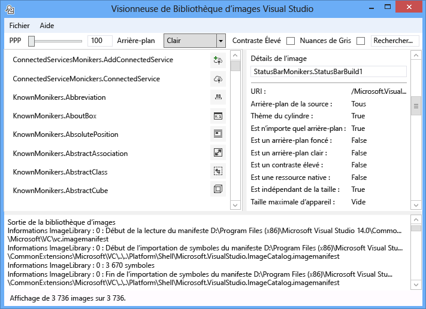
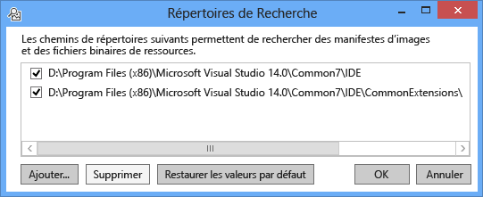
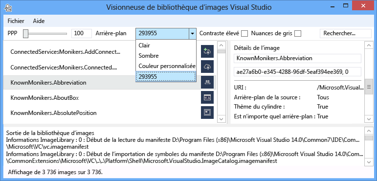
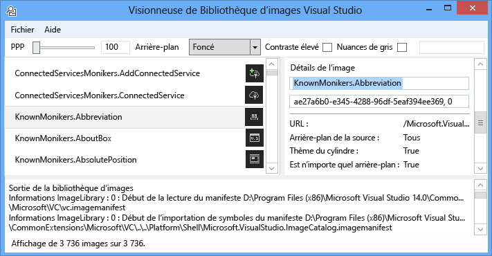
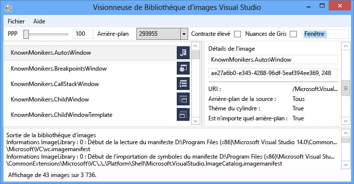
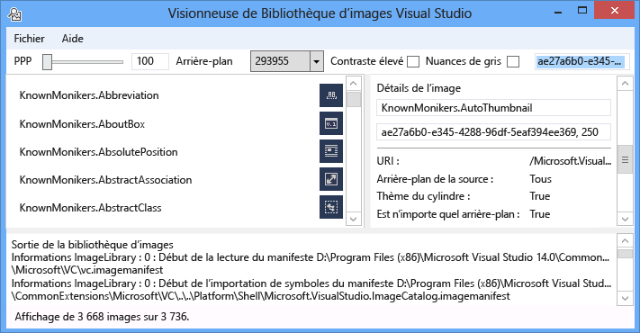
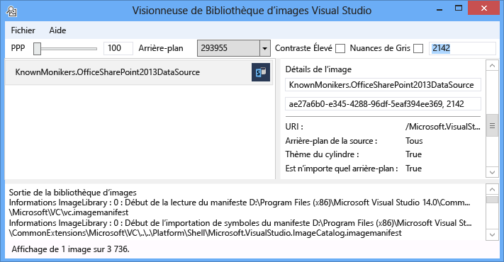

# <a name="image-library-viewer"></a>Visionneuse de bibliothèque d’images
L’outil visionneuse d’images Visual Studio peut charger et Rechercher des manifestes d’image, ce qui permet à l’utilisateur de les manipuler de la même façon que dans Visual Studio. L’utilisateur peut modifier l’arrière-plan, les tailles, les PPP, le contraste élevé et d’autres paramètres. L’outil affiche également les informations de chargement pour chaque manifeste d’image et affiche des informations sur la source de chaque image dans le manifeste de l’image. Cet outil est utile pour :

1. Erreurs de diagnostic

2. Vérification de la définition correcte des attributs dans les manifestes d’images personnalisées

3. Recherche d’images dans le catalogue d’images Visual Studio afin qu’une extension Visual Studio puisse utiliser des images qui correspondent au style de Visual Studio

   

   **Moniker d’image**

   Un moniker d’image (ou moniker pour Short) est une paire GUID : ID qui identifie de façon unique une ressource d’image ou une ressource de liste d’images dans la bibliothèque d’images.

   **Fichiers manifeste de l’image**

   Les fichiers manifeste d’image (. imagemanifest) sont des fichiers XML qui définissent un ensemble de ressources d’image, les monikers qui représentent ces ressources, ainsi que l’image réelle ou les images qui représentent chaque élément multimédia. Les manifestes d’image peuvent définir des images autonomes ou des listes d’images pour la prise en charge des IU héritées. En outre, il existe des attributs qui peuvent être définis sur l’élément multimédia ou sur les images individuelles derrière chaque ressource pour changer quand et comment ces ressources sont affichées.

   **Schéma du manifeste d’image**

   Un manifeste d’image complet se présente comme suit :

```xml
<ImageManifest>
      <!-- zero or one Symbols elements -->
      <Symbols>
        <!-- zero or more Guid, ID, or String elements -->
      </Symbols>
      <!-- zero or one Images elements -->
      <Images>
        <!-- zero or more Image elements -->
      </Images>
      <!-- zero or one ImageLists elements -->
      <ImageLists>
        <!-- zero or more ImageList elements -->
      </ImageLists>
</ImageManifest>
```

 **Symboles**

 Pour faciliter la lecture et l’aide à la maintenance, le manifeste d’image peut utiliser des symboles pour les valeurs d’attribut. Les symboles sont définis comme suit :

```xml
<Symbols>
      <Import Manifest="manifest" />
      <Guid Name="ShellCommandGuid" Value="8ee4f65d-bab4-4cde-b8e7-ac412abbda8a" />
      <ID Name="cmdidSaveAll" Value="1000" />
      <String Name="AssemblyName" Value="Microsoft.VisualStudio.Shell.UI.Internal" />
</Symbols>
```

|**Sous-élément**|**Définition**|
|-|-|
|Importer|Importe les symboles du fichier manifeste donné pour une utilisation dans le manifeste actuel.|
|Guid|Le symbole représente un GUID et doit correspondre à la mise en forme du GUID.|
|id|Le symbole représente un ID et doit être un entier non négatif.|
|String|Le symbole représente une valeur de chaîne arbitraire.|

 Les symboles respectent la casse et sont référencés à l’aide de la syntaxe $ (Symbol-Name) :

```xml
<Image Guid="$(ShellCommandGuid)" ID="$(cmdidSaveAll)" >
      <Source Uri="/$(AssemblyName);Component/Resources/image.xaml" />
</Image>
```

 Certains symboles sont prédéfinis pour tous les manifestes. Ils peuvent être utilisés dans l’attribut URI de l' \<Source> \<Import> élément ou pour référencer des chemins d’accès sur l’ordinateur local.

|**Symbole**|**Description**|
|-|-|
|CommonProgramFiles|La valeur de la variable d’environnement% CommonProgramFiles%|
|LocalAppData|Valeur de la variable d’environnement% LocalAppData%|
|ManifestFolder|Dossier contenant le fichier manifeste|
|MyDocuments|Chemin d’accès complet du dossier Mes documents de l’utilisateur actuel|
|ProgramFiles|La valeur de la variable d’environnement% ProgramFiles%|
|Système|Dossier Windows\System32|
|RépWin|La valeur de la variable d’environnement% WinDir%|

 **Image**

 L' \<Image> élément définit une image qui peut être référencée par un moniker. Le GUID et l’ID pris ensemble forment le moniker d’image. Le moniker de l’image doit être unique dans l’ensemble de la bibliothèque d’images. Si plusieurs images ont un moniker donné, la première rencontrée lors de la génération de la bibliothèque est celle qui est conservée.

 Il doit contenir au moins une source. Bien que les sources de taille neutre offrent les meilleurs résultats dans une vaste gamme de tailles, elles ne sont pas requises. Si le service est invité à fournir une image d’une taille non définie dans l' \<Image> élément et qu’il n’y a aucune source neutre pour la taille, le service choisit la source de taille optimale et la met à l’échelle à la taille demandée.

```xml
<Image Guid="guid" ID="int" AllowColorInversion="true/false">
      <Source ... />
      <!-- optional additional Source elements -->
</Image>
```

|**Attribut**|**Définition**|
|-|-|
|Guid|Souhaitée La partie GUID du moniker d’image|
|id|Souhaitée La partie ID du moniker d’image|
|AllowColorInversion|[Facultatif, valeur par défaut true] Indique si les couleurs de l’image peuvent être inversées par programmation lorsqu’elles sont utilisées sur un arrière-plan sombre.|

 **Source**

 L' \<Source> élément définit une ressource source d’image unique (XAML et png).

```xml
<Source Uri="uri" Background="background">
      <!-- optional NativeResource element -->
 </Source>
```

|**Attribut**|**Définition**|
|-|-|
|Uri|Souhaitée URI qui définit l’emplacement à partir duquel l’image peut être chargée. Les valeurs possibles sont les suivantes :<br /><br /> -Un URI à en- [tête pack](/dotnet/framework/wpf/app-development/pack-uris-in-wpf) à l’aide de l’autorité application:///<br /><br /> -Référence de ressource de composant absolue<br /><br /> -Chemin d’accès à un fichier contenant une ressource native|
|Arrière-plan|Facultatif Indique le type d’arrière-plan auquel la source est destinée à être utilisée.<br /><br /> Les valeurs possibles sont les suivantes :<br /><br /> - *Clair*: la source peut être utilisée sur un arrière-plan clair.<br /><br /> - *Dark*: la source peut être utilisée sur un arrière-plan sombre.<br /><br /> - *HighContrast*: la source peut être utilisée sur n’importe quel arrière-plan en mode contraste élevé.<br /><br /> - *HighContrastLight*: la source peut être utilisée sur un arrière-plan clair en mode contraste élevé.<br /><br /> -*HighContrastDark*: la source peut être utilisée sur un arrière-plan sombre en mode contraste élevé.<br /><br /> Si l’attribut **Background** est omis, la source peut être utilisée sur n’importe quel arrière-plan.<br /><br /> Si **Background** est *clair*, *Dark*, *HighContrastLight* ou *HighContrastDark*, les couleurs de la source ne sont jamais inversées. Si **Background** est omis ou défini sur *HighContrast*, l’inversion des couleurs de la source est contrôlée par l’attribut **AllowColorInversion** de l’image.|

 Un \<Source> élément peut avoir exactement l’un des sous-éléments facultatifs suivants :

|**Element**|**Attributs (tous obligatoires)**|**Définition**|
|-|-|-|
|\<Size>|Valeur|La source sera utilisée pour les images de la taille donnée (en unités de périphérique). L’image sera carrée.|
|\<SizeRange>|MinSize, MaxSize|La source sera utilisée pour les images comprises entre MinSize et MaxSize (en unités de périphérique). L’image sera carrée.|
|\<Dimensions>|Width, Height|La source sera utilisée pour les images de la largeur et de la hauteur données (en unités de périphérique).|
|\<DimensionRange>|MinWidth, MinHeight,<br /><br /> MaxWidth, MaxHeight|La source sera utilisée pour les images allant de la largeur/hauteur minimale à la largeur/hauteur maximale (en unités de périphérique).|

 Un \<Source> élément peut également avoir un sous- \<NativeResource> élément facultatif, qui définit un \<Source> qui est chargé à partir d’un assembly natif plutôt qu’un assembly managé.

```xml
<NativeResource Type="type" ID="int" />
```

|**Attribut**|**Définition**|
|-|-|
|Type|Souhaitée Type de la ressource native (XAML ou PNG)|
|id|Souhaitée La partie ID d’entier de la ressource native|

 **ImageList**

 L' \<ImageList> élément définit une collection d’images qui peuvent être retournées dans une seule bande. La bande est créée à la demande, selon les besoins.

```xml
<ImageList>
      <ContainedImage Guid="guid" ID="int" External="true/false" />
      <!-- optional additional ContainedImage elements -->
 </ImageList>
```

|**Attribut**|**Définition**|
|-|-|
|Guid|Souhaitée La partie GUID du moniker d’image|
|id|Souhaitée La partie ID du moniker d’image|
|Externe|[Facultatif, valeur par défaut false] Indique si le moniker d’image référence une image dans le manifeste actuel.|

 Le moniker de l’image contenue n’a pas besoin de référencer une image définie dans le manifeste actuel. Si l’image contenue est introuvable dans la bibliothèque d’images, une image d’espace réservé vide sera utilisée à la place.

## <a name="how-to-use-the-tool"></a>Comment utiliser l’outil
 **Validation d’un manifeste d’image personnalisé**

 Pour créer un manifeste personnalisé, nous vous recommandons d’utiliser l’outil ManifestFromResources pour générer automatiquement le manifeste. Pour valider le manifeste personnalisé, lancez la visionneuse de la bibliothèque d’images et sélectionnez fichier > définir les chemins... pour ouvrir la boîte de dialogue Rechercher dans les répertoires. L’outil utilisera les répertoires de recherche pour charger des manifestes d’images, mais il l’utilisera également pour rechercher les fichiers de .dll qui contiennent les images dans un manifeste. Veillez donc à inclure les répertoires de manifeste et de DLL dans cette boîte de dialogue.

 

 Cliquez sur **Ajouter** pour sélectionner de nouveaux répertoires de recherche afin de rechercher les manifestes et leurs DLL correspondantes. L’outil mémorise ces répertoires de recherche et ils peuvent être activés ou désactivés en cochant ou en désactivant un répertoire.

 Par défaut, l’outil tente de trouver le répertoire d’installation de Visual Studio et d’ajouter ces répertoires à la liste des répertoires de recherche. Vous pouvez ajouter manuellement des répertoires que l’outil ne trouve pas.

 Une fois tous les manifestes chargés, l’outil peut être utilisé pour activer ou désactiver les couleurs d' **arrière-plan** , **PPP**, **contraste élevé** ou **grayscaling** pour les images afin qu’un utilisateur puisse inspecter visuellement les ressources d’image pour vérifier qu’elles sont rendues correctement pour différents paramètres.

 

 La couleur d’arrière-plan peut être définie sur clair, foncé ou sur une valeur personnalisée. Si vous sélectionnez « couleur personnalisée », une boîte de dialogue de sélection de couleur s’ouvre et vous pouvez ajouter cette couleur personnalisée au bas de la zone de liste déroulante d’arrière-plan pour un rappel plus facile plus tard.

 

 La sélection d’un moniker d’image permet d’afficher les informations de chaque image réelle derrière ce moniker dans le volet d’informations de l’image à droite. Le volet permet également aux utilisateurs de copier un moniker par nom ou par GUID brut : valeur d’ID.

 

 Les informations affichées pour chaque source d’image incluent le type d’arrière-plan à afficher, si elles peuvent être à thème ou prises en charge contraste élevé, les tailles valides pour ou si elles sont indépendantes de la taille et si l’image provient d’un assembly natif.

 

 Lors de la validation d’un manifeste d’image, nous vous recommandons de déployer le manifeste et la DLL d’image dans leurs emplacements réels. Cela permet de vérifier que tous les chemins d’accès relatifs fonctionnent correctement et que la bibliothèque d’images peut trouver et charger le manifeste et la DLL de l’image.

 **Recherche du catalogue d’images KnownMonikers**

 Pour mieux faire correspondre le style de Visual Studio, une extension Visual Studio peut utiliser des images dans le catalogue d’images Visual Studio plutôt que de créer et d’utiliser sa propre image. Cela présente l’avantage de ne pas avoir à gérer ces images et garantit que l’image aura une image de secours haute résolution, afin qu’elle soit correcte dans tous les paramètres ppp pris en charge par Visual Studio.

 La visionneuse de la bibliothèque d’images permet de rechercher un manifeste afin qu’un utilisateur puisse trouver le moniker qui représente une ressource d’image et utiliser ce moniker dans le code. Pour rechercher des images, entrez le terme de recherche souhaité dans la zone de recherche et appuyez sur entrée. La barre d’État en bas affiche le nombre de correspondances qui ont été trouvées dans le nombre total d’images dans tous les manifestes.

 

 Lorsque vous recherchez des monikers d’image dans des manifestes existants, nous vous recommandons de rechercher et d’utiliser uniquement les monikers du catalogue d’images Visual Studio, d’autres monikers intentionnellement accessibles publiquement ou vos propres monikers personnalisés. Si vous utilisez des monikers non publics, l’interface utilisateur personnalisée peut être rompue ou les images ont été modifiées de manière inattendue si ces monikers et images non publics sont modifiés ou mis à jour.

 En outre, la recherche par GUID est possible. Ce type de recherche est utile pour filtrer la liste vers un manifeste unique, ou sous-section unique d’un manifeste si ce manifeste contient plusieurs GUID.

 

 Enfin, la recherche par ID est également possible.

 

## <a name="notes"></a>Remarques

- Par défaut, l’outil extraira plusieurs manifestes d’image présents dans le répertoire d’installation de Visual Studio. Le seul qui a des monikers pouvant être consommés publiquement est le manifeste **Microsoft. VisualStudio. ImageCatalog** . GUID : ae27a6b0-E345-4288-96df-5eaf394ee369 (ne **pas** substituer ce GUID dans un manifeste personnalisé) type : KnownMonikers

- L’outil tente au lancement de charger tous les manifestes d’images qu’il trouve, ce qui peut prendre plusieurs secondes pour que l’application s’affiche. Il peut également s’agir d’un ralentissement ou d’une absence de réponse lors du chargement des manifestes.

## <a name="sample-output"></a>Exemple de sortie
 Cet outil ne génère pas de sortie.
