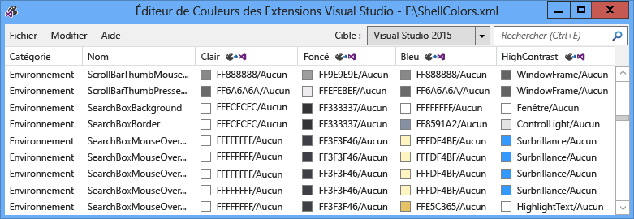
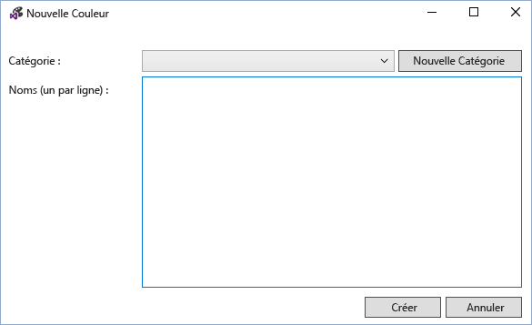
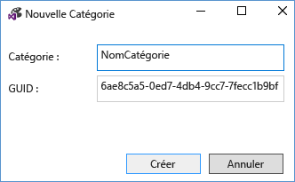
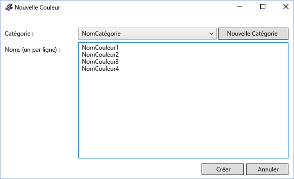
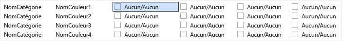
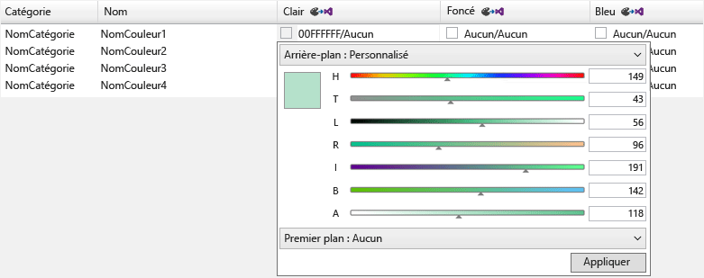
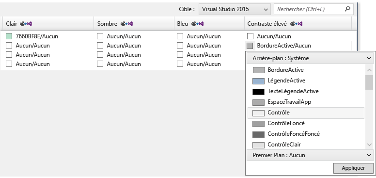
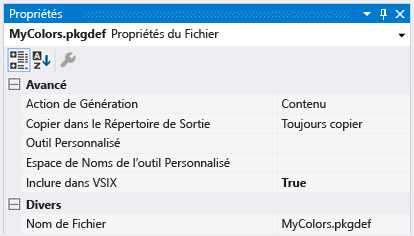
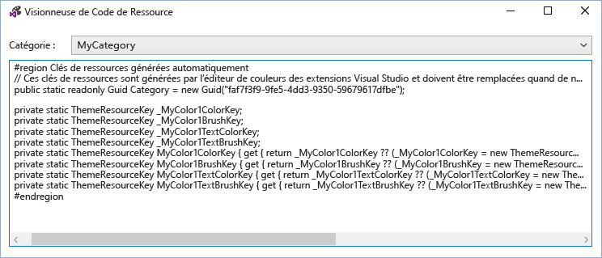
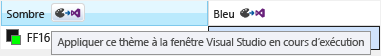

# <a name="vsix-color-editor"></a>Éditeur de couleur VSIX
L’outil Éditeur de couleurs des extensions Visual Studio permet de créer et de modifier des couleurs personnalisées pour Visual Studio. L’outil peut également générer des clés de ressources de thème afin que les couleurs puissent être utilisées dans le code. Cet outil est utile pour créer des couleurs pour une extension Visual Studio qui les prend en charge. Cet outil peut ouvrir les fichiers. pkgdef et .xml. Les thèmes Visual Studio (fichiers. vstheme) peuvent être utilisés avec l’éditeur de couleurs des extensions Visual Studio en remplaçant l’extension de fichier par .xml. En outre, les fichiers. vstheme peuvent être importés dans un fichier de .xml actif.

 

 **Fichiers de définition du package**

 Les fichiers de définition de package (. pkgdef) sont les fichiers qui définissent des thèmes. Les couleurs elles-mêmes sont stockées dans des fichiers de .xml de couleur de thème, qui sont compilés dans un fichier. pkgdef. Les fichiers. pkgdef sont déployés dans des emplacements Visual Studio pouvant faire l’objet d’une recherche, traités au moment de l’exécution et fusionnés pour définir des thèmes.

 **Jetons de couleur**

 Un jeton de couleur est constitué de quatre éléments :

- **Nom de la catégorie :** Regroupement logique pour un ensemble de couleurs. Utilisez un nom de catégorie existant s’il existe déjà des couleurs spécifiques à l’élément d’interface utilisateur souhaité, ou à un groupe d’éléments d’interface utilisateur.

- **Nom du jeton :** Nom descriptif du jeton de couleur et des ensembles de jetons. Les jeux incluent les noms des jetons d’arrière-plan et de premier plan (texte), ainsi que tous leurs États, et ils doivent être nommés afin qu’il soit facile d’identifier les paires et les États auxquels elles s’appliquent.

- **Valeurs de couleur (ou teintes) :** Nécessaire pour chaque thème de couleur. Créez toujours des valeurs de couleur d’arrière-plan et de texte par paires. Les couleurs sont jumelées pour l’arrière-plan/premier plan, de sorte que la couleur de texte (premier plan) est toujours lisible par rapport à la couleur d’arrière-plan sur laquelle elle est dessinée. Ces couleurs sont liées et seront utilisées ensemble dans l’interface utilisateur. Si l’arrière-plan n’est pas destiné à être utilisé avec du texte, ne définissez pas de couleur de premier plan.

- **Nom de la couleur système :** À utiliser dans les affichages à contraste élevé.

## <a name="how-to-use-the-tool"></a>Comment utiliser l’outil
 Autant que possible et, le cas échéant, les couleurs de Visual Studio existantes doivent être réutilisées au lieu d’en créer d’autres. Toutefois, dans les cas où aucune couleur appropriée n’est définie, des couleurs personnalisées doivent être créées pour garantir la compatibilité des extensions.

 **Création de nouveaux jetons de couleur**

 Pour créer des couleurs personnalisées à l’aide de l’éditeur de couleurs de l’extension Visual Studio, procédez comme suit :

1. Déterminez les noms de catégorie et de jeton pour les nouveaux jetons de couleur.

2. Choisissez les teintes que l’élément d’interface utilisateur utilisera pour chaque thème et la couleur système pour contraste élevé.

3. Utilisez l’éditeur de couleurs pour créer de nouveaux jetons de couleur.

4. Utilisez les couleurs dans une extension Visual Studio.

5. Testez les modifications dans Visual Studio.

   **Étape 1 : déterminer les noms de catégorie et de jeton pour les nouveaux jetons de couleur.**

   Le schéma d’attribution de noms préféré pour un VSColor est **[catégorie] [type d’interface utilisateur] [État]**. N’utilisez pas le mot « Color » dans les noms VSColor, car il est redondant.

   Les noms de catégorie fournissent des regroupements logiques et doivent être définis de la manière la plus étroite possible. Par exemple, le nom d’une seule fenêtre outil peut être un nom de catégorie, mais le nom d’une unité commerciale ou d’une équipe de projet n’est pas. Le regroupement des entrées en catégories permet d’éviter toute confusion entre les couleurs portant le même nom.

   Un nom de jeton doit indiquer clairement le type d’élément et les situations, ou « État », auquel la couleur sera appliquée. Par exemple, un **[type d’interface utilisateur]** d’une info-bulle active peut être nommée «**DataTip**» et le **[État]** peut être nommé «**actif**», ce qui donne le nom de couleur «**DataTipActive**». Étant donné que les info-bulles de données contiennent du texte, vous devez définir un premier plan et une couleur d’arrière-plan. En utilisant un jumelage d’arrière-plan/premier plan, l’éditeur de couleurs crée automatiquement les couleurs «**DataTipActive**» pour l’arrière-plan et «**DataTipActiveText**» pour le premier plan.

   Si la partie de l’interface utilisateur n’a qu’un seul État, la partie **[État]** du nom peut être omise. Par exemple, si une zone de recherche a une bordure et qu’aucun changement d’État n’affecte la couleur de la bordure, le nom du jeton de couleur de la bordure peut simplement être appelé «**SearchBoxBorder**».

   Certains noms d’État courants sont les suivants :

- Actif

- Inactif

- MouseOver

- MouseDown

- Sélectionnée

- Avec focus

  Exemples de quelques noms de jeton pour les parties d’un contrôle d’élément de liste :

- ListItem

- ListItemBorder

- ListItemMouseOver

- ListItemMouseOverBorder

- ListItemSelected

- ListItemSelectedBorder

- ListItemDisabled

- ListItemDisabledBorder

  **Étape 2 : choisissez les teintes que l’élément d’interface utilisateur utilisera pour chaque thème et la couleur système pour contraste élevé.**

  Lorsque vous choisissez des couleurs personnalisées pour l’interface utilisateur, sélectionnez un élément d’interface utilisateur existant similaire et utilisez ses couleurs comme base. Les couleurs des éléments d’interface utilisateur intégrés ont été examinées et testées, de sorte qu’elles s’affichent correctement et se comportent correctement dans tous les thèmes.

  **Étape 3 : utilisez l’éditeur de couleurs pour créer de nouveaux jetons de couleur.**

  Lancez l’éditeur de couleurs et ouvrez ou créez des couleurs de thème personnalisées .xml fichier. Sélectionnez **modifier > nouvelle couleur** dans le menu. Cela ouvre une boîte de dialogue permettant de spécifier la catégorie et un ou plusieurs noms pour les entrées de couleur de cette catégorie :

  

  Sélectionnez une catégorie existante ou sélectionnez **nouvelle catégorie** pour créer une nouvelle catégorie. Une autre boîte de dialogue s’ouvre et crée un nom de catégorie :

  

  La nouvelle catégorie devient alors disponible dans le menu déroulant nouvelle catégorie de **couleurs** . Après avoir choisi une catégorie, entrez un nom par ligne pour chaque nouveau jeton de couleur, puis sélectionnez « créer » lorsque vous avez terminé :

  

  Les valeurs de couleur sont indiquées en paires d’arrière-plan/premier plan, avec la valeur « None » indiquant que la couleur n’a pas été définie. Remarque : si une couleur n’a pas de paire couleur de texte/couleur d’arrière-plan, seul l’arrière-plan doit être défini.

  

  Pour modifier un jeton de couleur, sélectionnez une entrée de couleur pour le thème (colonne) de ce jeton. Ajoutez la valeur de couleur en tapant une valeur de couleur hexadécimale au format ARVB à 8 chiffres, en entrant un nom de couleur système dans la cellule ou en utilisant le menu déroulant pour sélectionner la couleur souhaitée à l’aide d’un jeu de curseurs de couleur ou d’une liste de couleurs système.

  

  

  Pour les composants qui n’ont pas besoin d’afficher du texte, entrez une seule valeur de couleur : la couleur d’arrière-plan. Sinon, entrez des valeurs pour la couleur de l’arrière-plan et du texte, séparées par une barre oblique.

  Lorsque vous entrez des valeurs pour contraste élevé, entrez des noms de couleurs système Windows valides. N’entrez pas de valeurs ARVB codées en dur. Vous pouvez afficher une liste de noms de couleurs système valides en sélectionnant « arrière-plan : système » ou « premier plan : système » dans les menus déroulants de la valeur de couleur. Lorsque vous créez des éléments qui ont des composants de texte, utilisez la paire de couleurs du système d’arrière-plan/texte correcte, sinon le texte peut être illisible.

  Lorsque vous avez fini de créer, de définir et de modifier les jetons de couleur, enregistrez-les au format .xml ou. pkgdef souhaité. Les jetons de couleur qui ne sont ni un arrière-plan ni un jeu de premier plan sont enregistrés sous forme de couleurs vides au format .xml, mais ignorés au format. pkgdef. Une boîte de dialogue vous avertit de la perte potentielle de couleurs si vous tentez d’enregistrer des couleurs vides dans un fichier. pkgdef.

  **Étape 4 : utiliser les couleurs dans une extension Visual Studio.**

  Après avoir défini les nouveaux jetons de couleur, incluez le fichier. pkgdef dans le fichier projet avec « action de génération » défini sur « contenu » et « inclure dans VSIX » défini sur « true ».

  

  Dans l’éditeur de couleurs des extensions Visual Studio, choisissez fichier > afficher le code de la ressource pour afficher le code utilisé pour accéder aux couleurs personnalisées dans l’interface utilisateur WPF.

  

  Incluez ce code dans une classe statique du projet. Une référence à **Microsoft. VisualStudio. Shell. \<VSVersion>.0.dll** doit être ajoutée au projet pour utiliser le type **ThemeResourceKey** .

```csharp
namespace MyCustomColors
{
    public static class MyCategory
    {
        #region Autogenerated resource keys
        // These resource keys are generated by Visual Studio Extension Color Editor, and should be replaced when new colors are added to this category.
        public static readonly Guid Category = new Guid("faf7f3f9-9fe5-4dd3-9350-59679617dfbe");

        private static ThemeResourceKey _MyColor1ColorKey;
        private static ThemeResourceKey _MyColor1BrushKey;
        private static ThemeResourceKey _MyColor1TextColorKey;
        private static ThemeResourceKey _MyColor1TextBrushKey;
        public static ThemeResourceKey MyColor1ColorKey { get { return _MyColor1ColorKey ?? (_MyColor1ColorKey = new ThemeResourceKey(Category, "MyColor1", ThemeResourceKeyType.BackgroundColor)); } }
        public static ThemeResourceKey MyColor1BrushKey { get { return _MyColor1BrushKey ?? (_MyColor1BrushKey = new ThemeResourceKey(Category, "MyColor1", ThemeResourceKeyType.BackgroundBrush)); } }
        public static ThemeResourceKey MyColor1TextColorKey { get { return _MyColor1TextColorKey ?? (_MyColor1TextColorKey = new ThemeResourceKey(Category, "MyColor1", ThemeResourceKeyType.ForegroundColor)); } }
        public static ThemeResourceKey MyColor1TextBrushKey { get { return _MyColor1TextBrushKey ?? (_MyColor1TextBrushKey = new ThemeResourceKey(Category, "MyColor1", ThemeResourceKeyType.ForegroundBrush)); } }
        #endregion
    }
}
```

 Cela permet l’accès aux couleurs dans le code XAML et permet à l’interface utilisateur de répondre aux modifications de thème.

```xaml
<UserControl x:Class="NewTestProject.TestPackageControl" Name="MyToolWindow"
             xmlns="http://schemas.microsoft.com/winfx/2006/xaml/presentation"
             xmlns:x="http://schemas.microsoft.com/winfx/2006/xaml"
             xmlns:ns="clr-namespace:MyCustomColors">
  <Grid>
    <TextBlock Background="{DynamicResource {x:Static ns:MyCategory.MyColor1BrushKey}}"
               Foreground="{DynamicResource {x:Static ns:MyCategory.MyColor1TextBrushKey}}"
      >Sample Text</TextBlock>

  </Grid>
</UserControl>
```

 **Étape 5 : tester les modifications dans Visual Studio.**

 L’éditeur de couleurs peut appliquer temporairement des jetons de couleur aux instances en cours d’exécution de Visual Studio pour afficher les modifications dynamiques apportées aux couleurs sans reconstruire le package d’extension. Pour ce faire, cliquez sur le bouton « appliquer ce thème à l’exécution de Visual Studio Windows » situé dans l’en-tête de chaque colonne de thème. Ce thème temporaire disparaît lorsque l’éditeur de couleurs VSIX est fermé.

 

 Pour rendre les modifications permanentes, régénérez et redéployez l’extension Visual Studio après avoir ajouté les nouvelles couleurs au fichier. pkgdef et écrit le code qui utilisera ces couleurs. La reconstruction de l’extension Visual Studio permet de fusionner les valeurs de Registre pour les nouvelles couleurs dans le reste des thèmes. Ensuite, redémarrez Visual Studio, affichez l’interface utilisateur et vérifiez que les nouvelles couleurs s’affichent comme prévu.

## <a name="notes"></a>Remarques
 Cet outil est destiné à la création de couleurs personnalisées pour les thèmes Visual Studio préexistants, ou pour la modification des couleurs d’un thème Visual Studio personnalisé. Pour créer des thèmes Visual Studio personnalisés complets, téléchargez l’extension de l' [éditeur de thème de couleurs Visual Studio](https://marketplace.visualstudio.com/items?itemName=VisualStudioProductTeam.VisualStudio2015ColorThemeEditor) à partir de la Galerie d’extensions Visual Studio.

## <a name="sample-output"></a>Exemple de sortie
 **Sortie de couleur XML**

 Le fichier .xml généré par l’outil est semblable à ce qui suit :

```xml
<Themes>
  <Theme Name="Light" GUID="{de3dbbcd-f642-433c-8353-8f1df4370aba}">
    <Category Name="CategoryName" GUID="{eee9d521-dac2-48d9-9a5e-5c625ba2040c}">
      <Color Name="ColorName1">
        <Background Type="CT_RAW" Source="FFFFFFFF" />
      </Color>
      <Color Name="ColorName2">
        <Background Type="CT_RAW" Source="FFFFFFFF" />
        <Foreground Type="CT_RAW" Source="FF000000" />
      </Color>
      <Color Name="ColorName3">
        <Background Type="CT_RAW" Source="FFFF0000" />
      </Color>
      <Color Name="ColorName4">
        <Background Type="CT_RAW" Source="FF000088" />
        <Foreground Type="CT_RAW" Source="FFFFFFFF" />
      </Color>
    </Category>
  </Theme>
  <Theme Name="Dark" GUID="{1ded0138-47ce-435e-84ef-9ec1f439b749}">...</Theme>
  <Theme Name="Blue" GUID="{a4d6a176-b948-4b29-8c66-53c97a1ed7d0}">...</Theme>
  <Theme Name="HighContrast" GUID="{a5c004b4-2d4b-494e-bf01-45fc492522c7}">...</Theme>
</Themes>

```

 **Sortie de la couleur de l’PKGDEF**

 Le fichier. pkgdef généré par l’outil est semblable à ce qui suit :

```
[$RootKey$\Themes\{de3dbbcd-f642-433c-8353-8f1df4370aba}\CategoryName]
"Data"=hex:78,00,00,00,0b,00,00,00,01,00,00,00,21,d5,e9,ee,c2,da,d9,48,9a,5e,5c,62,5b,a2,04,0c,04,00,00,00,0a,00,00,00,43,6f,6c,6f,72,4e,61,6d,65,31,01,ff,ff,ff,ff,00,0a,00,00,00,43,6f,6c,6f,72,4e,61,6d,65,32,01,ff,ff,ff,ff,01,00,00,00,ff,0a,00,00,00,43,6f,6c,6f,72,4e,61,6d,65,33,01,ff,00,00,ff,00,0a,00,00,00,43,6f,6c,6f,72,4e,61,6d,65,34,01,00,00,88,ff,01,ff,ff,ff,ff
[$RootKey$\Themes\{1ded0138-47ce-435e-84ef-9ec1f439b749}\CategoryName]
"Data"=hex:...
[$RootKey$\Themes\{a4d6a176-b948-4b29-8c66-53c97a1ed7d0}\CategoryName]
"Data"=hex:...
[$RootKey$\Themes\{a5c004b4-2d4b-494e-bf01-45fc492522c7}\CategoryName]
"Data"=hex:...

```

 **Wrapper de clés de ressources C#**

 Les clés de ressource de couleur générées par l’outil sont similaires à ceci :

```csharp
namespace MyNamespace
{
    public static class MyColors
    {
        #region Autogenerated resource keys
        // These resource keys are generated by Visual Studio Extension Color Editor, and should be replaced when new colors are added to this category.

        public static string ColorName1ColorKey { get { return "ColorName1ColorKey"; } }
        public static string ColorName1BrushKey { get { return "ColorName1BrushKey"; } }

        public static string ColorName2ColorKey { get { return "ColorName2ColorKey"; } }
        public static string ColorName2BrushKey { get { return "ColorName2BrushKey"; } }
        public static string ColorName2TextColorKey { get { return "ColorName2TextColorKey"; } }
        public static string ColorName2TextBrushKey { get { return "ColorName2TextBrushKey"; } }

        public static string ColorName3ColorKey { get { return "ColorName4ColorKey"; } }
        public static string ColorName3BrushKey { get { return "ColorName4BrushKey"; } }
        public static string ColorName3TextColorKey { get { return "ColorName4TextColorKey"; } }
        public static string ColorName3TextBrushKey { get { return "ColorName4TextBrushKey"; } }
        #endregion
    }
}
```

 **Wrapper de dictionnaire de ressources WPF**

 Les clés de **ResourceDictionary** de couleur générées par l’outil sont similaires à ce qui suit :

```xaml
<ResourceDictionary xmlns="http://schemas.microsoft.com/winfx/2006/xaml/presentation"
        xmlns:x="http://schemas.microsoft.com/winfx/2006/xaml"
        xmlns:colors="clr-namespace:MyNamespace">

  <SolidColorBrush x:Key="{x:Static colors:MyColors.ColorName1BrushKey}" Color="#FFFFFFFF" />
  <Color x:Key="{x:Static colors:MyColors.ColorName1ColorKey}" A="255" R="255" G="255" B="255" />

  <SolidColorBrush x:Key="{x:Static colors:MyColors.ColorName2BrushKey}" Color="#FFFFFFFF" />
  <Color x:Key="{x:Static colors:MyColors.ColorName2ColorKey}" A="255" R="255" G="255" B="255" />
  <SolidColorBrush x:Key="{x:Static colors:MyColors.ColorName2TextBrushKey}" Color="#FF000000" />
  <Color x:Key="{x:Static colors:MyColors.ColorName2TextColorKey}" A="255" R="0" G="0" B="0" />

  <SolidColorBrush x:Key="{x:Static colors:MyColors.ColorName3BrushKey}" Color="#FFFF0000" />
  <Color x:Key="{x:Static colors:MyColors.ColorName3ColorKey}" A="255" R="255" G="0" B="0" />

  <SolidColorBrush x:Key="{x:Static colors:MyColors.ColorName4BrushKey}" Color="#FF000088" />
  <Color x:Key="{x:Static colors:MyColors.ColorName4ColorKey}" A="255" R="0" G="0" B="136" />
  <SolidColorBrush x:Key="{x:Static colors:MyColors.ColorName4TextBrushKey}" Color="#FFFFFFFF" />
  <Color x:Key="{x:Static colors:MyColors.ColorName4TextColorKey}" A="255" R="255" G="255" B="255" />
</ResourceDictionary>
```
