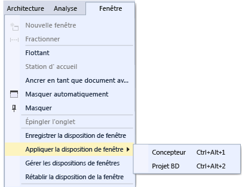
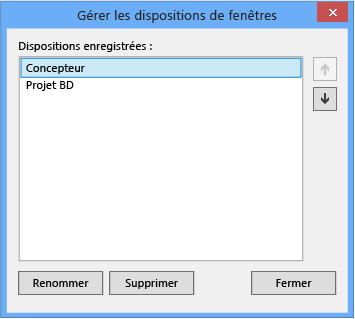

# Personnalisation des dispositions de fenêtres dans Visual Studio

Dans Visual Studio, vous pouvez personnaliser la position, la taille et le comportement des fenêtres pour créer des dispositions de fenêtres optimisées pour différents workflows de développement. Quand vous personnalisez la disposition, l'IDE mémorise vos paramètres. Ainsi, si vous modifiez l’emplacement d’ancrage de l’**Explorateur de solutions** et que vous fermez Visual Studio, l’**Explorateur de solutions** sera ancré au même emplacement à l’ouverture suivante de Visuel Studio, même si vous travaillez sur un autre ordinateur.

Vous pouvez également nommer et enregistrer une disposition personnalisée, et basculer d’une disposition à l’autre avec une seule commande. Par exemple, vous pouvez créer une disposition pour la modification et une disposition pour le débogage, et passer de l’une à l’autre à l’aide de la commande de menu **fenêtre**  >  **appliquer la disposition de fenêtre** .

## Fenêtres Outil et Document

L'IDE comprend deux types de fenêtres de base : les *fenêtres Outil* et les *fenêtres de document*. Les fenêtres outil incluent **Explorateur de solutions**, **Explorateur de serveurs**, **fenêtre Sortie**, **liste d’erreurs**, les concepteurs, les fenêtres du débogueur, etc. Les fenêtres de document contiennent les fichiers de code source, les fichiers de texte arbitraire, les fichiers de configuration, etc. Utilisez la barre de titre des fenêtres Outil pour les redimensionner et les déplacer. Vous pouvez faire glisser les fenêtres de document sur leur onglet. Cliquez avec le bouton droit sur l’onglet ou la barre de titre pour définir d’autres options dans la fenêtre.

Le menu **fenêtre** affiche les options d’ancrage, de flottement et de masquage des fenêtres dans l’IDE. Cliquez avec le bouton droit sur l'onglet ou la barre de titre d'une fenêtre pour afficher des options supplémentaires pour cette fenêtre spécifique. Vous pouvez afficher plusieurs instances d'une même fenêtre Outil à la fois. Par exemple, vous pouvez afficher plusieurs fenêtres du navigateur web, et vous pouvez créer des instances supplémentaires de certaines fenêtres Outil en choisissant **Nouvelle fenêtre** dans le menu **Fenêtre** .

### Fenêtres fractionnées

Quand vous devez afficher ou modifier deux emplacements à la fois dans un document, vous pouvez fractionner les fenêtres. Pour diviser votre document en deux sections qui défilent indépendamment, cliquez sur **Fractionner** dans le menu **Fenêtre** . Cliquez sur **Supprimer le fractionnement** dans le menu **Fenêtre** pour revenir à la vue unique.

### Onglets

Vous pouvez utiliser les onglets pour réorganiser votre disposition de différentes façons. Par exemple, vous pouvez afficher un aperçu d’un fichier dans l’éditeur sans ouvrir le fichier, vous pouvez regrouper vos onglets, et bien plus encore.

#### Onglet Aperçu (fenêtres de document)

Dans l’onglet **Aperçu** , vous pouvez afficher les fichiers dans l’éditeur sans les ouvrir. Vous pouvez afficher un aperçu des fichiers en les sélectionnant dans **Explorateur de solutions**, pendant le débogage, lorsque vous effectuez un pas à pas détaillé dans des fichiers, avec **atteindre la définition** et lorsque vous parcourez les résultats d’une recherche. Les fichiers d'aperçu apparaissent aussi sous un onglet à droite de l'onglet de document. Le fichier s’ouvre en édition si vous le modifiez ou si vous choisissez **Ouvrir**.

::: moniker range=">=vs-2019"

#### Onglets de documents verticaux

**[Nouveauté de la version 16,4](/visualstudio/releases/2019/release-notes-v16.4/)**: nous avons ajouté l’une des principales demandes de fonctionnalités, [onglets de document vertical](https://developercommunity.visualstudio.com/idea/467369/vertical-group-tab.html), dans la version 16,4 de Visual Studio 2019. À présent, vous pouvez gérer vos onglets de document dans une liste verticale, sur le côté gauche ou droit de votre éditeur.

Vous pouvez appliquer les onglets de document verticaux des manières suivantes :

-   >    >    >  Dans la barre de menus, choisissez outils options **onglets d’environnement et fenêtres** . Ensuite, dans le contrôle disposition de l' **onglet définir** , choisissez **haut**, **gauche** ou **droite** dans la liste déroulante.

- Cliquez avec le bouton droit sur un onglet, choisissez **définir la disposition des onglets**, puis choisissez **gauche** ou **droite**. (Pour ramener les onglets à leur position par défaut, choisissez **haut**.)

    :::image type="content" source="./media/vs-2019/vertical-tabs.gif" alt-text="Une animation qui affiche des onglets de documents verticaux en action":::

::: moniker-end

#### Groupes d'onglets

Les groupes d’onglets étendent votre capacité à gérer un espace de travail limité quand vous travaillez avec deux documents ouverts ou plus dans l’IDE. Vous pouvez organiser plusieurs fenêtres d’outils et plusieurs fenêtres de document en groupes d’onglets verticaux ou horizontaux, et faire passer les documents d’un groupe d’onglets à un autre.

### Barres d'outils

Vous pouvez réorganiser les barres d’outils en les faisant glisser vers l’emplacement de votre choix ou à l’aide de la boîte de dialogue **personnaliser** . Pour plus d’informations sur la façon de positionner et de personnaliser les barres d’outils, consultez Guide pratique [pour personnaliser des menus et des barres d’outils](../ide/how-to-customize-menus-and-toolbars-in-visual-studio.md).

## Organiser et ancrer des fenêtres

Une fenêtre de document ou une fenêtre outil peut être *ancrée* afin d’avoir une position et une taille dans le frame de fenêtre IDE. Vous pouvez également la placer en tant que fenêtre flottante distincte en dehors de l’IDE.

Vous pouvez ancrer une fenêtre outil n’importe où dans le frame IDE. Vous pouvez également ancrer certaines fenêtres outil comme fenêtres avec onglets dans le cadre de l’éditeur. Vous pouvez ancrer les fenêtres de document dans le cadre de l’éditeur et les épingler à leur position actuelle dans l’ordre de tabulation.

Vous pouvez également ancrer plusieurs fenêtres pour les faire flotter ensemble dans un *rafting* ou en dehors de l’IDE. Il est aussi possible de masquer ou de minimiser les fenêtres.

Vous pouvez organiser les fenêtres comme suit :

- épingler les fenêtres de document à gauche de la zone de configuration des onglets ;

- ancrer les fenêtres au cadre de modification sous forme d'onglets ;

- ancrer les fenêtres Outil au bord d'un cadre dans l'IDE ;

- faire flotter des fenêtres de document ou Outil par dessus l'IDE ou en dehors de celui-ci ;

- masquer les fenêtres Outil le long du bord de l'IDE ;

- afficher les fenêtres sur plusieurs écrans ;

- rétablir la position de la fenêtre selon la disposition par défaut ou une disposition personnalisée enregistrée.

Pour réorganiser les fenêtres outil et les fenêtres de document, vous pouvez placer le curseur sur la barre de titre d’une fenêtre, puis la faire glisser vers l’emplacement souhaité. Vous pouvez également cliquer avec le bouton droit sur la barre de titre de la fenêtre pour utiliser son menu contextuel, ou vous pouvez utiliser les commandes du menu **fenêtre** .

### Ancrer des fenêtres

Quand vous cliquez sur la barre de titre d'une fenêtre outil ou sur l'onglet de la fenêtre de document et que vous le faites glisser, un repère en forme de losange apparaît. Au cours de l'opération de glissement, quand le curseur de la souris se trouve sur l'une des flèches dans le losange, une zone grisée apparaît pour vous montrer où la fenêtre sera ancrée si vous relâchez le bouton de la souris à ce moment-là.

Pour déplacer une fenêtre ancrable sans la figer à un emplacement, appuyez sur la touche **Ctrl** pendant que vous faites glisser la fenêtre.

Pour retourner une fenêtre outil ou une fenêtre de document à son emplacement d’ancrage le plus récent, appuyez sur **CTRL** pendant que vous double-cliquez sur la barre de titre ou l’onglet de la fenêtre.

L'illustration suivante montre le repère en forme de losange pour les fenêtres de document, celles-ci pouvant uniquement être ancrées dans le cadre de modification :

Les fenêtres Outil peuvent être ancrées à un côté d'un cadre dans l'IDE ou dans le cadre de modification. Quand vous faites glisser une fenêtre Outil vers un autre emplacement, un repère en forme de losange apparaît pour vous aider à la réancrer facilement.

L’illustration suivante montre l’ancrage de l’**Explorateur de solutions** à un nouvel emplacement indiqué par la zone ombrée bleue :

### Fermer et masquer les fenêtres d’outil

Vous pouvez fermer une fenêtre Outil en cliquant sur le **X** dans le coin supérieur droit de la barre de titre. Pour rouvrir la fenêtre, utilisez son raccourci clavier ou la commande de menu. Les fenêtres outil prennent en charge une fonctionnalité nommée *Masquer automatiquement* qui permet de faire glisser une fenêtre lorsque vous utilisez une autre fenêtre. Quand une fenêtre est masquée automatiquement, son nom apparaît sur un onglet figurant sur le bord de l’IDE. Pour réutiliser la fenêtre, pointez sur l'onglet pour que la fenêtre soit de nouveau visible.

> [!NOTE]
> Pour définir si le masquage automatique fonctionne sur les fenêtres outil individuellement ou en tant que groupes ancrés, activez ou désactivez **Masquer automatiquement bouton affecte les fenêtres outil actives uniquement** dans la boîte de dialogue **options** . Pour plus d’informations, consultez [général, environnement, boîte de dialogue Options](../ide/reference/general-environment-options-dialog-box.md).

> [!NOTE]
> Les fenêtres Outil automatiquement masquées peuvent s’afficher temporairement quand la fenêtre a le focus. Pour masquer à nouveau la fenêtre, sélectionnez un élément qui se trouve en dehors de la fenêtre active. Quand la fenêtre perd le focus, elle disparaît à nouveau.

### Utiliser une deuxième analyse

Si vous possédez un deuxième écran et que votre système d'exploitation le prend en charge, vous pouvez choisir celui qui affiche une fenêtre. Vous pouvez même regrouper plusieurs fenêtres dans des *rafts* sur d’autres moniteurs.

> [!TIP]
> Vous pouvez créer plusieurs instances de l' **Explorateur de solutions** et les déplacer dans un autre écran. Cliquez avec le bouton droit sur la fenêtre et choisissez **Nouvelle vue Explorateur de solutions**. Vous pouvez retourner toutes les fenêtres à l’écran d’origine en double-cliquant tout en appuyant sur la touche **CTRL** .

### Rétablir les dispositions de fenêtres, changement de nom et basculement

Vous pouvez faire revenir l'IDE à la disposition d'origine des fenêtres pour votre collection de paramètres à l'aide de la commande **Rétablir la disposition de fenêtre** . Quand vous exécutez cette commande, les actions suivantes se produisent :

- Toutes les fenêtres sont déplacées vers leurs positions par défaut.

- Les fenêtres qui sont fermées dans la disposition de fenêtre par défaut sont fermées.

- Les fenêtres qui sont ouvertes dans la disposition de fenêtre par défaut sont ouvertes.

### Créer et enregistrer des dispositions personnalisées

Avec Visual Studio, vous pouvez enregistrer jusqu’à 10 dispositions de fenêtres personnalisées et passer rapidement de l’une à l’autre. Les étapes suivantes montrent comment créer, enregistrer, appeler et gérer des dispositions personnalisées qui tirent parti de plusieurs écrans avec des fenêtres d’outils ancrées et flottantes.

Commencez par créer une solution de test qui comporte deux projets, chacun avec une disposition optimale différente.

#### Créer un projet d'interface utilisateur et personnaliser la disposition

::: moniker range="vs-2017"

1. Créez un projet **Application WPF** C#. Imaginez que dans ce projet, vous allez développer une interface utilisateur. Vous voulez maximiser l’espace de la fenêtre du concepteur et écarter les autres fenêtres Outil.

::: moniker-end

::: moniker range=">=vs-2019"

1. Créez un projet d' **application WPF** C#. Imaginez que dans ce projet, vous allez développer une interface utilisateur. Vous voulez maximiser l’espace de la fenêtre du concepteur et écarter les autres fenêtres Outil.

::: moniker-end

2. Si vous avez plusieurs moniteurs, extrayez la fenêtre de **Explorateur de solutions** et la fenêtre **Propriétés** sur votre deuxième écran. Dans un système à un seul écran, essayez de fermer toutes les fenêtres à l'exception de celle du concepteur.

3. Appuyez sur **CTRL** + **ALT** + **X** pour afficher la fenêtre **boîte à outils** . Si la fenêtre est ancrée, faites-la glisser pour la faire flotter là où vous voulez la placer.

4. Appuyez sur **F5** pour placer Visual Studio en mode débogage. Ajustez la position des fenêtres de débogage **automatique**, **pile des appels** et **sortie** comme vous le souhaitez. La disposition que vous allez créer s’applique à la fois au mode Édition et au mode Débogage.

5. Lorsque vous avez besoin de vos dispositions en mode de débogage et en mode d’édition, choisissez **fenêtre**  >  **enregistrer la disposition de fenêtre**. Appelez cette disposition « Concepteur ».

     Notez que la nouvelle disposition reçoit le raccourci clavier suivant de la liste réservée de **CTRL** + **ALT** + **1... 0**.

#### Créer un projet de base de données et une disposition

1. Ajoutez un nouveau projet **Base de données SQL Server** à la solution.

2. Cliquez avec le bouton droit sur le nouveau projet dans **Explorateur de solutions** , puis choisissez **afficher dans l’Explorateur d’objets**. Dans la fenêtre **Explorateur d'objets SQL Server** qui s'affiche, vous pouvez accéder aux tables, vues et autres objets dans votre base de données. Vous pouvez soit faire flotter cette fenêtre ou la laisser ancrée. Ajustez librement les autres fenêtres d'outils. Pour plus de réalisme, vous pouvez ajouter une base de données réelle, mais cette étape n’est pas obligatoire dans cette procédure pas à pas.

3. Lorsque votre disposition est telle que vous le souhaitez, dans le menu principal, choisissez **fenêtre**  >  **enregistrer la disposition de fenêtre**. Nommez cette disposition « Projet BD ». (Nous ne prenons pas la peine de créer une disposition en mode débogage pour ce projet.)

#### Basculer entre les dispositions

Pour basculer entre les dispositions, utilisez les raccourcis clavier ou, dans le menu principal, choisissez **fenêtre**  >  **appliquer la disposition de fenêtre**.

Une fois la disposition de l'interface utilisateur appliquée, notez qu'elle est préservée à la fois dans les modes d'édition et débogage.

Si vous utilisez une configuration à plusieurs écrans au bureau et un ordinateur portable à un seul écran à la maison, vous pouvez créer des dispositions optimisées pour chaque ordinateur.

> [!NOTE]
> si vous appliquez une disposition à plusieurs écrans à un système à un seul écran, les fenêtres flottantes que vous avez placées sur le second écran sont alors masquées derrière la fenêtre Visual Studio. Vous pouvez placer ces fenêtres au premier plan en appuyant sur **Alt + Tab**. Si vous ouvrez par la suite Visual Studio avec plusieurs écrans, vous pouvez restaurer les fenêtres à leurs positions spécifiées en réappliquant la disposition.

#### Gérer vos dispositions et les rendre itinérantes

Vous pouvez supprimer, renommer ou réorganiser votre disposition personnalisée en choisissant **fenêtre**  >  **gérer les dispositions** de fenêtres. Si vous déplacez une disposition, la combinaison de touches est automatiquement ajustée afin de refléter la nouvelle position dans la liste. Les liaisons ne peuvent pas être modifiées par ailleurs, de sorte que vous pouvez stocker un maximum de 10 dispositions à la fois.

Pour vous souvenir du raccourci clavier attribué à la disposition, choisissez **fenêtre**  >  **appliquer la disposition de fenêtre**.

Ces dispositions sont automatiquement itinérantes entre les éditions de Visual Studio, entre les instances de Blend sur des ordinateurs distincts, mais aussi entre une édition Express quelconque et n'importe quelle autre organisation Express. Toutefois, les dispositions ne sont pas itinérantes entre Visual Studio, Blend et Express.

## Voir aussi

- [Comment : se déplacer dans l’IDE](../ide/how-to-move-around-in-the-visual-studio-ide.md)
