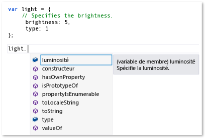
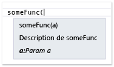
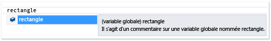
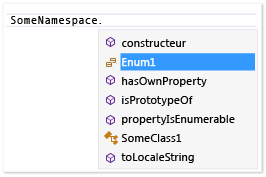
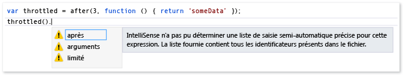

# Extension de JavaScript IntelliSense
[!INCLUDE[vs2017banner](../code-quality/includes/vs2017banner.md)]

Les fonctionnalités d'extensibilité JavaScript Intellisense vous permet de personnaliser les résultats d'Intellisense dans l'éditeur de JavaScript pour tiers bibliothèques.  Cela peut améliorer l'expérience des développeurs qui utilisent ces bibliothèques.  
  
 Le service de langage JavaScript fournit des fonctionnalités Intellisense pour les bibliothèques JavaScript tiers qui sont ajoutées à un projet.  Pour la plupart des bibliothèques, la saisie semi\-automatique des instructions est fournie automatiquement par le service de langage.  L'illustration suivante montre un exemple de la saisie semi\-automatique des instructions :  
  
   
  
 Si votre bibliothèque inclut les descriptions des variables, des fonctions, des objets et dans les balises standard de commentaire JavaScript \(\/\), vous bénéficiez automatiquement, par défaut, les fonctionnalités d'extensibilité Intellisense, qui fournissent des informations descriptives dans une zone contextuel qui apparaît à droite des éléments dans une liste de saisie semi\-automatique, ou lorsque vous tapez la parenthèse ouvrante dans un appel de fonction.  Les commentaires dans la zone contextuel contiennent la description du membre.  L'exemple suivant illustre la zone contextuel pour obtenir la liste de saisie semi\-automatique.  
  
   
  
 Pour améliorer davantage l'expérience du développeur, vous pouvez fournir des informations de type pour les développeurs dans la zone contextuel.  Vous pouvez fournir des informations de type à l'aide de JavaScript [Commentaires sur la documentation XML](../ide/xml-documentation-comments-javascript.md) au lieu des balises standard de commentaire.  Vous ajoutez des commentaires de documentation XML à l'aide de les balises de commentaire de triple barre oblique \(\/\) et un jeu défini des éléments XML.  
  
 Sinon, vous pouvez fournir des informations de type à l'aide de l'extensibilité JavaScript Intellisense.  Cette fonctionnalité vous permet de personnaliser des résultats Intellisense en créant des extensions JavaScript et en les ajoutant au contexte de script.  Dans l'extension, qui est un fichier JavaScript, vous abonnez à des événements exposés par l'objet d' `intellisense` du service de langage.  L'extensibilité JavaScript Intellisense est la solution par défaut pour les bibliothèques si un modèle de comportement à la bibliothèque empêché le service de langage JavaScript pour fournir le niveau souhaité de la prise en charge IntelliSense, et si une alternative aux déclaratifs commentaires de documentation XML est également nécessaire.  En personnalisant les résultats d'Intellisense, vous pouvez créer une expérience de première classe Intellisense, indépendamment de tous les modèles comportementaux qui peuvent limiter les fonctions par défaut du service de langage.  Pour plus d'informations, consultez [Saisie semi\-automatique des instructions pour les identificateurs](../ide/statement-completion-for-identifiers.md).  
  
## Ajouter une extension au contexte de script  
 Pour qu'une extension Intellisense est exécutée, elle doit être ajoutée au contexte actuel de script.  L'extension peut être ajoutée automatiquement au contexte de script par le mécanisme automatique de découverte, ou vous pouvez ajouter l'extension au contexte de script manuellement en utilisant des groupes de référence ou de la directive de référence.  
  
 Le mécanisme automatique de découverte permet au service de langage pour rechercher automatiquement les extensions qui respectent la convention d'affectation de noms *libraryname*.intellisense.js de fichier, et qui se trouvent dans le même répertoire que la bibliothèque à laquelle l'extension s'applique.  Par exemple, une extension valide pour la bibliothèque jQuery est jQuery.intellisense.js.  Pour les extensions plus restrictives jQuery, vous pouvez utiliser des noms de fichiers tels que jQuery\-1.7.1.intellisense.js \(une extension spécifique à la version\) ou jQuery.ui.intellisense.js \(une extension pour une portée bibliothèque jQuery\).  La version la plus restrictive de l'extension est utilisée si plusieurs extension est trouvée pour une bibliothèque donnée.  
  
 Si vous souhaitez utiliser l'extension pour tous vos fichiers projet JavaScript, vous pouvez plutôt choisir d'ajouter l'extension à un groupe de référence.  Il existe plusieurs types de groupes, de l'un ou l'autre ceux qui incluent des références implicites et de ceux de référence qui incluent des références de travail dédiées.  Pour ajouter une extension, vous devez généralement ajouter le fichier comme un groupe implicite de référence, soit **Implicite \(windows\)**, **Implicite \(Web\)**.  Les références implicites sont dans la portée de chaque fichier .js ouvert dans l'éditeur de code.  Lorsque vous utilisez cette méthode, vous devez ajouter l'extension et le fichier que l'extension complète.  
  
 Utilisez la page **IntelliSense** de la boîte de dialogue **Options** pour ajouter une extension comme un groupe de référence.  Vous pouvez accéder à la page **IntelliSense** en choisissant **Outils**, **Options** dans la barre de menus, puis choisir **Éditeur de texte**, **JavaScript**, **IntelliSense**, **Références**.  Pour plus d'informations sur les groupes de référence, consultez [IntelliSense JavaScript](../ide/javascript-intellisense.md) et le [Options, Éditeur de texte, JavaScript, IntelliSense](../ide/reference/options-text-editor-javascript-intellisense.md).  
  
 Si vous souhaitez utiliser l'extension d'un ensemble spécifique de fichiers, utilisez une directive de référence.  Lorsque vous utilisez cette méthode, vous devez référencer l'extension et le fichier que l'extension complète.  Pour plus d'informations sur l'utilisation de la directive de référence, consultez [IntelliSense JavaScript](../ide/javascript-intellisense.md).  
  
## Événements d'Intellisense de gestion  
 Les fonctionnalités d'extensibilité vous permet de personnaliser des résultats Intellisense en abonnant à des événements tels que l'événement d' `statementcompletion` de l'objet d' `intellisense` de service de langage.  L'exemple suivant montre une extension simple qui est utilisée par le service de langage pour masquer des membres qui commencent par un trait de soulignement de la saisie semi\-automatique des instructions.  Ce code est contenu dans underscorefilter.js et se trouve dans*Chemin d'installation de Visual Studio*\\\\\\ dossier JavaScript\\références.  
  
```javascript  
intellisense.addEventListener('statementcompletion', function (event) {  
    if (event.targetName === "this") return;  
  
    var filterRegex;  
  
    if (event.target === undefined || event.target === window)  
        filterRegex = /^_.*\d{2,}/;  
    else  
        filterRegex = /^_.*/;  
  
    event.items = event.items.filter(function (item) {  
        return !filterRegex.test(item.name);  
    });  
});  
```  
  
 Dans le code précédent, l'extension contrôle les propriétés de [propriété de nomcible](#TargetName) et de [propriété cible](#Target) de l'objet événement d' `statementcompletion` pour exclure des objets tels qu' `this` et `window`, et les vérifier qu'une liste valide de saisie semi\-automatique des instructions peut être marquée.  Si une liste de saisie semi\-automatique peut être identifiée, l'extension met à jour la collection d' [propriété d'éléments](#Items) de saisie semi\-automatique des instructions en filtrant les membres qui commencent par un trait de soulignement.  
  
 Pour obtenir des exemples supplémentaires, regardez dans\\\\\\*Chemin d'installation de Visual Studio*dossier JavaScript\\références.  Le fichier de showPlainComments.js dans ce dossier fournit des exemples d'utiliser d'autres événements pour fournir la prise en charge IntelliSense par défaut pour les balises standard de commentaire JavaScript \(\/\).  Comme underscorefilter.js, showPlainComments.js est déjà disponible en tant qu'extension active, et vous pouvez consulter les informations résultant Intellisense lorsque vous utilisez des balises de commentaire dans votre code pour les variables, fonctions, et des objets.  Pour obtenir d'autres exemples, consultez [Exemples de code](#CodeExamples).  
  
> [!WARNING]
>  Si vous modifiez les fichiers d'extension inclus dans Visual Studio, vous pouvez désactiver JavaScript Intellisense ou les fonctionnalités prises en charge par l'extension.  
  
 Dans votre code d'extension, vous pouvez créer des gestionnaires pour les types suivants d'événements à l'aide de `addEventListener`:  
  
-   `statementcompletion`, qui ajoute un gestionnaire pour un événement de saisie semi\-automatique des instructions.  La saisie semi\-automatique des instructions fournit une liste des membres d'un type particulier qui s'affiche lorsque vous tapez un caractère spécial tel qu'un point \(.\), ou une liste d'ID qui s'affiche lorsque vous tapez ou lorsque vous appuyez sur CTRL \+ J.  Le gestionnaire reçoit un objet événement du type `CompletionEvent`, qui prend en charge les membres suivants : [propriété d'éléments](#Items), [propriété cible](#Target), [propriété de nomcible](#TargetName), et [propriété de portée](#Scope).  
  
-   `signaturehelp`, qui ajoute un gestionnaire pour plus d'informations sur les paramètres Intellisense.  Les informations de paramètre fournissent des informations sur le nombre, les noms, les types de paramètres requis par une fonction.  Le gestionnaire reçoit un objet événement du type `SignatureHelpEvent`, qui prend en charge les membres suivants : [propriété cible](#Target), [propriété de parentObject](#ParentObject), [propriété de functionComments](#FunctionComments), [propriété de functionHelp](#FunctionHelp).  
  
-   `statementcompletionhint`, qui ajoute un gestionnaire pour info express Intellisense.  La zone contextuel info express illustre la déclaration complète pour les identificateurs dans votre code.  Le gestionnaire reçoit un objet événement du type `CompletionHintEvent`, qui prend en charge les membres suivants : [propriété de completionItem](#CompletionItem), et [propriété de symbolHelp](#SymbolHelp).  
  
 Pour obtenir des exemples qui illustrent des fonctionnalités Intellisense telles que la saisie semi\-automatique des instructions, les informations de paramètre, et l'info express, consultez l' [Utilisation de la fonctionnalité IntelliSense](../ide/using-intellisense.md).  
  
> [!NOTE]
>  Dans JavaScript, info express fait référence à la zone contextuel qui apparaît à droite d'une liste de saisie semi\-automatique.  Vous ne pouvez pas appeler manuellement l'info express.  
  
##  <a name="intellisenseObject"></a> objet intellisense  
 Le tableau suivant montre les fonctions qui sont disponibles pour l'objet d' `intellisense` .  L'objet d' `intellisense` est uniquement disponible au moment de le design.  
  
|Fonction|Description|  
|--------------|-----------------|  
|`addEventListener(type, handler);`|Ajoute un gestionnaire d'événements pour un événement Intellisense.<br /><br /> `type` est une valeur de chaîne.  Les valeurs valides incluent `statementcompletion`, `signaturehelp`, et `statementcompletionhint`.<br /><br /> `handler` est une fonction du gestionnaire d'événements qui accepte un objet événement d'un des types suivants :<br /><br /> -   `CompletionEvent`, utilisé pour l'événement d' `statementcompletion` .<br />-   `SignatureHelpEvent`, utilisé pour l'événement d' `signaturehelp` .<br />-   `CompletionHintEvent`, utilisé pour l'événement d' `statementcompletionhint` .<br /><br /> Pour obtenir des exemples qui utilisent cette fonction, consultez [Exemples de code](#CodeExamples).|  
|`annotate(obj, doc);`|Spécifie la documentation pour un objet en copiant des commentaires de documentation d'un objet vers un autre objet.<br /><br /> `obj` spécifie l'objet auquel pour copier la documentation.<br /><br /> `doc` spécifie l'objet dont pour copier la documentation.<br /><br /> Pour obtenir un exemple qui indique comment utiliser cette fonction, consultez [Ajouter des annotations Intellisense](#Annotations).|  
|`getFunctionComments(func);`|Retourne les commentaires pour une fonction spécifiée.<br /><br /> `func` spécifie la fonction pour laquelle les commentaires sont retournés.<br /><br /> Vous pouvez définir le paramètre d' `func` à l'aide de `completionItem.value`.<br /><br /> L'objet retourné d' `functionComments` inclut les membres suivants : `above`, `inside`, et `paramComment`.  Pour plus d'informations, consultez la propriété [propriété de functionComments](#FunctionComments).<br /><br /> `getFunctionComments` peut être appelé uniquement à partir d'un des gestionnaires d'événements qui sont stockés par `addEventListener`.<br /><br /> Pour obtenir un exemple qui indique comment utiliser cette fonction, consultez*Chemin d'installation de Visual Studio*\\\\\\\\\\ JavaScript références showPlainComments.js.|  
|`logMessage(msg);`|Envoie les messages de diagnostic dans la fenêtre Sortie.<br /><br /> `msg` est une chaîne qui contient le message.<br /><br /> Pour obtenir un exemple qui indique comment utiliser cette fonction, consultez [Envoyer des messages dans la fenêtre Sortie](#Logging).|  
|`nullWithCompletionsOf(value);`|Retourne une valeur NULL spéciale pour laquelle la liste de saisie semi\-automatique est déterminée par l'objet passé dans le paramètre d' `value` .<br /><br /> `value` détermine la liste de saisie semi\-automatique pour la valeur retournée.  `value` peut être n'importe quel type.<br /><br /> La valeur de retour null est traitée comme null au moment de le design, mais la liste de saisie semi\-automatique pour la valeur de retour est identique à la liste de saisie semi\-automatique du paramètre d' `value` .<br /><br /> Une utilisation de cette fonction est de fournir Intellisense pour une valeur de retour lorsque le type de retour est prévisible au moment de l'exécution, mais la valeur de retour est `null` au moment de le design.|  
|`redirectDefinition(func, definition);`|Demande à Intellisense d'utiliser la fonction fournie de définition au lieu de la fonction fonctionnelle d'origine lorsque l'aide ou le **Atteindre la définition** de paramètre est demandée.<br /><br /> `func` spécifie la fonction cible.<br /><br /> `definition` spécifie la fonction à utiliser au lieu de la fonction cible pour plus d'informations et **Atteindre la définition**de paramètre.|  
|`setCallContext(func, thisArg);`|Définit le contexte d'appel, ou la place, pour la fonction spécifiée.<br /><br /> `func` spécifie la fonction pour laquelle définit la portée.<br /><br /> `thisArg` est un littéral d'objet auquel le mot clé d' `this` peut faire référence, qui spécifie la nouvelle portée du membre.  Vous pouvez inclure des arguments à passer dans ce paramètre, par exemple, `intellisense.setCallContext(func, { thisArg: "", args: [23,2] });`<br /><br /> `setCallContext` fournit le comportement semblable à `Function.prototype.bind`, sauf qu'il a utilisé uniquement pour la prise en charge IntelliSense au moment de le design.  Vous pouvez utiliser `setCallContext` pour définir la portée de la fonction si vous devez simuler un appel au code qui n'est pas accessible sinon, de sorte que lorsque vous appelez la fonction, l'appel de fonction inclut la portée et les arguments appropriés.|  
|`undefinedWithCompletionsOf(value);`|Retourne une valeur non définie par spécial pour laquelle la liste de saisie semi\-automatique est déterminée par l'objet passé dans le paramètre d' `value` .<br /><br /> `value` détermine la liste de saisie semi\-automatique pour la valeur retournée.  `value` peut être n'importe quel type.<br /><br /> La valeur de retour non définie est traitée comme non définie au moment de le design, mais la liste de saisie semi\-automatique pour la valeur de retour est identique à la liste de saisie semi\-automatique du paramètre d' `value` .<br /><br /> Une utilisation de cette fonction est de fournir Intellisense pour une valeur de retour lorsque le type de retour est prévisible au moment de l'exécution, mais la valeur de retour est pas définie au moment de le design.|  
|`version()`|Retourne la version de Visual Studio.|  
  
## Membres d'événement  
 Les sections suivantes décrivent les membres qui sont dans le objet exposé pour les événements suivants : `statementcompletion`, `signaturehelp`, et `statementcompletionhint`.  
  
###  <a name="CompletionItem"></a> propriété de completionItem  
 Retourne l'ID, appelée l'élément d'achèvement, pour lequel une zone contextuel info express est demandé.  Cette propriété est disponible pour l'objet événement d' `statementcompletionhint` et pour la propriété d' [propriété d'éléments](#Items) de l'objet événement d' `statementcompletion` .  
  
 Valeur de retour : objet d' `completionItem`  
  
 Voici les membres de l'objet d' `completionItem` :  
  
-   `name`.  Lecture\/écriture en cas de utilisation de la collection d' `items` ; sinon, en lecture seule.  Retourne une chaîne qui identifie l'élément d'achèvement.  
  
-   `kind`.  Lecture\/écriture en cas de utilisation de la collection d' `items` ; sinon, en lecture seule.  Retourne une chaîne qui représente le type d'élément d'achèvement.  Les valeurs possibles sont méthode, champ, une propriété, un paramètre, variable, puis réservé.  
  
-   `glyph`.  Lecture\/écriture en cas de utilisation de la collection d' `items` ; sinon, en lecture seule.  Retourne une chaîne qui représente une icône qui s'affiche dans la liste de saisie semi\-automatique.  Les valeurs possibles pour `glyph` utilisent le format suivant : contre :*glyphType*, où *glyphType* correspond aux membres de langage indépendants de l'énumération d' <xref:Microsoft.VisualStudio.Language.Intellisense.StandardGlyphGroup> .  Par exemple, `vs:GlyphGroupMethod` est une valeur possible pour `glyph`.  Lorsque `glyph` n'est pas défini, la propriété d' `kind` détermine l'icône par défaut.  
  
-   `parentObject`.  Lecture seule.  Retourne l'objet parent.  
  
-   `value`.  Lecture seule.  Retourne un objet qui représente la valeur de l'élément d'achèvement.  
  
-   `comments`.  Lecture seule.  Retourne une chaîne qui contient les commentaires qui sont au\-dessus de le champ ou de la variable.  
  
-   `scope`.  Lecture seule.  Retourne la portée de l'élément d'achèvement.  Les valeurs possibles sont globales, locales, paramètre, et membre.  
  
###  <a name="Items"></a> propriété d'éléments  
 Obtient ou définit le tableau d'éléments de saisie semi\-automatique des instructions.  Chaque élément du tableau est un objet de [propriété de completionItem](#CompletionItem) .  La propriété d' `items` est disponible pour l'objet événement d' `statementcompletion` .  
  
 Valeur de retour : tableau  
  
###  <a name="FunctionComments"></a> propriété de functionComments  
 Retourne les commentaires de la fonction.  Cette propriété est disponible pour l'objet événement d' `signaturehelp` .  
  
 Valeur de retour : objet d' `comments`  
  
 Voici les membres de l'objet d' `comments` :  
  
-   `above`.  Retourne les commentaires au\-dessus de la fonction.  
  
-   `inside`.  Retourne les commentaires à l'intérieur de la fonction, généralement au format de VSDoc.  
  
-   `paramComments`.  Retourne un tableau qui représente des commentaires pour chaque paramètre de la fonction.  Les membres du tableau sont les suivants :  
  
    -   `name`.  Retourne une chaîne représentant le nom du paramètre.  
  
    -   `comment`.  Retourne une chaîne qui contient le commentaire du paramètre.  
  
###  <a name="FunctionHelp"></a> propriété de functionHelp  
 Retourne l'aide de la fonction.  Cette propriété est disponible pour l'objet événement d' `signaturehelp` .  
  
 Valeur de retour : objet d' `functionHelp`  
  
 Voici les membres de l'objet d' `functionHelp` :  
  
-   `functionName`.  Lecture\/écriture.  Retourne une chaîne contenant le nom de la fonction.  
  
-   `signatures`.  Lecture\/écriture.  Obtient ou définit le tableau de signatures de la fonction.  Chaque élément du tableau est un objet d' `signature` .  Certaines propriétés d' `signature`, telles que `locid`, correspondent aux attributs communs de [Commentaires sur la documentation XML](../ide/xml-documentation-comments-javascript.md) .  
  
     Les membres de l'objet d' `signature` suivants :  
  
    -   `description`.  Lecture\/écriture.  Retourne une chaîne qui décrit la fonction.  
  
    -   `locid`.  Lecture\/écriture.  Retourne un identificateur de chaîne qui contient des informations de localisation sur la fonction.  
  
    -   `helpKeyword`.  Lecture\/écriture.  Retourne une chaîne qui contient le mot clé d'aide.  
  
    -   `externalFile`.  Lecture\/écriture.  Retourne une chaîne qui représente le fichier qui contient l'ID de membre  
  
    -   `externalid`.  Lecture\/écriture.  Retourne une chaîne qui représente l'ID membre de la fonction.  
  
    -   `params`.  Lecture\/écriture.  Obtient ou définit le tableau de paramètres de la fonction.  Chaque élément du tableau de paramètres est un objet d' `parameter` qui possède des propriétés qui correspondent aux attributs suivants de l'élément de [\<param\>](../ide/param-javascript.md) :  
  
        -   `name`.  Lecture\/écriture.  Retourne une chaîne qui représente le nom de paramètre.  
  
        -   `type`.  Lecture\/écriture.  Retourne une chaîne qui représente le type de paramètre.  
  
        -   `elementType`.  Lecture\/écriture.  Si le type est `Array`, retourne une chaîne qui représente le type des éléments du tableau.  
  
        -   `description`.  Lecture\/écriture.  Retourne une chaîne qui décrit le paramètre.  
  
        -   `locid`.  Lecture\/écriture.  Retourne un identificateur de chaîne qui contient des informations de localisation sur la fonction.  
  
        -   `optional`.  Lecture\/écriture.  Retourne une chaîne qui indique si le paramètre est facultatif.  `true` indique que le paramètre est facultatif ; `false` indique qu'il n'est pas.  
  
    -   `returnValue`.  Lecture\/écriture.  Obtient ou définit un objet de valeur de retour avec les propriétés qui correspondent aux attributs suivants de l'élément de [\<returns\>](../ide/returns-javascript.md) :  
  
        -   `type`.  Lecture\/écriture.  Retourne une chaîne qui représente le type de retour.  
  
        -   `elementType`.  Lecture\/écriture.  Si le type est `Array`, retourne une chaîne qui représente le type des éléments du tableau.  
  
        -   `description`.  Lecture\/écriture.  Retourne une chaîne qui décrit la valeur de retour.  
  
        -   `locid`.  Lecture\/écriture.  Retourne un identificateur de chaîne qui contient des informations de localisation sur la fonction.  
  
        -   `helpKeyword`.  Lecture\/écriture.  Retourne une chaîne qui contient le mot clé d'aide.  
  
        -   `externalFile`.  Lecture\/écriture.  Retourne une chaîne qui représente le fichier qui contient l'ID de membre  
  
        -   `externalid`.  Lecture\/écriture.  Retourne une chaîne qui représente l'ID membre de la fonction.  
  
###  <a name="ParentObject"></a> propriété de parentObject  
 Retourne l'objet parent d'une fonction membre.  Par exemple, pour `document.getElementByID`, `parentObject` retourne l'objet d' `document` .  Cette propriété est disponible pour l'objet événement d' `signaturehelp` .  
  
 Valeur de retour : objet  
  
###  <a name="Target"></a> propriété cible  
 Retourne un objet qui représente l'élément à gauche du caractère de déclencheur, qui est un point \(.\).  Pour les fonctions, `target` retourne la fonction pour laquelle les informations sur les paramètres sont demandées.  Cette propriété est disponible pour les objets événement d' `statementcompletion` et d' `signaturehelp` .  
  
 Valeur de retour : objet  
  
###  <a name="TargetName"></a> propriété de nomcible  
 Retourne une chaîne qui représente la cible.  Par exemple, pour « this.  », `targetName` retourne « this ».  Pour « A.B » \(si le curseur figure après « B »\), `targetName` retourne « B ».  Cette propriété est disponible pour l'objet événement d' `statementcompletion` .  
  
 Valeur de retour : chaîne  
  
###  <a name="SymbolHelp"></a> propriété de symbolHelp  
 Retourne l'élément d'achèvement pour lequel une zone contextuel info express est demandé.  Cette propriété est disponible pour l'objet événement d' `statementcompletionhint` .  
  
 Valeur de retour : objet d' `symbolHelp` .  
  
 Certaines propriétés de l'objet d' `symbolHelp`, telles que `locid`, correspondent aux attributs communs de [Commentaires sur la documentation XML](../ide/xml-documentation-comments-javascript.md) .  
  
 Voici les membres de l'objet d' `symbolHelp` :  
  
-   `name`.  Lecture\/écriture.  Retourne une chaîne contenant le nom de l'identificateur.  
  
-   `symbolType`.  Lecture\/écriture.  Retourne une chaîne qui représente le type de symboles.  Les valeurs possibles incluent l'inconnu, la valeur booléenne, le nombre, la chaîne, l'objet, la fonction, le tableau, la date, et l'expression régulière.  
  
-   `symbolDisplayType`.  Lecture\/écriture.  Retourne une chaîne contenant le nom de type pour afficher.  Si `symbolDisplayType` n'est pas défini, `symbolType` est utilisé.  
  
-   `elementType`.  Lecture\/écriture.  Si `symbolType` est `Array`, retourne une chaîne qui représente le type des éléments du tableau.  
  
-   `scope`.  Lecture\/écriture.  Retourne une chaîne qui représente la portée du symbole.  Les valeurs possibles incluent global, local, le paramètre, et le membre.  
  
-   `description`.  Lecture\/écriture.  Retourne une chaîne qui contient une description du symbole.  
  
-   `locid`.  Lecture\/écriture.  Retourne un identificateur de chaîne qui contient des informations de localisation sur le symbole.  
  
-   `helpKeyword`.  Lecture\/écriture.  Retourne une chaîne qui contient le mot clé d'aide.  
  
-   `externalFile`.  Lecture\/écriture.  Retourne une chaîne qui représente le fichier qui contient l'ID de membre  
  
-   `externalid`.  Lecture\/écriture.  Retourne une chaîne qui représente l'ID membre du symbole.  
  
-   `functionHelp`.  Lecture\/écriture.  Retourne [propriété de functionHelp](#FunctionHelp), qui peut contenir des informations lorsqu' `symbolType` est fonction.  
  
###  <a name="Scope"></a> propriété de portée  
 Retourne la portée d'achèvement de l'événement.  Les valeurs possibles pour la portée d'achèvement sont globales et des membres.  Cette propriété est disponible pour l'objet événement d' `statementcompletion` .  
  
 Valeur de retour : chaîne  
  
## Extensions Intellisense de débogage  
 Vous ne pouvez pas déboguer des extensions, mais vous pouvez utiliser la fonction de [objet intellisense](#intellisenseObject) pour envoyer des informations dans la fenêtre Sortie de Visual Studio.  Pour obtenir un exemple qui indique comment utiliser cette fonction, consultez [Envoyer des messages dans la fenêtre Sortie](#Logging) plus loin dans cette rubrique.  Pour qu' `logMessage` s'exécute, au moins un gestionnaire d'événements doit être stocké dans une extension.  
  
##  <a name="CodeExamples"></a> Exemples de code  
 Cette section contient des exemples de code qui montrent comment utiliser les API d'extensibilité Intellisense.  Il existe d'autres façons d'utiliser ces API.  Pour obtenir des exemples supplémentaires, consultez les fichiers suivants dans\\\\\\*Chemin d'installation de Visual Studio*dossier JavaScript\\références.  Ce sont des exemples de exécution utilisés par le service de langage JavaScript.  
  
-   underscoreFilter.js.  Ce code masque les membres privés Intellisense.  Il comprend les gestionnaires d'événements pour l'événement d' `statementcompletion` .  
  
-   showPlainComments.js.  Ce code fournit la prise en charge IntelliSense pour les commentaires standard.  Il comprend les gestionnaires d'événements pour les événements d' `signaturehelp` et d' `statementcompletionhint` .  
  
###  <a name="Annotations"></a> Ajouter des annotations Intellisense  
 La procédure suivante indique comment fournir la prise en charge de documentation Intellisense d'une bibliothèque tierce sans modifier la bibliothèque directement.  Pour ce faire, vous pouvez utiliser `intellisense.annotate` dans une extension.  
  
 Pour que cet exemple fonctionne, vous avez besoin de fichiers suivants JavaScript dans votre projet :  
  
-   demoLib.js, qui est un fichier projet qui représente une bibliothèque tierce.  
  
-   demoLib.intellisense.js, qui est l'extension Intellisense.  Ce fichier n'a pas besoin d'être inclus dans le projet, mais il doit se trouver dans le même dossier que exampleLib.js.  
  
-   appCode.js, qui est un fichier projet qui représente le code d'application.  
  
##### Pour ajouter une annotation Intellisense  
  
1.  Ajoutez le code suivant à demoLib.js.  
  
    ```javascript  
    function someFunc(a) { };  
    var rectangle;  
  
    ```  
  
2.  Ajoutez le code suivant à demoLib.intellisense.js.  
  
    ```javascript  
    intellisense.annotate(someFunc, function (a) {  
        /// <signature>  
        /// <summary>Description of someFunc</summary>  
        /// <param name="a">Param a</param>  
        /// </signature>  
    });  
  
    intellisense.annotate(window, {  
        // This is a comment on a global variable named rectangle.  
        rectangle: undefined  
    });  
    ```  
  
3.  Ajoutez la directive suivante de référence comme première ligne appCode.js.  Le chemin d'accès utilisé ici indique que les fichiers JavaScript dans le même dossier.  
  
    ```javascript  
    /// <reference path="demoLib.js" />  
  
    ```  
  
4.  Dans appCode.js, tapez le code suivant.  Vous verrez les commentaires de documentation XML dans l'extension affichée comme informations sur les paramètres Intellisense.  
  
       
  
5.  Dans appCode.js, tapez le code suivant.  Lorsque vous tapez, vous verrez les commentaires standard dans l'extension affichée comme info express Intellisense.  
  
       
  
###  <a name="Logging"></a> Envoyer des messages dans la fenêtre Sortie  
 La procédure suivante montre comment envoyer des messages dans la fenêtre Sortie.  Vous pouvez envoyer des messages pour faciliter le débogage des extensions Intellisense.  
  
 Pour que cet exemple fonctionne, vous avez besoin de fichiers suivants JavaScript dans votre projet :  
  
-   exampleLib.js, qui est un fichier projet qui représente une bibliothèque tierce.  
  
-   exampleLib.intellisense.js, qui est l'extension Intellisense.  Ce fichier n'a pas besoin d'être inclus dans le projet, mais il doit se trouver dans le même dossier que exampleLib.js.  
  
-   appCode.js, qui est un fichier projet qui représente le code d'application.  
  
##### Pour envoyer un message dans la fenêtre Sortie  
  
1.  Ajoutez le code suivant à exampleLib.js.  
  
    ```javascript  
    var someVar = {  
        a: 1,  
        b: 'hello'  
    };  
    ```  
  
2.  Ajoutez le code suivant à exampleLib.intellisense.js.  
  
    ```javascript  
    intellisense.addEventListener('statementcompletion', function (e) {  
        // Prints out statement completion info: Either (1) the member   
        // list, if the trigger character was typed, or (2) the   
        // statement completion identifiers.  
        // e.target represents the object left of the trigger character.  
        intellisense.logMessage(  
            e.target ? 'member list requested, target: ' + e.targetName : 'statement completion for current scope requested');  
  
        // Prints out all statement completion items.  
        e.items.forEach(function (item) {  
            intellisense.logMessage('[completion item] ' + item.name + ', kind:' + item.kind + ', scope:' + item.scope + ', value:' + item.value);  
        });  
    });  
    ```  
  
3.  Ajoutez la directive suivante de référence comme première ligne appCode.js.  Le chemin d'accès utilisé ici indique que les fichiers JavaScript dans le même dossier.  
  
    ```javascript  
    /// <reference path="exampleLib.js" />  
  
    ```  
  
4.  Dans la fenêtre Sortie, choisissez **Service de langage JavaScript** dans la liste **Afficher la sortie à partir de** .  \(Pour afficher la fenêtre Sortie, sélectionnez **Sortie** du menu Affichage.\)  
  
5.  Dans appCode.js, tapez le code suivant.  Lorsque vous tapez, la fenêtre Sortie affiche des messages du service de langage.  Le premier message dans la fenêtre Sortie indique que la saisie semi\-automatique des instructions pour la portée actuelle a été demandée.  
  
    ```javascript  
    some  
    ```  
  
     Voici une vue partielle de la sortie que vous devez voir.  
  
    ```scr  
    03:16:14.3113: statement completion for current scope requested  
    03:16:14.3113: [completion item] break, kind:reserved, scope:undefined, value:undefined  
    03:16:14.3113: [completion item] case, kind:reserved, scope:undefined, value:undefined  
    03:16:14.3113: [completion item] catch, kind:reserved, scope:undefined, value:undefined  
  
    …  
    ```  
  
6.  Choisissez le bouton **Effacer tout** dans la fenêtre Sortie.  
  
7.  Tapez le code ci\-dessous.  Le premier message dans la fenêtre Sortie indique qu'une liste de membres a été demandée.  
  
    ```javascript  
    someVar.  
    ```  
  
     Voici une vue partielle de la sortie que vous devez voir :  
  
    ```scr  
    03:17:43.4032: member list requested, target: someVar  
    03:17:43.4032: [completion item] a, kind:field, scope:member, value:1  
    03:17:43.4032: [completion item] b, kind:field, scope:member, value:hello  
    03:17:43.4032: [completion item] constructor, kind:method, scope:member, value:  
  
    …  
    ```  
  
###  <a name="Icons"></a> Modifier les icônes Intellisense  
 Le code de procédure suivante explique comment modifier les icônes affichées par Intellisense par défaut.  Cela peut être utile lorsque vous fournissez des informations Intellisense sur les concepts de bibliothèque\- spécifiques tels que les espaces de noms, des classes, des interfaces, des énumérations.  
  
 Pour les valeurs disponibles d'icône, consultez l' <xref:Microsoft.VisualStudio.Language.Intellisense.StandardGlyphGroup>.  
  
 Pour que cet exemple fonctionne, vous avez besoin de fichiers suivants JavaScript dans votre projet :  
  
-   exampleLib.js, qui est un fichier projet qui se represens une bibliothèque tierce.  
  
-   exampleLib.intellisense.js, qui est l'extension Intellisense.  Ce fichier n'a pas besoin d'être inclus dans le projet, mais il doit se trouver dans le même dossier que exampleLib.js.  
  
-   appCode.js, qui est un fichier projet qui représente le code d'application.  
  
##### Pour modifier les icônes  
  
1.  Ajoutez le code suivant à exampleLib.js.  
  
    ```javascript  
    function Namespace(name) {  
        this._isNamespace = true;  
        window[name] = this;  
    };  
  
    function Enum(values) {  
        var e = Object.create(values);  
        e._isEnum = true;  
        return e;  
    };  
  
    var SomeNamespace = new Namespace('SomeNamespace');  
    // A constructor function is considered a class.  
    SomeNamespace.SomeClass1 = function () { }  
    SomeNamespace.Enum1 = new Enum({ VALUE1: 0, VALUE2: 1 });  
    ```  
  
2.  Ajoutez le code suivant à exampleLib.intellisense.js.  
  
    ```javascript  
    intellisense.addEventListener('statementcompletion', function (e) {  
        e.items.forEach(function (item) {  
            // Detect a namespace by using the _isNamespace flag.  
            if (item.value && item.value._isNamespace) {  
                item.glyph = 'vs:GlyphGroupNamespace';  
                }  
  
            if (item.parentObject && item.parentObject._isNamespace) {  
                // The item is a member of a namespace.   
  
                // All constructor functions that are part of a namespace   
                // are considered classes.   
                // A constructor function starts with  
                // an uppercase letter by convention.    
                if (typeof item.value == 'function' && (item.name[0].toUpperCase()   
                    == item.name[0])) {  
                    item.glyph = 'vs:GlyphGroupClass';  
                }  
  
                // Detect an enumeration by using the _isEnum flag.  
                if (item.value && item.value._isEnum) {  
                    item.glyph = 'vs:GlyphGroupEnum';  
                }  
            }  
        });  
    });  
  
    intellisense.addEventListener('statementcompletionhint', function (e) {  
        if (e.completionItem.value) {  
            if (e.completionItem.value._isNamespace) {  
                e.symbolHelp.symbolDisplayType = 'Namespace';  
            }  
            if (e.completionItem.value._isEnum) {  
                e.symbolHelp.symbolDisplayType = 'Enum';  
            }  
        }  
    });  
    ```  
  
3.  Ajoutez la directive suivante de référence comme première ligne appCode.js.  Le chemin d'accès utilisé ici indique que les fichiers JavaScript dans le même dossier.  
  
    ```javascript  
    /// <reference path="exampleLib.js" />  
  
    ```  
  
4.  Dans appCode.js, tapez le code suivant.  Lorsque vous tapez, vous verrez que l'icône de l'espace de noms a changé « {} », comme est utilisé en c.  
  
       
  
5.  Dans appCode.js, tapez le code suivant.  Lorsque vous tapez, vous verrez une nouvelle icône d'énumération pour le membre Enum1, et une nouvelle icône de classe pour le membre SomeClass1.  
  
       
  
###  <a name="Overriding"></a> Prévention des effets de l'exécution sur les résultats d'Intellisense  
 Le code de passe de service de langage JavaScript pour fournir dynamiquement des informations Intellisense.  Par conséquent, le comportement à l'exécution peut parfois interférer avec des effets souhaités.  La procédure suivante montre comment remplacer des résultats Intellisense lorsque le comportement à l'exécution entraîne Intellisense incorrect.  
  
 Pour que cet exemple fonctionne, vous avez besoin de fichiers suivants JavaScript dans votre projet :  
  
-   exampleLib.js, qui est un fichier projet qui représente une bibliothèque tierce.  
  
-   exampleLib.intellisense.js, qui est l'extension Intellisense.  Ce fichier n'a pas besoin d'être inclus dans le projet, mais il doit se trouver dans le même dossier que exampleLib.js.  
  
-   appCode.js, qui est un fichier projet qui représente le code d'application.  
  
##### Pour éviter les effets de l'exécution sur les résultats d'Intellisense  
  
1.  Ajoutez le code suivant à exampleLib.js.  
  
    ```javascript  
    function after(count, func) {  
        return function () {  
            if (--times < 1) {  
                return func.apply(this, arguments);  
            }  
        };  
    };  
    ```  
  
     Dans le code précédent, la fonction encapsulée ignore les appels initiaux, selon la valeur d' `count`, et n'est pas les résultats.  
  
2.  Ajoutez la directive suivante de référence comme première ligne appCode.js.  Le chemin d'accès utilisé ici indique que les fichiers JavaScript dans le même dossier.  
  
    ```javascript  
    /// <reference path="exampleLib.js" />  
  
    ```  
  
3.  Dans appCode.js, tapez le code suivant.  La liste d'ID apparaît au lieu d'Intellisense car la fonction encapsulée n'est jamais appelée, ce qui signifie que la fonction d' `throttled` ne retourne pas de résultat.  
  
       
  
4.  Ajoutez le code suivant à exampleLib.intellisense.js.  Cela modifie le comportement au moment de le design afin qu'Intellisense est indiqué pour la fonction encapsulée, comme prévu.  
  
    ```javascript  
    window.after = function (count, func) {  
        // Just return func.   
        return func;  
    };  
    ```  
  
5.  Dans appCode.js, testez les résultats en tapant vous le même code qui a entré précédemment.  Cette fois, Intellisense fournit les informations souhaitées.  
  
       
  
## Voir aussi  
 [IntelliSense JavaScript](../ide/javascript-intellisense.md)   
 [Saisie semi\-automatique des instructions pour les identificateurs](../ide/statement-completion-for-identifiers.md)