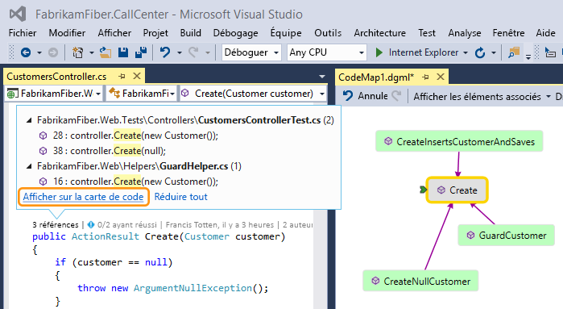
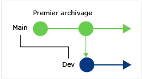
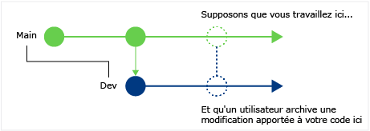
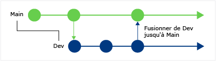
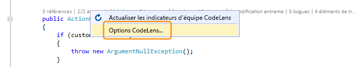
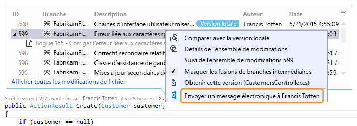
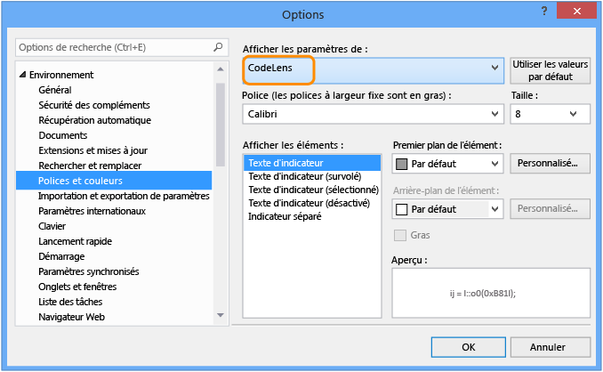
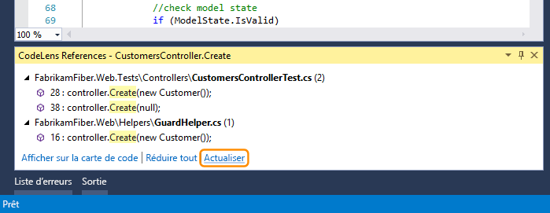
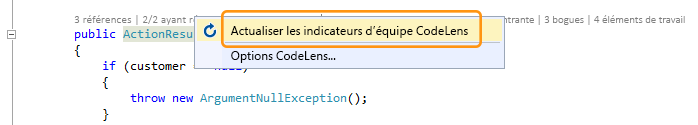

# Rechercher les modifications de code et d'autres historiques avec CodeLens

CodeLens vous permet de rester concentré sur votre travail pendant que vous cherchez ce qui s’est produit dans votre code, sans quitter l’éditeur. Vous pouvez trouver les références à un morceau de code, les changements dans votre code, les bogues liés, les éléments de travail, les revues du code et les tests unitaires.

::: moniker range=">=vs-2019"

> [!NOTE]
> CodeLens est disponible dans Visual Studio Community Edition. Toutefois, les indicateurs de *contrôle de code source* ne sont pas disponibles dans cette édition.

::: moniker-end

::: moniker range="vs-2017"

> [!NOTE]
> CodeLens n’est disponible que dans les éditions Visual Studio Enterprise et Professional. Il n'est pas disponible dans l'édition Visual Studio Community.

::: moniker-end

Recherchez où et comment les différentes parties de votre code sont utilisées dans votre solution :

Contactez votre équipe à propos de ces modifications dans votre code, sans quitter l'éditeur :

Pour choisir les indicateurs que vous souhaitez afficher, ou pour activer et désactiver CodeLens, accédez à **Outils**  >  **options**  >  **éditeur de texte**  >  **tous les langages**  >  **CodeLens**.

## Rechercher des références à votre code

Vous pouvez rechercher des références dans du code C# ou Visual Basic.

1. Choisissez l’indicateur **references** ou appuyez sur **Alt**+**2**.

   

   > [!NOTE]
   > Si l’indicateur montre **0 références**, cela signifie que vous n’avez aucune référence de code C# ou Visual Basic. Il peut cependant exister des références dans d’autres éléments, comme des fichiers *.xaml* et *.aspx*.

2. Pour voir le code qui référence, pointez sur la référence dans la liste.

   

3. Pour ouvrir le fichier contenant la référence, double-cliquez sur celle-ci.

### Cartes de code

Pour visualiser les relations entre le code et ses références, [créez une carte de code](../modeling/map-dependencies-across-your-solutions.md). Dans le menu contextuel de la carte de code, sélectionnez **Afficher toutes les références**.

## Rechercher des modifications dans votre code

Examinez l’historique de votre code pour savoir ce qui s’y est produit. Vous pouvez également examiner les modifications avant qu'elles soient fusionnées dans votre code. Cela vous permet de mieux comprendre la façon dont les modifications des autres branches peuvent affecter votre code.

Ce dont vous avez besoin :

- Visual Studio Enterprise ou Professional

- Azure DevOps Services, Team Foundation Server 2013 (ou version ultérieure) ou Git

- [Skype Entreprise](/skypeforbusiness/) pour contacter votre équipe à partir de l’éditeur de code

Pour le code C# ou Visual Basic stocké avec Team Foundation Version Control (TFVC) ou Git, vous obtenez les détails CodeLens au niveau des classes et des méthodes (indicateurs de *niveau élément de code*). Si votre dépôt Git est hébergé dans TfGit, vous obtenez également des liens vers les éléments de travail TFS.

Pour les types de fichiers autres que *.cs* or *.vb*, vous obtenez les détails CodeLens pour l’intégralité du fichier à un même emplacement dans le bas de la fenêtre (indicateurs de *niveau fichier*).

### Indicateurs de code de niveau élément

Les indicateurs de niveau élément de code permettent de voir qui a modifié le code et quelles modifications ont été faites. Les indicateurs de niveau élément de code sont disponibles pour le code C# et Visual Basic.

C’est ce que vous voyez quand vous utilisez Team Foundation Version Control (TFVC) dans Team Foundation Server ou Azure DevOps Services :

La période prise en charge par défaut s'étend sur les 12 derniers mois. Si votre code est stocké dans Team Foundation Server, vous pouvez changer la période de temps en exécutant la [commande TFSConfig](/azure/devops/server/command-line/tfsconfig-cmd) avec la [commande CodeIndex](../ide/codeindex-command.md) et l’indicateur **/indexHistoryPeriod**.

Pour afficher un historique détaillé de toutes les modifications, y compris celles datant de plus d’un an, choisissez **afficher toutes les modifications de fichier**:

La fenêtre **Historique** s’ouvre :

Quand vos fichiers sont dans un dépôt Git et que vous choisissez l’indicateur de modifications de niveau élément de code, voici ce que vous voyez :

### Indicateurs de niveau fichier

Recherchez les modifications pour un fichier entier dans les indicateurs de niveau fichier au bas de la fenêtre :

> [!NOTE]
> Les indicateurs de niveau fichier ne sont pas disponibles pour les fichiers C# et Visual Basic.

Pour obtenir plus d'informations sur une modification, cliquez avec le bouton droit sur cet élément. Selon que vous utilisez TFVC ou Git, différentes options permettent de comparer les versions du fichier, d’afficher les détails et d’effectuer le suivi de l’ensemble de modifications, d’obtenir la version sélectionnée du fichier et d’envoyer un e-mail à l’auteur de cette modification. Certains de ces détails s’affichent dans **Team Explorer**.

Vous pouvez également voir qui a modifié votre code au fil du temps. Cette fonctionnalité vous permet de découvrir des modèles dans les modifications effectuées par votre équipe, et d’en évaluer l’impact.

### Rechercher des modifications dans votre branche actuelle

Votre équipe peut avoir plusieurs branches, par exemple une branche principale et une branche de développement enfant, pour réduire le risque d’endommager le code stable.

Vous pouvez savoir combien de personnes ont modifié votre code et combien de modifications ont été apportées dans la branche principale en appuyant sur **ALT** + **6**:

### Savoir quand une branche a été créée dans votre code

Pour trouver quand une branche a été créée dans votre code, accédez à votre code dans la branche enfant. Ensuite, sélectionnez l’indicateur **Modifications** ou appuyez sur**Alt**+**6** :

### Rechercher les modifications entrantes d'autres branches

Vous pouvez voir les modifications entrantes. Dans la capture d’écran ci-dessous, une résolution de bogue a été effectuée dans la branche « Dev » :

Vous pouvez examiner cette modification sans quitter votre branche active (« Main ») :

### Savoir quand des modifications ont été fusionnées

Vous pouvez voir quand les modifications ont été fusionnées, ce qui vous permet de déterminer quelles modifications sont incluses dans votre branche :

Par exemple, votre code dans la branche Main contient maintenant la résolution de bogue de la branche « Dev » :

### Comparer une modification entrante à votre version locale

Comparez une modification entrante à votre version locale en appuyant sur **MAJ** + **F10**ou en double-cliquant sur l’ensemble de modifications.

### Icônes de branche

L’icône dans la colonne **Branche** vous indique comment la branche est liée à la branche dans laquelle vous travaillez.

|**Située**|**La modification provient de :**|
|--------------| - |
||La branche actuelle|
||La branche parente|
||Un branche enfant|
||Une branche homologue|
||Une branche plus éloignée qu'un parent, enfant ou homologue|
||Une fusion de la branche parente à une branche enfant|
||Une fusion d'une branche enfant à la branche parente|
||Une fusion d'une branche sans relation (fusion sans base)|

## Éléments de travail liés.

Recherchez des éléments de travail liés en sélectionnant l’indicateur **Éléments de travail** ou en appuyant sur **Alt**+**8**.

## Revues du code liées

Recherchez des revues du code liées en sélectionnant l’indicateur **Revues**. Pour utiliser le clavier, maintenez enfoncée la touche **Alt**, puis appuyez sur **Gauche** ou sur **Droite** pour parcourir les options d’indicateur.

## Bogues liés

Recherchez des bogues liés en sélectionnant l’indicateur **Bogues** ou en appuyant sur **Alt**+**7**.

## Contacter le propriétaire d'un élément

Recherchez l’auteur d’un élément en sélectionnant l’indicateur **Auteurs** ou en appuyant sur **Alt**+**5**.

Ouvrez le menu contextuel d'un élément pour afficher les options de contact. Si vous avez installé Lync ou Skype Entreprise, les options suivantes apparaissent :

## Tests unitaires associés

Vous pouvez découvrir les tests unitaires qui existent pour votre code C# ou Visual Basic sans ouvrir **l’Explorateur de tests**.

1. Accédez au code d’application auquel des [tests unitaires](../test/unit-test-your-code.md) sont associés.

2. Si ce n’est déjà fait, générez votre application pour charger les indicateurs de test CodeLens. 

3. Passez en revue les tests pour le code en appuyant sur **ALT** + **3**.

     

4. Si une icône d'avertissement s'affiche , cela signifie que les tests n’ont pas encore été exécutés : exécutez-les donc.

     

5. Pour passer en revue la définition d'un test, double-cliquez sur l'élément de test dans la fenêtre d'indicateur CodeLens pour ouvrir le fichier de code dans l'éditeur.

     

6. Pour passer en revue les résultats du test, choisissez l’indicateur État du test (  ou  ) ou appuyez sur **ALT** + **1**.

     

7. Pour connaître le nombre de personnes qui ont modifié ce test, qui a modifié ce test ou le nombre de modifications apportées à ce test, [recherchez l’historique de votre code](#find-changes-in-your-code) et les éléments liés.

## Raccourcis clavier

Pour utiliser le clavier pour sélectionner des indicateurs, maintenez enfoncée la touche **Alt** pour afficher les touches numériques associées, puis appuyez sur le numéro qui correspond à l’indicateur que vous voulez sélectionner.

> [!NOTE]
> Pour sélectionner l’indicateur **Revues**, maintenez enfoncée la touche **Alt** tout en utilisant les touches Gauche et Droite pour naviguer.

## Questions et réponses

### Q : Comment faire activer ou désactiver CodeLens ou choisir les indicateurs à afficher ?

**R :**  Vous pouvez activer ou désactiver les indicateurs, à l'exception de l'indicateur des références. Accédez à **Outils**  >  **options**  >  **éditeur de texte**  >  **tous les langages**  >  **CodeLens**.

Lorsque les indicateurs sont activés, vous pouvez aussi ouvrir les options CodeLens à partir des indicateurs.

Activez et désactivez les indicateurs de niveau fichier CodeLens à l'aide des icônes en forme de chevron situées en bas de la fenêtre de l'éditeur.

### Q : Où est CodeLens ?

**R :** CodeLens apparaît dans le code C# et Visual Basic, au niveau de la méthode, de la classe, de l'indexeur et de la propriété. CodeLens apparaît au niveau du fichier pour tous les autres types de fichiers.

- Assurez-vous que CodeLens est activé. Accédez à **Outils**  >  **options**  >  **éditeur de texte**  >  **tous les langages**  >  **CodeLens**.

- Si votre code est stocké dans TFS, assurez-vous que l'indexation de code est activée en utilisant la [commande CodeIndex](../ide/codeindex-command.md) avec la [commande TFS Config](/azure/devops/server/command-line/tfsconfig-cmd).

- Les indicateurs liés à DevOps s’affichent seulement si des éléments de travail sont liés au code et si vous êtes autorisé à ouvrir les éléments de travail liés. Vérifiez que vous disposez des [autorisations de membre](/azure/devops/organizations/security/view-permissions?view=vsts)de l’équipe.

- Les indicateurs de test unitaire ne s'affichent pas quand le code de l'application ne contient pas de tests unitaires. Les indicateurs d'état de test s'affichent automatiquement dans les projets de test. Si vous savez que votre code d’application a des tests unitaires, mais que les indicateurs de test ne s’affichent pas, essayez de générer la solution (**CTRL** + **Shift** + **B**).

::: moniker range=">=vs-2019"

> [!TIP]
> CodeLens est disponible dans Visual Studio Community Edition. Toutefois, les indicateurs de *contrôle de code source* ne sont pas disponibles dans cette édition.

::: moniker-end

::: moniker range="vs-2017"

> [!TIP]
> CodeLens n’est pas disponible dans l’édition Visual Studio Community.

::: moniker-end

### Q : Pourquoi est-ce que je ne vois pas les détails d'élément de travail pour une validation ?

**R :** cela peut se produire si CodeLens ne trouve pas les éléments de travail dans Azure Boards ou TFS. Vérifiez que vous êtes connecté au projet contenant ces éléments de travail et que vous disposez des autorisations nécessaires pour les visualiser. Les détails des éléments de travail peuvent ne pas apparaître si la description de la validation comporte des informations incorrectes sur les ID d’élément de travail dans Azure Boards ou dans TFS.

### Q : Pourquoi est-ce que je ne vois pas les indicateurs Skype ?

**R :** Les indicateurs Skype n’apparaissent pas si vous n’êtes pas connecté à Skype Entreprise, s’il n’est pas installé ou si votre configuration n’est pas prise en charge. Vous pouvez néanmoins envoyer un e-mail :

**Quelles sont les configurations de Skype et de Lync prises en charge ?**

- Skype for Business (32 bits ou 64 bits)

- Lync 2010 ou version ultérieure individuelle (32 bits ou 64 bits), mais pas Lync Basic 2013 avec Windows 8.1

CodeLens ne prend pas en charge l'installation de différentes versions de Lync ou de Skype. Elles peuvent ne pas être localisées pour toutes les versions localisées de Visual Studio.

### Q : comment changer la police et la couleur de CodeLens ?

**R :** Accédez à **Outils** > **Options** > **Environnement** > **Polices et couleurs**.

Pour utiliser le clavier :

1. Appuyez sur **ALT** + **T** + **O** pour ouvrir la boîte de dialogue **options** .

2. Appuyez sur **Flèche haut** ou **Flèche bas** pour atteindre le nœud **Environnement** , puis appuyez sur **Flèche gauche** pour développer le nœud.

3. Appuyez sur **Flèche bas** pour accéder à **Polices et couleurs**.

4. Appuyez sur **Tab** pour accéder à la liste **afficher les paramètres de** , puis appuyez sur la **flèche bas** pour sélectionner **CodeLens**.

### Q : Puis-je déplacer l'affichage tête haute CodeLens ?

**R :** Oui, choisissez  pour ancrer CodeLens en tant que fenêtre.

### Q : Comment actualiser les indicateurs ?

**R :** cela dépend de l'indicateur :

- **Références**: cet indicateur se met automatiquement à jour quand le code change. Si l’indicateur **Références** est ancré en tant que fenêtre distincte, actualisez-le en sélectionnant **Actualiser** :

   

- **Équipe** : Actualisez ces indicateurs en sélectionnant **Actualiser les indicateurs d’équipe CodeLens** dans le menu contextuel :

   

- **Test** : [Recherchez les tests unitaires pour votre code](#associated-unit-tests) pour actualiser l’indicateur **Test**.

### Q : Que signifie « Version locale » ?

**R :** La flèche **Version locale** pointe vers l’ensemble de modifications le plus récent dans votre version locale d’un fichier. Lorsque le serveur possède des ensembles de modifications plus récents, ils apparaissent au-dessus ou en-dessous de la flèche **Version locale** , selon l'ordre utilisé pour trier les ensembles de modifications.

### Q : puis-je gérer la façon dont CodeLens traite le code pour afficher l'historique et les éléments liés ?

**R :** Oui. Si votre code est dans TFS, utilisez la [commande CodeIndex](../ide/codeindex-command.md) avec la [commande TFS Config](/azure/devops/server/command-line/tfsconfig-cmd).

### Q : Mes indicateurs de test CodeLens n’apparaissent plus dans mon fichier quand j’ouvre ma solution pour la première fois. Comment les charger ?

**R :** Regénérez votre projet afin de charger les indicateurs de test CodeLens dans votre fichier. Pour améliorer les performances, Visual Studio n’extrait plus les informations sources pour les indicateurs de test lors du chargement des fichiers de code. Les indicateurs de test sont chargés après une génération, ou quand vous accédez à un test en double-cliquant dessus dans l’**Explorateur de tests**.

## Voir aussi

- [Fonctionnalités de l’éditeur de code](../ide/writing-code-in-the-code-and-text-editor.md)
