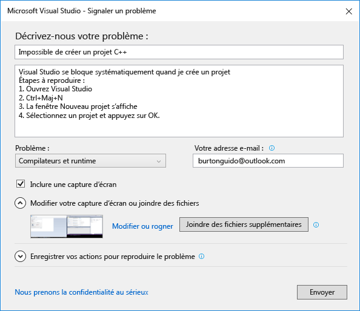
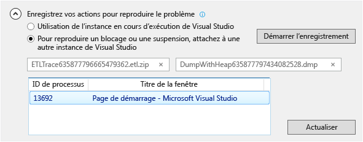

# Comment signaler un probl&#232;me avec Visual Studio
[!INCLUDE[vs2017banner](../code-quality/includes/vs2017banner.md)]

Si vous rencontrez un problème avec Visual Studio, nous aimerions en être informés pour pouvoir le diagnostiquer et le résoudre.  L’outil **Signaler un problème** vous permet de recueillir des informations détaillées sur le problème et de les envoyer à Microsoft en seulement quelques clics.  
  
 Microsoft respecte votre vie privée. Pour plus d’informations sur la façon dont nous utilisons les données que vous nous envoyez, consultez [Déclaration de confidentialité des produits Microsoft Visual Studio](https://www.visualstudio.com/en-us/dn948229).  
  
## Ouvrir l’outil Signaler un problème  
 Cliquez sur l’icône des commentaires utilisateur en regard de **Lancement rapide** dans la barre de titre, ou sur **Aide &#124; Envoyer des commentaires &#124; Signaler un problème**.  
  
   
  
## Décrire le problème  
  
###    
  
1.  Donnez un titre descriptif au problème qui nous aidera à l’adresser à l’équipe Visual Studio appropriée.  
  
2.  Indiquez des détails supplémentaires et, si possible, la procédure permettant de reproduire le problème.  
  
3.  Choisissez un secteur qui pose problème dans la liste déroulante. Indiquez l’hypothèse qui vous semble la meilleure si vous n’avez aucune certitude.  
  
   
  
## Fournir une capture d’écran \(facultatif\)  
 Choisissez **Inclure une capture d’écran** pour envoyer l’écran actuellement affiché à Microsoft. L’outil vous permet de rogner l’image pour afficher uniquement la partie de l’écran qui illustre le problème. Vous pouvez joindre d’autres captures d’écran ou fichiers en cliquant sur le bouton **Joindre des fichiers supplémentaires**.  
  
## Fournir un fichier dump de tas et de suivi \(facultatif\)  
  
###    
  
1.  Les fichiers dump de tas et de suivi s’avèrent très utiles pour nous aider à diagnostiquer les problèmes.   Nous vous remercions beaucoup d’employer l’outil Signaler un problème pour enregistrer les étapes de reproduction du problème ainsi que d’envoyer les données à Microsoft.  
  
2.  Cliquez sur le chevron en regard de **Enregistrez vos actions pour reproduire le problème**. Si le problème est tel que Visual Studio se bloque ou tombe en panne, ouvrez une autre instance de Visual Studio et sélectionnez\-la dans l’affichage de liste.  
  
3.  Cliquez sur **Démarrer l’enregistrement** et effectuez les étapes pour reproduire le problème. Quand vous avez terminé, cliquez sur le bouton **Arrêter l’enregistrement** dans la fenêtre flottante.  
  
4.  Attendez quelques minutes que Visual Studio collecte et compresse les informations qui ont été enregistrées. La boîte de dialogue ressemble à ceci quand le processus de collecte est terminé :  
  
       
  
## Décrire la solution de contournement, le cas échéant  
 Si vous avez réussi à contourner le problème, décrivez la solution de contournement dans la zone prévue à cet effet. Ceci nous permet non seulement de diagnostiquer le problème, mais également d’aider les autres utilisateurs qui peuvent rencontrer le même problème.  
  
## Envoyer le rapport  
 Cliquez sur le bouton Envoyer pour envoyer votre rapport, ainsi que les images et les fichiers dump ou de suivi. Si le bouton **Envoyer** est grisé, vérifiez que vous avez fourni un titre et une description.  
  
## Voir aussi  
 [Nous contacter](../ide/talk-to-us.md)