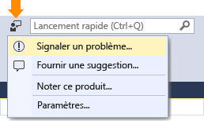

# Guide pratique pour signaler un problème avec Visual Studio 2017 RC
Si vous rencontrez un problème avec Visual Studio, nous aimerions en être informés pour pouvoir le diagnostiquer et le résoudre.  L’outil **Signaler un problème** vous permet de recueillir des informations détaillées sur le problème et de les envoyer à Microsoft en seulement quelques clics.  

 Microsoft respecte votre vie privée. Pour plus d’informations sur la façon dont nous utilisons les données que vous nous envoyez, consultez [Déclaration de confidentialité des produits Microsoft Visual Studio](https://www.visualstudio.com/en-us/dn948229).  

## Ouvrir l’outil Signaler un problème  
 Cliquez sur l’icône des commentaires utilisateur en regard de **Lancement rapide** dans la barre de titre, ou sur **Aide &#124; Envoyer des commentaires &#124; Signaler un problème**.  

   

## Rechercher et voter pour des problèmes similaires  
###    

1.  Recherchez votre problème et vérifiez si d’autres personnes l’ont déjà signalé.
2.  Si quelqu’un l’a signalé, rappelez-le nous.  

  

## Signaler un nouveau problème
###  
1.  En bas à gauche de l’outil **Signaler un problème** de Visual Studio, cliquez sur le bouton « **+** ».  
2.  Créez un titre descriptif pour le problème, qui nous permettra de l’adresser à l’équipe Visual Studio appropriée.  
3.  Donnez-nous des détails supplémentaires et, si possible, indiquez-nous les étapes de reproduction du problème.  

  

## Fournir une capture d’écran et des pièces jointes (facultatif)
###  
 Choisissez d’envoyer votre écran actuel à Microsoft. Vous pouvez joindre d’autres captures d’écran ou fichiers en cliquant sur le bouton **Joindre des fichiers supplémentaires**.  

## Fournir un fichier dump de tas et de suivi (facultatif)  
###    

Les fichiers dump de tas et de suivi s’avèrent très utiles pour nous aider à diagnostiquer les problèmes.   Nous vous remercions beaucoup d’employer l’outil **Signaler un problème** pour enregistrer les étapes de reproduction du problème ainsi que d’envoyer les données à Microsoft.  Voici comment faire.

1.  Cliquez sur l’onglet **Enregistrer**.
2.  Cliquez sur **Démarrer l’enregistrement**. Accordez l’autorisation d’exécuter l’outil.
3.  Quand l’outil **Enregistreur d’actions utilisateur** apparaît, effectuez les étapes qui reproduisent le problème.
4.  Quand vous avez terminé, cliquez sur le bouton **Arrêter l’enregistrement** dans la fenêtre flottante.
5.  Attendez quelques minutes que Visual Studio collecte et compresse les informations que vous avez enregistrées.  Après cela, vous verrez une boîte de dialogue qui ressemble à ce qui suit.   

  

## Envoyer le rapport  
###    
 Cliquez sur le bouton **Envoyer** pour envoyer votre rapport, ainsi que les images et les fichiers dump ou de trace. (Si le bouton **Envoyer** est grisé, vérifiez que vous avez fourni un titre et une description du rapport.)  

## Voir aussi  
 [Nous contacter](../ide/talk-to-us.md)

