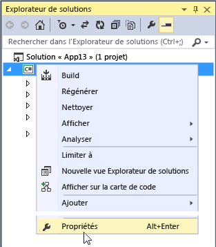
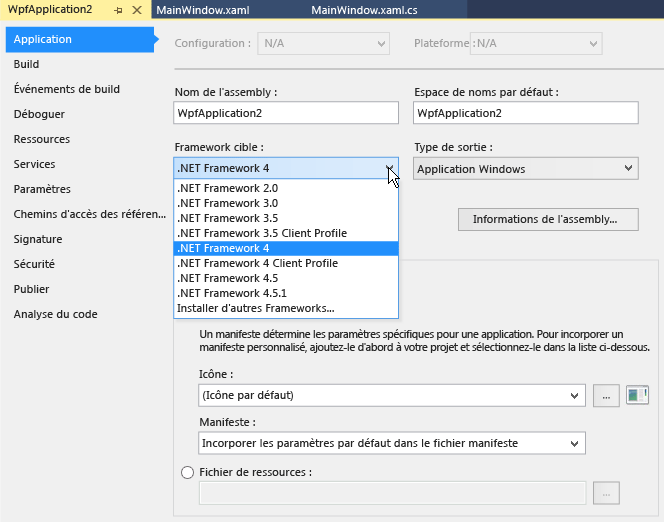

# Procédure : Cibler une version de .NET

Cet article explique comment cibler une version spécifique du .NET Framework quand vous créez un projet .NET Framework. Il décrit également comment changer la version ciblée dans un projet Visual Basic, C#, ou F# existant.

> [!IMPORTANT]
> Pour plus d’informations sur la modification de la version cible pour les projets C++, consultez [Guide pratique pour modifier l’infrastructure cible et l’ensemble d’outils de plateforme](/cpp/build/how-to-modify-the-target-framework-and-platform-toolset).

## Cibler une version quand vous créez un projet

Quand vous créez un projet .NET Framework, les versions du .NET Framework disponibles dépendent des versions installées et du modèle de projet sélectionné.

1. Dans la barre de menus, choisissez **Fichier** > **Nouveau** > **Projet**.

1. Choisissez un modèle .NET Framework pour le type de projet que vous voulez créer.

1. Dans la liste déroulante **Framework** située en bas de la boîte de dialogue, choisissez la version du .NET Framework que votre projet doit cibler.

   La liste des frameworks affiche uniquement les versions qui s’appliquent au modèle que vous avez choisi.

   > [!NOTE]
   > Certains types de projets, comme .NET Core, n’affichent pas la liste déroulante **Framework**.

   ::: moniker range="vs-2017"

   

   ::: moniker-end

   ::: moniker range=">=vs-2019"

   

   ::: moniker-end

1. Continuez avec [la création du projet](create-new-project.md).

## Changer la version ciblée

Vous pouvez changer la version ciblée de .NET dans un projet Visual Basic, C# ou F# en suivant cette procédure.

1. Dans l’**Explorateur de solutions**, ouvrez le menu contextuel du projet que vous souhaitez modifier, puis choisissez **Propriétés**.

    

1. Dans la colonne gauche de la fenêtre **Propriétés**, choisissez l’onglet **Application**.

    

    > [!NOTE]
    > Après avoir créé une application UWP, vous ne pouvez pas changer la version ciblée de Windows ou de .NET.

1. Dans la liste **Framework cible**, choisissez la version que vous souhaitez.

1. Dans la boîte de dialogue de vérification qui apparaît, choisissez le bouton **Oui**.

    Le projet est alors déchargé. Quand il se recharge, il cible la version de .NET que vous venez de choisir.

    > [!NOTE]
    > Si votre code contient des références à une autre version de .NET que celle que vous avez ciblée, des messages d’erreur peuvent apparaître quand vous compilez ou que vous exécutez le code. Pour résoudre ces erreurs, vous devez modifier les références. Consultez [Résoudre les problèmes liés aux erreurs de ciblage de .NET](../msbuild/troubleshooting-dotnet-framework-targeting-errors.md).

## Voir aussi

- [Vue d’ensemble du ciblage des frameworks](../ide/visual-studio-multi-targeting-overview.md)
- [Résoudre les problèmes liés aux erreurs de ciblage du .NET Framework](../msbuild/troubleshooting-dotnet-framework-targeting-errors.md)
- [Application, page du Concepteur de projet (C#)](../ide/reference/application-page-project-designer-csharp.md)
- [Application, page du Concepteur de projet (Visual Basic)](../ide/reference/application-page-project-designer-visual-basic.md)
- [Guide pratique pour modifier l’infrastructure cible et l’ensemble d’outils de plateforme (C++)](/cpp/build/how-to-modify-the-target-framework-and-platform-toolset)