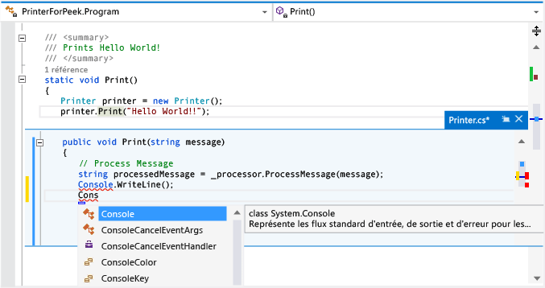

# Guide pratique pour afficher et modifier le code avec l’Aperçu de définition (ALT + F12)
Utilisez la commande **Aperçu de définition** pour afficher et modifier du code sans sortir du code que vous écrivez. Les options **Aperçu de définition** et **Atteindre la définition** affichent les mêmes informations, mais **Aperçu de définition** affiche le code dans une fenêtre contextuelle, alors que l’option **Atteindre la définition** affiche le code dans une fenêtre de code distincte. L’option **Atteindre la définition** provoque le basculement de votre contexte (c’est-à-dire, la fenêtre de code active, la ligne active et la position du curseur) vers la fenêtre du code de définition. Avec l’option **Aperçu de la définition**, vous pouvez afficher et modifier la définition et vous déplacer dans le fichier de définition tout en conservant votre position dans le fichier de code d’origine.  
  
 Vous pouvez utiliser **Aperçu de définition** avec du code C#, Visual Basic et C++. En Visual Basic, l’option **Aperçu de définition** affiche un lien vers l’**Explorateur d’objets** pour les symboles qui ne disposent pas de métadonnées de définition (par exemple, les types .NET Framework intégrés).  
  
## Utilisation de l'option Aperçu de définition  
  
#### Pour ouvrir une fenêtre Aperçu de définition    
1.  Vous pouvez afficher l’aperçu d’une définition en choisissant **Aperçu de la définition** dans le menu contextuel d’un membre que vous souhaitez explorer. Dans Visual Studio 2017 version 15.4 ou ultérieure, si l’option est activée, vous pouvez également afficher l’aperçu d’une définition à l’aide de la souris en appuyant sur **Ctrl** (ou sur une autre touche de modification) et en cliquant sur le nom du membre. Si vous préférez utiliser le clavier, appuyez sur **Alt+F12**.  
  
     Cette illustration représente la fenêtre **Aperçu de définition** pour une méthode nommée `Print()` :  
  
       
  
     La fenêtre de définition apparaît sous la ligne `printer.Print("Hello World!")` du fichier d'origine. La fenêtre ne masque aucune partie du code de votre fichier d'origine. Les lignes qui suivent `printer.Print("Hello World!")` apparaissent sous la fenêtre de définition.  
  
2.  Vous pouvez déplacer le curseur vers différents emplacements dans la fenêtre de définition du code. Vous pouvez également vous déplacer dans la fenêtre de code d’origine.  
  
3.  Vous pouvez copier une chaîne dans la fenêtre de définition et la coller dans le code d'origine. Vous pouvez également effectuer un glisser-déposer de la chaîne de la fenêtre de définition vers le code d’origine sans la supprimer dans la fenêtre de définition.  
  
4.  Vous pouvez fermer la fenêtre de définition en choisissant la touche **Échap** ou le bouton **Fermer** sous l’onglet de la fenêtre de définition.  
  
#### Pour ouvrir une fenêtre Aperçu de définition à partir d'une fenêtre Aperçu de définition    
-   Si une fenêtre **Aperçu de définition** est déjà ouverte, vous pouvez appeler de nouveau **Aperçu de définition** sur le code affiché dans cette fenêtre. Une autre fenêtre de définition s'ouvre. Un ensemble de points de navigation apparaissent en regard de l'onglet de la fenêtre de définition. Vous pouvez les utiliser pour naviguer entre les fenêtres de définition. L’info-bulle sur chaque point indique le nom et le chemin du fichier de définition que le point représente.  
  
       
  
#### Pour utiliser l'option Aperçu de définition avec plusieurs résultats    
-   Si vous utilisez l’option **Aperçu de définition** sur du code possédant plusieurs définitions (par exemple, des classes partielles), une liste de résultats apparaît à droite de la vue Définition de code. Vous pouvez choisir un résultat quelconque dans la liste pour afficher sa définition.  
  
       
  
#### Pour apporter des modifications dans la fenêtre Aperçu de définition    
-   Quand vous commencez à apporter des modifications dans une fenêtre **Aperçu de la définition**, le fichier que vous modifiez s’ouvre automatiquement dans un onglet distinct dans l’éditeur de code et reflète les modifications effectuées. Vous pouvez continuer à apporter, annuler et enregistrer des modifications dans la fenêtre **Aperçu de définition** et l’onglet continuera à refléter ces modifications. Même si vous fermez la fenêtre **Aperçu de la définition** sans enregistrer les modifications, vous pouvez effectuer, annuler et enregistrer des modifications supplémentaires dans l’onglet, en reprenant exactement là où vous vous êtes arrêté dans la fenêtre **Aperçu de la définition**.  
  
       
  
#### Pour changer les options d’aperçu de la définition  
1. Accédez à **Outils**, **Options**, **Éditeur de texte**, **Général**.  

2. Sélectionnez l’option **Ouvrir la définition dans l’aperçu**.  

3. Cliquez sur **OK** pour fermer la boîte de dialogue **Options**.  

       

#### Pour utiliser des raccourcis clavier pour l'option Aperçu de définition    
-   Vous pouvez utiliser les raccourcis clavier suivants avec la fenêtre **Aperçu de définition** :  
  
    |Fonctionnalité|Raccourci clavier|  
    |-------------------|:-----------------------:|  
    |Ouvrir la fenêtre de définition|Alt+F12|  
    |Fermer la fenêtre de définition|Échap|  
    |Promouvoir la fenêtre de définition en onglet de document standard|Maj+Alt+Début|  
    |Naviguer entre les fenêtres de définition|Ctrl+Alt+- et Ctrl+Alt+=|  
    |Naviguer entre plusieurs résultats|F8 et Maj+F8|  
    |Permuter entre la fenêtre de l'éditeur de code et la fenêtre de définition|Maj+Échap|  
  
    > [!NOTE]
    >  Pour modifier le code dans une fenêtre **Aperçu de définition**, vous pouvez utiliser les mêmes raccourcis clavier que vous utilisez ailleurs dans Visual Studio.  
  
## Voir aussi  
[Navigation dans le code](../ide/navigating-code.md)  
[Atteindre la définition et Aperçu de la définition](../ide/go-to-and-peek-definition.md)  
[Conseils de productivité](../ide/productivity-tips-for-visual-studio.md)