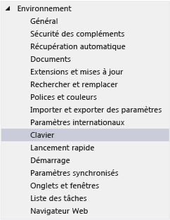
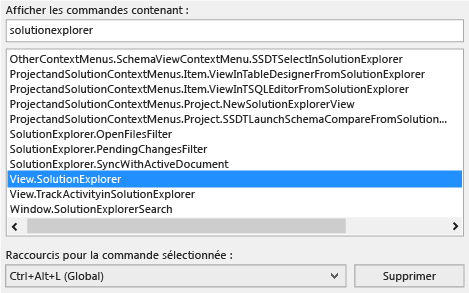
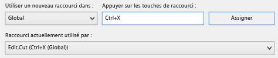
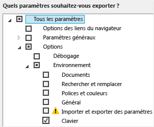
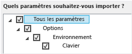

# Identifier et personnaliser les raccourcis clavier dans Visual Studio

Vous pouvez identifier les raccourcis clavier pour les commandes Visual Studio, personnaliser ces raccourcis, et les exporter afin que d'autres utilisateurs puissent les utiliser. De nombreux raccourcis appellent toujours les mêmes commandes, mais le comportement d'un raccourci peut varier selon les conditions suivantes :

- Les paramètres d'environnement par défaut que vous avez choisis la première fois que vous avez ouvert Visual Studio&mdash;par exemple, les paramètres de développement généraux ou Visual C#. (Pour plus d’informations sur la modification ou la réinitialisation de vos paramètres, consultez [Paramètres d’environnement](environment-settings.md).)

- Si vous avez personnalisé ou non le comportement du raccourci.

- Le contexte dans lequel vous êtes au moment de choisir le raccourci. Par exemple, le raccourci **F2** appelle la commande `Edit.EditCell` si vous utilisez le **concepteur de paramètres** et invoque la commande `File.Rename` si vous utilisez **Team Explorer**.

Indépendamment des paramètres, de la personnalisation et du contexte, vous pouvez toujours rechercher et changer un raccourci clavier dans la boîte de dialogue **Options**. Vous pouvez également rechercher les raccourcis clavier par défaut pour plusieurs dizaines de commandes dans [Raccourcis clavier populaires](../ide/default-keyboard-shortcuts-in-visual-studio.md#most-popular-keyboard-shortcuts). Pour obtenir la liste complète des raccourcis par défaut (en fonction des paramètres de **Développement général**), consultez [Tous les raccourcis clavier](../ide/default-keyboard-shortcuts-in-visual-studio.md).

Si un raccourci est affecté à une commande du contexte *global* et à aucun autre contexte, ce raccourci appelle toujours cette commande. Mais un raccourci peut être affecté à une commande du contexte global et à une commande différente dans un contexte spécifique. Si vous utilisez un raccourci lorsque vous êtes dans le contexte spécifique, ce raccourci appelle la commande pour ce contexte spécifique, et non le contexte global.

> [!NOTE]
> Les paramètres et l'édition de Visual Studio peuvent modifier le nom et l'emplacement des commandes de menu et les options qui apparaissent dans les boîtes de dialogue. Cette page est basée sur le profil de paramètres **Développement général**.

## Identifier un raccourci clavier

1. Dans la barre de menus, choisissez **Outils**  >  **options**.

2. Développez **Environnement**, puis choisissez **Clavier**.

   

3. Dans la zone **Afficher les commandes contenant**, entrez tout ou partie du nom de la commande sans espaces.

   Vous pouvez, par exemple, rechercher des commandes pour `solutionexplorer`.

4. Dans la liste, choisissez la commande correcte.

    Par exemple, vous pouvez choisir `View.SolutionExplorer`.

5. Si la commande a un raccourci clavier, elle apparaît dans la liste **Raccourcis de la commande sélectionnée**.

   

## Personnaliser un raccourci clavier

1. Dans la barre de menus, choisissez **Outils**  >  **options**.

2. Développez **Environnement**, puis choisissez **Clavier**.

3. Facultatif : filtrez la liste des commandes en entrant tout ou partie du nom de la commande, sans espaces, dans la zone **Afficher les commandes contenant**.

4. Dans la liste, choisissez la commande à laquelle vous souhaitez associer un raccourci clavier.

   Dans la liste **Utiliser un nouveau raccourci dans**, choisissez la zone de fonctionnalités dans laquelle vous voulez utiliser le raccourci.

   Par exemple, choisissez **Global** si vous voulez que le raccourci fonctionne dans tous les contextes. Vous pouvez utiliser n'importe quel raccourci qui n'est pas mappé (comme Global) dans un autre éditeur. Sinon, l'éditeur substitue le raccourci.

   > [!NOTE]
   > Vous ne pouvez pas affecter les touches suivantes dans le cadre d’un raccourci clavier dans **Global** :
   >
   > - Entrée, Tab, Verr. maj
   > - Impr. écran/SYSTÈME, Arrêt défil., Pause/Attn
   > - Inser, Début, Fin, Pge préc., Pge suiv
   > - Touche du logo Windows, touche Application, touches de direction
   > - Verr. num., Suppr ou Effacer sur le pavé numérique
   > - La combinaison de touches Ctrl+Alt+Suppr

6. Dans la zone **Appuyer sur les touches de raccourci**, entrez le raccourci à utiliser.

    > [!NOTE]
    > Vous pouvez créer un raccourci qui associe une lettre avec la touche **ALT** , la touche **CTRL** , ou les deux. Vous pouvez également créer un raccourci qui combine la touche **MAJ** et une lettre avec la touche **ALT** , la touche **CTRL** , ou les deux.

     Si un raccourci est déjà affecté à une autre commande, il s’affiche dans la zone **Raccourci actuellement utilisé par**. Dans ce cas, choisissez la touche **retour arrière** pour supprimer ce raccourci avant d’en essayer un autre.

    

7. Choisissez le bouton **Assigner**.

    > [!NOTE]
    > Si vous spécifiez un autre raccourci pour une commande, cliquez sur **Attribuer** puis cliquez sur **Annuler** pour fermer la boîte de dialogue, le raccourci que vous avez attribué n’est pas annulé.

## Partager les raccourcis clavier personnalisés

Vous pouvez partager les raccourcis clavier personnalisés en les exportant vers un fichier, puis en donnant le fichier à d'autres utilisateurs afin de pouvoir importer les données.

### Pour exporter uniquement les raccourcis clavier

1. Dans la barre de menus, choisissez **Outils**  >  **importation et exportation de paramètres**.

2. Choisissez **Exporter les paramètres d’environnement sélectionnés**, puis choisissez **Suivant**.

3. Sous **Quels paramètres souhaitez-vous exporter ?**, décochez la case **Tous les paramètres**, développez **Options**, puis **Environnement**.

4. Cochez la case **Clavier**, puis choisissez **Suivant**.

   

5. Dans les zones **Comment voulez-vous appeler votre fichier des paramètres** et **Stocker mon fichier des paramètres dans ce répertoire**, laissez les valeurs par défaut ou spécifiez des valeurs différentes, puis choisissez **Terminer**.

::: moniker range="vs-2017"

Par défaut, les raccourcis sont enregistrés dans un fichier du dossier *%USERPROFILE%\Documents\Visual Studio 2017\Settings*. Le nom du fichier reflète la date à laquelle vous avez exporté les paramètres, et l’extension est *. vssettings*.

::: moniker-end

::: moniker range=">=vs-2019"

Par défaut, les raccourcis sont stockés dans un fichier du dossier *%USERPROFILE%\Documents\Visual Studio 2019\Settings*. Le nom du fichier reflète la date à laquelle vous avez exporté les paramètres, et l’extension est *. vssettings*.

::: moniker-end

### Pour importer uniquement les raccourcis clavier

1. Dans la barre de menus, choisissez **Outils**  >  **importation et exportation de paramètres**.

2. Choisissez la case d’option **Importer les paramètres d’environnement sélectionnés**, puis **Suivant**.

3. Choisissez la case d’option **Non, importer simplement de nouveaux paramètres en remplaçant mes paramètres actuels**, puis choisissez **Suivant**.

4. Sous **Mes paramètres**, choisissez le fichier qui contient les raccourcis que vous souhaitez importer, ou choisissez le bouton **Parcourir** pour rechercher le fichier approprié.

5. Choisissez **Suivant**.

6. Sous **Quels paramètres voulez-vous importer ?**, décochez la case **Tous les paramètres**, développez **Options**, puis **Environnement**.

7. Cochez la case **Clavier**, puis choisissez **Terminer**.

   

## Voir aussi

- [Fonctionnalités d’accessibilité de Visual Studio](../ide/reference/accessibility-features-of-visual-studio.md)
