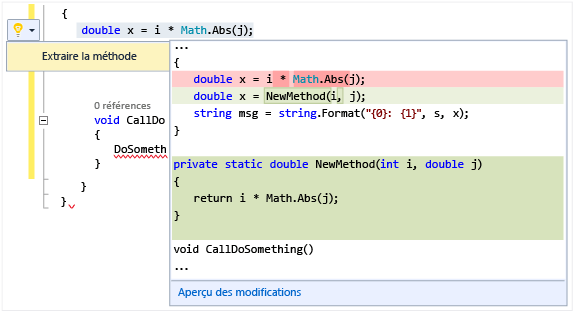

# Effectuer des actions rapides avec des ampoules
Les ampoules sont une fonctionnalité de productivité de Visual Studio. Il s’agit d’icônes qui apparaissent dans l’éditeur Visual Studio. Vous pouvez cliquer dessus pour effectuer des actions rapides, notamment la refactorisation et la correction d’erreurs. Les ampoules regroupent des fonctions d’aide à la correction et à la refactorisation dans un point focal unique, souvent directement sur la ligne que vous tapez.  

   

 Dans les langages C# et Visual Basic, une ampoule apparaît si votre code est souligné d’une ligne ondulée rouge et qu’une suggestion pour résoudre le problème est disponible dans Visual Studio. Par exemple, si une erreur est signalée par un soulignement rouge ondulé, une ampoule apparaît lorsque des corrections sont disponibles pour cette erreur. En C++, quand vous ajoutez une nouvelle fonction à un fichier d’en-tête, une ampoule apparaît pour vous proposer de créer une implémentation de stub de cette fonction. Des éditeurs tiers peuvent fournir des diagnostics et des suggestions personnalisés pour n'importe quel langage, par exemple dans le cadre d'un SDK. Dans ce cas, les ampoules Visual Studio s'allument en fonction des règles établies.  

## Pour afficher une ampoule  

1.  Dans de nombreux cas, les ampoules apparaissent spontanément lorsque vous passez la souris au niveau de l’erreur ou dans la marge gauche de l’éditeur lorsque vous déplacez le point d’insertion dans une ligne qui contient une erreur. Si vous remarquez une ligne ondulée rouge, vous pouvez pointer dessus avec la souris pour afficher l'ampoule. Vous pouvez aussi déclencher l'apparition d'une ampoule quand vous utilisez la souris ou le clavier pour vous rendre quelque part sur la ligne où le problème se produit.  

2.  Appuyez sur **Ctrl + .** sur une ligne pour appeler l’ampoule et accéder directement à la liste des corrections éventuelles.  

   

## Pour afficher les corrections éventuelles  
 Cliquez sur la flèche bas ou sur le lien Afficher les corrections éventuelles pour afficher une liste d'actions rapides que l'ampoule peut effectuer pour vous.  

   

## Pour effectuer une refactorisation  
 Pour effectuer des refactorisations, vous pouvez toujours cliquer avec le bouton droit pour faire apparaître le menu contextuel. Vous pouvez aussi appuyer sur Ctrl + . pour afficher les options de refactorisation. Dans l'illustration suivante, la refactorisation Extraire une méthode vous est proposée lorsque vous appuyez sur Ctrl + . quelque part sur la ligne contenant l'appel `Math.Abs` :  

 

