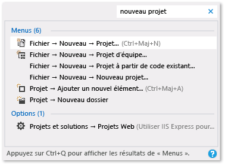
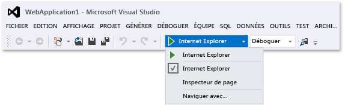

# Conseils de productivité pour Visual Studio

Cette rubrique propose différents conseils pour vous aider à écrire, parcourir et déboguer votre code plus rapidement et facilement.

Pour plus d'informations sur les raccourcis clavier courants, consultez [Conseils d’utilisation du clavier](../ide/tips-and-tricks-for-visual-studio.md). Ou pour obtenir une liste plus complète des raccourcis clavier, consultez [Identifier et personnaliser les raccourcis clavier](../ide/identifying-and-customizing-keyboard-shortcuts-in-visual-studio.md) et [Raccourcis clavier par défaut](../ide/default-keyboard-shortcuts-in-visual-studio.md).

## Écrire du code

Écrivez le code plus rapidement à l’aide des fonctionnalités suivantes.

- **Utilisez des commandes pratiques**. Visual Studio propose différentes commandes pour vous aider à accomplir plus rapidement des tâches d’édition. Par exemple, dans **Visual Studio 2017 versions 15.6** et ultérieures, vous pouvez choisir une commande afin de facilement dupliquer une ligne de code sans avoir à la copier, à repositionner le curseur, puis à coller la ligne. Choisissez **Edition** > **Dupliquer** ou appuyez sur **Ctrl**+**E**,**V**. Vous pouvez également développer ou diminuer rapidement une sélection de texte en choisissant **Modifier** > **Avancé** > **Développer la sélection** ou **Modifier** > **Avancé** > **Diminuer la sélection** ou en appuyant sur **Maj**+**Alt**+**=** ou sur **Maj**+**Alt**+**-**  (disponible dans **Visual Studio 2017 version 15.5** et version ultérieure).

- **Utiliser IntelliSense**. Lorsque vous écrivez du code dans l'éditeur, les informations IntelliSense, telles que Liste des membres, Informations sur les paramètres, Info express, l'assistance de signature et Compléter le mot, s'affichent. Ces fonctionnalités prennent en charge la correspondance approximative de texte. Par exemple, les listes de résultats pour la liste des membres comprennent non seulement les entrées qui commencent par les caractères saisis, mais également celles qui contiennent la combinaison de caractères n’importe où dans leurs noms. Pour plus d’informations, consultez [Utiliser IntelliSense](../ide/using-intellisense.md).

- **Modifier l’insertion automatique des options IntelliSense quand vous entrez du code**. En basculant IntelliSense en mode suggestion, vous pouvez spécifier que les options IntelliSense ne sont insérées que si vous les choisissez explicitement.

     Pour activer le mode suggestion, appuyez sur les touches **Ctrl**+**Alt**+**Espace** ou, dans la barre de menus, sélectionnez **Edit** > **IntelliSense** > **Activer/Désactiver le mode de saisie semi-automatique**.

- **Utiliser des extraits de code**. Vous pouvez utiliser des extraits de code intégrés ou créer les vôtres.

     Pour insérer un extrait de code, choisissez **Edition** > **IntelliSense** > **Insérer l’extrait** ou **Entourer de** dans la barre de menus, ou ouvrez le menu contextuel dans un fichier et choisissez **Extrait** > **Insérer l’extrait** ou **Entourer de**. Pour plus d’informations, consultez [Extraits de code](../ide/code-snippets.md).

- **Corriger les erreurs de code inline**. Les actions rapides vous permettent de refactoriser, générer ou modifier facilement le code en une seule action. Ces actions peuvent être appliquées en utilisant l’icône en forme de tournevis  ou d’ampoule , ou en appuyant sur **Alt**+**Entrée** ou **Ctrl**+**.** quand votre curseur se trouve sur la ligne de code appropriée. Pour plus d’informations, consultez [Actions rapides](quick-actions.md).

- **Afficher et modifier la définition d’un élément de code**. Vous pouvez afficher et modifier rapidement le module dans lequel un élément de code, tel qu'un membre, une variable ou une variable locale, est défini.

    Pour ouvrir une définition dans une fenêtre indépendante, mettez l’élément en surbrillance, puis appuyez sur les touches **Alt**+**F12**, ou ouvrez le menu contextuel de l’élément et choisissez **Aperçu de la définition**. Pour ouvrir une définition dans une nouvelle fenêtre de code, ouvrez le menu contextuel de l’élément de code, puis choisissez **Atteindre la définition**.

- **Utiliser des exemples d’applications**. Vous pouvez accélérer le développement d'applications en téléchargeant et en installant des exemples d'applications à partir de [Microsoft Developer Network](https://code.msdn.microsoft.com/). Vous pouvez également apprendre une technologie ou un concept de programmation spécifiques en téléchargeant et en explorant un exemple de pack pour cette zone.

## Naviguer dans le code

 Vous pouvez utiliser différentes techniques pour rechercher et vous déplacer plus rapidement vers des emplacements spécifiques de votre code.

- **Insérer un signet sur les lignes de code**. Vous pouvez utiliser des signets pour naviguer rapidement vers les lignes de code spécifiques d'un fichier.

    Pour définir un signet, sélectionnez **Edition** > **Signets** > **Activer/Désactiver le signet** dans la barre de menus. Vous pouvez afficher tous les signets d’une solution dans la fenêtre **Signets**. Pour plus d’informations, consultez [Définir des signets dans le code](../ide/setting-bookmarks-in-code.md).

- **Rechercher des définitions de symbole dans un fichier**. Vous pouvez faire une recherche dans une solution pour trouver des définitions de symbole et des noms de fichiers, mais les résultats de la recherche ne comportent pas d’espaces de noms ni de variables locales.

   Pour accéder à cette fonctionnalité, sélectionnez **Edition** > **Naviguer vers** dans la barre de menus.

- **Parcourir la structure globale de votre code**. Dans l’**Explorateur de solutions**, vous pouvez rechercher et parcourir des classes, ainsi que leurs types et membres dans vos projets. Vous pouvez également rechercher des symboles, afficher la hiérarchie d’appels d’une méthode, rechercher des références de symboles et effectuer d’autres tâches. Si vous sélectionnez un élément de code dans l’**Explorateur de solutions**, le fichier associé s’ouvre dans un onglet **Aperçu** et le curseur se déplace vers l’élément dans le fichier. Pour plus d’informations, consultez [Afficher la structure du code](../ide/viewing-the-structure-of-code.md).

## Rechercher des éléments plus rapidement

Vous pouvez rechercher des commandes, des fichiers et des options dans l’IDE en plus de filtrer le contenu des fenêtres Outil pour afficher uniquement les informations importantes pour votre tâche actuelle.

- **Filtrer le contenu des fenêtres d’outils**. Vous pouvez faire une recherche dans le contenu de nombreuses fenêtres d’outils, telles que la **Boîte à outils**, la fenêtre **Propriétés** et l’**Explorateur de solutions**, mais afficher uniquement les éléments dont les noms contiennent les caractères que vous spécifiez.

- **Afficher uniquement les erreurs que vous souhaitez traiter**. Si vous sélectionnez le bouton **Filtre** dans la barre d’outils **Liste d’erreurs**, vous pouvez réduire le nombre d’erreurs qui s’affichent dans la fenêtre **Liste d’erreurs**. Vous pouvez afficher uniquement les erreurs des fichiers ouverts dans l'éditeur, uniquement les erreurs du fichier actif ou uniquement les erreurs du projet actif. Vous pouvez également rechercher des erreurs spécifiques dans la fenêtre **Liste d’erreurs**.

- **Rechercher des boîtes de dialogue, commandes de menu et options**. Dans la zone [Lancement rapide](../ide/reference/quick-launch-environment-options-dialog-box.md), entrez les mots clés ou expressions pour les éléments recherchés. Par exemple, les options suivantes apparaissent si vous entrez `new project` :

    

    **Lancement rapide** affiche notamment des liens vers les boîtes de dialogue **Nouveau projet** et **Ajouter un nouvel élément**, ainsi que vers la page **Projets et solutions** dans la boîte de dialogue **Options**. Les résultats de lancement rapide peuvent également inclure des fichiers de projet et des fenêtres Outil.

## Déboguer du code

Le débogage peut prendre beaucoup de temps, mais les conseils suivants peuvent vous aider à accélérer le processus.

- **Tester la même page, la même application ou le même site dans divers navigateurs**. Quand vous déboguez votre code, vous pouvez basculer facilement entre les navigateurs web installés, notamment l’[Inspecteur de page (Visual Studio)](http://msdn.microsoft.com/Library/65880969-1ad2-47be-85b9-bb12c81bf209), sans avoir besoin d’ouvrir la boîte de dialogue **Naviguer avec**. Vous pouvez utiliser la liste **Cible de débogage**, qui se trouve dans la barre d’outils **Standard** en regard du bouton **Démarrer le débogage**, pour vérifier rapidement le navigateur que vous utilisez quand vous déboguez ou visualisez des pages.

    

- **Définir des points d’arrêt temporaires**. Vous pouvez créer un point d'arrêt temporaire dans la ligne active et démarrer le débogueur simultanément. Lorsque vous atteignez cette ligne de code, le débogueur passe en mode arrêt. Pour plus d’informations, consultez [Naviguer dans le code avec le débogueur](../debugger/navigating-through-code-with-the-debugger.md).

    Pour utiliser cette fonctionnalité, choisissez les touches **Ctrl**+**F10**, ou ouvrez le menu contextuel de la ligne de code dans laquelle vous souhaitez interrompre l’exécution, puis choisissez **Exécuter jusqu’au curseur**.

- **Déplacer le point d’exécution pendant le débogage**. Vous pouvez déplacer le point d'exécution en cours vers une autre section de code, puis redémarrer le débogage à partir de ce point. Cette technique est utile si vous souhaitez déboguer une section de code sans avoir besoin de recréer toutes les étapes nécessaires pour atteindre cette section. Pour plus d’informations, consultez [Naviguer dans le code avec le débogueur](../debugger/navigating-through-code-with-the-debugger.md).

     Pour déplacer le point d’exécution, faites glisser la flèche jaune vers l’emplacement où vous souhaitez placer l’instruction suivante dans le même fichier source, puis sélectionnez la touche **F5** pour poursuivre le débogage.

- **Capturer des informations de valeur pour les variables**. Vous pouvez ajouter un DataTip à une variable dans votre code et l'épingler afin d'accéder à la dernière valeur connue pour la variable une fois que le débogage est terminé. Pour plus d’informations, consultez [Afficher les valeurs des données dans les conseils de données](../debugger/view-data-values-in-data-tips-in-the-code-editor.md).

     Pour ajouter un DataTip, le débogueur doit être en mode arrêt. Placez le curseur sur la variable, puis appuyez sur le bouton Pin sur le DataTip qui apparaît. Lorsque le débogage est arrêté, une icône d'épingle bleue apparaît dans le fichier source en regard de la ligne de code qui contient la variable. Si vous pointez l'épingle bleue, la valeur de la variable de la session de débogage la plus récente s'affiche.

- **Effacer la fenêtre Exécution**. Vous pouvez effacer le contenu de la [fenêtre Exécution](../ide/reference/immediate-window.md) au moment de la conception en entrant `>cls` ou `>Edit.ClearAll`

     Pour plus d’informations sur d’autres commandes, consultez [Alias de commandes Visual Studio](../ide/reference/visual-studio-command-aliases.md).

## Accéder à Visual Studio Tools

Vous pouvez rapidement accéder à une invite de commandes développeur ou à un autre outil Visual Studio si vous l’épinglez au menu Démarrer ou à la barre des tâches.

1. Dans l’Explorateur Windows, accédez à `%ProgramData%\Microsoft\Windows\Start Menu\Programs\Visual Studio 2017\Visual Studio Tools`.

1. Cliquez avec le bouton droit ou ouvrez le menu contextuel pour **Invite de commandes développeur**, puis choisissez **Épingler au menu Démarrer** ou **Épingler à la barre des tâches**.

## Gérer des fichiers, des barres d’outils et des fenêtres

À tout moment, vous pouvez travailler dans plusieurs fichiers de code et vous déplacer sur plusieurs fenêtres Outil à mesure que vous développez une application. Vous pouvez préserver une bonne organisation en utilisant les conseils suivants.

- **Faire en sorte que les fichiers que vous utilisez fréquemment soient visibles dans l’éditeur**. Vous pouvez épingler des fichiers à gauche de l'onglet afin qu'ils restent visibles quel que soit le nombre de fichiers ouverts dans l'éditeur.

     Pour épingler un fichier, sélectionnez l’onglet du fichier, puis sélectionnez le bouton **Basculer l’état de l’épinglage**.

- **Déplacer des documents et des fenêtres vers d’autres moniteurs**. Si vous utilisez plusieurs écrans lorsque vous développez des applications, vous pouvez travailler plus facilement sur des parties de votre application en déplaçant les fichiers ouverts dans l'éditeur vers un autre moniteur. Vous pouvez également déplacer les fenêtres Outil, comme les fenêtres du débogueur, vers un autre moniteur, et ancrer ensemble des fenêtres de documents et des fenêtres Outil pour créer des « ensembles flottants ». Pour plus d’informations, consultez [Personnalisation des dispositions de fenêtres dans Visual Studio](../ide/customizing-window-layouts-in-visual-studio.md).

     Vous pouvez également gérer des fichiers plus facilement en créant une autre instance de l’**Explorateur de solutions** et en la déplaçant vers un autre moniteur. Pour créer une autre instance de l’**Explorateur de solutions**, ouvrez un menu contextuel dans l’**Explorateur de solutions**, puis choisissez **Nouvelle vue Explorateur de solutions**.

- **Personnaliser les polices qui apparaissent dans Visual Studio**. Vous pouvez modifier le type, la taille et la couleur de police utilisés pour le texte dans l’IDE. Par exemple, vous pouvez personnaliser la couleur des éléments de code spécifiques dans l'éditeur et le type de police dans les fenêtres Outil ou dans tout l'IDE. Pour plus d’informations, consultez [Guide pratique pour modifier les polices et les couleurs](../ide/how-to-change-fonts-and-colors-in-visual-studio.md) et [Guide pratique pour modifier les polices et les couleurs utilisées dans l’Éditeur](../ide/reference/how-to-change-fonts-and-colors-in-the-editor.md).

## Voir aussi

- [Raccourcis clavier par défaut pour les commandes fréquemment utilisées](../ide/default-keyboard-shortcuts-for-frequently-used-commands-in-visual-studio.md)
- [Guide pratique pour personnaliser des menus et des barres d’outils](../ide/how-to-customize-menus-and-toolbars-in-visual-studio.md)
- [Procédure pas à pas : création d’une application simple](../ide/walkthrough-create-a-simple-application-with-visual-csharp-or-visual-basic.md)
- [Conseils et astuces d’accessibilité](../ide/reference/accessibility-tips-and-tricks.md)