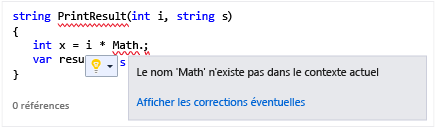
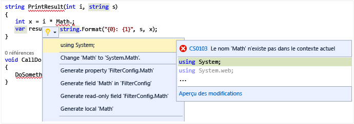

# <a name="quick-actions"></a>Actions rapides

Les [actions rapides](refactoring-code-generation-quick-actions.md#quick-actions) vous permettent de refactoriser, générer ou modifier facilement le code en une seule action.  Bien qu’il existe de nombreuses actions rapides qui s’appliquent spécifiquement à C# ou Visual Basic, il en existe également d’autres qui s’appliquent à la fois aux projets C# et Visual Basic.  Elles peuvent être appliquées en utilisant l’icône d’ampoule  ou en appuyant sur **Ctrl+.** quand votre curseur se trouve sur la ligne de code appropriée.

Une ampoule apparaît si votre code est souligné d’une ligne ondulée rouge et qu’une suggestion pour résoudre le problème est disponible dans Visual Studio. Par exemple, si une erreur est signalée par un soulignement rouge ondulé, une ampoule apparaît lorsque des corrections sont disponibles pour cette erreur. Des éditeurs tiers peuvent fournir des diagnostics et des suggestions personnalisés pour n'importe quel langage, par exemple dans le cadre d'un SDK. Dans ce cas, les ampoules Visual Studio s'allument en fonction des règles établies.  

### <a name="to-see-a-light-bulb"></a>Pour afficher une ampoule  

1. Dans de nombreux cas, les ampoules apparaissent spontanément lorsque vous passez la souris au niveau de l’erreur ou dans la marge gauche de l’éditeur lorsque vous déplacez le point d’insertion dans une ligne qui contient une erreur. Si vous remarquez une ligne ondulée rouge, vous pouvez pointer dessus avec la souris pour afficher l'ampoule. Vous pouvez aussi déclencher l'apparition d'une ampoule quand vous utilisez la souris ou le clavier pour vous rendre quelque part sur la ligne où le problème se produit.  

2. Appuyez sur **Ctrl + .** sur une ligne pour appeler l’ampoule et accéder directement à la liste des corrections éventuelles.  

     

### <a name="to-see-potential-fixes"></a>Pour afficher les corrections éventuelles  
Cliquez sur la flèche bas ou sur le lien Afficher les corrections éventuelles pour afficher une liste d'actions rapides que l'ampoule peut effectuer pour vous.  



## <a name="common-quick-actions"></a>Actions rapides courantes
Voici quelques-unes des actions rapides courantes qui sont applicables à la fois au code C# et Visual Basic.

### <a name="add-missing-casesdefault-caseboth"></a>Ajouter les instructions case manquantes/une instruction case par défaut/les deux
Quand vous créez une instruction `switch` en C# ou une instruction `Select Case` en Visual Basic, vous pouvez utiliser une action de code pour ajouter automatiquement des éléments case manquants, une instruction case par défaut, ou les deux.  Pour une instruction vide telle que la suivante :

```CSharp
enum MyEnum
{
    Item1,
    Item2,
    Item3
}

...

MyEnum myEnum = MyEnum.Item1;

switch(myEnum)
{
}
```

```VB
Enum MyEnum
    Item1
    Item2
    Item3
End Enum

...

Dim myEnum as MyEnum = MyEnum.Item1

Select Case myEnum
End Select
```

En utilisant l’action rapide **Ajouter les deux** pour renseigner à la fois les instructions case manquantes et une instruction case par défaut, vous créez l’instruction suivante :

```CSharp
switch(myEnum)
{
    case MyEnum.Item1:
        break;
    case MyEnum.Item2:
        break;
    case MyEnum.Item3:
        break;
    default:
        break;
}
```

```VB
Select Case myEnum
    Case MyEnum.Item1
        Exit Select
    Case MyEnum.Item2
        Exit Select
    Case Else
        Exit Select
End Select
```

### <a name="correct-misspelled-type"></a>Corriger le type mal orthographié
Si vous orthographiez involontairement de façon incorrecte un type dans Visual Studio, cette action rapide le corrige automatiquement pour vous.  Ces éléments s’affichent dans le menu Ampoule comme **Change '*misspelled type*' to '*correct type*'** (Remplacer type mal orthographié par type correct).  Exemple :

```CSharp
// Before
private viod MyMethod()
{
}

// Change 'viod' to 'void'

// After
private void MyMethod()
{
}
```

```VB
' Before
Function MyFunction as Intger
End Function

' Change 'Intger' to 'Integer'

' After
Function MyFunction as Integer
End Function
```

### <a name="remove-unnecessary-cast"></a>Supprimer le cast inutile
Si vous effectuez le cast d’un type en un autre type qui ne nécessite pas un cast, l’élément d’action rapide **Supprimer le cast inutile** supprime le cast de votre code.

```CSharp
// before
int number = (int)3;

// Remove Unnecessary Cast

// after
int number = 3;
```

```VB
' Before
Dim number as Integer = CType(3, Integer)

' Remove Unnecessary Cast

' After
Dim number as Integer = 3
```

### <a name="replace-method-with-property--replace-property-with-method"></a>Remplacer une méthode par une propriété / Remplacer une propriété par une méthode
Ces actions rapides convertissent une méthode en une propriété, ou vice versa.  L’exemple ci-dessous illustre le changement d’une méthode en une propriété.  Pour la procédure opposée, inversez simplement les sections *Avant* et *Après*.

```CSharp
private int MyValue;

// Before
public int GetMyValue()
{
    return MyValue;
}

// Replace 'GetMyValue' with property

// After
public int MyValue
{
    get { return MyValue; }
}
```

```VB
Dim MyValue As Integer

' Before
Function GetMyValue() As Integer
    Return MyValue
End Function

' Replace 'GetMyValue' with property

' After
ReadOnly Property MyValue As Integer
    Get
        Return MyValue
    End Get
End Property
```

### <a name="make-method-synchronous"></a>Rendre la méthode synchrone
Lors de l’utilisation du mot clé `async`/`Async` sur une méthode, il est prévu que le mot clé `await`/`Await` sera également utilisé quelque part dans cette méthode.  Toutefois, si ce n’est pas le cas, une action rapide s’affiche pour vous permettre de rendre la méthode synchrone en supprimant le mot clé `async`/`Async` et en modifiant le type de retour.  Utilisez l’option **Rendre la méthode synchrone** dans le menu Actions rapides.

```CSharp
// Before
async Task<int> MyAsyncMethod()
{
    return 3;
}

// Make method synchronous

// After
int MyAsyncMethod()
{
    return 3;
}
```

```VB
' Before
Async Function MyAsyncMethod() As Task(Of Integer)
    Return 3
End Function

' Make method synchronous

' After
Function MyAsyncMethod() As Integer
    Return 3
End Function
```

### <a name="make-method-asynchronous"></a>Rendre la méthode asynchrone
Lors de l’utilisation du mot clé `await`/`Await` dans une méthode, il est prévu que la méthode elle-même soit marquée avec le mot clé `async`/`Async`.  Toutefois, si ce n’est pas le cas, une action rapide s’affiche pour vous permettre de rendre la méthode asynchrone.  Utilisez l’option **Make method/Function asynchronous** (Rendre la méthode/fonction asynchrone) dans le menu Actions rapides.

```CSharp
// Before
int MyAsyncMethod()
{
    return await Task.Run(...);
}

// Make method synchronous

// After
async Task<int> MyAsyncMethod()
{
    return await Task.Run(...);
}
```

```VB
' Before
Function MyAsyncMethod() as Integer
    Return  Await Task.Run(...)
End Function

' Make method synchronous

' After
Async Function MyAsyncMethod() As Task(Of Integer)
    Return Await Task.Run(...)
End Function
```

### <a name="remove-unnecesary-usingsimports"></a>Supprimer les Usings inutiles/les importations superflues
L’action rapide **Supprimer les Usings inutiles/les importations superflues** supprime toutes les instructions `using` et `Import` inutilisées pour le fichier actif.  Quand vous sélectionnez cet élément, les importations d’espaces de noms inutilisées sont immédiatement supprimées.

### <a name="add-usingsimports-for-types-in-reference-assemblies-nuget-packages-or-other-types-in-your-solution"></a>Ajouter des instructions using/Import pour les types dans les assemblys de référence, les packages NuGet ou d’autres types de votre solution
L’utilisation de types situés dans d’autres projets de votre solution permet d’afficher automatiquement l’action rapide, mais vous devez activer les autres à partir de l’onglet **Outils > Options > C#** ou **De base > Avancé** :  

* Suggérer des usings/imports pour les types dans les assemblys de référence
* Suggérer des usings/imports pour les types dans les packages NuGet

Quand ces options sont activées, si vous utilisez un type dans un espace de noms qui n’est pas importé, mais existe dans un assembly de référence ou un package NuGet, l’instruction using/import est créée.

```CSharp
// Before
Debug.WriteLine("Hello");

// using System.Diagnostics;

// After
using System.Diagnostics;

Debug.WriteLine("Hello");
```

```VB
' Before
Debug.WriteLine("Hello")

' Imports System.Diagnostics

// After
Imports System.Diagnostics

Debug.WriteLine("Hello")
```

### <a name="convert-to-interpolated-string"></a>Convertir en chaîne interpolée
Les [chaînes interpolées](/dotnet/csharp/language-reference/keywords/interpolated-strings) représentent un moyen simple d’exprimer des chaînes avec des variables incorporées, similaire à la méthode **[String.Format](https://msdn.microsoft.com/library/system.string.format.aspx)**.  Cette action rapide reconnaît les chaînes concaténées ou l’utilisation de **String.Format** et met une chaîne interpolée à la place.

```CSharp
// Before
int num = 3;
string s = string.Format("My string with {0} in the middle", num);

// Convert to interpolated string

// After
int num = 3;
string s = $"My string with {num} in the middle";
```

```VB
' Before
Dim num as Integer = 3
Dim s as String = String.Format("My string with {0} in the middle", num)

' Convert to interpolated string

' After
Dim num as Integer = 3
Dim s As String = $"My string with {num} in the middle"
```

### <a name="remove-merge-conflict-markers"></a>Supprimer les marqueurs de conflits de fusion
Ces actions rapides vous permettent de résoudre les conflits de fusion par une « modification » qui supprime les marqueurs et le code en conflit. (Disponible uniquement dans Visual Studio 2017 [version 15.3, préversion].)


### <a name="add-null-checks-for-parameters"></a>Ajouter des contrôles de valeurs Null pour les paramètres
Cette action rapide vous permet d’ajouter un contrôle dans votre code pour déterminer si un paramètre est Null. (Disponible uniquement dans Visual Studio 2017 [version 15.3, préversion].)


### <a name="constructor-generator-improvements"></a>Améliorations du générateur de constructeur
Quand vous créez un constructeur, cette action rapide vous permet de sélectionner les propriétés ou les champs à générer, ou vous pouvez générer le constructeur à partir d’un corps vide. Vous pouvez également l’utiliser pour ajouter des paramètres à un constructeur existant à partir du site d’appel. (Disponible uniquement dans Visual Studio 2017 [version 15.3, préversion].)


### <a name="remove-unused-variables"></a>Supprimer les variables inutilisées
Cette action rapide vous permet de supprimer les variables qui ont été déclarées, mais jamais utilisées dans votre code. (Disponible uniquement dans Visual Studio 2017 [version 15.3, préversion].)


### <a name="generate-overrides"></a>Générer des substitutions
Cette action rapide vous permet de créer une substitution à partir d’une ligne vide dans une classe ou structure. La boîte de dialogue **Pick Members** (Choisir les membres) vous permet de choisir les membres à substituer. (Disponible uniquement dans Visual Studio 2017 [version 15.3, préversion].)


### <a name="change-base-for-numeric-literals"></a>Changer la base des littéraux numériques
Cette action rapide vous permet de convertir un littéral numérique d’un système numérique de base en un autre. Par exemple, vous pouvez convertir un nombre en un format hexadécimal ou binaire. (Disponible uniquement dans Visual Studio 2017 [version 15.3, préversion].)


### <a name="insert-digit-separators-into-literals"></a>Insérer des séparateurs numériques dans les littéraux
Cette action rapide vous permet d’ajouter des caractères de séparation aux valeurs littérales. (Disponible uniquement dans Visual Studio 2017 [version 15.3, préversion].)


### <a name="convert-if-construct-to-switch"></a>Convertir une construction **if** en **switch**
Cette action rapide vous permet de convertir une construction **if-then-else** en construction **switch**. (Disponible uniquement dans Visual Studio 2017 [version 15.3, préversion].)

```CSharp
// Before
if (obj is string s)
{
  Console.WriteLine("obj is a string: " + s);  
}

else if (obj is int i && i > 10)
{
  Console.WriteLine("obj is an int greater than 10");
}

// Convert to switch

// After
switch (obj)
{
  case string s:
    Console.WriteLine("Obj is a string: " + s);
    break;
  case int i when i > 10:
    Console.WriteLine("obj is an int greater than 10");
    break;
}
```

```VB
' Before
If TypeOf obj Is String s Then
    Console.WriteLine("obj is a string: " + s)
Else If TypeOf obj Is Integer i And i > 10 Then
    Console.WriteLine("obj is an int greater than 10")
End If

' Convert to switch

' After
Select Case obj
  Case String s
    Console.WriteLine("Obj is a string: " + s)
    Exit Sub
  Case Integer i when i > 10
    Console.WriteLine("obj is an int greater than 10")
    Exit Sub
End Select
```

# <a name="see-also"></a>Voir aussi
* [Styles de code et actions rapides](code-styles-and-quick-actions.md)

