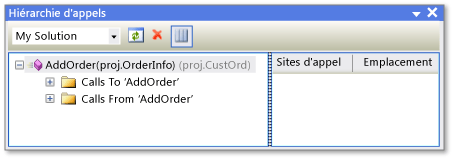

# Hi&#233;rarchie d&#39;appels
[!INCLUDE[vs2017banner](../../code-quality/includes/vs2017banner.md)]

La hiérarchie d'appels vous permet de parcourir votre code en affichant tous les appels à destination et en provenance d'une méthode, d'une propriété, ou d'un constructeur sélectionné.  Cela vous permet de mieux comprendre le flux de code et d'évaluer les effets des modifications à coder.  Vous pouvez examiner plusieurs niveaux de code pour voir les chaînes complexes d'appels de méthodes et les points d'entrée supplémentaires dans le code, ce qui vous permet d'explorer toutes les voies d'exécution possibles.  
  
 La hiérarchie d'appels est disponible au moment du design, contrairement à la pile des appels qui est affichée par le débogueur.  
  
## Utilisation de la hiérarchie d'appels  
 Pour afficher la fenêtre **Hiérarchie d'appels**, cliquez avec le bouton droit sur le nom d'un appel de méthode, de propriété ou de constructeur, puis cliquez sur **Afficher la hiérarchie d'appels**.  
  
 Le nom de membre s'affiche dans un volet d'arborescence dans la fenêtre **Hiérarchie d'appels**.  Si vous développez le nœud correspondant au membre, les sous\-nœuds **Appels à** *nom de membre* et **Appels de** *nom de membre* apparaissent.  L'illustration suivante montre ces nœuds dans la fenêtre **Hiérarchie d'appels**.  
  
   
Fenêtre Hiérarchie d'appels  
  
-   Si vous développez le nœud **Appels à**, tous les membres qui appellent le membre sélectionné sont affichés.  
  
-   Si vous développez le nœud **Appels de**, tous les membres qui sont appelés par le membre sélectionné sont affichés.  
  
 Vous pouvez ensuite développer chacun des membres de ces sous\-nœuds en nœuds **Appels à** et **Appels de**.  Cela vous permet de naviguer dans la pile des appelants, comme indiqué dans l'illustration suivante.  
  
   
Fenêtre Hiérarchie d'appels  
  
 Pour les membres définis en tant que membres virtuels ou abstraits, un nœud **Remplace 'nom de méthode'** apparaît.  Pour les membres d'interface, un nœud **Implémente 'nom de méthode'** apparaît.  Ces nœuds susceptibles d'être développés apparaissent au même niveau que les nœuds **Appels à** et **Appels de**.  
  
 La zone **Étendue de recherche** de la barre d'outils contient des choix pour **Ma solution**, **Projet actif** et **Document actif**.  
  
 Lorsque vous sélectionnez un membre enfant dans le volet d'arborescence **Hiérarchie d'appels** :  
  
-   Le volet des détails **Hiérarchie d'appels** affiche toutes les lignes de code dans lesquelles ce membre enfant est appelé à partir du membre parent.  
  
-   **Fenêtre Définition de code**, si elle est ouverte, affiche le code du membre sélectionné.  Cette fenêtre est disponible dans c\# et C\+\+.  Pour plus d'informations sur cette fenêtre, consultez [Affichage de la structure du code](../../ide/viewing-the-structure-of-code.md).  
  
> [!NOTE]
>  La hiérarchie d'appels ne trouve pas les références au groupe de méthodes, qui incluent les emplacements auxquels une méthode est ajoutée en tant que gestionnaire d'événements ou est assignée à un délégué.  Pour rechercher toutes les références à une méthode, vous pouvez utiliser la commande **Rechercher toutes les références**.  
  
## Éléments de menu contextuel  
 Le tableau suivant décrit plusieurs options de menu contextuel qui sont disponibles lorsque vous cliquez avec le bouton droit sur un nœud dans le volet d'arborescence.  
  
|Élément de menu contextuel|Description|  
|--------------------------------|-----------------|  
|**Ajouter comme nouvelle racine**|Ajoute le nœud sélectionné au volet d'arborescence en tant que nouveau nœud racine.  Cela vous permet de concentrer votre attention sur une sous\-arborescence spécifique.|  
|**Supprimer racine**|Supprime le nœud racine sélectionné du volet d'arborescence.  Cette option est disponible uniquement à partir d'un nœud racine.   Vous pouvez également utiliser le bouton de barre d'outils **Supprimer racine** pour supprimer le nœud racine sélectionné.|  
|**Atteindre la définition**|Exécute la commande Atteindre la définition sur le nœud sélectionné.  Cela permet de naviguer jusqu'à la définition d'origine pour un appel de membre ou une définition de variable.   Pour exécuter la commande Atteindre la définition, vous pouvez également double\-cliquer sur le nœud sélectionné ou appuyer sur F12.|  
|**Rechercher toutes les références**|Exécute la commande Rechercher toutes les références sur le nœud sélectionné.  Cela permet de rechercher toutes les lignes de code de votre projet qui référencent une classe ou un membre.   Vous pouvez également utiliser MAJ\+F12 pour exécuter la commande Rechercher toutes les références sur le nœud sélectionné.|  
|**Copier**|Copie le contenu du nœud sélectionné \(mais pas ses sous\-nœuds\).|  
|**Actualiser**|Réduit le nœud sélectionné afin qu'il puisse être redéveloppé pour afficher des informations actualisées.|