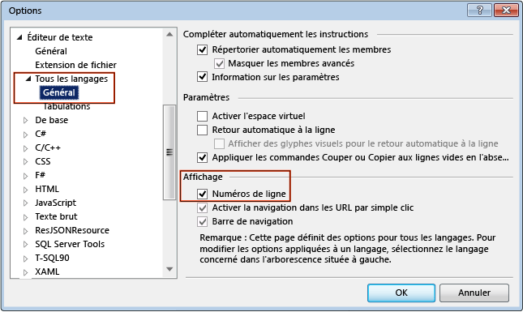

# Procédure : Afficher les numéros de ligne dans l’Éditeur

Vous pouvez afficher ou masquer la numérotation des lignes dans votre code.

## Afficher les numéros de ligne dans le code

Les numéros de ligne ne s'ajoutent pas à votre code ; ils ne sont là qu'à titre de référence. Si vous voulez imprimer les numéros de ligne, dans la boîte de dialogue **Imprimer**, cochez la case **Inclure les numéros de ligne**.

### Pour afficher les numéros de ligne dans le code

1.  Dans la barre de menus, sélectionnez **Outils**, **Options**. Développez le nœud **Éditeur de texte**, puis sélectionnez le nœud du langage que vous utilisez ou **Tous les langages** pour activer les numéros de ligne dans tous les langages. Vous pouvez également taper le **numéro de ligne** dans la zone **Lancement rapide**.

2.  Cochez la case **Numéros de ligne**.

    

> [!NOTE]
> Selon votre langage ou vos paramètres, vous devez peut-être cocher la case **Afficher tous les paramètres** dans la boîte de dialogue **Options** pour afficher le sous-nœud **Tous les langages**.

## Voir aussi

- [Personnalisation de l’éditeur](../../ide/customizing-the-editor.md)
- [Éditeur de texte, boîte de dialogue Options](../../ide/reference/text-editor-options-dialog-box.md)
- [Fonctionnalités de l’éditeur de code](../../ide/writing-code-in-the-code-and-text-editor.md)