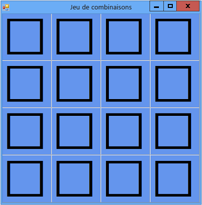

# Étape 1 : créer un projet et ajouter une table à votre formulaire
La première étape pour créer un jeu de combinaisons consiste à créer le projet et à ajouter une table à votre formulaire. La table permet d'aligner les icônes dans une grille 4x4, de façon ordonnée. Vous définissez également plusieurs propriétés pour améliorer l'apparence de la grille de jeu.

## Pour créer un projet et ajouter une table à votre formulaire

1.  Dans la barre de menus, choisissez **Fichier** > **Nouveau** > **Projet**.

2.  Si vous n’utilisez pas Visual Studio Express, vous devez d’abord sélectionner un langage de programmation. Dans la liste **Modèles installés**, choisissez **Visual C#** ou **Visual Basic**.

3.  Dans la liste des modèles de projet, choisissez **Application Windows Forms**, nommez le projet **JeuCombinaisons**, puis choisissez le bouton **OK**.

4.  Dans la fenêtre **Propriétés**, définissez les propriétés de formulaire ci-dessous.

    1.  Modifiez la propriété **Text** du formulaire en remplaçant **Form1** par **Matching Game** (Jeu de combinaisons). Ce texte s'affiche en haut de la fenêtre du jeu.

    2.  Définissez la taille du formulaire en spécifiant une largeur de 550 pixels et une hauteur de 550 pixels. Pour cela, vous pouvez définir la propriété **Size** sur **550, 550** ou faire glisser l’angle du formulaire jusqu’à ce que vous voyiez la taille appropriée dans le coin inférieur droit de l’environnement de développement intégré (IDE).

5.  Affichez la boîte à outils en choisissant l’onglet **Boîte à outils** à gauche de l’environnement IDE.

6.  Faites glisser un contrôle <xref:System.Windows.Forms.TableLayoutPanel> de la catégorie **Conteneurs** dans la boîte à outils, puis définissez les propriétés suivantes pour celle-ci.

    1.  Affectez la valeur **CornflowerBlue** à la propriété **BackColor**. Pour ce faire, ouvrez la boîte de dialogue **BackColor** en choisissant la flèche déroulante en regard de la propriété **BackColor** dans la fenêtre **Propriétés**.  Ensuite, choisissez l’onglet **Web** dans la boîte de dialogue **BackColor** pour afficher la liste des couleurs disponibles.

        > [!NOTE]
        >  Les couleurs ne sont pas dans l'ordre alphabétique et **CornflowerBlue** se trouve en bas de la liste.

    2.  Affectez la valeur **Fill** à la propriété **Dock** en choisissant le bouton de liste déroulante en regard de la propriété, puis le grand bouton central. Ceci permet d'étendre la table afin qu'elle couvre le formulaire entier.

    3.  Affectez la valeur **Inset** à la propriété **CellBorderStyle**. Cela place des bordures visuelles entre toutes les cellules de la grille de jeu.

    4.  Choisissez le bouton triangulaire dans le coin supérieur droit du TableLayoutPanel pour afficher son menu de tâches.

    5.  Dans la barre des tâches, choisissez deux fois **Ajouter une ligne** pour ajouter deux lignes supplémentaires, puis choisissez deux fois **Ajouter une colonne** pour ajouter deux colonnes supplémentaires.

    6.  Dans la barre des tâches, choisissez **Modifier les lignes et les colonnes** pour afficher la fenêtre **Styles de ligne et de colonne**. Choisissez chacune des colonnes, choisissez la case d’option **Pour cent**, puis affectez à chaque colonne une largeur égale à 25 % de la largeur totale. Sélectionnez ensuite **Lignes** dans la zone de liste déroulante en haut de la fenêtre et affectez une hauteur de 25 pour cent à chaque ligne. Une fois terminé, choisissez le bouton **OK**.

     Votre TableLayoutPanel doit désormais correspondre à une grille 4x4 de seize cellules carrées de même taille. Les images des icônes apparaîtront ultérieurement dans ces lignes et colonnes.

7.  Vérifiez que le TableLayoutPanel est sélectionné dans l'éditeur de formulaires. Si c’est le cas, vous devez voir **tableLayoutPanel1** en haut de la fenêtre **Propriétés**. S’il n’est pas sélectionné, choisissez TableLayoutPanel sur le formulaire ou dans le contrôle de liste déroulante en haut de la fenêtre **Propriétés**.

     Lorsque le TableLayoutPanel est sélectionné, ouvrez la boîte à outils et ajoutez un contrôle <xref:System.Windows.Forms.Label> (situé dans la catégorie **Contrôles communs**) dans la cellule supérieure gauche du TableLayoutPanel. Le contrôle d’étiquette doit maintenant être sélectionné dans l'IDE. Définissez les propriétés ci-dessous pour ce contrôle.

    1.  Veillez à ce que la propriété **BackColor** du contrôle Label ait la valeur **CornflowerBlue**.

    2.  Affectez à la propriété **AutoSize** la valeur **False**.

    3.  Affectez la valeur **Fill** à la propriété **Dock**.

    4.  Affectez la valeur **MiddleCenter** à la propriété **TextAlign** en choisissant le bouton de liste déroulante en regard de la propriété, puis le bouton central. Cela garantit l'affichage de l'icône au milieu de la cellule.

    5.  Choisissez la propriété **Font**. Un bouton de sélection (**…**) doit s’afficher.

    6.  Choisissez le bouton de sélection et affectez la valeur **Webdings** à la propriété **Font**, la valeur **Bold** à **Font Style** et la valeur **72** à **Size**.

    7.  Affectez la lettre **c** à la propriété **Text** du contrôle Label.

         La cellule supérieure gauche dans le TableLayoutPanel doit désormais contenir un cadre noir centré sur un arrière-plan bleu.

        > [!NOTE]
        >  La police Webdings est une police d'icônes fournie avec le système d'exploitation Windows. Dans votre jeu de combinaisons, cette police vous permet d'afficher les icônes que le joueur doit associer par paires. Au lieu de mettre **c** dans la propriété **Text**, essayez d’entrer des lettres différentes pour voir quelles icônes sont affichées. Un point d'exclamation est une araignée, un N majuscule est un œil et une virgule un piment rouge.

8.  Choisissez le contrôle d’étiquette et copiez-le dans la cellule suivante du TableLayoutPanel. (Appuyez sur **Ctrl**+**C** ou, dans la barre de menus, choisissez **Modification** > **Copier**.) Ensuite, collez-le. (Appuyez sur **Ctrl**+**V** ou, dans la barre de menus, choisissez **Modification** > **Coller**.) Une copie de la première étiquette apparaît dans la deuxième cellule du TableLayoutPanel. Collez-le à nouveau, et une autre étiquette s'affiche dans la troisième cellule. Continuez à coller des contrôles d’étiquette jusqu'à ce que toutes les cellules soient remplies.

    > [!NOTE]
    >  Si vous effectuez un trop grand nombre de collages, l'IDE ajoute une nouvelle ligne au TableLayoutPanel pour fournir la place nécessaire à l'ajout de votre nouveau contrôle d’étiquette. Vous pouvez l'annuler. Pour supprimer la nouvelle cellule, appuyez sur **Ctrl**+**Z** ou, dans la barre de menus, choisissez **Modification** > **Annuler**.

     Votre formulaire est maintenant mis en forme. Il doit ressembler à l'image ci-dessous.

      Formulaire de jeu de combinaisons initial

## Pour continuer ou examiner

-   Pour passer à l’étape suivante du tutoriel, consultez [Étape 2 : ajouter un objet aléatoire et une liste d’icônes](../ide/step-2-add-a-random-object-and-a-list-of-icons.md).

-   Pour revenir à la rubrique de présentation, consultez [Tutoriel 3 : Créer un jeu de combinaisons](../ide/tutorial-3-create-a-matching-game.md).
