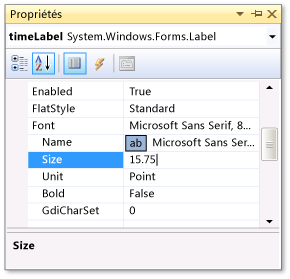
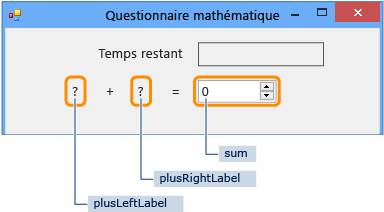
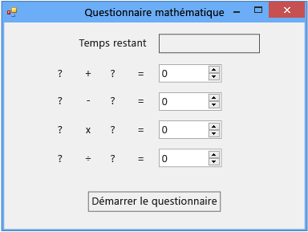

# Étape 1 : Créer un projet et ajouter des étiquettes à votre formulaire

Les premières étapes du développement de ce questionnaire consistent à créer le projet, puis à ajouter des étiquettes, un bouton et d'autres contrôles à un formulaire. Vous devez également définir des propriétés pour chaque contrôle que vous ajoutez. Le projet contiendra le formulaire, les contrôles et, ultérieurement dans le didacticiel, du code. Le bouton démarre le questionnaire, les étiquettes affichent les problèmes à résoudre et les autres contrôles montrent les réponses aux problèmes et le temps restant pour terminer le questionnaire.

> [!NOTE]
> Cette rubrique fait partie d'une série de didacticiels sur les concepts de codage de base. Pour obtenir une vue d’ensemble du didacticiel, consultez [didacticiel 2 : créer un questionnaire mathématique chronométré](../ide/tutorial-2-create-a-timed-math-quiz.md).

## Pour créer un projet pour un formulaire

::: moniker range="vs-2017"

1. Dans la barre de menus, choisissez **fichier** > **nouveau** > **projet**.

1. Choisissez **Visual C#** ou **Visual Basic** dans la partie gauche de la boîte de dialogue **Nouveau projet**, puis, choisissez **Windows Desktop**.

1. Dans la liste des modèles, choisissez le modèle **Application Windows Forms (.NET Framework)**, nommez-le *MathQuiz*, puis choisissez le bouton **OK**.

    Un formulaire nommé *Form1.cs* ou *Form1.vb* apparaît, selon le langage de programmation que vous avez choisi.

   > [!NOTE]
   > Si vous ne voyez pas le modèle **Application Windows Forms (.NET Framework)**, utilisez Visual Studio Installer pour installer la charge de travail **Développement .NET Desktop**.     Pour plus d’informations, consultez la page [Installer Visual Studio](../install/install-visual-studio.md).

::: moniker-end

::: moniker range=">=vs-2019"

1. Dans la fenêtre Démarrer, choisissez **créer un nouveau projet**.

   

1. Dans la fenêtre **Créer un projet**, entrez ou tapez *Windows Forms* dans la zone de recherche. Ensuite, choisissez **Bureau** dans la liste **type de projet** .

   Après avoir appliqué le filtre de **type de projet** , choisissez le modèle d' **application Windows Forms (.NET Framework)** pour C# ou Visual Basic, puis choisissez **suivant**.

   

   > [!NOTE]
   > Si vous ne voyez pas le modèle **Windows Forms (.NET Framework)**, vous pouvez l’installer à partir de la fenêtre **Créer un projet**. Dans le **Vous ne trouvez pas ce que vous cherchez ?**, choisissez le lien **Installer plus d’outils et de fonctionnalités**.
   >
   > 
   >
   > Ensuite, dans Visual Studio Installer, choisissez la charge de travail **Développement .NET Desktop**.
   >
   > 
   >
   > Après cela, choisissez le bouton **Modifier** dans Visual Studio Installer. Vous pouvez être invité à enregistrer votre travail ; le cas échéant, faites-le. Ensuite, choisissez **Continuer** pour installer la charge de travail.

1. Dans la fenêtre **Configurer votre nouveau projet**, saisissez ou entrez *MathQuiz* dans la boîte **Nom du projet**. Ensuite, choisissez **créer**.

::: moniker-end

## Pour définir les propriétés d’un formulaire

1. Dans Visual Studio, choisissez le formulaire (*Form1.cs* ou *Form1.vb*, selon le langage de programmation), puis modifiez la propriété de son **Texte** par **Questionnaire mathématique**.

     La fenêtre **Propriétés** contient les propriétés du formulaire.

1. Modifiez la taille du formulaire en spécifiant une largeur de 500 pixels et une hauteur de 400 pixels.

     Vous pouvez redimensionner le formulaire en faisant glisser ses bords jusqu'à ce que la taille correcte apparaisse dans l'angle inférieur gauche de l'environnement de développement intégré (IDE). Vous pouvez également modifier les valeurs de la propriété **Size**.

1. Remplacez la valeur de la propriété **FormBorderStyle** par **Fixed3D** et affectez à la propriété **MaximizeBox** la valeur **False**.

     Ces valeurs empêchent les personnes interrogées de redimensionner le formulaire.

## Pour créer la zone de temps restant

1. Ajoutez un contrôle <xref:System.Windows.Forms.Label> à partir de la **boîte à outils**, puis attribuez à sa propriété **(Name)** la valeur **timeLabel**.

     Ce contrôle Label deviendra une zone dans l'angle supérieur droit. Elle indiquera le nombre de secondes restantes dans le questionnaire.

2. Remplacez la valeur de la propriété **AutoSize** par **False** pour pouvoir redimensionner la zone.

3. Remplacez la valeur de la propriété **BorderStyle** par **FixedSingle** pour dessiner une ligne autour de la zone.

4. Affectez à la propriété **Size** la valeur **200, 30**.

5. Déplacez le contrôle Label vers l'angle supérieur droit du formulaire. Des lignes d'espacement bleues y apparaîtront.

     Ces lignes vous aideront à aligner des contrôles dans le formulaire.

6. Dans la fenêtre **Propriétés** , choisissez la propriété **Text** , puis appuyez sur la touche **retour arrière** pour effacer sa valeur.

7. Choisissez le signe plus ( **+** ) en regard de la propriété **font** , puis remplacez la valeur de la propriété **Size** par **15,75**.

     Vous pouvez modifier plusieurs propriétés de police, comme le montre la capture d’écran suivante.

     

8. Ajoutez un autre contrôle Label à partir de la **boîte à outils**, puis définissez sa taille de police sur **15,75**.

9. Affectez la valeur **Temps restant** à la propriété **Text**.

10. Placez le contrôle Label de façon à l’aligner juste à gauche du contrôle Label **timeLabel**.

### Pour ajouter des contrôles pour les problèmes d'addition

1. Ajoutez un contrôle Label à partir de la **boîte à outils**, puis affectez à sa propriété **Text** la valeur **?** (point d’interrogation).

2. Affectez à la propriété **AutoSize** la valeur **False**.

3. Affectez à la propriété **Size** la valeur **60, 50**.

4. Affectez la valeur **18** à la taille de police.

5. Affectez à la propriété **TextAlign** la valeur **MiddleCenter**.

6. Affectez à la propriété **Location** la valeur **50, 75** pour positionner le contrôle dans le formulaire.

7. Affectez à la propriété **(Name)** la valeur **plusLeftLabel**.

8. Choisissez l’étiquette **plusLeftLabel** , puis choisissez **CTRL** + **C** ou **copier** dans le menu **Edition** .

9. Collez l’étiquette trois fois en cliquant sur les touches **CTRL** + **V** ou sur **coller** dans le menu **Edition** .

10. Disposez les trois nouveaux contrôles Label en ligne à droite du contrôle Label **plusLeftLabel**.

     Vous pouvez utiliser les lignes d'espacement pour définir l'écartement et les aligner.

11. Affectez à la propriété **Text** du deuxième contrôle Label la valeur **+** (signe plus).

12. Affectez à la propriété **(Name)** du troisième contrôle Label la valeur **plusRightLabel**.

13. Affectez à la propriété **Text** du quatrième contrôle Label la valeur **=** (signe égal).

14. Ajoutez un contrôle <xref:System.Windows.Forms.NumericUpDown> à partir de la **boîte à outils**, puis affectez-lui une taille de police de **18** et une largeur de **100**.

     Vous en apprendrez davantage sur ce type de contrôle ultérieurement.

15. Alignez le contrôle NumericUpDown sur les contrôles d’étiquettes du problème d’addition.

16. Modifiez la propriété **(Name)** du contrôle NumericUpDown en lui affectant la valeur **sum** (somme).

     Vous avez créé la première ligne, comme indiqué dans l’illustration suivante.

     

## Pour ajouter des contrôles pour les problèmes de soustraction, multiplication et division

1. Copiez les cinq contrôles du problème d'addition (autrement dit, les quatre contrôles Label et le contrôle NumericUpDown), puis collez-les.

     Le formulaire contient cinq nouveaux contrôles, encore sélectionnés.

2. Positionnez tous les contrôles en les alignant sous les contrôles d'addition.

     Vous pouvez utiliser les lignes d'espacement pour laisser suffisamment d'espace entre les deux lignes.

3. Modifiez la propriété **Text** du deuxième contrôle Label en lui affectant la valeur **-** (signe moins).

4. Nommez le premier contrôle Label point d’interrogation **minusLeftLabel**.

5. Nommez le second contrôle Label point d’interrogation **minusRightLabel**.

6. Nommez le contrôle NumericUpDown **difference**.

7. Collez les cinq contrôles deux fois de plus.

8. Pour la troisième ligne, nommez le premier contrôle Label **timesLeftLabel**, remplacez la valeur de la propriété **Text** du deuxième contrôle Label par **×** (signe de multiplication), nommez le troisième contrôle Label **timesRightLabel** et nommez le contrôle NumericUpDown **product** (produit).

9. Pour la quatrième ligne, nommez le premier contrôle Label **dividedLeftLabel**, remplacez la valeur de la propriété **Text** du deuxième contrôle Label par **÷** (symbole de division), nommez le troisième contrôle Label **dividedRightLabel** et nommez le contrôle NumericUpDown **quotient**.

    > [!NOTE]
    > Vous pouvez copier les signes de multiplication (×) et de division (÷) indiqués dans ce didacticiel pour les coller dans le formulaire.

## Pour ajouter un bouton de démarrage et définir l'ordre des index de tabulation

1. Ajoutez un contrôle <xref:System.Windows.Forms.Button> à partir de la **boîte à outils**, puis affectez à sa propriété **(Name)** la valeur **startButton**.

2. Affectez la valeur **Démarrer le questionnaire** à la propriété **Text**.

3. Affectez la valeur **14** à la taille de police.

4. Affectez la valeur **True** à la propriété **AutoSize**, ce qui permet de redimensionner automatiquement le bouton à une taille adaptée au texte.

5. Centrez le bouton vers le bas du formulaire.

6. Affectez à la propriété **TabIndex** du contrôle **startButton** la valeur **1**.

    > [!NOTE]
    > La propriété **TabIndex** définit l’ordre des contrôles lorsque le preneur de quiz choisit la touche **Tab** . Pour voir comment cela fonctionne, ouvrez une boîte de dialogue (par exemple, dans la barre de menus, choisissez **fichier**  >  **ouvrir**), puis appuyez plusieurs fois sur la touche **Tab** . Regardez comment votre curseur passe d’un contrôle à l’autre chaque fois que vous choisissez la touche **Tab** . Un programmeur a choisi l'ordre en créant le formulaire.

7. Affectez à la propriété **TabIndex** du contrôle NumericUpDown de somme la valeur **2**, à celle du contrôle de différence la valeur **3**, à celle du contrôle de produit la valeur **4** et à celle du contrôle quotient la valeur **5**.

     Le formulaire doit ressembler à la capture d’écran suivante.

     

8. Pour vérifier si la propriété **TabIndex** fonctionne comme prévu, enregistrez et exécutez le programme en appuyant sur la touche **F5** ou en choisissant **Déboguer** > **Démarrer le débogage** dans la barre de menus, puis appuyez plusieurs fois sur la touche **Tab**.

## Pour continuer ou examiner

- Pour passer à l’étape suivante du didacticiel, consultez **[étape 2 : créer un problème d’addition aléatoire](../ide/step-2-create-a-random-addition-problem.md)**.

- Pour revenir à la rubrique de présentation, consultez [didacticiel 2 : créer un questionnaire mathématique chronométré](../ide/tutorial-2-create-a-timed-math-quiz.md).
