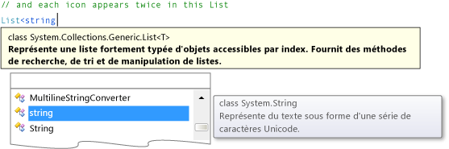

# Étape 2 : ajouter un objet aléatoire et une liste d'icônes

Dans cette étape, vous créez un ensemble de symboles correspondants pour le jeu. Chaque symbole est ajouté à deux cellules aléatoires dans le TableLayoutPanel du formulaire. Pour cela, vous devez utiliser deux instructions `new` pour créer deux objets. Le premier est un objet <xref:System.Random> identique à celui que vous avez utilisé dans le jeu du quiz mathématique. Il est utilisé dans ce code pour choisir de façon aléatoire des cellules dans le TableLayoutPanel. Le second objet, qui est peut-être nouveau pour vous, est un objet <xref:System.Collections.Generic.List%601> qui sert à stocker les symboles choisis au hasard.

## Pour ajouter un objet aléatoire et une liste d'icônes

1. Dans **Solution Explorer**, choisissez *Form1.cs* si vous utilisez C, ou *Form1.vb* si vous utilisez Visual Basic, puis sur la barre du menu, choisissez Le**code** **De vue** > . Vous pouvez aussi appuyer sur la touche **F7** ou double-cliquer sur **Form1** dans l’**Explorateur de solutions**.

     Cela affiche le module de code derrière Form1.

2. Dans le code existant, ajoutez le code suivant :

     [!code-csharp[VbExpressTutorial4Step2_3_4#1](../ide/codesnippet/CSharp/step-2-add-a-random-object-and-a-list-of-icons_1.cs)]
     [!code-vb[VbExpressTutorial4Step2_3_4#1](../ide/codesnippet/VisualBasic/step-2-add-a-random-object-and-a-list-of-icons_1.vb)]

      > [!IMPORTANT]
      > Utilisez le contrôle du langage de programmation en haut à droite de cette page pour voir l’extrait de code CMD ou l’extrait de code Visual Basic.  

      Si vous utilisez C, assurez-vous de mettre le code après l’accolade`public partial class Form1 : Form`bouclée d’ouverture et juste après la déclaration de classe ( ). Si vous utilisez Visual Basic, placez le code juste après la déclaration de classe (`Public Class Form1`).

3. Quand vous ajoutez l’objet de la liste, notez que la fenêtre **IntelliSense** s’ouvre. Ce qui suit est un exemple de C, mais un texte similaire apparaît lorsque vous ajoutez une liste dans Visual Basic.

      ***Fenêtre IntelliSense***

    > [!NOTE]
    > La fenêtre IntelliSense apparaît seulement quand vous entrez du code manuellement. Si vous effectuez un copier-coller du code, elle n'apparaît pas.

     Si vous examinez le code (et les remarques) par petites sections, vous le comprendrez plus facilement. Vos programmes peuvent utiliser des objets de liste pour effectuer le suivi de nombreux types d'éléments différents. Une liste peut contenir des nombres, des valeurs True/False, du texte ou d'autres objets. Un objet de liste peut même contenir d'autres objets de liste. Une liste est composée d’éléments et chacune d’elles ne contient qu’un seul type d’élément. Ainsi, une liste de nombres ne peut contenir que des nombres et vous ne pouvez pas y ajouter de texte. De même, vous ne pouvez pas ajouter de nombres dans une liste de valeurs true/false.

     Lorsque vous créez un objet `List` à l'aide d'une instruction `new`, vous devez spécifier le type de données que vous souhaitez y stocker. C’est la raison pour laquelle l’info-bulle en haut de la fenêtre **IntelliSense** affiche les types d’éléments figurant dans la liste. En outre, c’est `List<string>` ce que `List(Of String)` signifie (en C) et `List` (dans Visual `string` Basic) : c’est un objet qui contient des éléments de type de données. Une chaîne est utilisée par votre programme pour stocker du texte, lequel est indiqué par l’info-bulle à droite de la fenêtre **IntelliSense**.

4. Considérez pourquoi dans Visual Basic un tableau temporaire doit être créé en premier, mais en C, la liste peut être créée avec une seule instruction. C’est parce que la langue C a *initialisateurs de collection*, qui préparent la liste pour accepter les valeurs. En Visual Basic, vous pouvez utiliser un initialiseur de collection. Toutefois, nous vous recommandons d'utiliser le code précédent pour des raisons de compatibilité avec la version antérieure de Visual Basic.

     Lorsque vous utilisez un initialiseur de collection avec une instruction `new`, une fois que le nouvel objet de liste a été créé, le programme le remplit avec les données que vous avez fournies entre les accolades. Dans ce cas, vous obtenez une liste de chaînes nommées icônes, et cette liste sera initialisée de manière à contenir seize chaînes. Chacune de ces chaînes est une lettre unique, et elles correspondent toutes aux icônes qui seront dans les contrôles Label. Ainsi, le jeu comportera une paire de points d'exclamation, une paire de lettres N majuscules, une paire de virgules, etc. (Lorsque ces personnages sont réglés sur la police Webdings, ils apparaîtront comme des symboles, tels qu’un bus, un vélo, une araignée, et ainsi de suite.) Votre objet de liste aura seize cordes en tout, une pour chaque cellule dans le panneau TableLayoutPanel.

    > [!NOTE]
    > Dans Visual Basic, vous obtenez le même résultat, mais les chaînes sont d'abord insérées dans un tableau temporaire, qui est ensuite converti en objet de liste. Un tableau est semblable à une liste, sauf que les tableaux sont créés avec une taille fixe, par exemple. Les listes peuvent se réduire et s'agrandir autant que nécessaire, ce qui est important dans ce programme.

## Pour continuer ou examiner

- Pour passer à l’étape suivante tutoriel, voir [**étape 3: Attribuer une icône aléatoire à chaque étiquette**](../ide/step-3-assign-a-random-icon-to-each-label.md).

- Pour revenir à l’étape tutoriel précédente, voir [étape 1: Créer un projet et ajouter une table à votre formulaire](../ide/step-1-create-a-project-and-add-a-table-to-your-form.md).
