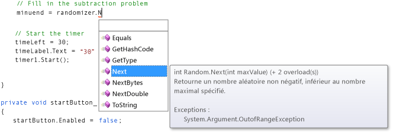
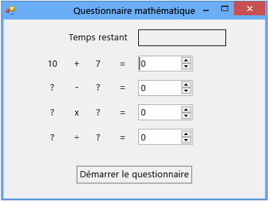

# Étape 2 : Créer un problème d’addition aléatoire

Dans la deuxième partie de ce didacticiel, vous rendez le questionnaire plus difficile en ajoutant des problèmes mathématiques basés sur des nombres aléatoires. Vous créez également une méthode qui s'appelle `StartTheQuiz()` et qui renseigne les problèmes et démarre le temporisateur. Plus tard dans ce didacticiel, vous ajouterez des problèmes de soustraction, de multiplication et de division.

> [!NOTE]
> Cette rubrique fait partie d'une série de didacticiels sur les concepts de codage de base. Pour obtenir une vue d’ensemble du didacticiel, consultez [didacticiel 2 : créer un questionnaire mathématique chronométré](../ide/tutorial-2-create-a-timed-math-quiz.md).

## Pour créer un problème d'addition aléatoire

1. Dans le concepteur de formulaires, choisissez le formulaire (**Form1**).

2. Dans la barre de menus, choisissez **Afficher**le  >  **code**.

     *Form1.cs* ou *Form1.vb* apparaît, en fonction du langage de programmation que vous utilisez, pour que vous puissiez afficher le code utilisé pour le formulaire.

3. Créez un objet <xref:System.Random> en ajoutant une instruction `new` dans la partie supérieure du code, comme suit :

     [!code-csharp[VbExpressTutorial3Step2#1](../ide/codesnippet/CSharp/step-2-create-a-random-addition-problem_1.cs)]
     [!code-vb[VbExpressTutorial3Step2#1](../ide/codesnippet/VisualBasic/step-2-create-a-random-addition-problem_1.vb)]

     [!INCLUDE [devlang-control-csharp-vb](./includes/devlang-control-csharp-vb.md)]

     Vous avez ajouté un objet aléatoire à votre formulaire et avez nommé cet objet **randomizer**.

     `Random` est connu en tant qu'objet. Vous avez déjà probablement entendu parler de ce mot et vous en apprendrez davantage sur sa signification pour la programmation dans le didacticiel suivant. Pour le moment, souvenez-vous que vous pouvez utiliser des instructions `new` pour créer des boutons, des étiquettes, des panneaux, des éléments OpenFileDialogs, ColorDialogs, SoundPlayers, Randoms, et même des formulaires, et ces éléments sont appelés objets. Quand vous exécutez votre programme, le formulaire est démarré et le code utilisé crée un objet qu’il nomme **randomizer**.

     Bientôt, vous générerez une méthode pour vérifier les réponses. Votre questionnaire doit donc utiliser des variables pour stocker les nombres aléatoires qu'il génère pour chaque problème. Consultez [Variables](/dotnet/visual-basic/programming-guide/language-features/variables/index) ou [Types](/dotnet/csharp/programming-guide/types/index). Pour utiliser correctement les variables, vous devez les déclarer, ce qui signifie que vous devez répertorier leurs noms et types de données.

4. Ajoutez deux variables de type entier au formulaire et nommez-les **addend1** et **addend2**.

    > [!NOTE]
    > Une variable de type entier est dénommée int en C# ou Integer en Visual Basic. Ce type de variable stocke un nombre positif ou négatif compris entre -2 147 483 648 et 2 147 483 647, et ne peut stocker que des nombres entiers, pas de décimales.

     Utilisez une syntaxe similaire pour ajouter une variable de type entier de la même manière que vous avez ajouté l'objet aléatoire, à mesure que le code suivant s'affiche.

     [!code-csharp[VbExpressTutorial3Step2#2](../ide/codesnippet/CSharp/step-2-create-a-random-addition-problem_2.cs)]
     [!code-vb[VbExpressTutorial3Step2#2](../ide/codesnippet/VisualBasic/step-2-create-a-random-addition-problem_2.vb)]

5. Ajoutez une méthode nommée `StartTheQuiz()` et qui utilise la méthode <xref:System.Random.Next> de l'objet aléatoire pour afficher les nombres aléatoires dans les étiquettes. Ajoutez un commentaire pour indiquer que par la suite, `StartTheQuiz()` renseignera tous les problèmes, puis démarrera la minuterie. La fonction doit se présenter comme suit.

     [!code-csharp[VbExpressTutorial3Step2#3](../ide/codesnippet/CSharp/step-2-create-a-random-addition-problem_3.cs)]
     [!code-vb[VbExpressTutorial3Step2#3](../ide/codesnippet/VisualBasic/step-2-create-a-random-addition-problem_3.vb)]

     Notez que quand vous entrez un point (.) après `randomizer` dans le code, une fenêtre IntelliSense s’ouvre et affiche les méthodes d’objet aléatoire que vous pouvez appeler. Par exemple, IntelliSense propose la méthode `Next()`, comme suit.

      
*Next, méthode*

     Lorsque vous entrez un point après un objet, IntelliSense affiche une liste des membres de l'objet, tels que des propriétés, des méthodes et des événements.

    > [!NOTE]
    > Lorsque vous utilisez la méthode `Next()` avec l'objet `Random`, comme lorsque vous appelez `randomizer.Next(50)`, vous obtenez un nombre aléatoire inférieur à 50 (compris entre 0 et 49). Dans cet exemple, vous avez appelé `randomizer.Next(51)`. Vous avez utilisé 51 et non 50 pour que l'addition des deux nombres aléatoires donne une somme comprise entre 0 et 100. Si vous passez 50 à la méthode `Next()`, elle choisira un nombre de 0 à 49, si bien que la plus haute somme possible sera 98 et non 100. Une fois que les deux premières instructions de la méthode ont été exécutées, chacune des deux variables de type entier, **addend1** et **addend2**, contient un nombre aléatoire compris entre 0 et 50. Cette capture d’écran montre le code C#, mais IntelliSense fonctionne de la même façon pour les Visual Basic.

     Examinez attentivement ces instructions.

     [!code-csharp[VbExpressTutorial3Step2#18](../ide/codesnippet/CSharp/step-2-create-a-random-addition-problem_4.cs)]
     [!code-vb[VbExpressTutorial3Step2#18](../ide/codesnippet/VisualBasic/step-2-create-a-random-addition-problem_4.vb)]

     Les instructions ont défini les propriétés **Text** de **plusLeftLabel** et **plusRightLabel** pour qu’elles affichent les deux nombres aléatoires. Vous devez utiliser la méthode `ToString()` de l'entier pour convertir les nombres en texte. (En programmation, chaîne signifie texte. Les contrôles Label n'affichent que le texte, pas les nombres.

6. Dans la fenêtre de conception, double-cliquez sur le bouton **Démarrer** ou sélectionnez-le, puis appuyez sur la touche **Entrée**.

     Lorsqu'une personne interrogée choisit ce bouton, le questionnaire doit démarrer et vous venez d'ajouter un gestionnaire d'événements Clic pour implémenter ce comportement.

7. Ajoutez les deux instructions suivantes.

     [!code-csharp[VbExpressTutorial3Step2#4](../ide/codesnippet/CSharp/step-2-create-a-random-addition-problem_5.cs)]
     [!code-vb[VbExpressTutorial3Step2#4](../ide/codesnippet/VisualBasic/step-2-create-a-random-addition-problem_5.vb)]

     La première instruction appelle la nouvelle méthode `StartTheQuiz()`. La deuxième instruction affecte à la propriété **Enabled** du contrôle **startButton** la valeur **False** pour que la personne interrogée ne puisse pas choisir le bouton durant le questionnaire.

8. Enregistrez votre code, exécutez-le, puis sélectionnez le bouton **Démarrer**.

     Un problème d’addition aléatoire apparaît, comme illustré dans la capture d’écran suivante.

      
*Problème d’addition aléatoire*

     Dans l'étape suivante du didacticiel, vous ajouterez la somme.

## Pour continuer ou examiner

- Pour passer à l’étape suivante du didacticiel, consultez **[étape 3 : ajouter un minuteur de compte à rebours](../ide/step-3-add-a-countdown-timer.md)**.

- Pour revenir à l’étape précédente du tutoriel, consultez [Étape 1 : créer un projet et ajouter des étiquettes à votre formulaire](../ide/step-1-create-a-project-and-add-labels-to-your-form.md).
