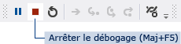

# &#201;tape&#160;2&#160;: ex&#233;cuter votre programme
[!INCLUDE[vs2017banner](../code-quality/includes/vs2017banner.md)]

Lorsque vous avez créé une solution, vous avez en fait généré un programme qui fonctionne.  Pour le moment, il n'offre que peu de possibilités : il se contente d'afficher une fenêtre vide qui indique **Form1** dans la barre de titre.  Mais il fonctionne réellement, comme vous allez le découvrir.  
  
  Pour obtenir une version vidéo de cette rubrique, consultez [Didacticiel 1 : Créer une visionneuse d'images en Visual Basic – Vidéo 1](http://go.microsoft.com/fwlink/?LinkId=205209) ou [Didacticiel 1 : Créer une visionneuse d'images en C\# – Vidéo 1](http://go.microsoft.com/fwlink/?LinkId=205199).  Ces vidéos utilisent une version antérieure de Visual Studio et présentent donc de légères différences quant à certaines commandes de menu et autres éléments d'interface utilisateur.  Toutefois, les concepts et les procédures fonctionnent de façon similaire dans la version actuelle de Visual Studio.  
  
### Pour exécuter votre programme  
  
1.  Utilisez l'une des méthodes suivantes pour exécuter votre programme.  
  
    -   Appuyez sur la touche **F5**.  
  
    -   Dans la barre de menus, sélectionnez **Débogage**, puis **Démarrer le débogage**.  
  
    -   Dans la barre d'outils, choisissez le bouton **Démarrer le débogage**, qui se présente comme suit.  
  
           
Bouton de barre d'outils Démarrer le débogage  
  
2.  Visual Studio exécute votre programme et une fenêtre intitulée **Form1** s'affiche.  Le schéma suivant montre le programme que vous venez de générer.  Le programme est exécuté, et vous allez bientôt y faire des ajouts.  
  
       
Programme d'application Windows Form en cours d'exécution  
  
3.  Revenez à l'environnement de développement intégré \(IDE\) de Visual Studio et examinez la nouvelle barre d'outils.  Des boutons supplémentaires apparaissent dans la barre d'outils lorsque vous exécutez un programme.  Ces boutons vous permettent d'effectuer des opérations comme arrêter et démarrer votre programme, et vous aident à localiser les erreurs \(bogues\) possibles.  Dans cet exemple, nous les utilisons pour démarrer et arrêter le programme.  
  
       
Barre d'outils de débogage  
  
4.  Utilisez l'une des méthodes suivantes pour arrêter votre programme.  
  
    -   Dans la barre d'outils, choisissez le bouton **Arrêter le débogage**.  
  
    -   Dans la barre de menus, choisissez **Débogage**, **Arrêter le débogage**.  
  
    -   Dans l'angle supérieur de la fenêtre **Form1**, choisissez le bouton X.  
  
    > [!NOTE]
    >  Lorsque vous exécutez votre programme dans l'IDE, vous effectuez un *débogage*, car vous le faites généralement pour rechercher et résoudre des bogues \(erreurs\) dans le programme.  Bien que ce programme soit petit et ne fasse pas encore grand chose, il n'en reste pas moins un programme.  Vous suivez la même procédure pour exécuter et déboguer d'autres programmes.  Pour en savoir plus sur le débogage, consultez [Principes de base du débogueur](../debugger/debugger-basics.md).  
  
### Pour continuer ou examiner  
  
-   Pour passer à l'étape suivante du didacticiel, consultez [Étape 3 : définir les propriétés de votre formulaire](../ide/step-3-set-your-form-properties.md).  
  
-   Pour revenir à l'étape précédente du didacticiel, consultez [Étape 1 : créer un projet d'application Windows Forms](../ide/step-1-create-a-windows-forms-application-project.md).