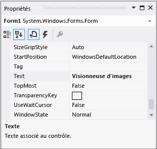

# Étape 3 : définir les propriétés de votre formulaire

Ensuite, vous utilisez la fenêtre **Propriétés** pour changer l’apparence de votre formulaire.

## Comment définir vos propriétés de formulaire

1. Assurez-vous que vous êtes à la recherche de **Windows Forms Designer**. Dans l’environnement de développement intégré (IDE) de Visual Studio, choisissez l’onglet **Form1.cs [Design]** (ou l’onglet **Form1.vb [Design]** dans Visual Basic).

1. Choisissez un endroit quelconque dans le formulaire **Form1** pour le sélectionner. La fenêtre **Propriétés** doit maintenant afficher les propriétés du formulaire. Les formulaires ont plusieurs propriétés. Par exemple, vous pouvez définir la couleur du premier plan et de l'arrière-plan, le texte du titre qui est affiché en haut du formulaire, les dimensions du formulaire, ainsi que d'autres propriétés.

   > [!NOTE]
   > Si la fenêtre **Propriétés** n’apparaît pas, arrêtez votre application en choisissant le bouton Halte carrée **Debugging** sur la barre d’outils, ou fermez simplement la fenêtre. Si l’application est arrêtée et que vous ne voyez toujours pas la fenêtre **Propriétés,** sur la barre de menu, choisissez **View** > **Properties Window**.

1. Après avoir sélectionné le formulaire, recherchez la propriété **Text** dans la fenêtre **Propriétés**. Suivant la façon dont la liste est triée, vous devrez peut-être la faire défiler. Choisissez **le texte**, tapez Le **visualiseur d’images,** puis choisissez **Enter**.  Votre formulaire devrait maintenant avoir le texte **Picture Viewer** dans sa barre de titre, et la fenêtre **Propriétés** devrait ressembler à la capture d’écran suivante.

     
   ***Fenêtre de propriétés*** *window*

   > [!NOTE]
   > Les propriétés peuvent être commandées par une vue **catégorisée** ou **alphabétique.** Vous pouvez passer d’une vue à l’autre à l’aide des boutons de la fenêtre **Propriétés**. Dans ce tutoriel, il est plus facile de trouver des propriétés à travers la vue **alphabétique.**

1. Revenez au **Concepteur Windows Forms**. Sélectionnez la poignée de déplacement située dans l'angle inférieur droit du formulaire, c'est-à-dire le petit carré blanc présenté ci-dessous.

     
   *Poignée de drag*

    Faites glisser la poignée pour redimensionner le formulaire et le rendre plus large et un peu plus grand.

1. Dans la fenêtre **Propriétés**, vous pouvez observer que la propriété **Size** a changé. En effet, la propriété **Size** change dès que vous redimensionnez le formulaire. Essayez de faire glisser la poignée du formulaire pour lui donner une taille adaptée à ce projet, soit environ **550, 350** (l'exactitude n'est pas nécessaire). Comme alternative, vous pouvez entrer les valeurs directement dans la propriété **Taille,** puis choisir la clé **Enter.**

1. Exécutez votre application à nouveau. N’oubliez pas que vous pouvez utiliser l’une des méthodes suivantes pour exécuter votre application.

   - Choisissez la touche **F5**.

   - Sur la barre de menu, choisissez **Debug** > **Start Debugging**.

   - Dans la barre d’outils, choisissez le bouton **Démarrer le débogage**, qui se présente comme suit.

       
     Démarrer le bouton de *barre d’outils* ***Debugging***

     Comme avant, l’IDE construit et exécute votre application, et une fenêtre apparaît.

1. Avant d’aller à l’étape suivante, arrêtez votre application, car l’IDE ne vous laissera pas modifier votre application pendant qu’elle est en cours d’exécution. N’oubliez pas que vous pouvez utiliser l’une des méthodes suivantes pour arrêter votre application.

   - Dans la barre d’outils, choisissez le bouton **Arrêter le débogage**.

   - Sur la barre de menu, choisissez **Debug** > **Stop Debugging**.

   - Utilisez votre clavier et appuyez sur **Shift**+**F5**.

   - Choisissez le bouton **X** dans le coin supérieur de la fenêtre **Picture Viewer.**

## Étapes suivantes

* Pour passer à l’étape suivante tutoriel, voir **[Étape 4: Exposer votre formulaire avec un contrôle TableLayoutPanel](../ide/step-4-lay-out-your-form-with-a-tablelayoutpanel-control.md)**.

* Pour revenir à l’étape tutoriel précédente, voir [Étape 2: Exécuter votre application de visionneuse d’images](../ide/step-2-run-your-program.md).

## Voir aussi

* [Tutorial 2: Créer un quiz de mathématiques chronométré](tutorial-2-create-a-timed-math-quiz.md)
* [Tutorial 3: Créer un jeu correspondant](tutorial-3-create-a-matching-game.md)
