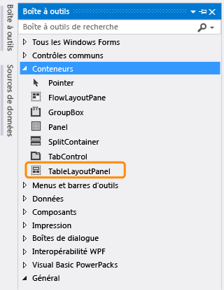
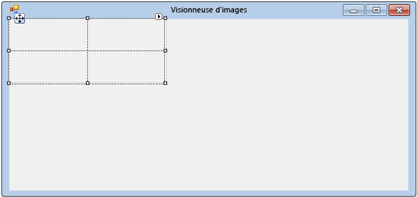
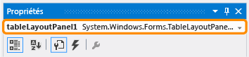
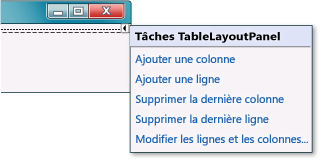
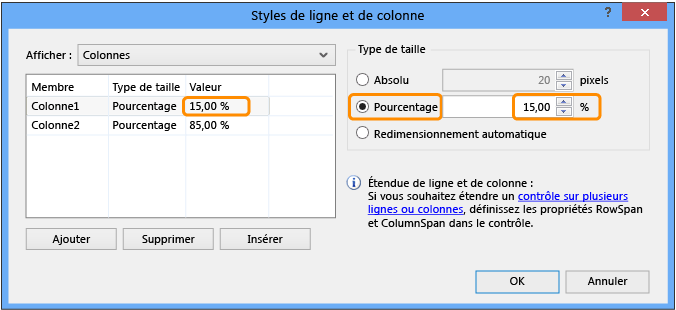
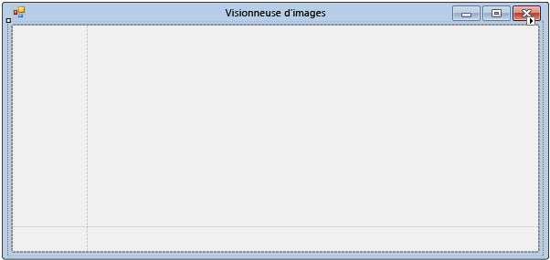

# Étape 4 : Composer votre formulaire avec un contrôle TableLayoutPanel

Dans cette étape, vous allez ajouter un contrôle <xref:System.Windows.Forms.TableLayoutPanel> à votre formulaire. Le TableLayoutPanel aide à aligner correctement les contrôles du formulaire que vous ajouterez ultérieurement.

## Comment disposer votre formulaire avec un contrôle TableLayoutPanel

1. Sur le côté gauche de l’IDE de Visual Studio, choisissez l’onglet **boîte à outils** . (Vous pouvez également choisir **Afficher** > la**boîte à outils** dans la barre de menus ou appuyer sur **CTRL**+**ALT**+**X**.)

1. Choisissez le petit symbole de triangle en regard du groupe **conteneurs** pour l’ouvrir, comme illustré dans la capture d’écran suivante.

      
***Conteneurs*** *groupe*

1. Vous pouvez ajouter des contrôles comme des boutons, des cases à cocher et des étiquettes à votre formulaire. Double-cliquez sur le contrôle TableLayoutPanel dans la **Boîte à outils**. Vous pouvez également faire glisser le contrôle de la Boîte à outils vers le formulaire. Dans ce cas, l’IDE ajoute un contrôle TableLayoutPanel à votre formulaire, comme illustré dans la capture d’écran suivante.

      
***TableLayoutPanel*** *contrôle*

    > [!NOTE]
    > Après avoir ajouté votre contrôle TableLayoutPanel, si une fenêtre intitulée **Tâches TableLayoutPanel** s’affiche à l’intérieur de votre formulaire, cliquez n’importe où dans le formulaire pour la fermer. Vous en apprendrez davantage sur cette fenêtre plus loin dans ce didacticiel.

     Notez que la **Boîte à outils** se développe pour recouvrir votre formulaire lorsque vous sélectionnez son onglet, et se referme lorsque vous effectuez une sélection en dehors de celle-ci. Il s’agit de la fonctionnalité de Masquer automatiquement dans l’IDE. Vous pouvez l’activer ou la désactiver pour l’une des fenêtres en cliquant sur l’icône en forme de punaise dans l’angle supérieur droit de la fenêtre pour basculer Masquer automatiquement et la verrouiller sur place. L'icône de la punaise apparaît comme suit.

      
***Punaise*** *icône*

1. Veillez à ce que TableLayoutPanel soit sélectionné lorsque vous le choisissez. Vous pouvez vérifier quel contrôle est sélectionné en examinant la liste déroulante en haut de la fenêtre **Propriétés** , comme illustré dans la capture d’écran suivante.

      
***Propriétés*** de *fenêtre affichée* ***TableLayoutPanel*** *contrôle*

1. Dans la barre d’outils de la fenêtre **Propriétés**, choisissez le bouton **Ordre alphabétique**. Cela permet de trier la liste des propriétés dans l’ordre alphabétique dans la fenêtre **Propriétés** , ce qui facilite la localisation des propriétés dans ce didacticiel.

1. Le sélecteur de contrôles est une liste déroulante située en haut de la fenêtre **Propriétés**. Dans cet exemple, il indique qu’un contrôle appelé `tableLayoutPanel1` est sélectionné. Vous pouvez sélectionner des contrôles en choisissant une zone dans le **Concepteur Windows Forms** ou en utilisant le sélecteur de contrôles.

   À présent que TableLayoutPanel est sélectionné, recherchez la propriété **Dock** et sélectionnez-la **.** Sa valeur doit être **Aucun**. Notez qu’une flèche de déroulement s’affiche en regard de la valeur. Cliquez sur la flèche, puis sélectionnez le bouton **remplissage** (le grand bouton au milieu), comme illustré dans la capture d’écran suivante.

      
***Propriétés*** de *fenêtre avec* ***Remplissage*** *sélectionné*

     Dans Visual Studio, le terme *ancrage* signifie qu’une fenêtre est attachée à une autre fenêtre ou zone dans l’IDE. Par exemple, la fenêtre **Propriétés** peut être désancrée&mdash;, non attachée et flottante dans Visual Studio&mdash;, ou elle peut être ancrée sur **Explorateur de solutions**.

1. Une fois que vous avez défini la propriété **Dock** TableLayoutPanel sur **Fill**, vous remarquerez que le panneau remplit tout le formulaire. Si vous redimensionnez à nouveau le formulaire, le TableLayoutPanel reste ancré et se redimensionne automatiquement pour s'adapter aux nouvelles dimensions.

    > [!NOTE]
    > Un TableLayoutPanel fonctionne comme une table dans Microsoft Office Word : il comporte des lignes et des colonnes, et une cellule peut s’étendre sur plusieurs lignes et colonnes. Chaque cellule ne peut contenir qu'un seul contrôle (comme un bouton, une case à cocher ou une étiquette). Votre TableLayoutPanel doit avoir un <xref:System.Windows.Forms.PictureBox> contrôle couvrant l’intégralité de sa ligne supérieure <xref:System.Windows.Forms.CheckBox> , un contrôle dans sa cellule inférieure gauche et quatre <xref:System.Windows.Forms.Button> contrôles dans sa cellule inférieure droite.

1. Actuellement, le TableLayoutPanel est composé de deux lignes et colonnes de taille égale. Nous allons les redimensionner pour que la ligne du haut et la colonne de droite soient bien plus grandes. Dans le **Concepteur Windows Forms**, sélectionnez le TableLayoutPanel. Dans l'angle supérieur droit, il y a un petit bouton en forme de triangle noir, comme celui illustré ci-dessous.

      
***Triangle*** *bouton*

     Ce bouton indique que le contrôle dispose de tâches vous permettant de définir ses propriétés automatiquement.

1. Choisissez le triangle pour afficher la liste des tâches du contrôle, comme illustré dans la capture d’écran suivante.

      
***TableLayoutPanel*** *tâches*

1. Sélectionnez la tâche **Modifier les lignes et les colonnes** pour afficher la fenêtre **Styles de ligne et de colonne**. Sélectionnez **Column1** et affectez-lui la valeur 15 pour cent en vérifiant que le bouton **Pourcentage** est sélectionné et en entrant **15** dans la zone **Pourcentage**. (Il s’agit <xref:System.Windows.Forms.NumericUpDown> d’un contrôle, que vous utiliserez dans un didacticiel ultérieur.) Sélectionnez **Colonne2** et affectez-lui la valeur 85 pour cent. Ne sélectionnez pas encore le bouton **OK**, sinon la fenêtre se fermera. (Mais si vous le faites, vous pouvez la rouvrir à l’aide de la liste des tâches.)

      
***TableLayoutPanel*** *styles de colonne et de ligne*

1. Dans la liste déroulante **Afficher** en haut de la fenêtre **styles de ligne et de colonne** , choisissez **lignes**. Affectez les valeurs 90 pour cent à **Ligne1** et 10 pour cent à **Ligne2**.

1. Sélectionnez le bouton **OK** . Votre TableLayoutPanel doit maintenant avoir une grande ligne en haut, une petite ligne en bas, une petite colonne à gauche et une grande colonne à droite. (Vous pouvez redimensionner les lignes et les colonnes dans le TableLayoutPanel en choisissant **tableLayoutPanel1** dans le formulaire, puis en faisant glisser ses bordures de ligne et de colonne.)

      
***Formulaire1*** *(Visionneuse d’images) avec un redimensionnement* ***TableLayoutPanel***

## Étapes suivantes

* Pour passer à l’étape suivante du didacticiel, **consultez [étape 5 : Ajoutez des contrôles à votre](../ide/step-5-add-controls-to-your-form.md)formulaire**.

* Pour revenir à l’étape précédente du tutoriel, consultez [Étape 3 : définir les propriétés de votre formulaire](../ide/step-3-set-your-form-properties.md).

## Voir aussi

* [Tutoriel 2 : Créer un questionnaire mathématique chronométré](tutorial-2-create-a-timed-math-quiz.md)
* [Tutoriel 3 : Créer un jeu de combinaisons](tutorial-3-create-a-matching-game.md)
