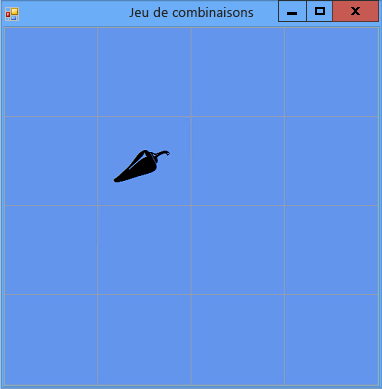

# Étape 5 : ajouter des références de contrôles Label
Le programme doit effectuer le suivi des contrôles d'étiquette que le joueur a choisis. Pour le moment, le programme indique l'ensemble des étiquettes choisies par le joueur. Mais nous allons changer cela. Une fois que le joueur a choisi le premier contrôle d'étiquette, le programme doit afficher son icône. Une fois que le joueur a choisi le deuxième contrôle d'étiquette, le programme doit afficher brièvement les deux icônes, puis les masquer à nouveau. Votre programme vérifiera à présent quel contrôle d'étiquette le joueur a choisi en premier et en deuxième à l'aide de *variables de référence*.  

### Pour ajouter des références aux contrôles Label  

1.  Pour ajouter des références aux contrôles Label dans votre formulaire, utilisez le code suivant.  

     [!code-vb[VbExpressTutorial4Step5#5](../ide/codesnippet/VisualBasic/step-5-add-label-references_1.vb)]
     [!code-csharp[VbExpressTutorial4Step5#5](../ide/codesnippet/CSharp/step-5-add-label-references_1.cs)]  

     Ces variables de référence sont identiques aux instructions que vous avez utilisées avant pour ajouter des objets (comme les objets `Timer`, `List` et `Random` ) à votre formulaire. Toutefois, ces instructions n'entraînent pas l'affichage de deux contrôles d'étiquette supplémentaires dans le formulaire étant donné qu'il n'existe aucun `new` mot-clé dans l'une ou l'autre des deux instructions. Sans le `new` mot-clé, aucun objet n'est créé. C'est la raison pour laquelle `firstClicked` et `secondClicked` sont appelées « variables de référence » : elles sont uniquement chargées de suivre (ou de référencer) les objets `Label`.  

     Lorsqu'une variable n'effectue pas le suivi d'un objet, elle est définie sur une valeur spéciale : `null` en Visual C# et `Nothing` en Visual Basic. Au démarrage du programme, `firstClicked` et `secondClicked` ont donc la valeur `null` ou `Nothing`, ce qui signifie que les variables n'effectuent aucun suivi.  

2.  Modifiez votre gestionnaire d'événements Click pour qu'il utilise la nouvelle variable de référence `firstClicked`. Supprimez la dernière instruction dans la méthode du gestionnaire d'événements `label_Click()` (`clickedLabel.ForeColor = Color.Black;`) et remplacez-la par l'instruction `if` suivante. (Veillez à inclure le commentaire et la totalité de l'instruction `if`.)  

     [!code-vb[VbExpressTutorial4Step5#6](../ide/codesnippet/VisualBasic/step-5-add-label-references_2.vb)]
     [!code-csharp[VbExpressTutorial4Step5#6](../ide/codesnippet/CSharp/step-5-add-label-references_2.cs)]  

3.  Enregistrez et exécutez votre programme. Choisissez l'un des contrôles d'étiquette, et son icône s'affiche.  

4.  Choisissez le contrôle d'étiquette suivant, et notez que rien ne se passe. Le programme effectue déjà le suivi du premier contrôle choisissez que le joueur a choisi et donc `firstClicked` n'est pas égal à `null` en Visual C# ou `Nothing` en Visual Basic. Lorsque votre instruction `if` vérifie si `firstClicked` est égal à `null` ou `Nothing`, elle découvre que ce n'est pas le cas et n'exécute pas les instructions dans l'instruction `if`. Par conséquent, seule la première icône que le joueur a choisie devient noire et les autres restent invisibles, comme indiqué dans l'image suivante.  

       
Jeu de combinaisons affichant une icône  

     Vous allez résoudre cette situation à l'étape suivante du didacticiel en ajoutant un contrôle **Minuterie**.  

### Pour continuer ou examiner  

-   Pour passer à l’étape suivante du didacticiel, consultez [Étape 6 : ajouter une minuterie](../ide/step-6-add-a-timer.md).  

-   Pour revenir à l'étape précédente du didacticiel, consultez [Étape 4 : ajouter un gestionnaire d'événements Click à chaque contrôle Label](../ide/step-4-add-a-click-event-handler-to-each-label.md).
