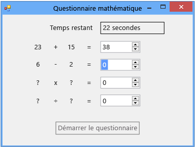

# Étape 6 : Ajouter un problème de soustraction
Dans la sixième partie de ce didacticiel, vous allez ajouter un problème de soustraction et apprendre à effectuer les tâches suivantes :

- Stocker les valeurs de soustraction.

- Générer des nombres aléatoires pour le problème (et vérifier que la réponse est comprise entre 0 et 100).

- Mettre à jour la méthode qui vérifie les réponses afin qu'elle vérifie également le nouveau problème de soustraction.

- Mettre à jour le gestionnaire d'événements <xref:System.Windows.Forms.Timer.Tick> de votre minuterie pour qu'il remplisse la réponse correcte lorsque le temps est écoulé.

> [!NOTE]
> Cette rubrique fait partie d'une série de didacticiels sur les concepts de codage de base. Pour obtenir une vue d’ensemble du didacticiel, consultez [didacticiel 2 : créer un questionnaire mathématique chronométré](../ide/tutorial-2-create-a-timed-math-quiz.md).

## Pour ajouter un problème de soustraction

1. Ajoutez deux variables de type entier à votre formulaire pour le problème de soustraction, entre les variables de type entier du problème d'addition et la minuterie. Le code doit se présenter comme suit.

     [!code-vb[VbExpressTutorial3Step5_6#12](../ide/codesnippet/VisualBasic/step-6-add-a-subtraction-problem_1.vb)]
     [!code-csharp[VbExpressTutorial3Step5_6#12](../ide/codesnippet/CSharp/step-6-add-a-subtraction-problem_1.cs)]

     [!INCLUDE [devlang-control-csharp-vb](./includes/devlang-control-csharp-vb.md)]

     Les noms des nouvelles variables de type entier (**minuend** et **subtrahend**) ne sont pas des termes de programmation. Ce sont des noms généralement utilisés en arithmétique pour désigner le nombre à retrancher (subtrahend, ou diminuteur en français) et le nombre duquel le diminuteur est soustrait (minuend, ou diminuende en français). La différence correspond à minuend moins subtrahend. Vous pourriez utiliser d'autres noms, étant donné que votre programme ne requiert aucun nom spécifique pour les variables, les contrôles, les composants ou les méthodes. Vous devez suivre des règles, par exemple ne pas commencer les noms par des chiffres, mais plutôt recourir à des noms tels que x1, x2, x3 et x4. Toutefois, les noms génériques rendent le code difficile à lire et les problèmes quasiment impossible à localiser. Pour faire en sorte que les noms des variables soient uniques et conviviaux, vous utiliserez les noms traditionnels pour la multiplication (multiplicande x multiplicateur = produit) et la division (dividende ÷ diviseur = quotient) plus tard dans ce didacticiel.

     Vous modifierez ensuite la méthode `StartTheQuiz()` permettant de fournir des valeurs aléatoires pour le problème de soustraction.

2. Ajoutez le code suivant après le commentaire « Fill in the subtraction problem » (« Remplissage du problème de soustraction »).

     [!code-vb[VbExpressTutorial3Step5_6#13](../ide/codesnippet/VisualBasic/step-6-add-a-subtraction-problem_2.vb)]
     [!code-csharp[VbExpressTutorial3Step5_6#13](../ide/codesnippet/CSharp/step-6-add-a-subtraction-problem_2.cs)]

     Pour éviter les réponses négatives dans le cadre d'un problème de soustraction, ce code utilise la méthode <xref:System.Random.Next> de la classe <xref:System.Random> un peu différemment que pour le problème d'addition. Lorsque vous attribuez deux valeurs à la méthode `Next()`, elle choisit un nombre aléatoire qui est supérieur ou égal à la première valeur, mais inférieur à la deuxième. Le code suivant choisit un nombre aléatoire entre 1 et 100 et le stocke dans la variable minuend.

     [!code-vb[VbExpressTutorial3Step5_6#21](../ide/codesnippet/VisualBasic/step-6-add-a-subtraction-problem_3.vb)]
     [!code-csharp[VbExpressTutorial3Step5_6#21](../ide/codesnippet/CSharp/step-6-add-a-subtraction-problem_3.cs)]

     Vous pouvez appeler la méthode `Next()` de la classe aléatoire, que vous avez nommée « randomizer » précédemment dans ce tutoriel, de plusieurs façons. Les méthodes que vous appelez de plusieurs façons sont désignées comme étant surchargées, et vous pouvez utiliser IntelliSense pour les explorer. Examinez à nouveau l'info-bulle de la fenêtre IntelliSense pour la méthode `Next()`.

      
*Info-bulle **IntelliSense** _ _window *

     L’info-bulle affiche **(+ 2 surcharge(s))**, ce qui signifie que vous pouvez appeler la méthode `Next()` de deux manières différentes. Les surcharges contiennent des nombres ou des types d’arguments leur permettant de fonctionner un peu différemment les unes des autres. Par exemple, une méthode peut prendre un seul argument entier, alors qu’une de ses surcharges peut prendre un entier et une chaîne. Choisissez la surcharge appropriée en fonction de ce que vous souhaitez qu'elle fasse. Quand vous ajoutez du code à la méthode `StartTheQuiz()`, plus d’informations apparaissent dans la fenêtre IntelliSense dès que vous entrez `randomizer.Next(`. Pour parcourir les surcharges, actionnez les touches **Flèche haut** et **Flèche bas**, comme indiqué dans l’illustration suivante :

      
*Surcharge pour*  * **Next ()** _ _method dans * ***IntelliSense***

     Dans ce cas, vous souhaitez choisir la dernière surcharge, car vous pouvez spécifier les valeurs minimales et maximales.

3. Modifiez la méthode `CheckTheAnswer()` pour vérifier si la réponse à la soustraction est correcte.

     [!code-vb[VbExpressTutorial3Step5_6#14](../ide/codesnippet/VisualBasic/step-6-add-a-subtraction-problem_4.vb)]
     [!code-csharp[VbExpressTutorial3Step5_6#14](../ide/codesnippet/CSharp/step-6-add-a-subtraction-problem_4.cs)]

     En C#, `&&` est l' `logical and` opérateur. En Visual Basic, l'opérateur équivalent est `AndAlso`. Ces opérateurs indiquent « si la somme de addend1 et addend2 est égale à la valeur de la somme NumericUpDown, et si minuend moins subtrahend est égal à la valeur de difference NumericUpDown ». La méthode `CheckTheAnswer()` retourne `true` si les réponses aux problèmes d'addition et de soustraction sont toutes les deux correctes.

4. Remplacez la dernière partie du gestionnaire d'événements Tick du minuteur par le code suivant afin que la réponse correcte s'affiche une fois le délai écoulé.

     [!code-vb[VbExpressTutorial3Step5_6#22](../ide/codesnippet/VisualBasic/step-6-add-a-subtraction-problem_5.vb)]
     [!code-csharp[VbExpressTutorial3Step5_6#22](../ide/codesnippet/CSharp/step-6-add-a-subtraction-problem_5.cs)]

5. Enregistrez et exécutez votre code.

     Votre programme inclut un problème de soustraction, comme le montre l’illustration suivante :

      
***Questionnaire mathématique** _ _with problème de soustraction *

## Pour continuer ou examiner

- Pour passer à l’étape suivante du didacticiel, consultez **[étape 7 : ajouter des problèmes de multiplication et de division](../ide/step-7-add-multiplication-and-division-problems.md)**.

- Pour revenir à l’étape précédente du tutoriel, consultez [Étape 5 : ajouter des gestionnaires d’événements Enter pour les contrôles NumericUpDown](../ide/step-5-add-enter-event-handlers-for-the-numericupdown-controls.md).
