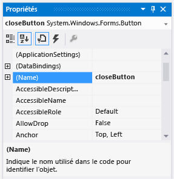

# <a name="step-6-name-your-button-controls"></a>Étape 6 : affecter un nom à vos contrôles bouton

Votre formulaire ne contient qu’un seul <xref:System.Windows.Forms.PictureBox>. Lorsque vous l’avez ajouté, l’IDE l’a nommé automatiquement **pictureBox1**. Il n’existe qu’un seul <xref:System.Windows.Forms.CheckBox>, appelé **checkBox1**. Bientôt, vous écrirez du code, et ce code se référera à la CheckBox et PictureBox. Parce qu’il n’y a qu’un seul de ces contrôles, vous saurez ce que cela signifie lorsque vous verrez **pictureBox1** ou **checkBox1** dans votre code.

> [!TIP]
> En Visual Basic, le nom des contrôles commence par défaut par une lettre majuscule, autrement dit **PictureBox1**, **CheckBox1**et ainsi de suite.

Il existe quatre boutons dans votre formulaire, et l’IDE les a nommés **button1**, **button2**, **button3**et **button4**. Leurs noms actuels ne vous permettent pas de savoir s’il s’agit du bouton **Fermer** ou du bouton **Afficher une image** . C’est pourquoi il est utile de donner à vos contrôles bouton des noms plus informatifs.

## <a name="to-name-your-button-controls"></a>Pour nommer vos contrôles bouton

1. Dans le formulaire, choisissez le bouton **Fermer** . (Si vous avez encore tous les boutons sélectionnés, choisissez la clé **Esc** pour annuler la sélection.) Faites défiler la fenêtre **Propriétés** jusqu’à ce que vous voyiez la propriété **(Nom).** (La propriété **(Nom)** est près du sommet lorsque les propriétés sont alphabétique.) Changer le nom pour **fermerButton**, comme indiqué dans la capture d’écran suivante.

    <br>***Fenêtre de propriétés*** *avec* *le nom* ***closeButton***

    > [!NOTE]
    > Essayez de changer le nom de votre bouton pour **fermer Button**, avec un espace entre les mots "fermer" et "Button". Lorsque vous le faites, l’IDE affiche un message d’erreur : « La valeur de la propriété n’est pas valide. » Les espaces (et quelques autres caractères) ne sont pas autorisés dans les noms de contrôle.

1. Renommez les trois autres boutons en **backgroundButton**, **clearButton**et **showButton**.
Vous pouvez vérifier les noms en sélectionnant la liste déroulante du sélecteur de contrôles dans la fenêtre **Propriétés** . Les nouveaux noms de boutons apparaissent.

1. Double-cliquez sur le bouton **Afficher une image** du formulaire. Comme alternative, choisissez le Bouton Afficher un bouton **d’image** sur le formulaire, puis appuyez sur la clé **Enter.** Lorsque vous le faites, l’IDE ouvre un onglet supplémentaire dans la fenêtre principale nommée **Form1.cs**. (Si vous utilisez Visual Basic, l’onglet est nommé **Form1.vb**).

   Cet onglet affiche le fichier de code derrière le formulaire, comme indiqué dans la capture d’écran suivante.

    <br>
***Form1.cs*** *onglet avec code C*

    > [!NOTE]
    > Votre onglet Form1.cs ou Form1.vb pourrait afficher **showButton** comme **ShowButton** à la place.

1. Examinez attentivement cette partie du code.

    ```csharp
        private void ShowButton_Click(object sender, EventArgs e)
    {
    }
    ```

    ```vb
        Private Sub showButton_Click() Handles showButton.Click

    End Sub
    ```

   [!INCLUDE [devlang-control-csharp-vb](./includes/devlang-control-csharp-vb.md)]

   Vous regardez le code `showButton_Click()` appelé (alternativement, `ShowButton_Click()`). L’IDE l’a ajouté au code du formulaire lorsque vous avez ouvert le fichier de code du bouton **showButton** . Au moment de la conception, lorsque vous ouvrez le fichier de code d’un contrôle dans un formulaire, le code est généré pour le contrôle s’il n’existe pas déjà. Ce code, connu sous le nom de *méthode*, s’exécute lorsque vous exécutez votre application et choisissez le contrôle - dans ce cas, le Afficher un bouton **d’image.**

1. Choisissez à nouveau l’onglet **Windows Forms Designer** **(Form1.cs [Design]**), puis ouvrez le fichier de code pour le bouton **Effacer l’image** pour créer une méthode pour elle dans le code du formulaire. Répétez la même opération pour les deux boutons restants. Chaque fois, l’IDE ajoute une nouvelle méthode au fichier de code du formulaire.

1. Pour ajouter une méthode de plus, ouvrez le fichier de code pour `checkBox1_CheckedChanged()` le contrôle **CheckBox** dans Windows Forms **Designer** pour faire ajouter à l’IDE une méthode. Cette méthode est appelée chaque fois que l’utilisateur active ou désactive la case à cocher.

   > [!TIP]
   > Lorsque vous travaillez sur une application, vous vous déplacez souvent entre l’éditeur de code et **Windows Forms Designer**. L’IDE vous permet de naviguer facilement dans votre projet. Utilisez **Solution Explorer** pour ouvrir Windows Forms **Designer** en cliquant à deux *Form1.cs* dans C ou *Form1.vb* dans Visual Basic, ou sur la barre de menu, choisissez **View** > **Designer**.

    Les éléments suivants montrent le nouveau code qui est affiché dans l’éditeur de code.

    [!code-csharp[VbExpressTutorial1Step6_#2](../ide/codesnippet/CSharp/step-6-name-your-button-controls_2.cs)]

    [!code-vb[VbExpressTutorial1Step6_#2](../ide/codesnippet/VisualBasic/step-6-name-your-button-controls_2.vb)]

    > [!NOTE]
    > Votre code peut ne pas afficher les gestionnaires d’événements en lettres "camelCase".

    Les cinq méthodes que vous avez ajoutées s’appellent *les gestionnaires d’événements,* parce que votre application les appelle chaque fois qu’un événement (comme un utilisateur choisissant un bouton ou sélection d’une boîte) se produit.

    Lorsque vous affichez le code d’un contrôle dans l’IDE au moment de la conception, Visual Studio ajoute une méthode de gestionnaire d’événements pour le contrôle s’il n’en possède pas déjà une. Par exemple, lorsque vous double-cliquez sur un bouton, l’IDE ajoute un gestionnaire d’événements pour son événement <xref:System.Windows.Forms.Control.Click> (qui est appelé chaque fois que l’utilisateur choisit le bouton). Lorsque vous double-cliquez sur une case à cocher, l’IDE ajoute un gestionnaire d’événements pour son événement <xref:System.Windows.Forms.CheckBox.CheckedChanged> (qui est appelé chaque fois que l’utilisateur active ou désactive la case).

    Une fois que vous avez ajouté un gestionnaire d’événements pour un contrôle, vous pouvez y revenir à tout moment en double-cliquant sur le contrôle du **Concepteur Windows Forms **ou, dans la barre de menus, en choisissant **Afficher** > **Code**.

    Les noms sont importants lorsque vous générez des programmes, et vous pouvez nommer les méthodes (y compris les gestionnaires d’événements) comme vous le voulez. Lorsque vous ajoutez un gestionnaire d’événements avec l’IDE, il choisit un nom en fonction du nom du contrôle et de l’événement qui est géré.

    Par exemple, l’événement Cliquez sur un bouton nommé **showButton** s’appelle la `showButton_Click()` méthode (alternativement, `ShowButton_Click()`) gestionnaire d’événements. De même, des parenthèses ouvrantes et fermantes `()` sont généralement ajoutées après le nom de la méthode pour indiquer clairement qu’il s’agit de méthodes.

    Si vous décidez que vous souhaitez modifier un nom variable de code, cliquez à droite sur la variable dans le code, puis choisissez **Refactor** > **Rename**. Toutes les instances de cette variable dans le code sont renommées. Pour plus d’informations, voir [Rename refactoring](../ide/reference/rename.md).

## <a name="next-steps"></a>Étapes suivantes

* Pour passer à l’étape suivante tutoriel, voir **[l’étape 7: Ajouter des composants de dialogue à votre formulaire](../ide/step-7-add-dialog-components-to-your-form.md)**.

* Pour revenir à l’étape tutoriel précédente, voir [Étape 5: Ajouter des contrôles à votre formulaire](../ide/step-5-add-controls-to-your-form.md).

## <a name="see-also"></a>Voir aussi

* [Tutorial 2: Créer un quiz de mathématiques chronométré](tutorial-2-create-a-timed-math-quiz.md)
* [Tutorial 3: Créer un jeu correspondant](tutorial-3-create-a-matching-game.md)
