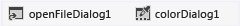

# <a name="step-7-add-dialog-components-to-your-form"></a>Étape 7 : Ajouter des composants de boîte de dialogue à votre formulaire

Pour permettre à votre application d’ouvrir des fichiers image et de choisir une couleur d’arrière-plan, au cours de cette étape, vous allez ajouter un <xref:System.Windows.Forms.OpenFileDialog> composant et un <xref:System.Windows.Forms.ColorDialog> composant à votre formulaire.

À certains égards, un composant est semblable à un contrôle. Utilisez la **boîte à outils** pour ajouter un composant à votre formulaire, et la fenêtre **Propriétés** pour définir les propriétés du composant. Mais contrairement à un contrôle, lorsque vous ajoutez un composant, il n'est pas visible dans votre formulaire. À la place, il permet d'utiliser des comportements que vous pouvez déclencher à l'aide de code. Un composant sert, par exemple, à ouvrir une boîte de dialogue **Ouvrir un fichier**.

## <a name="to-add-dialog-components-to-your-form"></a>Pour ajouter des composants de boîte de dialogue à votre formulaire

1. Choisissez le **Concepteur Windows Forms** (**Form1. cs [Design]**), puis ouvrez le groupe **boîtes de dialogue** dans la **boîte à outils**.

    > [!NOTE]
    > Le groupe **Boîtes de dialogue** dans la **boîte à outils** est doté de composants qui ouvrent de nombreuses boîtes de dialogue utiles. Vous pouvez les utiliser pour ouvrir et enregistrer des fichiers, parcourir des dossiers, ainsi que pour choisir des polices et des couleurs. Dans ce projet, vous utilisez deux composants de dialogue : OpenFileDialog et ColorDialog.

1. Pour ajouter un composant appelé **openFileDialog1** à votre formulaire, double-cliquez sur **OpenFileDialog**. Pour ajouter un composant appelé **colorDialog1** à votre formulaire, double-cliquez sur **ColorDialog** dans la **boîte à outils**. (Vous l’utilisez dans l’étape suivante du didacticiel.) Vous devez voir une zone en bas de **Concepteur Windows Forms** (sous le formulaire de la **visionneuse d’images** ) qui contient une icône pour chacun des deux composants de boîte de dialogue que vous avez ajoutés, comme illustré dans l’image suivante.

     <br>***Boîte de dialogue** _ _components *

1. Choisissez l’icône **openFileDialog1** dans la zone située en bas du **Concepteur Windows Forms**. Définissez deux propriétés :

    - Définissez la propriété **Filter** à la valeur suivante (vous pouvez copier-coller cette valeur) :

        ```
        JPEG Files (*.jpg)|*.jpg|PNG Files (*.png)|*.png|BMP Files (*.bmp)|*.bmp|All files (*.*)|*.*
        ```

    - Définissez la propriété **Title** à la valeur suivante : **Sélectionner un fichier image**

         Les paramètres de la propriété **Filter** spécifient les types de fichiers à afficher dans la boîte de dialogue **Sélectionner un fichier image**.

    > [!TIP]
    > Pour voir un exemple de boîte de dialogue **Ouvrir un fichier** dans une application différente, ouvrez le **Bloc-notes** ou **Paint** et, dans la barre de menus, choisissez **Fichier** > **Ouvrir**. Notez qu’il y a une liste déroulante en regard du nom de fichier qui vous permet de choisir le type de fichier. <br/><br/>Vous venez d’utiliser la propriété **Filter** dans le composant **OpenFileDialog** pour la configurer dans votre application. Notez également que les propriétés **Title** et **Filter** sont affichées en gras dans la fenêtre **Propriétés**. L'IDE utilise ce style pour vous montrer toutes les propriétés dont les valeurs par défaut ont été modifiées.

## <a name="next-steps"></a>Étapes suivantes

* Pour passer à l’étape suivante du didacticiel, consultez **[étape 8 : écrire du code pour le gestionnaire d’événements du bouton afficher une image](../ide/step-8-write-code-for-the-show-a-picture-button-event-handler.md)**.

* Pour revenir à l’étape précédente du tutoriel, consultez [Étape 6 : affecter un nom à vos contrôles bouton](../ide/step-6-name-your-button-controls.md).

## <a name="see-also"></a>Voir aussi

* [Didacticiel 2 : créer un questionnaire mathématique chronométré](tutorial-2-create-a-timed-math-quiz.md)
* [Didacticiel 3 : créer un jeu de combinaisons](tutorial-3-create-a-matching-game.md)
