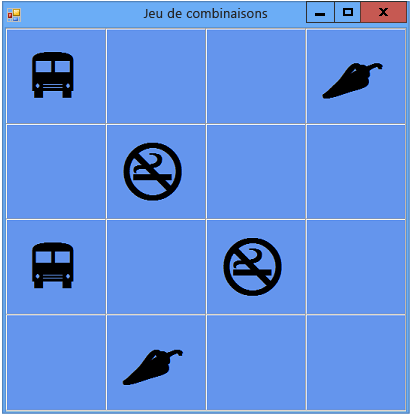

# <a name="step-7-keep-pairs-visible"></a>Étape 7 : Garder les paires visibles
Le jeu fonctionne correctement tant que le joueur se contente de choisir des paires d'icônes qui ne correspondent pas. Voyons ce qui doit se produire lorsque le joueur choisit une paire d'icônes identiques. Au lieu de faire disparaître les icônes en activant le minuteur (à l'aide de la méthode <xref:System.Windows.Forms.Timer.Start>), le jeu doit se réinitialiser pour arrêter le suivi de tous les contrôles Label à l'aide des variables de référence `firstClicked` et `secondClicked`, sans réinitialiser les couleurs des deux contrôles Label choisis.

## <a name="to-keep-pairs-visible"></a>Pour garder des paires visibles

1. Ajoutez l'instruction `if` suivante à la méthode de gestionnaire d'événements `label_Click()`, vers la fin du code, juste au-dessus de l'instruction où vous démarrez le minuteur. Examinez attentivement le code lorsque vous l'ajoutez au programme. Analysez son fonctionnement.

     [!code-csharp[VbExpressTutorial4Step7#9](../ide/codesnippet/CSharp/step-7-keep-pairs-visible_1.cs)]
     [!code-vb[VbExpressTutorial4Step7#9](../ide/codesnippet/VisualBasic/step-7-keep-pairs-visible_1.vb)]

     > [!IMPORTANT]
     > Utilisez le contrôle de langage de programmation en haut à droite de cette page pour afficher l’extrait de code C# ou l’extrait de code Visual Basic.<br><br>

     La première ligne de l'instruction `if` que vous venez d'ajouter vérifie si l'icône du premier contrôle Label choisi par le joueur est la même que l'icône du deuxième contrôle Label. Si les icônes sont identiques, le programme exécute les trois instructions entre les accolades en C# ou les trois instructions dans l'instruction `if` en Visual Basic. Les deux premières instructions réinitialisent les variables de référence `firstClicked` et `secondClicked` pour arrêter le suivi des différents contrôles Label. (Vous pouvez identifier ces deux instructions dans le gestionnaire d’événements du minuteur <xref:System.Windows.Forms.Timer.Tick> .) La troisième instruction est une `return` instruction, qui indique au programme d’ignorer le reste des instructions dans la méthode sans les exécuter.

     Si vous programmez en C#, vous avez peut-être remarqué qu’une partie du code utilise un seul signe égal ( `=` ), tandis que d’autres instructions utilisent deux signes égal ( `==` ). Examinez pourquoi `=` est utilisé dans certains cas et `==` dans d'autres.

     Cet exemple montre bien la différence entre les deux cas. Examinez attentivement le code entre parenthèses dans l'instruction `if`.

    ```vb
    firstClicked.Text = secondClicked.Text
    ```

    ```csharp
    firstClicked.Text == secondClicked.Text
    ```

     Analysez ensuite attentivement la première instruction dans le bloc de code après l'instruction `if`.

    ```vb
    firstClicked = Nothing
    ```

    ```csharp
    firstClicked = null;
    ```

     La première de ces deux instructions vérifie si deux icônes sont identiques. Étant donné que deux valeurs sont comparées, le programme C# utilise l' `==` opérateur d’égalité. En fait, la deuxième instruction modifie la valeur (appelée *assignation*) en affectant la valeur `null` à la variable de référence `firstClicked` pour la réinitialiser. C'est la raison pour laquelle elle utilise plutôt l'opérateur d'assignation `=`. C# utilise `=` pour définir des valeurs et `==` les comparer. Le langage Visual Basic utilise `=` pour l'affectation et la comparaison des variables.

2. Enregistrez et exécutez le programme, puis commencez à choisir des icônes sur le formulaire. Si vous choisissez une paire qui ne correspond pas, l'événement Tick du minuteur se déclenche et les deux icônes disparaissent. Si vous choisissez une paire correspondante, la nouvelle `if` instruction s’exécute et l’instruction return indique à la méthode d’ignorer le code qui démarre le minuteur, de sorte que les icônes restent visibles, comme le montre l’image suivante.

     <br/>
***Jeu de combinaisons*** *avec des paires d’icônes visibles*

## <a name="to-continue-or-review"></a>Pour continuer ou examiner

- Pour passer à l’étape suivante du didacticiel, consultez **[étape 8 : ajouter une méthode pour vérifier si le joueur a gagné](../ide/step-8-add-a-method-to-verify-whether-the-player-won.md)**.

- Pour revenir à l’étape précédente du didacticiel, consultez [étape 6 : ajouter une minuterie](../ide/step-6-add-a-timer.md).
