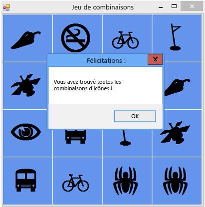

# Étape 8 : Ajouter une méthode pour vérifier si le joueur a gagné
Vous avez créé un jeu divertissant, mais il a besoin d'un élément supplémentaire pour être complet. Le jeu doit se terminer en cas de victoire du joueur : vous devez donc ajouter une méthode `CheckForWinner()` pour vérifier si le joueur a gagné.

## Pour ajouter une méthode afin de vérifier si le joueur a gagné

1. Ajoutez une méthode `CheckForWinner()` en bas de votre code, sous le gestionnaire d'événements `timer1_Tick()`, comme illustré dans le code suivant.

     [!code-csharp[VbExpressTutorial4Step8#10](../ide/codesnippet/CSharp/step-8-add-a-method-to-verify-whether-the-player-won_1.cs)]
     [!code-vb[VbExpressTutorial4Step8#10](../ide/codesnippet/VisualBasic/step-8-add-a-method-to-verify-whether-the-player-won_1.vb)]

     La méthode utilise une autre boucle `foreach` en Visual C# ou `For Each` en Visual Basic pour parcourir chaque étiquette dans le <xref:System.Windows.Forms.TableLayoutPanel>. Elle utilise l'opérateur d'égalité (`==` en Visual C# et `=` en Visual Basic) pour analyser la couleur de l'icône de chaque contrôle Label et vérifier si elle correspond à celle de l'arrière-plan. Si les couleurs correspondent, l'icône reste invisible et le joueur n'a pas associé toutes les icônes restantes. Dans ce cas, le programme utilise une instruction `return` pour ignorer le reste de la méthode. Si la boucle parcourt tous les contrôles Label sans exécuter l'instruction `return`, cela signifie que toutes les icônes du formulaire ont été associées. Le programme affiche un MessageBox pour féliciter le joueur d'avoir gagné, puis appelle la méthode `Close()` du formulaire pour arrêter le jeu.

2. Ensuite, appelez la nouvelle méthode `CheckForWinner()` via le gestionnaire d'événements <xref:System.Windows.Forms.Control.Click> du contrôle Label. Veillez à ce que votre programme vérifie si le joueur a gagné après avoir affiché la seconde icône choisie par le joueur. Recherchez la ligne où vous définissez la couleur de la seconde icône choisie, puis appelez la méthode `CheckForWinner()` juste après, comme cela est illustré dans le code suivant.

     [!code-csharp[VbExpressTutorial4Step8#11](../ide/codesnippet/CSharp/step-8-add-a-method-to-verify-whether-the-player-won_2.cs)]
     [!code-vb[VbExpressTutorial4Step8#11](../ide/codesnippet/VisualBasic/step-8-add-a-method-to-verify-whether-the-player-won_2.vb)]

3. Enregistrez et exécutez le programme. Jouez au jeu et associez toutes les icônes. Lorsque vous gagnez, le programme affiche un **MessageBox** de félicitations (comme illustré à la figure suivante), puis ferme la boîte de message.

     
**Jeu de combinaisons** avec **MessageBox**

## Pour continuer ou examiner

- Pour passer à l’étape suivante du tutoriel, consultez [Étape 9 : Tester d’autres fonctionnalités](../ide/step-9-try-other-features.md)

- Pour revenir à l’étape précédente du tutoriel, consultez [Étape 7 : Garder les paires visibles](../ide/step-7-keep-pairs-visible.md).
