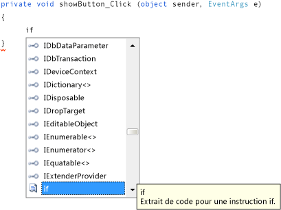

# Étape 8 : Écrire du code pour le gestionnaire d’événements du bouton Afficher une image

Dans cette étape, vous configurez le bouton **Afficher une image** pour qu’il fonctionne de la manière suivante :

- Quand un utilisateur choisit ce bouton, le programme ouvre une boîte de dialogue <xref:System.Windows.Forms.OpenFileDialog>.

- Si un utilisateur ouvre un fichier image, le programme affiche cette image dans le contrôle <xref:System.Windows.Forms.PictureBox>.

L'IDE dispose d'un outil puissant appelé IntelliSense pour vous aider à écrire du code. Lorsque vous tapez du code, l'IDE ouvre une zone de saisie semi-automatique en fonction des mots partiels que vous entrez. Il essaie de déterminer ce que vous voulez écrire ensuite, et passe automatiquement au dernier élément que vous choisissez dans la liste. Vous pouvez utiliser les touches de direction Haut et Bas pour parcourir la liste, ou continuer à taper des lettres pour limiter le nombre de choix. Quand vous voyez le choix qui vous intéresse, appuyez sur la touche **Tab** pour le sélectionner. Sinon, vous pouvez ignorer les suggestions, si vous n'en avez pas besoin.

Pour obtenir une version vidéo de cette rubrique, consultez [Turoriel 1 : Créer une visionneuse d’images en Visual Basic – vidéo 4](https://msdn.microsoft.com/vstudio/gg315355.aspx). Cette vidéo utilise une version antérieure de Visual Studio et présente donc de légères différences quant à certaines commandes de menu et à d’autres éléments de l’interface utilisateur. Toutefois, les concepts et les procédures fonctionnent de façon similaire dans la version actuelle de Visual Studio.

## Pour écrire du code pour le gestionnaire d'événements du bouton Afficher une image

1.  Ouvrez le **Concepteur Windows Forms** et double-cliquez sur le bouton **Afficher une image**. L'IDE accède immédiatement au concepteur de code et place votre curseur à l'intérieur de la méthode `showButton_Click()` que vous avez ajoutée précédemment.

2.  Tapez un `i` sur la ligne vide entre les deux accolades `{ }`. (En Visual Basic, écrivez sur la ligne vide entre `Private Sub...` et `End Sub`.) Une fenêtre **IntelliSense** s’ouvre, comme indiqué dans l’image suivante.

     

3.  La fenêtre **IntelliSense** doit mettre le mot `if` en surbrillance. (Dans le cas contraire, entrez un `f` minuscule, et elle le fera.) Notez la petite *info-bulle* qui apparaît avec la description **Extrait de code pour l’instruction if** en regard de la fenêtre **IntelliSense**. (En Visual Basic, l'info-bulle indique également qu'il s'agit d'un extrait de code, mais avec un libellé légèrement différent.) Comme vous voulez utiliser cet extrait de code, appuyez sur la touche **Tab** pour insérer `if` dans votre code. Appuyez ensuite à nouveau sur la touche **Tab** pour utiliser l’extrait de code `if`. (Si vous avez effectué un autre choix et si votre fenêtre **IntelliSense** a disparu, revenez en arrière pour effacer le `i` et retapez-le pour que la fenêtre **IntelliSense** s’ouvre à nouveau.)

     

4.  Ensuite, utilisez IntelliSense pour entrer le reste du code destiné à ouvrir une boîte de dialogue **Ouvrir un fichier**. Si l’utilisateur a choisi le bouton **OK**, le contrôle PictureBox charge le fichier que l’utilisateur a sélectionné. Les étapes suivantes vous expliquent comment entrer le code, et malgré leur nombre important, elles se limitent en fait à quelques séquences de touches :

    1.  Commencez avec le texte sélectionné **true** dans l’extrait de code. Tapez `op` pour le remplacer. (En Visual Basic, comme vous devez commencer par une majuscule, tapez `Op`.)

    2.  La fenêtre **IntelliSense** s’ouvre et affiche **openFileDialog1**. Appuyez sur la touche **Tab** pour sélectionner ce composant. (En Visual Basic, comme chaque mot commence par une majuscule, il est écrit **OpenFileDialog1**. Vérifiez que **OpenFileDialog1** est sélectionné.)

         Pour en savoir plus sur `OpenFileDialog`, consultez [OpenFileDialog](<xref:System.Windows.Forms.OpenFileDialog>).

    3.  Tapez un point (`.`) (appelé « dot » par de nombreux programmeurs). Étant donné que vous avez tapé un point juste après **openFileDialog1**, une fenêtre **IntelliSense** s’ouvre pour afficher toutes les propriétés et les méthodes du composant **OpenFileDialog**. Ce sont les mêmes propriétés qui s’affichent dans la fenêtre **Propriétés** quand vous effectuez ce choix dans le **Concepteur Windows Forms**. Vous pouvez également choisir des méthodes qui peuvent indiquer au composant d'effectuer certaines opérations (comme ouvrir une boîte de dialogue).

        > [!NOTE]
        > La fenêtre **IntelliSense** vous donne accès à des propriétés et à des méthodes. Pour déterminer ce qui est affiché, regardez l’icône à gauche de chaque élément dans la fenêtre **IntelliSense**. Vous pouvez voir l'image d'un bloc en regard de chaque méthode et l'image d'une clé à molette en regard de chaque propriété. Il y a également une icône d'éclair en regard de chaque événement. Ces images se présentent comme suit.

         

         

         

    4.  Commencez à taper `ShowDialog` (les majuscules n’ont aucune importance dans IntelliSense). La méthode `ShowDialog()` affichera la boîte de dialogue **Ouvrir un fichier**. Une fois que la fenêtre a mis **ShowDialog** en surbrillance, appuyez sur la touche **Tab**. Vous pouvez également sélectionner « ShowDialog » et choisir la touche **F1** pour obtenir de l’aide.

         Pour en savoir plus sur la méthode `ShowDialog()`, consultez [ShowDialog, méthode](<xref:System.Windows.Forms.Form.ShowDialog%2A>).

    5.  Quand vous utilisez une méthode sur un contrôle ou un composant (opération désignée sous le nom d’*appel de méthode*), vous devez ajouter des parenthèses. Par conséquent, entrez les parenthèses ouvrantes et fermantes juste après le « g » dans `ShowDialog` : `()` Il doit maintenant ressembler à « openFileDialog1.ShowDialog() ».

        > [!NOTE]
        > Les méthodes sont des éléments essentiels dans un programme, et ce didacticiel vous a montré plusieurs façons de les utiliser. Vous pouvez appeler la méthode d’un composant pour lui demander d’effectuer une action, comme quand vous avez appelé la méthode `ShowDialog()` du composant **OpenFileDialog**. Vous pouvez créer vos propres méthodes pour que votre programme effectue certaines actions particulières (comme la méthode `showButton_Click()` que vous générez actuellement, qui permet d'ouvrir une boîte de dialogue et une image lorsqu'un utilisateur choisit un bouton).

    6.  Pour Visual C#, ajoutez un espace, puis deux signes égal (`==`). Pour Visual Basic, ajoutez un espace, puis un seul signe égal (`=`). (Visual C# et Visual Basic utilisent des opérateurs d'égalité différents.)

    7.  Ajoutez un autre espace. Une fois terminé, une autre fenêtre **IntelliSense** s’ouvre. Commencez à taper `DialogResult` et appuyez sur la touche **Tab** pour l’ajouter.

        > [!NOTE]
        > Lorsque vous écrivez du code pour appeler une méthode, elle retourne parfois une valeur. Ici, la méthode <xref:System.Windows.Forms.CommonDialog.ShowDialog> du composant **OpenFileDialog** retourne une valeur <xref:System.Windows.Forms.DialogResult>. DialogResult est une valeur spéciale qui vous indique ce qui s'est passé dans une boîte de dialogue. Un composant **OpenFileDialog** permet à l’utilisateur de choisir **OK** ou **Annuler** : sa méthode `ShowDialog()` retournera donc `DialogResult.OK` ou `DialogResult.Cancel`.

    8.  Tapez un point pour ouvrir la fenêtre **IntelliSense** de la valeur DialogResult. Tapez la lettre `O` et appuyez sur la touche **Tab pour in**sérer **OK**.

         Pour en savoir plus sur DialogResult, consultez [DialogResult](<xref:System.Windows.Forms.DialogResult>).

        > [!NOTE]
        >  La première ligne de code doit être terminée. Pour Visual C#, la ligne doit être la suivante.
        >
        >  `if (openFileDialog1.ShowDialog() == DialogResult.OK)`
        >
        >  Pour Visual Basic, la ligne doit être la suivante.
        >
        >  `If OpenFileDialog1.ShowDialog() = DialogResult.OK Then`

    9. Maintenant, ajoutez une ligne de code supplémentaire. Vous pouvez la taper (ou la copier et la coller), mais utilisez plutôt IntelliSense pour l'ajouter. Plus vous vous familiariserez avec IntelliSense, plus vous pourrez écrire votre propre code rapidement. Votre dernière méthode `showButton_Click()` se présente comme suit : (Sélectionnez l’onglet **VB** pour consulter la version Visual Basic du code.)

         [!code-csharp[VbExpressTutorial1Step8#1](../ide/codesnippet/CSharp/step-8-write-code-for-the-show-a-picture-button-event-handler_1.cs)]
         [!code-vb[VbExpressTutorial1Step8#1](../ide/codesnippet/VisualBasic/step-8-write-code-for-the-show-a-picture-button-event-handler_1.vb)]

## Pour continuer ou examiner

-   Pour passer à l’étape suivante du tutoriel, consultez [Étape 9 : Passer en revue, commenter et tester votre code](../ide/step-9-review-comment-and-test-your-code.md).

-   Pour revenir à l’étape précédente du tutoriel, consultez [Étape 7 : Ajouter des composants de boîte de dialogue à votre formulaire](../ide/step-7-add-dialog-components-to-your-form.md).
