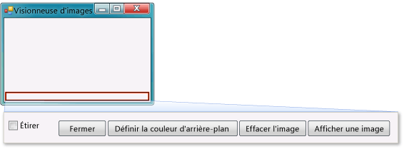

# <a name="step-9-review-comment-and-test-your-code"></a>Étape 9 : examiner, commenter et tester votre code

Ensuite, ajoutez un commentaire à votre code. Un commentaire est une note qui ne modifie pas le comportement de l’application. Il permet à une autre personne qui lit votre code de mieux le comprendre. L'ajout de commentaires à votre code est une bonne habitude à prendre.

Dans C#, deux barres obliques (//) marquent une ligne comme un commentaire. et par un guillemet simple (') en Visual Basic. Après avoir ajouté un commentaire, vous testez votre application. Quand vous travaillez sur vos projets, il est recommandé d'exécuter et de tester souvent le code afin que vous puissiez détecter et résoudre les problèmes au plus tôt, avant que le code devienne plus complexe. Cette opération est un *test itératif*.

Vous venez de générer un programme qui fonctionne, et bien qu'il ne soit pas encore terminé, il peut déjà charger une image. Avant d'ajouter un commentaire à votre code et de le tester, prenez le temps de revoir les concepts de code, car vous serez amené à les utiliser régulièrement :

- Quand vous avez double-cliqué sur le bouton **Afficher une image** dans le **Concepteur Windows Forms**, l’IDE a ajouté automatiquement une *méthode* au code de votre programme.

- Les méthodes vous permettent d'organiser votre code : c'est ainsi que votre code est regroupé.

- La plupart du temps, une méthode effectue un petit nombre de choses dans un ordre spécifique, par exemple comment votre méthode `showButton_Click()` (ou `ShowButton_Click()`) affiche une boîte de dialogue, puis charge une image.

- Une méthode contient des *instructions* ou des lignes de code. En d'autres termes, une méthode permet de regrouper des instructions de code.

- Quand une méthode est exécutée (ou *appelée*), les instructions qu’elle contient s’exécutent dans l’ordre, l’une après l’autre, en commençant par la première.

   Voici un exemple d'instruction.

  ```csharp
  PictureBox1.Load(openFileDialog1.FileName);
  ```

  ```vb
  pictureBox1.Load(openFileDialog1.FileName)
  ```

   Les instructions permettent à vos programmes d'effectuer des actions. Dans C#, une instruction se termine toujours par un point-virgule. En Visual Basic, la fin d'une ligne indique la fin d'une instruction. (Aucun point-virgule n’est nécessaire dans Visual Basic.) L’instruction précédente indique à votre contrôle <xref:System.Windows.Forms.PictureBox> de charger le fichier que l’utilisateur a sélectionné avec le composant **OpenFileDialog** .

## <a name="to-add-comments"></a>Pour ajouter des commentaires

1. Ajoutez le commentaire suivant à votre code.

     [!INCLUDE [devlang-control-csharp-vb](./includes/devlang-control-csharp-vb.md)]

     [!code-csharp[VbExpressTutorial1Step9_10#1](../ide/codesnippet/CSharp/step-9-review-comment-and-test-your-code_1.cs)]

     [!code-vb[VbExpressTutorial1Step9_10#1](../ide/codesnippet/VisualBasic/step-9-review-comment-and-test-your-code_1.vb)]

    Le gestionnaire d’événements <xref:System.Windows.Forms.Control.Click> du bouton **showButton** est maintenant terminé, et il fonctionne. Vous avez commencé votre code par une instruction `if`. Une instruction `if` est la manière dont vous indiquez à votre application, « vérifiez cette chose et, si elle est vraie, effectuez ces actions ». Dans ce cas, vous indiquez à votre application d’ouvrir la boîte de dialogue **ouvrir un fichier** , et si l’utilisateur sélectionne un fichier et choisit le bouton **OK** , chargez ce fichier dans le **PictureBox**.

    > [!TIP]
    > L’IDE est conçu pour vous aider à écrire votre code rapidement, notamment grâce aux *extraits de code*. Un extrait est un raccourci qui se développe en petit bloc de code.
    >
    >  Vous pouvez consulter tous les extraits de code disponibles. Dans la barre de menus, choisissez **Outils** > **Gestionnaire des extraits de code**. Pour C#, l’extrait de code `if` est en **visuel C#**  . Par Visual Basic, les extraits de code `if` se trouvent dans des **modèles de Code**  >  des**conditions et des boucles**. Vous pouvez utiliser ce gestionnaire pour parcourir les extraits existants ou ajouter les vôtres.
    >
    >  Pour activer un extrait de code lorsque vous écrivez du code, tapez-le et appuyez sur la touche **Tab**. De nombreux extraits de code étant affichés dans la fenêtre **IntelliSense**, vous devez appuyer deux fois sur la touche **Tab**, d’abord pour sélectionner l’extrait de code dans la fenêtre **IntelliSense**, puis pour indiquer à l’IDE de l’utiliser. (IntelliSense prend en charge l'extrait `if`, mais pas `ifelse`.)

1. Avant d’exécuter votre application, enregistrez-la en choisissant le bouton **enregistrer tout** de la barre d’outils, qui doit ressembler à la capture d’écran suivante.

     <br>
*Bouton* ***enregistrer tout***

     Vous pouvez également enregistrer votre application en choisissant **fichier** > **enregistrer tout** à partir de la barre de menus (ou en appuyant sur **Ctrl**+**Shift**+**S**). Il est conseillé d'enregistrer votre travail régulièrement.

     Lorsqu’il est en cours d’exécution, votre programme doit ressembler à l’image suivante.

     <br>***Visionneuse d'images***

## <a name="to-test-your-app"></a>Pour tester votre application

1. Appuyez sur la touche **F5** ou choisissez le bouton **Démarrer le débogage** dans la barre d’outils.

1. Choisissez le bouton **Afficher une image** pour exécuter le code que vous venez d’écrire. Tout d’abord, l’application ouvre une boîte de dialogue **ouvrir un fichier** . Vérifiez que vos filtres s’affichent dans la liste déroulante **Types de fichiers** en bas de la boîte de dialogue. Ensuite, naviguez jusqu'à une image et ouvrez-la. En général, des échantillons d’images sont fournis avec le système d’exploitation Windows. Ils se trouvent dans votre dossier *Mes documents*, à l’intérieur du dossier *Mes images\Échantillons d’images*.

    > [!TIP]
    > Si vous ne voyez pas d’images affichées dans la boîte de dialogue **Sélectionner un fichier image**, vérifiez que le filtre **Tous les fichiers (*.\*)** est sélectionné dans la liste déroulante figurant en bas à droite de la boîte de dialogue.

1. Chargez une image et elle s'affiche dans votre PictureBox. Essayez ensuite de redimensionner votre formulaire en faisant glisser ses bordures. Étant donné que votre PictureBox est ancré à l’intérieur d’un TableLayoutPanel (lui-même ancré à l’intérieur du formulaire), votre zone d’image se redimensionne automatiquement à la même largeur que le formulaire, et remplit les 90 pour cent supérieurs du formulaire. C'est la raison pour laquelle vous avez utilisé les conteneurs <xref:System.Windows.Forms.TableLayoutPanel> et <xref:System.Windows.Forms.FlowLayoutPanel> : ils permettent à votre formulaire de converser des dimensions correctes lorsque l'utilisateur le redimensionne.

     Pour le moment, les images de grande taille dépassent les bordures de votre visionneuse d'images. Dans l'étape suivante, vous ajouterez du code pour ajuster les images dans la fenêtre.

## <a name="to-continue-or-review"></a>Pour continuer ou examiner

- Pour passer à l’étape suivante du didacticiel, consultez **[étape 10 : écrire du code pour des boutons supplémentaires et une case à cocher](../ide/step-10-write-code-for-additional-buttons-and-a-check-box.md)** .

- Pour revenir à l’étape précédente du tutoriel, consultez [Étape 8 : écrire du code pour le gestionnaire d’événements du bouton Afficher une image](../ide/step-8-write-code-for-the-show-a-picture-button-event-handler.md).

## <a name="see-also"></a>Voir aussi

* [Didacticiel 2 : créer un questionnaire mathématique chronométré](tutorial-2-create-a-timed-math-quiz.md)
* [Didacticiel 3 : créer un jeu de combinaisons](tutorial-3-create-a-matching-game.md)
