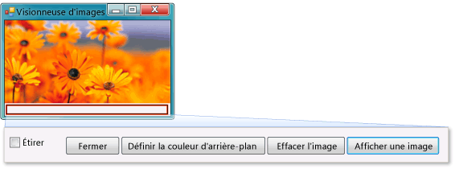

# Tutoriel 1 : créer une visionneuse d'images

Dans ce didacticiel, vous allez créer une application qui charge une image à partir d’un fichier et l’affiche dans une fenêtre. Vous apprenez à utiliser la **Concepteur Windows Forms** pour faire glisser des contrôles tels que des boutons et des zones d’image sur votre formulaire, définir leurs propriétés et utiliser des conteneurs pour redimensionner facilement le formulaire. Vous commencez également à écrire du code.

> [!NOTE]
> Ce didacticiel couvre à C# la fois et Visual Basic. vous devez donc vous concentrer sur les informations spécifiques au langage de programmation que vous utilisez.

Ce didacticiel vous guide tout au long des tâches suivantes :

* Créez un projet.

* Tester (déboguer) une application.

* Ajouter des contrôles de base, comme des cases à cocher et des boutons, à un formulaire.

* Positionner des contrôles sur un formulaire à l’aide de dispositions.

* Ajouter des boîtes de dialogue **Ouvrir un fichier** et **Couleur** à un formulaire.

* Écrire du code à l’aide d’IntelliSense et d’extraits de code.

* Écrire des méthodes de gestionnaire d'événements.

Lorsque vous avez terminé, votre application doit ressembler à l’image suivante :

## Liens de tutoriels

|Intitulé|Description|
|-----------|-----------------|
|[Étape 1 : créer un projet d’application Windows Forms](../ide/step-1-create-a-windows-forms-application-project.md)|Commencez par créer un projet d’application Windows Forms.|
|[Étape 2 : exécuter votre application visionneuse d’images](../ide/step-2-run-your-program.md)|Exécutez le projet d’application Windows Forms que vous avez créé à l’étape précédente.|
|[Étape 3 : définir les propriétés de votre formulaire](../ide/step-3-set-your-form-properties.md)|Modifiez l’apparence de votre formulaire à l’aide de la fenêtre **Propriétés**.|
|[Étape 4 : composer votre formulaire avec un contrôle TableLayoutPanel](../ide/step-4-lay-out-your-form-with-a-tablelayoutpanel-control.md)|Ajoutez un contrôle `TableLayoutPanel` à votre formulaire.|
|[Étape 5 : ajouter des contrôles à votre formulaire](../ide/step-5-add-controls-to-your-form.md)|Ajoutez des contrôles à votre formulaire (notamment des contrôles `PictureBox` et `CheckBox`). Ajoutez des boutons à votre formulaire.|
|[Étape 6 : affecter un nom à vos contrôles bouton](../ide/step-6-name-your-button-controls.md)|Renommez vos boutons en leur donnant des noms plus explicites.|
|[Étape 7 : ajouter des composants de dialogue à votre formulaire](../ide/step-7-add-dialog-components-to-your-form.md)|Ajoutez un composant `OpenFileDialog` et un composant `ColorDialog` à votre formulaire.|
|[Étape 8 : écrire du code pour le gestionnaire d’événements du bouton Afficher une image](../ide/step-8-write-code-for-the-show-a-picture-button-event-handler.md)|Écrivez du code à l’aide de l’outil IntelliSense.|
|[Étape 9 : examiner, commenter et tester votre code](../ide/step-9-review-comment-and-test-your-code.md)|Vérifiez et testez votre code. Ajoutez autant de commentaires que nécessaire.|
|[Étape 10 : écrire du code pour les boutons supplémentaires et une case à cocher](../ide/step-10-write-code-for-additional-buttons-and-a-check-box.md)|Écrivez du code à l'aide d'IntelliSense pour faire fonctionner d'autres boutons et une case à cocher.|
|[Étape 11 : exécuter votre application et essayer d’autres fonctionnalités](../ide/step-11-run-your-program-and-try-other-features.md)|Exécutez votre application et définissez la couleur d’arrière-plan. Essayez d'autres fonctionnalités, telles que la modification des couleurs, des polices et des bordures.|

D’autres ressources de formation vidéo gratuites sont également disponibles. Pour en savoir plus sur la C#programmation dans, consultez [ C# notions de base : développement pour les débutants](https://channel9.msdn.com/Series/C-Sharp-Fundamentals-Development-for-Absolute-Beginners). Pour en savoir plus sur la programmation en Visual Basic, consultez [Notions de base de Visual Basic : développement pour grands débutants](https://channel9.msdn.com/Series/Visual-Basic-Development-for-Absolute-Beginners).

## Étapes suivantes

Pour commencer le didacticiel, commencez à l' **[étape 1 : créer un projet d’application Windows Forms](../ide/step-1-create-a-windows-forms-application-project.md)** .

## Voir aussi

* [Autres C# didacticiels](/visualstudio/get-started/csharp/)
* [Didacticiels de Visual Basic](/visualstudio/get-started/visual-basic/)
* [C++gratuits](/cpp/get-started/tutorial-console-cpp)
