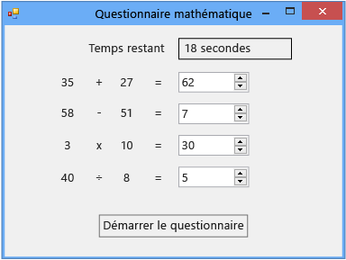

# Tutoriel 2 : créer un questionnaire mathématique chronométré

Dans ce didacticiel, vous générez un questionnaire dans lequel la personne interrogée doit résoudre quatre problèmes arithmétiques aléatoires dans un délai imparti. Vous apprenez à :

-   Générer des nombres aléatoires à l'aide de la classe <xref:System.Random>.

-   Déclencher des événements à une heure spécifique à l’aide d’un contrôle <xref:System.Windows.Forms.Timer>.

-   Contrôler le flux d'un programme à l'aide d'instructions `if else`.

-   Effectuer des opérations arithmétiques de base dans le code.

Quand vous avez terminé, votre questionnaire ressemble à l’image suivante, avec des valeurs différentes :

## Liens de tutoriels

Pour télécharger la version finale du questionnaire, consultez [Exemple complet de questionnaire de mathématiques du tutoriel](http://code.msdn.microsoft.com/Complete-Math-Quiz-8581813c).

> [!NOTE]
> Ce didacticiel couvre à la fois Visual C# et Visual Basic : ne tenez compte que des informations spécifiques au langage de programmation que vous utilisez.

## Rubriques connexes

|Titre|Description|
|-----------|-----------------|
|[Étape 1 : créer un projet et ajouter des étiquettes à votre formulaire](../ide/step-1-create-a-project-and-add-labels-to-your-form.md)|Commencez par créer le projet, modifier ses propriétés et ajouter des contrôles `Label`.|
|[Étape 2 : créer un problème d'addition aléatoire](../ide/step-2-create-a-random-addition-problem.md)|Créez un problème d'addition et utilisez la classe `Random` pour générer des nombres aléatoires.|
|[Étape 3 : ajouter un temporisateur](../ide/step-3-add-a-countdown-timer.md)|Ajoutez un temporisateur pour que le questionnaire soit chronométré.|
|[Étape 4 : ajouter la méthode CheckTheAnswer()](../ide/step-4-add-the-checktheanswer-parens-method.md)|Ajoutez une méthode pour vérifier si la personne interrogée a fourni une réponse correcte au problème.|
|[Étape 5 : ajouter des gestionnaires d’événements Enter pour les contrôles NumericUpDown](../ide/step-5-add-enter-event-handlers-for-the-numericupdown-controls.md)|Ajoutez des gestionnaires d'événements pour faciliter le déroulement du questionnaire.|
|[Étape 6 : ajouter un problème de soustraction](../ide/step-6-add-a-subtraction-problem.md)|Ajoutez un problème de soustraction qui génère des nombres aléatoires, utilise le minuteur et recherche les réponses correctes.|
|[Étape 7 : ajouter des problèmes de multiplication et de division](../ide/step-7-add-multiplication-and-division-problems.md)|Ajoutez des problèmes de multiplication et de division qui génèrent des nombres aléatoires, utilisent le minuteur et recherchent les réponses correctes.|
|[Étape 8 : personnaliser le questionnaire](../ide/step-8-customize-the-quiz.md)|Essayez d’autres fonctionnalités, telles que la modification des couleurs et l’ajout d’une aide.|
