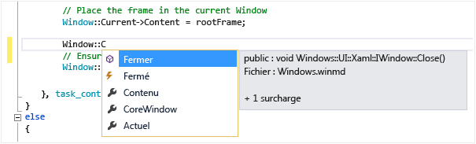

# <a name="using-intellisense-in-visual-studio"></a>Utilisation d’IntelliSense dans Visual Studio

IntelliSense est le terme général employé pour plusieurs fonctionnalités : Liste des membres, Informations sur les paramètres, Info express et Compléter le mot. Ces fonctionnalités vous aident à en savoir plus sur le code que vous utilisez, à assurer le suivi des paramètres que vous tapez et à ajouter des appels aux propriétés et aux méthodes en quelques séquences de touches.

De nombreux aspects d'IntelliSense sont spécifiques au langage. Pour plus d'informations sur l’utilisation d’IntelliSense dans différents langages, consultez les rubriques répertoriées dans la section [Voir aussi](#see-also).

## <a name="list-members"></a>Liste des membres

Une liste de membres valides d'un type (ou d'un espace de noms) apparaît lorsque vous tapez un caractère déclencheur (par exemple, un point (`.`) en code managé ou `::` en C++). Si vous continuez à taper des caractères, la liste est filtrée pour inclure uniquement les membres qui commencent par ces caractères ou les membres dont le nom contient *un* mot qui commence par ces caractères. IntelliSense effectue également une mise en correspondance en « casse mixte ». Pour afficher les correspondances, vous pouvez donc simplement taper la première lettre de chaque mot en casse mixte composant le nom de membre.

Après avoir sélectionné un élément, insérez-le dans votre code en appuyant sur la touche **Tab** ou en tapant un espace. Si vous sélectionnez un élément et que vous tapez un point, l'élément apparaît suivi du point, ce qui provoque l'affichage d'une autre liste de membres. Lorsque vous sélectionnez un élément, mais avant de l'insérer, vous obtenez des informations express le concernant.

Dans la liste des membres, l'icône de gauche représente le type de membre, tel que l'espace de noms, la classe, la fonction ou la variable. Pour obtenir une liste des icônes, consultez [Icônes de l’Explorateur d’objets et de la fenêtre Affichage de classes](../ide/class-view-and-object-browser-icons.md). Si la liste est longue, appuyez sur **Pg. préc** et **Pg. suiv** pour vous déplacer vers le haut ou vers le bas dans la liste.



Vous pouvez appeler la fonctionnalité **Liste des membres** manuellement en appuyant sur **Ctrl**+**J**, en choisissant **Edition** > **IntelliSense** > **Liste des membres** ou en choisissant le bouton **Liste des membres** dans la barre d’outils de l’éditeur. Lorsque la liste des membres est appelée sur une ligne vide ou en dehors d'une portée reconnue, elle affiche des symboles dans l'espace de noms global.

Pour désactiver par défaut la liste des membres (afin qu’elle n’apparaisse pas sauf si elle est explicitement appelée), accédez à **Outils** > **Options** > **Tous les langages** et désélectionnez **Répertorier automatiquement les membres**. Si vous souhaitez désactiver la liste des membres uniquement pour un langage spécifique, accédez à la page de paramètres **Général** pour ce langage.

Vous pouvez également passer en mode suggestion, où seul le texte que vous tapez est inséré dans le code. Par exemple, si vous entrez un identificateur qui ne figure pas dans la liste et que vous appuyez sur **Tab**, en mode de saisie semi-automatique, l’entrée remplace l’identificateur tapé. Pour basculer entre le mode Saisie semi-automatique et le mode Suggestion, appuyez sur **Ctrl**+**Alt**+**Barre d’espace** ou choisissez **Edition** > **IntelliSense** > **Activer/Désactiver le mode de saisie semi-automatique**.

## <a name="parameter-info"></a>Informations sur les paramètres

Informations sur les paramètres fournit des informations sur le nombre, les noms et les types des paramètres requis par une méthode, un paramètre de type générique d’attribut (en C#) ou un modèle (en C++).

Le paramètre suivant à taper pour la fonction vous est indiqué en gras. Pour les fonctions surchargées, vous pouvez utiliser les touches **Haut** et **Bas** pour consulter les différentes informations de paramètres concernant les surcharges de fonction.


Lorsque vous annotez des fonctions et des paramètres avec les commentaires de documentation XML, les commentaires apparaissent comme Informations sur les paramètres. Pour plus d’informations, consultez [Insérer des commentaires dans le code XML](../ide/supplying-xml-code-comments.md).

Vous pouvez appeler manuellement la fonctionnalité Informations sur les paramètres en choisissant **Edition** > **IntelliSense** > **Informations sur les paramètres**, en appuyant sur **Ctrl**+**Maj**+**Barre d’espace** ou en choisissant le bouton **Informations sur les paramètres** dans la barre d’outils de l’éditeur.

## <a name="quick-info"></a>Info express

Infos express affiche la déclaration complète de tout identificateur dans votre code.


Quand vous sélectionnez un membre dans la zone **Liste des membres**, l’info-bulle Info express s’affiche aussi.


Vous pouvez appeler manuellement la fonctionnalité Info express en choisissant **Edition** > **IntelliSense** > **Info express**, en appuyant sur **Ctrl**+**I** ou en choisissant le bouton **Info express** dans la barre d’outils de l’éditeur.

Si une fonction est surchargée, il est possible que la fonctionnalité IntelliSense n'affiche pas les informations de toutes les formes de la surcharge.

Vous pouvez désactiver la fonctionnalité Info express pour le code C++ en accédant à **Outils** > **Options** > **Éditeur de texte** > **C/C++** > **Avancé**, puis en définissant **Info express automatique** sur `false`.

## <a name="complete-word"></a>Compléter le mot

La fonctionnalité Compléter le mot entre automatiquement la fin du nom de variable, de commande ou de fonction dès que vous avez entré assez de caractères pour lever toute ambiguïté sur le nom. Vous pouvez appeler la fonctionnalité Compléter le mot en choisissant **Edition** > **IntelliSense** > **Compléter le mot**, en appuyant sur **Ctrl**+**Espace** ou en choisissant le bouton **Compléter le mot** dans la barre d’outils de l’éditeur.

## <a name="intellisense-options"></a>Options IntelliSense

Les options IntelliSense sont activées par défaut. Pour les désactiver, choisissez **Outils** > **Options** > **Éditeur de texte** et désélectionnez **Informations sur les paramètres** ou **Répertorier automatiquement les membres** si vous n’avez pas besoin de la fonctionnalité Liste des membres.

## <a name="troubleshoot-intellisense"></a>Résoudre les problèmes d’IntelliSense

Dans certains cas, les options IntelliSense ne fonctionneront peut-être pas comme vous l'attendez.

**Le curseur se trouve en dessous d’une erreur de code.** Vous ne pourrez peut-être pas utiliser IntelliSense si une fonction incomplète ou une autre erreur existe dans le code situé au-dessus du curseur, car IntelliSense ne pourra peut-être pas analyser les éléments du code. Vous pouvez résoudre ce problème en commentant le code applicable.

**Le curseur se trouve dans un commentaire de code.** Vous ne pouvez pas utiliser IntelliSense si le curseur se trouve dans un commentaire de votre fichier source.

**Le curseur se trouve dans un littéral de chaîne.** Vous ne pouvez pas utiliser IntelliSense si le curseur se trouve entre les guillemets entourant un littéral de chaîne, comme dans l'exemple suivant :

```cpp
MessageBox( hWnd, "String literal|")
```

**Les options automatiques sont désactivées.** Par défaut, IntelliSense est automatiquement utilisé, mais vous pouvez le désactiver. Même lorsque la saisie semi-automatique des instructions est désactivée, vous pouvez appeler une fonctionnalité IntelliSense.

## <a name="see-also"></a>Voir aussi

- [Visual Basic IntelliSense](../ide/visual-basic-specific-intellisense.md)
- [C# IntelliSense](../ide/visual-csharp-intellisense.md)
- [JavaScript IntelliSense](../ide/javascript-intellisense.md)
- [Écrire et refactoriser du code (C++)](/cpp/ide/writing-and-refactoring-code-cpp)
- [Insérer des commentaires dans le code XML](../ide/supplying-xml-code-comments.md)