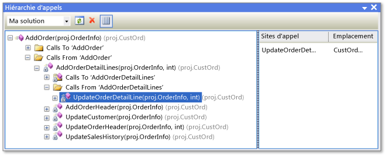

# Affichage de la structure du code

Vous pouvez examiner les objets et les membres dans des projets Visual Studio, ainsi que les objets et les membres dans des composants .NET Framework, des composants COM, des bibliothèques de liens dynamiques (DLL) et des bibliothèques de types (TLB).

Vous pouvez également utiliser l’**Explorateur de solutions** pour parcourir les types et les membres dans vos projets, rechercher des symboles, afficher la hiérarchie d’appels d’une méthode, rechercher les références des symboles, etc., sans avoir à basculer entre les différentes fenêtres d’outils répertoriées précédemment.

Si vous avez Visual Studio Enterprise, vous pouvez utiliser les cartes de code pour visualiser la structure de votre code et ses dépendances sur l’ensemble de la solution, et explorer les parties du code qui vous intéressent. Pour plus d’informations, consultez [Mapper les dépendances dans vos solutions](../modeling/map-dependencies-across-your-solutions.md).

> [!NOTE]
> L’édition de Visual Studio et les paramètres que vous utilisez peuvent affecter les fonctionnalités de l’environnement IDE. Elles peuvent différer de celles décrites dans cette rubrique.

##   Affichage de classes (Visual Basic, C#, C++)

L’**affichage de classes** est illustré dans le cadre de l’**Explorateur de solutions** ainsi que dans une fenêtre distincte. La fenêtre **Affichage de classes** affiche les éléments d’une application. Le volet supérieur affiche les espaces de noms, les types, les interfaces, les énumérations et les classes, alors que le volet inférieur affiche les membres qui appartiennent au type sélectionné dans le volet supérieur. Cette fenêtre vous permet d’accéder aux définitions des membres dans le code source (ou dans l’**Explorateur d’objets** si l’élément est défini en dehors de votre solution).

Il est inutile de compiler un projet pour afficher ses éléments dans la fenêtre **Affichage de classes**. La fenêtre est actualisée quand vous modifiez le code dans votre projet.

Vous pouvez ajouter du code à votre projet en sélectionnant le nœud du projet et en choisissant le bouton **Ajouter** pour ouvrir la boîte de dialogue **Ajouter un nouvel élément**. Le code est ajouté dans un fichier distinct.

Si votre projet est archivé dans le contrôle de code source, chaque élément **Affichage de classes** affiche une icône qui indique l’état du code source du fichier. Les commandes de contrôle de code source courantes, comme **Extraire**, **Archiver** et **Obtenir la dernière version**, sont également disponibles dans le menu contextuel de l’élément.

### Barre d’outils Affichage de classes

La barre d'outils Affichage de classes contient les commandes ci-dessous.

|||  
|-|-|  
|**Nouveau dossier**|Crée un dossier ou sous-dossier virtuel dans lequel vous pouvez organiser les éléments fréquemment utilisés. Ils sont enregistrés dans le fichier solution (.suo) actif. Une fois que vous avez renommé ou supprimé un élément dans votre code, il peut apparaître dans un dossier virtuel en tant que nœud d'erreur. Pour corriger ce problème, supprimez le nœud d'erreur. Si vous avez renommé un élément, vous pouvez le déplacer de nouveau de la hiérarchie de projet vers le dossier.|  
|**Précédent**|Permet d'accéder à l'élément précédemment sélectionné.|  
|**Suivant**|Permet d'accéder à l'élément sélectionné suivant.|  
|**Afficher le diagramme de classes** (projets de code managé uniquement)|Devient disponible quand vous sélectionnez un espace de noms ou un type dans **Affichage de classes**. Quand un espace de noms est sélectionné, le diagramme de classes affiche tous les types qu'il contient. Quand un type est sélectionné, le diagramme de classes affiche uniquement ce type.|  

### Paramètres de l’affichage de classes

Le bouton **Paramètres de l’affichage de classes** dans la barre d’outils contient les paramètres ci-dessous.

|||  
|-|-|  
|**Afficher les types de base**|Les types de base sont affichés.|  
|**Afficher les types dérivés**|Les types dérivés sont affichés.|  
|**Afficher les types et les membres masqués**|Les types et membres masqués (non prévus pour être utilisés par les clients) sont affichés en gris clair.|  
|**Afficher les membres publics**|Les membres publics sont affichés.|  
|**Afficher les membres protégés**|Les membres protégés sont affichés.|  
|**Afficher les membres privés**|Les membres privés sont affichés.|  
|**Afficher les autres membres**|D'autres types de membres sont affichés, y compris les membres internes (ou Friend en Visual Basic).|  
|**Afficher les membres hérités**|Les membres hérités sont affichés.|  
|**Afficher les méthodes d’extension**|Les méthodes d’extension sont affichées.|  

### Menu contextuel de la fenêtre Affichage de classes

Le menu contextuel dans la fenêtre **Affichage de classes** peut contenir les commandes ci-dessous, selon le type de projet sélectionné.

|||  
|-|-|  
|**Atteindre la définition**|Recherche la définition de l’élément dans le code source ou dans l’**Explorateur d’objets** si l’élément n’est pas défini dans le projet ouvert.|  
|**Parcourir les définitions**|Affiche l’élément sélectionné dans l’**Explorateur d’objets**.|  
|**Rechercher toutes les références**|Recherche l’élément de l’objet actuellement sélectionné et affiche les résultats dans une fenêtre **Résultats de la recherche**.|  
|**Appliquer le filtre au type** (code managé uniquement)|Affiche uniquement le type ou l'espace de noms sélectionné. Vous pouvez supprimer le filtre en choisissant le bouton **Effacer Résultats de la recherche** (X) situé à côté de la zone **Rechercher**.|  
|**Copier**|Copie le nom qualifié complet de l'élément.|  
|**Trier par ordre alphabétique**|Répertorie les types et les membres dans l'ordre alphabétique par nom.|  
|**Trier les membres par type**|Répertorie les types et les membres dans l'ordre par type (de sorte que les classes précèdent les interfaces, les interfaces précèdent les délégués et les méthodes précèdent les propriétés).|  
|**Trier les membres par accès**|Répertorie les types et les membres dans l'ordre par type d'accès, tel que public ou privé.|  
|**Grouper par type de membre**|Trie les types et les membres en groupes par type d'objet.|  
|**Atteindre la déclaration** (code C++ uniquement)|Affiche la déclaration du type ou du membre dans le code source, si elle est disponible.|  
|**Atteindre la définition**|Affiche la définition du type ou du membre dans le code source, si elle est disponible.|  
|**Atteindre la référence**|Affiche une référence au type ou au membre dans le code source, si elle est disponible.|  
|**Afficher la hiérarchie d’appels**|Affiche la méthode sélectionnée dans la fenêtre **Hiérarchie d’appels**.|  

##   Fenêtre Hiérarchie d’appels (Visual Basic, C#, C++)

La fenêtre **Hiérarchie d’appels** indique où une méthode donnée (ou une propriété ou un constructeur) est appelée, et répertorie les méthodes qui sont appelées à partir de cette méthode. Vous pouvez afficher plusieurs niveaux du graphique des appels, qui montre les relations appelant/appelé parmi les méthodes dans une portée spécifiée.

Vous pouvez afficher la fenêtre **Hiérarchie d’appels** en sélectionnant une méthode (ou une propriété ou un constructeur), puis en choisissant **Afficher la hiérarchie d’appels** dans le menu contextuel. L'affichage doit ressembler à l'illustration suivante.

La liste déroulante de la barre d’outils vous permet de spécifier la portée de la hiérarchie : la solution, le projet actuel ou le document actif.

Le volet principal affiche les appels en direction et en provenance de la méthode, et le volet **Sites d’appel** affiche l’emplacement de l’appel sélectionné. Pour les membres virtuels ou abstraits, un nœud **Remplace nom de méthode** apparaît. Pour les membres d’interface, un nœud **Implémente nom de méthode** apparaît.

La fenêtre **Hiérarchie d’appels** ne recherche pas les références au groupe de méthodes qui incluent des emplacements où une méthode est ajoutée en tant que gestionnaire d’événements ou est assignée à un délégué. Pour trouver ces références, utilisez la commande **Rechercher toutes les références**.

Le menu contextuel de la fenêtre **Hiérarchie d’appels** contient les commandes ci-dessous.

|||  
|-|-|  
|**Ajouter comme nouvelle racine**|Ajoute le nœud sélectionné en tant que nouveau nœud racine.|  
|**Supprimer racine**|Supprime le nœud racine sélectionné du volet d’arborescence.|  
|**Atteindre la définition**|Navigue jusqu'à la définition d'origine d'une méthode.|  
|**Rechercher toutes les références**|Recherche dans le projet toutes les références à la méthode sélectionnée.|  
|**Copier**|Copie le nœud sélectionné (mais pas ses sous-nœuds).|  
|**Actualiser**|Actualise les informations.|  

##   Explorateur d’objets

L’**Explorateur d’objets** affiche les descriptions du code dans vos projets.

Vous pouvez filtrer ce que vous souhaitez afficher dans l’**Explorateur d’objets**. À l’aide de la liste déroulante située en haut de la fenêtre, vous pouvez choisir parmi les options suivantes :

- Tout .NET Framework

- Silverlight

- La solution active

- Un jeu personnalisé de composants

Les composants personnalisés peuvent inclure des fichiers exécutables de code managé, des assemblys de bibliothèque, des bibliothèques de types et des fichiers .ocx. Il n'est pas possible d'ajouter des composants personnalisés C++. Les paramètres personnalisés sont enregistrés dans le répertoire d’application utilisateur Visual Studio : %APPDATA%\Microsoft\VisualStudio\15.0\ObjBrowEX.dat.

Le volet gauche de l’**Explorateur d’objets** montre les conteneurs physiques, tels que les composants COM et .NET Framework. Vous pouvez développer les nœuds de conteneur pour afficher les espaces de noms qu’ils contiennent, puis développer les espaces de noms pour afficher les types qu’ils contiennent. Quand vous sélectionnez un type, ses membres (tels que les propriétés et les méthodes) sont répertoriés dans le volet droit. Le volet inférieur droit affiche des informations détaillées sur l'élément sélectionné.

Vous pouvez rechercher un élément spécifique à l’aide de la zone **Rechercher** en haut de la fenêtre. Les recherches ne respectent pas la casse. Les résultats de recherche sont affichés dans le volet gauche. Pour effacer une recherche, choisissez le bouton **Effacer la recherche** (X) situé à côté de la zone **Rechercher**.

L’**Explorateur d’objets** assure le suivi des sélections effectuées et vous pouvez naviguer entre vos sélections à l’aide des boutons **Suivant** et **Précédent** de la barre d’outils.

Vous pouvez utiliser l’**Explorateur d’objets** pour ajouter une référence d’assembly à une solution ouverte en sélectionnant un élément (assembly, espace de noms, type ou membre) et en choisissant le bouton **Ajouter une référence** dans la barre d’outils.

### Paramètres de l’Explorateur d’objets

Choisissez le bouton **Paramètres de l’Explorateur d’objets** dans la barre d’outils pour spécifier l’un des affichages suivants.

|||  
|-|-|  
|**Afficher les espaces de noms**|Affiche les espaces de noms plutôt que les conteneurs physiques, dans le volet gauche. Les espaces de noms stockés dans plusieurs conteneurs physiques sont fusionnés.|  
|**Afficher les conteneurs**|Affiche les conteneurs physiques plutôt que les espaces de noms, dans le volet gauche. **Afficher les espaces de noms** et **Afficher les conteneurs** sont des paramètres qui s’excluent mutuellement.|  
|**Afficher les types de base**|Affiche les types de base.|  
|**Afficher les types dérivés**|Affiche les types dérivés.|  
|**Afficher les types et les membres masqués**|Affiche les types et membres masqués (non prévus pour être utilisés par les clients) en gris clair.|  
|**Afficher les membres publics**|Affiche les membres publics.|  
|**Afficher les membres protégés**|Affiche les membres protégés.|  
|**Afficher les membres privés**|Affiche les membres privés.|  
|**Afficher les autres membres**|Affiche d'autres types de membres, y compris les membres internes (ou Friend en Visual Basic).|  
|**Afficher les membres hérités**|Affiche les membres hérités.|  
|**Afficher les méthodes d’extension**|Affiche les méthodes d’extension.|  

### Commandes du menu contextuel de l’Explorateur d’objets

Le menu contextuel dans l’**Explorateur d’objets** peut contenir les commandes ci-dessous, selon le type d’élément sélectionné.

|||  
|-|-|  
|**Parcourir les définitions**|Affiche le nœud principal de l'élément sélectionné.|  
|**Rechercher toutes les références**|Recherche l’élément de l’objet actuellement sélectionné et affiche les résultats dans une fenêtre **Résultats de la recherche**.|  
|**Appliquer le filtre au type**|Affiche uniquement le type ou l'espace de noms sélectionné. Vous pouvez supprimer le filtre en choisissant le bouton **Effacer la recherche**.|  
|**Copier**|Copie le nom qualifié complet de l'élément.|  
|**Supprimer**|Si la portée est un jeu personnalisé de composants, supprime le composant sélectionné de la portée.|  
|**Trier par ordre alphabétique**|Répertorie les types et les membres dans l'ordre alphabétique par nom.|  
|**Trier par type d’objet**|Répertorie les types et les membres dans l'ordre par type (de sorte que les classes précèdent les interfaces, les interfaces précèdent les délégués et les méthodes précèdent les propriétés).|  
|**Trier les objets par accès**|Répertorie les types et les membres dans l'ordre par type d'accès, tel que public ou privé.|  
|**Grouper par type d’objet**|Trie les types et les membres en groupes par type d'objet.|  
|**Atteindre la déclaration** (projets C++ uniquement)|Affiche la déclaration du type ou du membre dans le code source, si elle est disponible.|  
|**Atteindre la définition**|Affiche la définition du type ou du membre dans le code source, si elle est disponible.|  
|**Atteindre la référence**|Affiche une référence au type ou au membre dans le code source, si elle est disponible.|  
|**Afficher la hiérarchie d’appels**|Affiche la méthode sélectionnée dans la fenêtre **Hiérarchie d’appels**.|  

##   Fenêtre Définition de code (C#, C++)

La fenêtre **Définition de code** affiche la définition d’un type ou membre sélectionné dans le projet actif. Le type ou le membre peut être sélectionné dans l'éditeur de code ou dans une fenêtre d'affichage de code.

Cette fenêtre est en lecture seule mais vous pouvez y définir des points d'arrêt ou des signets. Pour modifier la définition affichée, choisissez **Modifier la définition** dans le menu contextuel. Cela ouvre le fichier source dans l'éditeur de code et place le point d'insertion sur la ligne où la définition commence.

### Menu contextuel de la fenêtre Définition de code

Le menu contextuel dans la fenêtre **Définition de code** peut contenir les commandes répertoriées ci-dessous, selon le langage de programmation.

|||  
|-|-|  
|**Créer des tests unitaires**|Crée des tests unitaires pour l'élément sélectionné.|  
|**Générer un diagramme de séquence**|Quand une méthode est sélectionnée, génère un diagramme de séquence.|  
|**Créer un accesseur private**|Si un test unitaire est présent dans la solution, génère une méthode que le test utilise pour accéder au code.|  
|**Atteindre la définition**|Recherche la définition (ou les définitions, pour des classes partielles) et l’affiche dans une fenêtre **Résultats de la recherche**.|  
|**Rechercher toutes les références**|Recherche les références au type ou au membre dans la solution.|  
|**Afficher la hiérarchie d’appels**|Affiche la méthode dans la fenêtre **Hiérarchie d’appels**.|  
|**Afficher les tests d’appel**|S'il existe des tests unitaires dans le projet, affiche les tests qui appellent le code sélectionné.|  
|**Exécuter les tests d’appel**|S'il existe des tests unitaires dans le projet, exécute les tests pour le code sélectionné.|  
|**Point d’arrêt**|Insère un point d'arrêt (ou un point de trace).|  
|**Exécuter jusqu’au curseur**|Exécute le programme en mode débogage jusqu'à l'emplacement du curseur.|  
|**Copier**|Copie la ligne sélectionnée.|  
|**Mode Plan**|Commandes de mode Plan standard.|  
|**Modifier la définition**|Déplace le point d'insertion vers la définition dans la fenêtre de code.|  
|**Choisir l’encodage**|Ouvre la fenêtre **Encodage** afin que vous puissiez définir un encodage pour le fichier.|  

### Fenêtre Structure du document

Vous pouvez utiliser la fenêtre **Structure du document** conjointement aux vues de concepteurs comme le concepteur pour une page XAML ou un concepteur Windows Form, ou avec des pages HTML. Cette fenêtre affiche les éléments dans une arborescence, afin que vous puissiez consulter la structure logique du formulaire ou de la page et rechercher des contrôles incorporés en profondeur ou masqués.

## Voir aussi

[Affichage de classes et Explorateur d’objets, icônes](../ide/class-view-and-object-browser-icons.md)