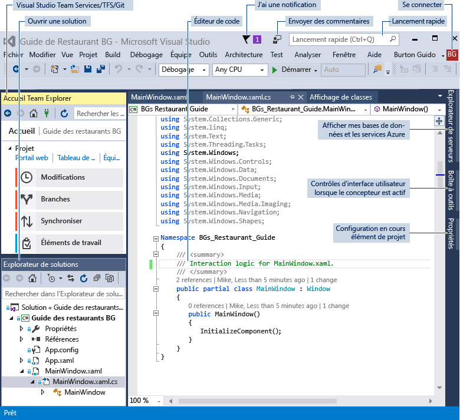
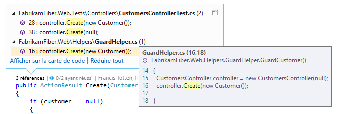
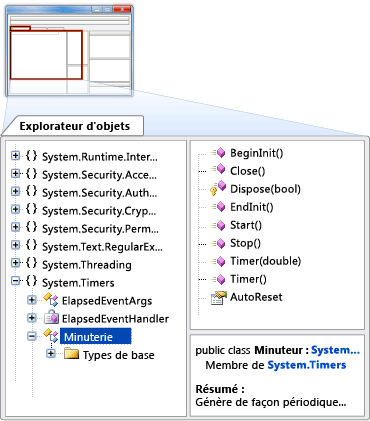
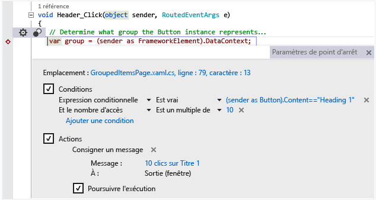
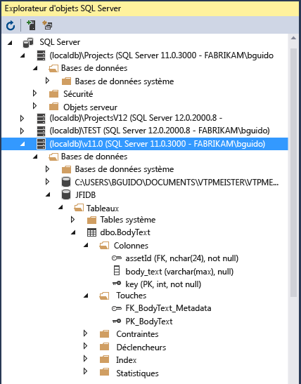

# Environnement IDE de Visual Studio
Microsoft Visual Studio 2017 RC est une suite d’outils permettant de créer des logiciels, qui couvre la phase de planification, la conception de l’interface utilisateur, par le codage, le test, le débogage, l’analyse de la qualité et de la performance du code, le déploiement sur les clients et la collecte de la télémétrie sur l’utilisation. Ces outils sont conçus pour fonctionner ensemble avec la meilleure intégration possible et sont tous exposés via l'environnement de développement intégré (IDE) de Visual Studio.  

 Vous pouvez utiliser Visual Studio pour créer de nombreux types d'applications, que ce soit des applications commerciales simples et des jeux pour clients mobiles ou des grands systèmes complexes destinés aux entreprises et aux centres de données. Vous pouvez créer :  

 - Des applications et des jeux qui fonctionnent non seulement sur Windows, mais également sur Android et iOS

 - Des sites web et des services web basés sur ASP.NET, JQuery, AngularJS et d’autres frameworks répandus.

 - Des applications pour des plateformes et des appareils aussi variés qu’Azure, Office, SharePoint, Hololens, Kinect et IoT (Internet of Things), pour n’en citer que quelques-uns.

 - Des jeux et des applications graphiques pour différents appareils Windows, notamment la Xbox, utilisant DirectX

 Visual Studio prend en charge par défaut C#, C et C++, JavaScript, TypeScript, F# et Visual Basic. Visual Studio fonctionne avec et s’intègre parfaitement à Xamarin grâce à [Xamarin pour Visual Studio](https://www.xamarin.com/visual-studio), et aux applications tierces comme Unity grâce à l’extension [Visual Studio Tools for Unity](../cross-platform/visual-studio-tools-for-unity.md) et à Apache Cordova grâce à [Visual Studio Tools pour Apache Cordova](../misc/get-started-with-visual-studio-tools-for-apache-cordova2.md). Vous pouvez étendre Visual Studio vous-même en créant des outils personnalisés qui effectuent des tâches spécialisées par l’intermédiaire du [SDK Visual Studio](../extensibility/visual-studio-sdk.md).

## Découvrir les nouveautés
 Si vous n’avez jamais utilisé Visual Studio, découvrez les principes de base en commençant par [Bien démarrer avec Visual Studio](../ide/get-started-with-visual-studio.md).
Si vous voulez découvrir les nouvelles fonctionnalités de Visual Studio 2017 RC, consultez [Nouveautés dans Visual Studio 2017 RC](../ide/whats-new-in-visual-studio.md).

## Installer Visual Studio
 Vous pouvez déterminer quelle édition de Visual Studio vous convient en consultant la rubrique [Produits Visual Studio](https://www.visualstudio.com/products/).

 Vous pouvez installer Visual Studio 2017 RC en le téléchargeant à partir de [Téléchargements Visual Studio](https://www.visualstudio.com/vs/). Pour en savoir plus sur le processus d’installation, consultez [Installation de Visual Studio 2017 RC](https://go.microsoft.com/fwlink/?linkid=833223).

## Visite guidée de l’IDE
 L’illustration suivante montre l’IDE de Visual Studio avec un projet ouvert, ainsi que plusieurs fenêtres d’outils clés.
 - L’[Explorateur de solutions](../ide/solutions-and-projects-in-visual-studio.md) vous permet d’afficher et de parcourir vos fichiers de code.
 - [Team Explorer](https://www.visualstudio.com/en-us/docs/connect/work-team-explorer) vous permet de suivre des éléments de travail et de partager du code avec d’autres utilisateurs à l’aide des technologies de gestion de version comme [Git](https://git-scm.com/) et [Team Foundation Version Control (TFVC)](https://www.visualstudio.com/en-us/docs/tfvc/overview).
 - [Cloud Explorer](https://azure.microsoft.com/en-us/documentation/articles/vs-azure-tools-resources-managing-with-cloud-explorer/) vous permet d’afficher et de gérer vos ressources Azure, telles que les machines virtuelles, les tables, les bases de données SQL et bien plus encore.
 - La fenêtre [Éditeur](../ide/writing-code-in-the-code-and-text-editor.md) vous permet d’afficher et de modifier les données de concepteur et le code source.
 - La fenêtre [Sortie](../ide/reference/output-window.md) affiche le résultat de la compilation, de l’exécution, du débogage et bien plus encore.

   

 ### Se connecter
  Quand vous démarrez Visual Studio pour la première fois, vous pouvez vous connecter avec votre compte Microsoft, ou avec votre compte professionnel ou celui de votre établissement scolaire. Le fait d’être connecté vous permet de synchroniser vos paramètres, comme les dispositions des fenêtres, entre plusieurs appareils et de vous connecter automatiquement aux services dont vous pouvez avoir besoin, comme des abonnements Azure et Visual Studio Team Services. Si vous avez une licence d'abonnement, vous devez vous connecter à Visual Studio régulièrement pour maintenir votre jeton de licence actualisé. Si vous avez une licence de clé de produit, vous ne devez pas vous connecter, mais le faire facilite votre connexion à Visual Studio Team Services et à vos comptes avec Azure, Office 365 et Salesforce.com. Pour plus d’informations, consultez [Connexion à Visual Studio](../ide/signing-in-to-visual-studio.md).

  Si vous avez plusieurs comptes Visual Studio Team Services, plusieurs comptes Azure ou plusieurs abonnements MSDN, vous pouvez les lier et accéder ainsi aux ressources et aux services de tous vos comptes avec une seule connexion. Pour plus d'informations, consultez [Utiliser plusieurs comptes d'utilisateur](../ide/work-with-multiple-user-accounts.md).

 ### Rester à jour
  L'icône de notification dans le coin supérieur droit de la barre de titre vous indique quand des mises à jour sont disponibles pour Visual Studio ou pour des composants associés que vous avez installés. Vous pouvez choisir d'ignorer ou de prendre en compte ces notifications. Pour plus d’informations, consultez [Notifications de Visual Studio](../ide/visual-studio-notifications.md).

 ### Rechercher des éléments et obtenir de l’aide
  La fenêtre [Lancement rapide](../ide/reference/quick-launch-environment-options-dialog-box.md), entourée en rouge dans la capture d’écran ci-dessous, est un moyen rapide de rechercher des commandes, des outils, des fonctionnalités, etc. de Visual Studio quand vous ne connaissez pas le raccourci clavier ou l’emplacement du menu. Tapez simplement ce que vous recherchez et la fenêtre Lancement rapide vous donne un lien vers ce que vous cherchez.

 

 Dans Visual Studio, vous pouvez appuyer sur **F1** pour accéder à l'aide en ligne pour la fenêtre active. Vous pouvez également appuyer sur **F1** dans l’éditeur de code pour accéder à la page d’aide pour l’API ou le mot clé à la position actuelle du point d’insertion. Par exemple, dans un fichier C#, placez le signe insertion quelque part dans une déclaration `System.String` ou juste après celle-ci, et appuyez sur **F1** pour accéder à la page d’aide pour [String](assetId:///T:System.String?qualifyHint=False&autoUpgrade=True).

### Envoyer vos commentaires
 Il est facile de nous envoyer des commentaires sur Visual Studio quand vous le souhaitez. Cliquez sur l’icône de commentaires dans la barre de titre en regard de **Lancement rapide** , puis cliquez sur **Signaler un problème** ou **Faire une suggestion**.

 Les versions préliminaires de Visual Studio disposent également d’une option **Évaluer ce produit** . Nous examinons tous ces commentaires et nous les utilisons pour améliorer le produit. Pour plus d’informations, consultez [Nous contacter](../ide/talk-to-us.md).

### Personnaliser l’IDE
 Vous pouvez personnaliser la disposition des fenêtres en fonction de votre style de développement. Vous pouvez ancrer, détacher ou masquer n'importe quelle fenêtre à tout moment, et vous pouvez aussi exécuter l'éditeur en mode plein écran. Vous pouvez créer et enregistrer plusieurs dispositions de fenêtres personnalisées, qui montrent seulement les fenêtres dont vous avez besoin pour des contextes spécifiques. Par exemple, vous pouvez créer une disposition en plein écran pour ne voir que l'éditeur de code. Vous pouvez aussi créer des dispositions différentes pour le débogage et pour les opérations en équipe. Pour plus d’informations, consultez [Personnalisation des dispositions de fenêtres](../ide/customizing-window-layouts-in-visual-studio.md).

 Vous pouvez personnaliser Visual Studio de beaucoup d'autres façons et retrouver votre paramétrage ailleurs si vous travaillez sur plusieurs ordinateurs. Pour plus d'informations, consultez [Personnalisation de l'IDE](../ide/personalizing-the-visual-studio-ide.md).

 Il existe des raccourcis clavier pour presque tout, que vous pouvez également personnaliser. Pour créer des raccourcis, tapez « Clavier » dans la zone Lancement rapide pour ouvrir la boîte de dialogue Clavier. Dans cette boîte de dialogue, vous pouvez appuyer sur F1 pour accéder à la page d’aide si vous avez besoin de plus d’informations sur les options. Pour plus d’informations, consultez [Raccourcis clavier par défaut dans Visual Studio](../ide/default-keyboard-shortcuts-in-visual-studio.md).

## Se connecter à Visual Studio Team Services et à Team Foundation Server
  Visual Studio Team Services (VSTS) est un service basé sur le cloud destiné à héberger des projets de logiciels et à permettre la collaboration dans des équipes. VSTS prend en charge les systèmes de contrôle de code source Git et Team Foundation, ainsi que les méthodologies de développement Scrum, CMMI et Agile. La gestion de version Team Foundation (TFVC) utilise un référentiel de serveur unique et centralisé pour effectuer le suivi et la gestion des versions des fichiers. Les modifications locales sont toujours archivées sur le serveur central, où les autres développeurs peuvent obtenir les dernières modifications. Team Foundation Server (TFS) 2015 est le hub de gestion du cycle de vie des applications pour Visual Studio. Il permet à toutes personnes impliquées dans le processus de développement de participer à une même solution. TFS est également utile pour la gestion des équipes et des projets hétérogènes.

  Si vous avez un compte Visual Studio Team Services ou Team Foundation Server sur votre réseau, vous vous y connectez via la fenêtre Team Explorer. Depuis cette fenêtre, vous pouvez vérifier le code dans ou en dehors du contrôle de code source, gérer des éléments de travail, démarrer des builds et accéder aux salles d'équipe et aux espaces de travail. Vous pouvez ouvrir Team Explorer à partir de **Lancement rapide** ou du menu principal, à partir d’**Affichage, Team Explorer** ou d’**Équipe, Gérer les connexions**.  Pour plus d’informations sur Visual Studio Team Services, consultez [www.visualstudio.com](https://www.visualstudio.com/). Pour plus d’informations sur Team Foundation Server, consultez [Team Foundation Server](https://www.visualstudio.com/products/tfs-overview-vs).

  L’illustration suivante montre le volet Team Explorer pour une solution qui est hébergée dans VSTS :

   

## Créer des solutions et des projets
  Même si vous pouvez utiliser Visual Studio pour parcourir les fichiers de code individuels, le plus souvent, vous travaillerez dans un *projet*. Un projet Visual Studio est une collection de fichiers et de ressources qui sont compilés en un seul fichier exécutable binaire pour des applications (par exemple un fichier .exe, DLL ou appx). Pour les sites web non-ASP.NET, aucun fichier exécutable n'est généré, et le projet contient seulement du code HTML, des fichiers JavaScript et des images. Comme vous devrez parfois créer plusieurs fichiers binaires ou plusieurs sites web qui sont étroitement liés, Visual Studio propose le concept de solution, qui peut contenir plusieurs projets ou sites web. Quand vous créez un projet, vous créez en fait un « projet dans une solution » et vous pouvez, si nécessaire, ajouter ultérieurement des projets à cette solution. Par exemple, si vous avez un projet de DLL, vous pouvez ajouter un projet .exe à la solution, qui charge et utilise la DLL.

  Un *modèle de projet* est une collection de fichiers de code prédéfinis et de paramètres de configuration qui vous permettent de créer rapidement un type spécifique d'application. Visual Studio est fourni avec de nombreux modèles de projet et, si aucun des modèles par défaut ne vous convient, vous pouvez créer vos propres modèles. Après avoir créé un projet avec un modèle, vous pouvez commencer à y écrire votre propre code, dans les fichiers fournis ou dans des fichiers que vous ajoutez. Pour plus d’informations, consultez [Solutions et projets](../ide/solutions-and-projects-in-visual-studio.md). L'illustration suivante montre la boîte de dialogue Nouveau projet, avec les modèles de projet disponibles pour les applications ASP.NET.

   

## Écrire, parcourir et comprendre le code  
 Si vous êtes développeur, la fenêtre de l'éditeur est l'endroit où vous passerez probablement le plus de temps. Visual Studio offre la prise en charge de l’édition pour C#, C++, Visual Basic, F#, JavaScript, TypeScript, XML, HTML et CSS. Visual Studio prend également en charge l’édition et la compilation pour de nombreux autres langages.

 Pour modifier des fichiers individuels dans l’éditeur de texte, choisissez **Fichier, Ouvrir, Fichier**. Pour modifier des fichiers dans un projet ouvert, choisissez et ouvrez le nom du fichier dans l’Explorateur de solutions. Le code est colorisé, et vous pouvez personnaliser le jeu de couleurs en tapant « Couleurs » dans la zone de lancement rapide. Vous pouvez avoir un grand nombre de fenêtres d'éditeur de texte ouvertes en même temps sous forme d'onglets. Vous pouvez fractionner chaque fenêtre indépendamment. Vous pouvez également exécuter l'éditeur de texte en mode plein écran.  

   

 L'éditeur de texte est très interactif (si vous voulez qu'il le soit) et offre de nombreuses fonctionnalités de productivité qui vous aident à écrire du code plus vite et mieux. Les fonctionnalités varient selon le langage, et leur utilisation n'est pas obligatoire (tapez « Éditeur » dans la zone Lancement rapide) pour activer ou désactiver les fonctionnalités. Voici quelques-unes des fonctionnalités de productivité courantes :  

-  La [refactorisation](../ide/refactoring-in-visual-studio.md) inclut des opérations comme le renommage intelligent des variables, le déplacement de lignes de code sélectionnées dans une fonction distincte, le déplacement de code à d’autres endroits, la réorganisation des paramètres des fonctions, et ainsi de suite.

    

-  **IntelliSense** est un terme couvrant un ensemble de fonctionnalités appréciées qui affichent des informations sur les types concernant votre code directement dans l’éditeur et qui, dans certains cas, écrivent de petits extraits de code pour vous. Cela revient à avoir de la documentation de base incluse dans l'éditeur, ce qui vous évite d'avoir à rechercher des informations sur les types dans une fenêtre d'aide distincte. Les fonctionnalités d'IntelliSense varient selon le langage. Pour plus d’informations, consultez [Visual C# IntelliSense](../ide/visual-csharp-intellisense.md), [Visual C++ Intellisense](../ide/visual-cpp-intellisense.md), [JavaScript IntelliSense](../ide/javascript-intellisense.md), [Options IntelliSense propres à Visual Basic](../ide/visual-basic-specific-intellisense.md). L'illustration suivante montre certaines fonctionnalités IntelliSense à l'œuvre :  

       

-  Les**tildes** vous signalent des erreurs ou des problèmes potentiels dans votre code en temps réel au fil de votre saisie, ce qui vous permet de les corriger immédiatement sans attendre que l'erreur soit découverte au moment de la compilation ou de l'exécution. Si vous pointez sur le tilde, vous voyez des informations supplémentaires sur l'erreur. Une icône d'ampoule peut également apparaître dans la marge gauche, avec des suggestions pour corriger l'erreur. Pour plus d'informations, consultez [Effectuer des actions rapides avec des ampoules](../ide/perform-quick-actions-with-light-bulbs.md).  

    

-  Les [signets](../ide/setting-bookmarks-in-code.md) vous permettent d'accéder rapidement à des lignes spécifiques dans les fichiers sur lesquels vous travaillez activement.

    

-  Vous pouvez appeler la fenêtre [Hiérarchie d'appels](../ide/reference/call-hierarchy.md) dans le menu contextuel de l’éditeur de texte pour afficher les méthodes qui appellent la méthode sous le signe insertion et qui sont appelées par cette méthode.

    

-  **CodeLens** vous permet de rechercher les références et les modifications apportées à votre code, les bogues liés, les éléments de travail, les révisions de code et les tests unitaires, tout cela sans quitter l'éditeur.

    

  Pour plus d’informations, consultez [Rechercher les modifications du code et d’autres éléments de l’historique](../ide/find-code-changes-and-other-history-with-codelens.md).  

-  La fenêtre **Aperçu de la définition** montre une définition de méthode ou de type inline, sans vous obliger à quitter votre contexte actuel. Cette fenêtre fonctionne désormais également pour XAML.  

    

-  L'option de menu contextuel **Atteindre la définition** vous amène directement à l'endroit où la fonction ou l'objet est défini. D'autres commandes de navigation sont également disponibles en cliquant avec le bouton droit dans l'éditeur.

    

- Un outil connexe, l'[Explorateur d'objets](http://msdn.microsoft.com/en-us/f89acfc5-1152-413d-9f56-3dc16e3f0470), vous permet d'examiner les assemblys .NET ou Windows Runtime sur votre système, pour voir les types qu'ils contiennent ainsi que les méthodes et les propriétés que ces types contiennent.  

       

 La plupart des éléments du menu Edition et du menu Affichage se rapportent d'une façon ou d'une autre à l'éditeur de code. Pour plus d’informations sur l’éditeur, consultez [Écriture de code](../ide/writing-code-in-the-code-and-text-editor.md) et [Modification de votre code](https://www.visualstudio.com/features/ide-vs).  

## Compiler et générer votre code  
 La génération d'un projet consiste à compiler le code source et à effectuer les étapes nécessaires pour produire l'exécutable. Les opérations de génération varient selon les langages, et les sites web standard n'ont pas de génération du tout. Quel que soit le type de projet, le menu **Générer** est l'emplacement standard pour ces commandes. Pour compiler et exécuter votre code avec une seule frappe au clavier, appuyez sur la touche F5. Chaque compilateur est entièrement configurable via l'IDE. La barre d’outils Générer vous permet de spécifier s’il faut générer une version de débogage de votre programme, avec des symboles et une vérification des erreurs supplémentaire activée pour la prise en charge des points d’arrêt et le pas à pas dans le débogueur, ou bien une version Release, que vous livrerez au final aux utilisateurs. Vous pouvez configurer davantage de paramètres de génération, ainsi que de nombreux autres paramètres sur la page des propriétés pour un projet. Choisissez le menu contextuel (clic droit) du nœud du projet dans l’Explorateur de solutions, puis la commande Propriétés. Vous pouvez également effectuer des générations à partir de la ligne de commande.  

 La sortie de la génération, notamment les messages d'erreur ou de réussite, apparaît dans la fenêtre Sortie. La liste d’erreurs (illustrée ci-dessous) fournit des informations détaillées sur les erreurs de génération.  

   

## Déboguer votre code  
 Le débogueur de pointe de Visual Studio vous permet de déboguer du code en cours d’exécution dans votre projet local, sur un appareil distant ou sur un émulateur, comme ceux destinés aux appareils Android ou Windows Phone. Vous pouvez parcourir le code instruction par instruction et examiner les variables au fil de la progression, vous pouvez avancer pas à pas dans des applications multithread, et vous pouvez définir des points d'arrêt qui sont atteints seulement quand une condition spécifiée est vraie. Vous pouvez surveiller les valeurs des variables à mesure que le code s’exécute. Tout ceci peut être géré dans l’éditeur de code lui-même, ce qui vous permet de ne pas quitter le contexte de votre code.  

   

 Le débogueur lui-même comprend plusieurs fenêtres qui vous permettent d'afficher et de manipuler des variables locales, la pile des appels et d'autres aspects de l'environnement d'exécution. Vous pouvez trouver ces fenêtres dans le menu **Débogage** .  

 La [Fenêtre Exécution](../ide/reference/immediate-window.md) vous permet de taper une expression et de voir son résultat immédiatement.

 La fenêtre [IntelliTrace](../debugger/intellitrace.md) enregistre chaque appel de méthode et d’autres événements dans un programme .NET en cours d’exécution et peut vous aider à localiser rapidement l’origine d’un problème.

 Pour plus d’informations, consultez [Débogage dans Visual Studio](../debugger/debugging-in-visual-studio.md).  

## Tester votre code  
 Visual Studio inclut une infrastructure de test unitaire pour le code managé (.NET) et une pour le C++ natif. Pour créer des tests unitaires, ajoutez simplement un projet de test à votre solution, écrivez vos tests, puis exécutez-les à partir de la fenêtre Explorateur de tests. Pour plus d’informations, consultez [Tests unitaires sur votre code](../test/unit-test-your-code.md).  

   

## Analyser la qualité et les performances du code  
 Visual Studio inclut des outils puissants pour l'analyse statique et à l'exécution. Les outils d'analyse statique vous aident à identifier les erreurs potentielles dans la conception, la globalisation, l'interopérabilité, la performance, la sécurité et d'autres catégories. Les tests de performance, ou de profilage, mesurent la façon dont votre programme s'exécute. Vous accédez à ces outils à partir du menu **Analyse** . Pour plus d'informations, consultez [Amélioration de la qualité avec les outils de diagnostic de Visual Studio](../test/improve-code-quality.md).  

## Se connecter à des services cloud et à des bases de données  
 [Cloud Explorer](https://azure.microsoft.com/en-us/documentation/articles/vs-azure-tools-resources-managing-with-cloud-explorer/) dans Visual Studio montre les ressources Azure dans tous les comptes gérés sous l’abonnement Azure auquel vous êtes connecté. Vous pouvez obtenir Cloud Explorer en installant le [SDK Azure](https://azure.microsoft.com/en-us/downloads/).

 

 L’[Explorateur de serveurs](https://msdn.microsoft.com/en-us/library/cd2cz7yy.aspx) est également disponible pour vous aider à parcourir et à gérer les instances et les ressources SQL Server sur Azure, Salesforce.com, Office 365 et les sites web.

 Visual Studio inclut [Microsoft SQL Server Data Tools](https://msdn.microsoft.com/en-us/data/tools.aspx) (SSDT) qui vous permet de générer, déboguer, maintenir et refactoriser des bases de données. Vous pouvez travailler avec un projet de base de données, ou directement avec une instance de base de données connectée, locale ou hors site.  

 L’[Explorateur d’objets SQL Server](https://msdn.microsoft.com/en-us/library/hh231250.aspx) de Visual Studio offre une vue des objets de base de données similaire à celle de SQL Server Management Studio. L'Explorateur d'objets SQL Server vous permet d'effectuer des tâches simples d'administration et de conception de base de données, y compris la modification des données des tables, la comparaison de schémas et l'exécution de requêtes à l'aide de menus contextuels directement depuis l'Explorateur d'objets SQL Server. SSDT inclut également des types de projets spéciaux et des outils de développement de solutions SQL Server 2012 Analysis Services, Reporting Services et Integration Services Business Intelligence (anciennement appelé Business Intelligence Development Studio).  

   

## Déployer votre application terminée  
 Quand votre application est prête à être déployée auprès des clients, Visual Studio fournit les outils nécessaires, qu'elle soit déployée dans le Windows Store, sur un site SharePoint ou à l'aide des technologies InstallShield ou Windows Installer. Ils sont tous accessibles via l'IDE. Pour plus d’informations, consultez [Déploiement d’applications, de services et de composants](../deployment/deploying-applications-services-and-components.md).  

## Outils d'architecture et de modélisation (version Enterprise uniquement)  
 Vous pouvez utiliser les outils d'architecture et de modélisation de Visual Studio pour concevoir et modéliser votre application. Ces outils vous aident à visualiser la structure, le comportement et les relations du code. Vous pouvez créer des modèles à différents niveaux de détails tout au long du cycle de vie d'application dans le cadre de votre processus de développement. Vous pouvez suivre les spécifications, les tâches, les cas de test, les bogues et les autres travaux associés à vos modèles, en liant des éléments de modèle aux éléments de travail de Team Foundation Server et de votre plan de développement. Pour plus d’informations, consultez [Concevoir et modéliser votre application](../modeling/analyze-and-model-your-architecture.md).  

## Étendre Visual Studio à l’aide du SDK Visual Studio  
 Visual Studio est une plateforme extensible. Une extension de Visual Studio est un outil personnalisé qui s'intègre à l'IDE. Vous pouvez ajouter des extensions de tiers ou créer les vôtres. Pour plus d’informations, consultez [Commencer à développer des extensions Visual Studio](../extensibility/starting-to-develop-visual-studio-extensions.md).  

 Les [recommandations pour l’expérience utilisateur de Visual Studio](../extensibility/ux-guidelines/visual-studio-user-experience-guidelines.md) constituent une référence essentielle pour ceux qui écrivent des extensions pour Visual Studio. Ces recommandations spécifiques à une plateforme comprennent des informations sur la conception des boîtes de dialogue, sur les polices, les couleurs, les icônes, les contrôles communs et sur d'autres modèles d'interaction, qui permettront à votre nouvelle fonctionnalité de s'intégrer sans problème à Visual Studio.  

## Voir aussi  
 [Installation de Visual Studio 2017 RC](../install/install-visual-studio.md)   
 [Modification de votre code](https://www.visualstudio.com/features/ide-vs)   
 [Nouveautés de Visual Studio 2017 RC](../ide/whats-new-in-visual-studio.md)   
 [Portage, migration et mise à niveau des projets Visual Studio](../porting/port-migrate-and-upgrade-visual-studio-projects.md)   
 [Nous contacter](../ide/talk-to-us.md)

