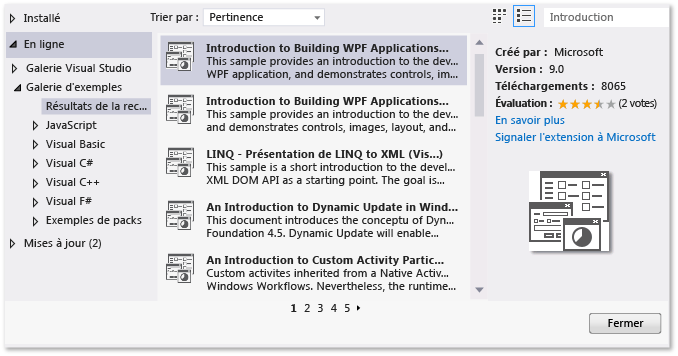
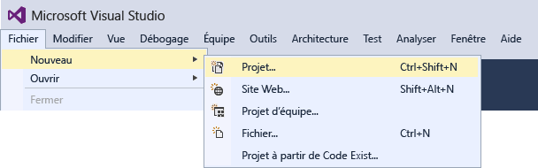
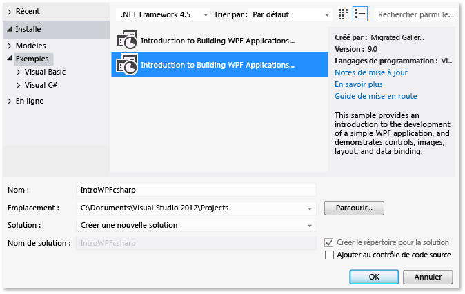
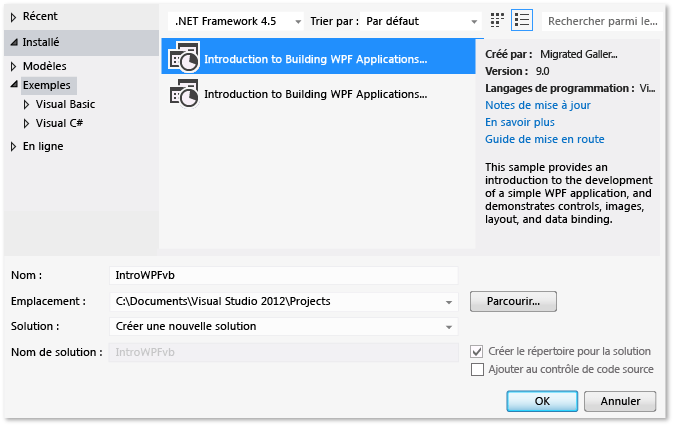
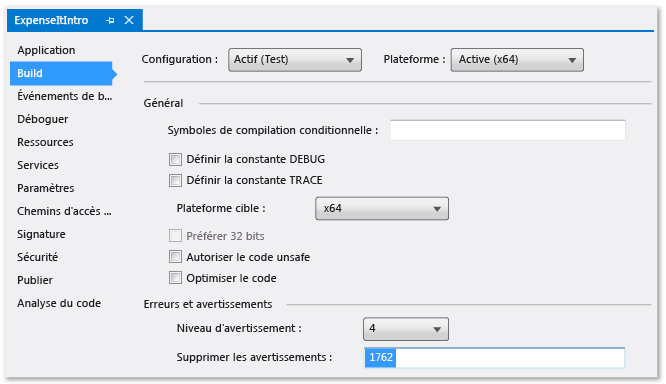
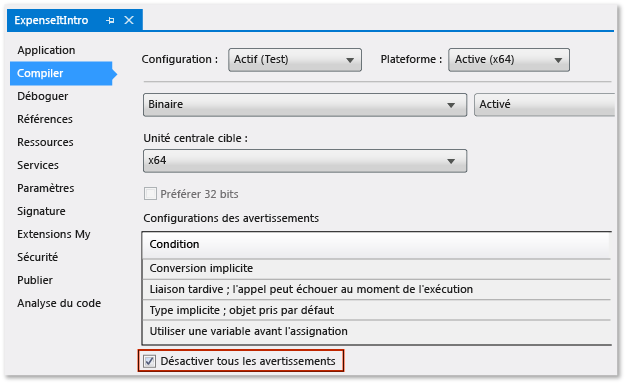

# Proc&#233;dure pas &#224; pas&#160;: g&#233;n&#233;ration d&#39;une application
[!INCLUDE[vs2017banner](../code-quality/includes/vs2017banner.md)]

En effectuant ce tutoriel, vous vous familiariserez avec plusieurs options que vous pouvez configurer lorsque vous générez des applications avec Visual Studio.  Vous créerez une configuration de build personnalisée, masquerez certains messages d'avertissement, et augmenterez la quantité d'informations de sortie de génération, parmi d'autres tâches, pour un exemple d'application.  
  
 Cette rubrique contient les sections suivantes :  
  
 [Installer l'exemple d'application](../ide/walkthrough-building-an-application.md#BKMK_installapp)  
  
 [Créez une configuration de build personnalisée](../ide/walkthrough-building-an-application.md#BKMK_CreateBuildConfig)  
  
 [Générer l'application](../ide/walkthrough-building-an-application.md#BKMK_building)  
  
 [Masquer les avertissements du compilateur](../ide/walkthrough-building-an-application.md#BKMK_hidewarning)  
  
 [Affichez des informations de génération supplémentaires dans la fenêtre Sortie](../ide/walkthrough-building-an-application.md#BKMK_outputdetails)  
  
 [Créer un build de sortie](../ide/walkthrough-building-an-application.md#BKMK_releasebuild)  
  
##   Installer l'exemple d'application  
 Vous utiliserez la boîte de dialogue **Extensions et mises à jour** pour rechercher et installer l'exemple[Introduction à générer des applications WPF](http://code.msdn.microsoft.com/Introduction-to-Building-b8d16419?SRC=VSIDE) à partir de la galerie des sur le site Web Microsoft.  La galerie des exemples fournit divers exemples de projets que vous pouvez télécharger et examiner lorsque vous organisez et développer vos applications.  
  
#### Pour installer l'application exemple.  
  
1.  Dans la barre de menus, sélectionnez **Outils**, **Extensions et mises à jour**.  
  
2.  Choisissez la catégorie **En ligne**, puis sélectionnez la catégorie **Galerie d'échantillons**.  
  
3.  Spécifiez `Introduction` dans la zone de recherche pour rechercher l'exemple.  
  
       
  
4.  Dans la liste des résultats, choisissez **Introduction à générer des applications WPF \(Visual C \#\)** ou **Introduction à générer des applications WPF \(Visual Basic\)**.  
  
5.  Cliquez sur le bouton **Télécharger**, puis sur le bouton **Fermer**.  
  
 L'exemple Introduction à générer des applications WPF s'affiche dans la boîte de dialogue **Nouveau projet**.  
  
#### Pour créer une solution pour l'application exemple  
  
1.  Ouvrez la boîte de dialogue **Nouveau projet**.  
  
       
  
2.  Dans la catégorie **Installé**, sélectionnez la catégorie **Exemples** pour afficher l'exemple Introduction à générer des applications WPF.  
  
3.  Nommez la solution `IntroWPFcsharp` pour Visual C\#.  
  
       
  
     OR  
  
     Nommez la solution `IntroWPFvb` pour Visual Basic.  
  
       
  
4.  Cliquez sur le bouton **OK**.  
  
##   Créez une configuration de build personnalisée  
 Lorsque vous créez une solution, les configurations de build Debug et Release et leurs plateformes cibles par défaut sont définies automatiquement pour la solution.  Vous pouvez ensuite personnaliser ces configurations ou créer les vôtres.  Les configurations de build spécifient le type de build.  Les plateformes de build spécifient le système d'exploitation qu'une application cible pour cette configuration.  Pour plus d'informations, consultez [Présentation des configurations de build](../ide/understanding-build-configurations.md), [Présentation des plateformes de générations](../ide/understanding-build-platforms.md) et [Debug and Release Project Configurations](http://msdn.microsoft.com/fr-fr/0440b300-0614-4511-901a-105b771b236e).  
  
 Vous pouvez modifier ou créer des configurations et des paramètres de plateforme en utilisant la boîte de dialogue **Gestionnaire de configurations**.  Dans cette procédure, vous allez créer une configuration de build pour le test.  
  
#### Pour créer une configuration de build  
  
1.  Ouvrez la boîte de dialogue **Gestionnaire de configurations**.  
  
       
  
2.  Dans la liste **Configuration de la solution active**, cliquez sur **\<Nouveau\>**.  
  
3.  Dans la boîte de dialogue **Nouvelle configuration de solution**, nommez la nouvelle configuration `Test`, copiez les paramètres de la configuration Debug existante, puis choisissez le bouton **OK**.  
  
       
  
4.  Dans la liste **Configuration de la solution active**, cliquez sur **\<Nouveau\>**.  
  
5.  Dans la boîte de dialogue **Nouvelle plateforme de solution**, choisissez **x64**, et ne copiez pas les paramètres de la plateforme x86.  
  
       
  
6.  Cliquez sur le bouton **OK**.  
  
 La configuration de solution active a été modifiée pour Test avec la plateforme active de solution à la valeur x64.  
  
   
  
 Vous pouvez rapidement vérifier ou modifier la configuration de solution active à l'aide de la liste **Configurations de solutions** dans la barre d'outils **Standard**.  
  
   
  
##   Générer l'application  
 Ensuite, vous générerez la solution avec la configuration de build personnalisée.  
  
#### Pour générer la solution  
  
-   Dans la barre de menus, choisissez **Générer**, puis **Générer la solution**.  
  
 La fenêtre **Sortie** affiche les résultats de la génération.  La génération a réussie, mais plusieurs messages d'avertissement ont été générés.  
  
 Figure 1 : Avertissements Visual Basic  
  
   
  
 Figure 2 : Avertissements Visual C\#  
  
   
  
##   Masquer les avertissements du compilateur  
 Vous pouvez temporairement masquer certains messages d'avertissement pendant une génération plutôt qu'ils encombrent la sortie de génération.  
  
#### Pour masquer un avertissement spécifique de Visual C \#  
  
1.  Dans l'**Explorateur de solutions**, sélectionnez le noeud de plus haut niveau du projet.  
  
2.  Dans la barre de menus, sélectionnez **Afficher**, **Pages de propriétés**.  
  
     Le **Concepteur de projets** s'ouvre.  
  
3.  Sélectionnez la page **Générer** puis, dans la zone **Supprimer les avertissements**, spécifiez le numéro d'avertissement `1762`.  
  
       
  
     Pour plus d'informations, consultez [Générer, page du Concepteur de projets \(C\#\)](../ide/reference/build-page-project-designer-csharp.md).  
  
4.  Générez la solution.  
  
     La fenêtre **Sortie** affiche uniquement les informations résumées pour la génération.  
  
       
  
#### Pour supprimer tous les avertissements de génération Visual Basic  
  
1.  Dans l'**Explorateur de solutions**, sélectionnez le noeud de plus haut niveau du projet.  
  
2.  Dans la barre de menus, sélectionnez **Afficher**, **Pages de propriétés**.  
  
     Le **Concepteur de projets** s'ouvre.  
  
3.  Sur la page **Compiler**, activez la case à cocher **Désactiver tous les avertissements**.  
  
       
  
     Pour plus d'informations, consultez [Configuration d'avertissements en Visual Basic](../ide/configuring-warnings-in-visual-basic.md).  
  
4.  Générez la solution.  
  
 La fenêtre **Sortie** affiche uniquement les informations résumées pour la génération.  
  
   
  
 Pour plus d'informations, consultez [Comment : supprimer des avertissements du compilateur](../ide/how-to-suppress-compiler-warnings.md).  
  
##   Affichez des informations de génération supplémentaires dans la fenêtre Sortie  
 Vous pouvez modifier la quantité d'informations sur le processus de génération qui s'affiche dans la fenêtre **Sortie**.  Les commentaires de génération sont généralement réglés à la valeur minimale, ce qui signifie que la fenêtre **Sortie** affiche uniquement un résumé du processus de génération avec tous les avertissements ou erreurs de priorité élevée.  Vous pouvez afficher davantage d'informations sur la génération en utilisant [Options \(boîte de dialogue\), Projets et solutions, Générer et exécuter](../ide/reference/options-dialog-box-projects-and-solutions-build-and-run.md).  
  
> [!IMPORTANT]
>  Si vous affichez davantage d'informations, la génération nécessitera plus de temps pour terminer.  
  
#### Pour modifier la quantité d'informations dans la fenêtre Sortie  
  
1.  Ouvrez la boîte de dialogue **Options**.  
  
       
  
2.  Choisissez la catégorie **Projets et solutions**, puis sélectionnez la page de propriétés **Générer et exécuter** .  
  
3.  Dans la liste **Commentaires relatifs à la sortie de génération du projet MSBuild**, sélectionnez **Normale**, puis cliquez sur le bouton **OK**.  
  
4.  Dans la barre de menus, choisissez **Générer**, puis **Effacer la solution**.  
  
5.  Générez la solution, puis examinez les informations dans la fenêtre **Sortie**.  
  
     Les informations de build incluent le temps de démarrage de la génération \(situé au début\), l'ordre dans lequel les fichiers ont été traités, et la durée que le processus a pris pour finir \(situé à la fin\).  Ces informations incluent également la syntaxe du compilateur que Visual Studio exécute pendant la génération.  
  
     Par exemple, dans la version Visual C\#, l'option [\/nowarn](/dotnet/visual-basic/reference/command-line-compiler/nowarn) liste le code d'avertissement, 1762, spécifié antérieurement dans cette rubrique, avec trois autres avertissements.  
  
     Dans la version Visual Basic, [\/nowarn](/dotnet/visual-basic/reference/command-line-compiler/nowarn) n'inclut pas d'avertissements spécifiques à exclure, donc aucun avertissement ne s'affiche.  
  
    > [!TIP]
    >  Vous pouvez rechercher le contenu de la fenêtre **Sortie** si vous affichez la boîte de dialogue **Rechercher** en utilisant les touches Ctrl\+F.  
  
 Pour plus d'informations, consultez [Comment : afficher, enregistrer et configurer des fichiers journaux de génération](../ide/how-to-view-save-and-configure-build-log-files.md).  
  
##   Créer un build de sortie  
 Vous pouvez générer une version de l'exemple d'application qui est optimisé pour la livraison.  Pour la version Release, vous spécifierez que le fichier exécutable est copié vers un partage réseau avant que la génération commence.  
  
 Pour plus d’informations, consultez [Comment : modifier le répertoire de sortie de la génération](../ide/how-to-change-the-build-output-directory.md) et [Génération et nettoyage de solutions et de projets dans Visual Studio](../ide/building-and-cleaning-projects-and-solutions-in-visual-studio.md).  
  
#### Pour spécifier une version Release pour Visual Basic  
  
1.  Ouvrez le **Concepteur de projets**.  
  
       
  
2.  Sélectionnez la page **Compiler**.  
  
3.  Dans la liste **Configuration**, sélectionnez **Version**.  
  
4.  Dans la liste **Plateforme**, choisissez **x86**.  
  
5.  Dans la zone **Chemin de sortie de la génération**, spécifiez un chemin d'accès réseau.  
  
     Par exemple, vous pouvez spécifier \\\\myserver\\builds.  
  
    > [!IMPORTANT]
    >  Un message peut apparaître, vous avertissant que le partage réseau que vous avez spécifié peut ne pas être un emplacement sûre.  Si vous faites confiance à l'emplacement que vous avez spécifié, choisissez le bouton **OK** dans le message.  
  
6.  Générez l'application.  
  
       
  
#### Pour spécifier une version Release pour Visual C\#  
  
1.  Ouvrez le **Concepteur de projets**.  
  
       
  
2.  Sélectionnez la page **Génération**.  
  
3.  Dans la liste **Configuration**, sélectionnez **Version**.  
  
4.  Dans la liste **Plateforme**, choisissez **x86**.  
  
5.  Dans la zone **Chemin de sortie**, spécifiez un chemin d'accès réseau.  
  
     Par exemple, vous pourriez spécifier \\\\myserver\\builds.  
  
    > [!IMPORTANT]
    >  Un message peut apparaître, vous avertissant que le partage réseau que vous avez spécifié peut ne pas être un emplacement sûre.  Si vous faites confiance à l'emplacement que vous avez spécifié, choisissez le bouton **OK** dans le message.  
  
6.  Générez l'application.  
  
       
  
 Le fichier exécutable est copié dans le chemin d'accès réseau que vous avez spécifié.  Son chemin d'accès est \\\\myserver\\builds \\*FileName*.exe.  
  
 Félicitations : vous avez terminé avec succès ce tutoriel.  
  
## Voir aussi  
 [Procédure pas à pas : génération d’un projet \(C\+\+\)](../Topic/Walkthrough:%20Building%20a%20Project%20\(C++\).md)   
 [ASP.NET Web Application Project Precompilation Overview](http://msdn.microsoft.com/fr-fr/b940abbd-178d-4570-b441-52914fa7b887)   
 [Walkthrough: Using MSBuild](../msbuild/walkthrough-using-msbuild.md)