# Procédure pas à pas : générer une application

Avec cette procédure pas à pas, vous allez vous familiariser avec plusieurs options qu’il est possible de configurer lors de la génération d’applications avec Visual Studio. Vous allez créer une configuration de build personnalisée, masquer certains messages d’avertissement et afficher davantage d’informations de sortie de build dans un exemple d’application.

## Installer l’exemple d’application

Téléchargez l’exemple [Introduction to Building WPF Applications](https://code.msdn.microsoft.com/Introduction-to-Building-b8d16419). Choisissez C# ou Visual Basic. Une fois le fichier *.zip* téléchargé, décompressez-le et ouvrez le fichier *ExpenseItIntro.sln* avec Visual Studio.

## Créer une configuration de build personnalisée

Lorsque vous créez une solution, les configurations de build Debug et Release, et leurs plateformes cibles par défaut, sont automatiquement définies pour la solution. Vous pouvez ensuite personnaliser ces configurations ou créer les vôtres. Les configurations de build spécifient le type de build. Les plateformes de build spécifient le système d’exploitation qui est ciblé par une application pour cette configuration. Pour plus d’informations, consultez [Présentation des configurations de build](../ide/understanding-build-configurations.md), [Présentation des plateformes de build](../ide/understanding-build-platforms.md) et [Comment : définir des configurations Debug et Release](../debugger/how-to-set-debug-and-release-configurations.md).

Vous pouvez modifier ou créer des configurations et des paramètres de plateforme dans la boîte de dialogue **Gestionnaire de configurations**. Dans cette procédure, vous allez créer une configuration de build à des fins de test.

### Pour créer une configuration de build

1. Ouvrez la boîte de dialogue **Gestionnaire de configurations**.

   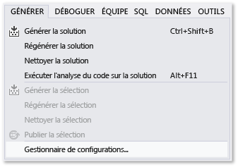

1. Dans la liste **Configuration de la solution active**, choisissez **\<Nouveau...\>**.

1. Dans la boîte de dialogue **Nouvelle configuration de solution**, nommez la nouvelle configuration `Test`, copiez les paramètres de la configuration **Debug** existante, puis cliquez sur le bouton **OK**.

   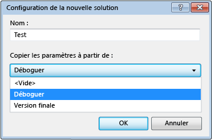

1. Dans la liste **Plateforme de la solution active**, choisissez **\<Nouveau...\>**.

1. Dans la boîte de dialogue **Nouvelle plateforme de solution**, choisissez **x64** et ne copiez pas les paramètres de la plateforme x86.

   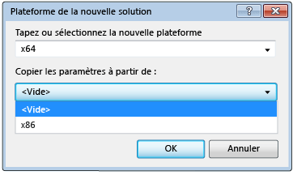

1. Sélectionnez le bouton **OK** .

   La configuration de la solution active a été changée en **Test** avec la plateforme de la solution active définie sur x64.

   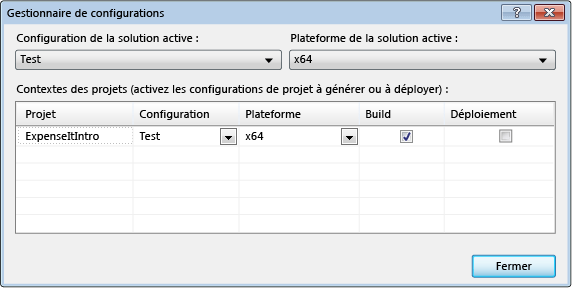

1. Choisissez **Fermer**.

Vous pouvez rapidement vérifier ou modifier la configuration de la solution active à l’aide de la liste **Configurations de solutions** présente dans la barre d’outils **Standard**.

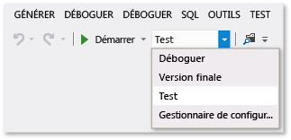

## Générer l’application

Ensuite, vous allez générer la solution avec la configuration de build personnalisée.

### Générer la solution

-   Dans la barre de menus, choisissez **Générer**  >  **Générer la solution**.

    La fenêtre **Sortie** affiche les résultats de la génération. La génération a réussi.

## Masquer les avertissements du compilateur

Nous présenterons ensuite du code qui provoque la génération d’un avertissement par le compilateur.

1. Dans le projet C#, ouvrez le fichier *ExpenseReportPage.xaml.cs*. Dans la méthode **ExpenseReportPage**, ajoutez le code suivant : `int i;`.

    OU

    Dans le projet Visual Basic, ouvrez le fichier *ExpenseReportPage.xaml.vb*. Dans le constructeur personnalisé **Public Sub New...**, ajoutez le code suivant : `Dim i`.

1. Générez la solution.

La fenêtre **Sortie** affiche les résultats de la génération. La génération a réussi, mais des avertissements ont été générés :

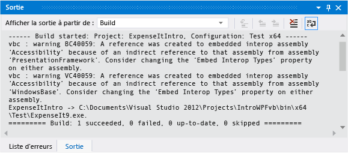

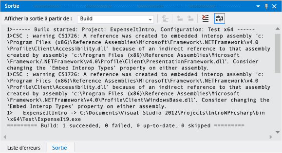

Vous pouvez temporairement masquer certains messages d’avertissement pendant la génération, pour éviter qu’ils n’encombrent la fenêtre Sortie.

### Masquer un avertissement C# spécifique

1. Dans l’**Explorateur de solutions**, choisissez le premier nœud de projet.

1. Dans la barre de menus, sélectionnez **Afficher** > **Pages de propriétés**.

     Le **Concepteur de projets** s’ouvre.

1. Choisissez la page **Build**, puis, dans la zone **Supprimer les avertissements**, spécifiez le numéro d’avertissement **0168**.

     

     Pour plus d’informations, consultez [Générer, page du Concepteur de projets (C#)](../ide/reference/build-page-project-designer-csharp.md).

1. Générez la solution.

     La fenêtre **Sortie** affiche uniquement le résumé de la génération.

     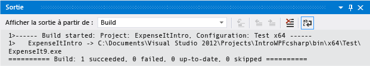

### Supprimer tous les avertissements de génération Visual Basic

1. Dans l’**Explorateur de solutions**, choisissez le premier nœud de projet.

2. Dans la barre de menus, sélectionnez **Afficher** > **Pages de propriétés**.

     Le **Concepteur de projets** s’ouvre.

3. Dans la page **Compiler**, cochez la case **Désactiver tous les avertissements**.

     

     Pour plus d’informations, consultez [Configurer des avertissements dans Visual Basic](../ide/configuring-warnings-in-visual-basic.md).

4. Générez la solution.

   La fenêtre **Sortie** affiche uniquement le résumé de la génération.

   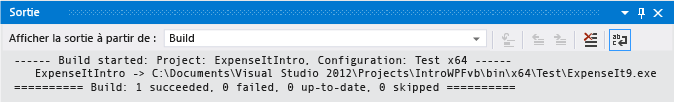

   Pour plus d’informations, consultez [Guide pratique pour supprimer les avertissements du compilateur](../ide/how-to-suppress-compiler-warnings.md).

## Afficher des informations de génération supplémentaires dans la fenêtre Sortie

Vous pouvez modifier la quantité d’informations relatives au processus de génération qui s’affichent dans la fenêtre **Sortie**. Le niveau de détail des informations sur la build est généralement défini sur **Minimale**. Dans ce cas, la fenêtre **Sortie** affiche seulement un résumé du processus de build, ainsi que les erreurs ou avertissements de haute priorité. Vous pouvez afficher plus d’informations sur la build en utilisant la [Boîte de dialogue Options, Projets et solutions, Générer et exécuter](../ide/reference/options-dialog-box-projects-and-solutions-build-and-run.md).

> [!IMPORTANT]
> Si vous décidez d’afficher davantage d’informations, la génération sera plus longue.

### Changer la quantité d’informations dans la fenêtre Sortie

1. Ouvrez la boîte de dialogue **Options**.

     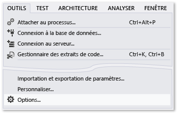

1. Sélectionnez la catégorie **Projets et solutions**, puis la page **Générer et exécuter**.

1. Dans la liste **Commentaires relatifs à la sortie de génération du projet MSBuild**, choisissez **Normal**, puis cliquez sur le bouton **OK**.

1. Dans la barre de menus, choisissez **Générer** > **Nettoyer la solution**.

1. Générez la solution, puis passez en revue les informations contenues dans la fenêtre **Sortie**.

     Les informations de build comprennent l’heure à laquelle la génération a commencé (située au début), et l’ordre dans lequel les fichiers ont été traités. Ces informations comprennent également la syntaxe de compilateur que Visual Studio exécute pendant la génération.

     Par exemple, dans la génération C#, l’option [/nowarn](/dotnet/visual-basic/reference/command-line-compiler/nowarn) contient le code d’avertissement **1762** que vous avez spécifié précédemment dans cette rubrique, ainsi que trois autres avertissements.

     Dans la build Visual Basic, comme [/nowarn](/dotnet/visual-basic/reference/command-line-compiler/nowarn) n’inclut pas d’avertissements à exclure, aucun avertissement ne s’affiche.

    > [!TIP]
    > Pour effectuer une recherche dans la fenêtre **Sortie**, affichez la boîte de dialogue **Rechercher** en appuyant sur les touches**Ctrl**+**F**.

Pour plus d’informations, consultez [Comment : afficher, enregistrer et configurer des fichiers journaux de génération](../ide/how-to-view-save-and-configure-build-log-files.md).

## Créer une version Release

Vous pouvez créer une version de l’exemple d’application qui soit optimisée pour sa livraison. Pour la version Release, vous allez spécifier que le fichier exécutable doit être copié vers un partage réseau avant que la génération ne démarre.

Pour plus d’informations, consultez [Guide pratique pour modifier le répertoire de sortie de la génération](../ide/how-to-change-the-build-output-directory.md) et [Générer et nettoyer des projets et des solutions dans Visual Studio](../ide/building-and-cleaning-projects-and-solutions-in-visual-studio.md).

### Spécifier une version Release pour Visual Basic

1. Ouvrez le **Concepteur de projet**.

     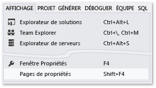

1. Choisissez la page **Compiler**.

1. Dans la liste **Configuration**, choisissez **Version finale**.

1. Dans la liste **Plateforme**, choisissez **x86**.

1. Dans la zone de texte **Chemin de sortie de la génération**, spécifiez un chemin réseau.

     Par exemple, vous pouvez spécifier `\\myserver\builds`.

    > [!IMPORTANT]
    > Une boîte de message peut s’afficher, indiquant que le partage réseau que vous avez spécifié n’est pas un emplacement approuvé. Si vous faites confiance à l’emplacement que vous avez spécifié, cliquez sur **OK** dans la boîte de message.

1. Générez l'application.

     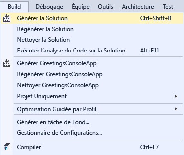

### Spécifier une version Release pour C# #

1. Ouvrez le **Concepteur de projet**.

     

1. Choisissez la page **Générer**.

1. Dans la liste **Configuration**, choisissez **Version finale**.

1. Dans la liste **Plateforme**, choisissez **x86**.

1. Dans la zone de texte **Chemin de sortie**, spécifiez un chemin réseau.

     Par exemple, vous pouvez spécifier `\\myserver\builds`.

    > [!IMPORTANT]
    > Une boîte de message peut s’afficher, indiquant que le partage réseau que vous avez spécifié n’est pas un emplacement approuvé. Si vous faites confiance à l’emplacement que vous avez spécifié, cliquez sur **OK** dans la boîte de message.

1. Dans la **barre d’outils Standard**, définissez l’option Configurations de solutions sur **Release** et l’option Plateformes solution sur **x86**.

1. Générez l'application.

     

   Le fichier exécutable est copié sur le chemin réseau que vous avez spécifié. Son chemin est `\\myserver\builds\\FileName.exe`.

Félicitations ! La procédure pas à pas est terminée.

## Voir aussi

- [Procédure pas à pas : générer un projet (C++)](/cpp/ide/walkthrough-building-a-project-cpp)
- [Présentation de la précompilation de projets d’application web ASP.NET](/previous-versions/aspnet/aa983464\(v\=vs.110\))
- [Procédure pas à pas : utiliser MSBuild](../msbuild/walkthrough-using-msbuild.md)