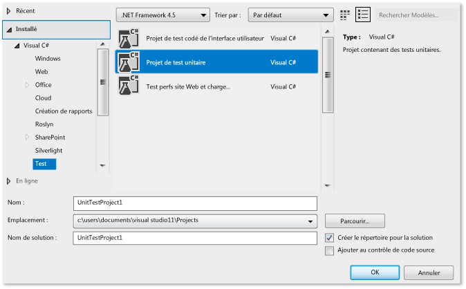
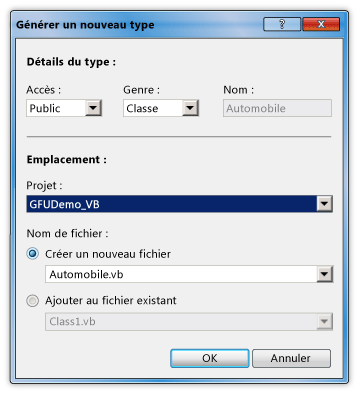
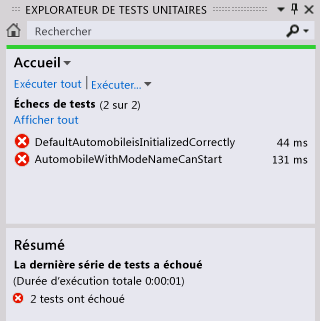
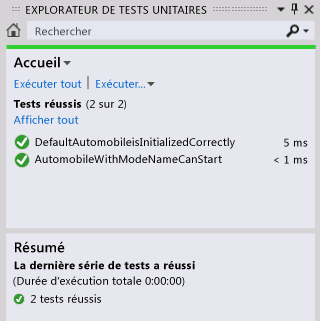

# Procédure pas à pas : développement basé d’abord sur les tests avec la fonctionnalité Générer à partir de l’utilisation

Cette rubrique montre comment utiliser la fonctionnalité [Generate From Usage](../ide/visual-csharp-intellisense.md#generate-from-usage) , qui prend en charge le développement basé d’abord sur les tests.

 Le*développement basé d’abord sur les tests* est une approche de conception logicielle dans laquelle vous écrivez d’abord des tests unitaires basés sur des spécifications de produits, puis vous écrivez le code source nécessaire pour que les tests réussissent. Visual Studio prend en charge le développement basé d’abord sur les tests en générant de nouveaux types et membres dans le code source lorsque vous y faites référence pour la première fois dans vos cas de test, avant de les définir.

Visual Studio génère les nouveaux types et membres avec une interruption minimale de votre flux de travail. Vous pouvez créer des stubs pour des types, méthodes, propriétés, champs ou constructeurs sans quitter votre emplacement actuel dans le code. Quand vous ouvrez une boîte de dialogue pour spécifier des options de génération de type, le fichier ouvert actuellement récupère immédiatement le focus lorsque la boîte de dialogue se ferme.

Vous pouvez utiliser la fonctionnalité **Générer à partir de l’utilisation** avec des frameworks de test qui s’intègrent à Visual Studio. Dans cette rubrique, nous allons utiliser l’infrastructure de test unitaire Microsoft.

[!INCLUDE[note_settings_general](../data-tools/includes/note_settings_general_md.md)]

### Créer un projet de bibliothèque de classes Windows et un projet de test

1. En C# ou en Visual Basic, créez un projet **Bibliothèque de classes Windows**. Nommez-le `GFUDemo_VB` ou `GFUDemo_CS`, selon le langage que vous utilisez.

2. Dans l’**Explorateur de solutions**, cliquez avec le bouton droit sur l’icône de solution en haut, choisissez **Ajouter** > **Nouveau projet**.

3. Créez un **Projet de test unitaire (.NET Framework)** .

   ::: moniker range="vs-2017"

   L’illustration suivante montre la boîte de dialogue **Nouveau projet** pour les modèles C#.

   

   ::: moniker-end

### Ajouter une référence au projet de bibliothèque de classes

1. Dans **l’Explorateur de solutions**, sous votre projet de test unitaire, cliquez avec le bouton droit sur l’entrée **Références**, puis choisissez **Ajouter une référence**.

2. Dans la boîte de dialogue **Gestionnaire de références**, sélectionnez **Projets**, puis sélectionnez le projet de bibliothèque de classes.

3. Choisissez **OK** pour fermer la boîte de dialogue **Gestionnaire de références**.

4. Enregistrez votre solution. Vous êtes maintenant prêt à commencer l’écriture des tests.

### Générer une nouvelle classe à partir d’un test unitaire

1. Le projet de test contient un fichier nommé *UnitTest1*. Double-cliquez sur ce fichier dans **l’Explorateur de solutions** pour l’ouvrir dans l’éditeur de code. Une classe de test et une méthode de test ont été générées.

2. Recherchez la déclaration de classe `UnitTest1` et renommez-la `AutomobileTest`.

   > [!NOTE]
   > IntelliSense offre désormais deux options pour la saisie semi-automatique des instructions IntelliSense : le *mode de saisie semi-automatique* et le *mode de suggestion*. Utilisez le mode de suggestion quand les classes et les membres sont utilisés avant d’être définis. Quand une fenêtre **IntelliSense** est ouverte, vous pouvez appuyer sur **Ctrl**+**Alt**+**Barre d’espace** pour basculer entre le mode de complétion et le mode de suggestion. Pour plus d’informations, consultez [Utiliser IntelliSense](../ide/using-intellisense.md). Le mode de suggestion sera utile lorsque vous taperez `Automobile` à l’étape suivante.

3. Recherchez la méthode `TestMethod1()` et renommez-la `DefaultAutomobileIsInitializedCorrectly()`. Dans cette méthode, créez une instance d’une classe nommée `Automobile`, comme illustré dans les captures d’écran suivantes. Un soulignement ondulé apparaît pour signaler une erreur de compilation. Une ampoule d’erreur [Actions rapides](../ide/quick-actions.md) apparaît dans la marge de gauche ou directement sous le soulignement ondulé si vous pointez dessus.

    

    

4. Choisissez l’ampoule **Actions rapides** ou cliquez sur celle-ci. Un message d’erreur s’affiche, indiquant que le type `Automobile` n’est pas défini. Des solutions vous sont également proposées.

5. Cliquez sur **Générer un nouveau type** pour ouvrir la boîte de dialogue **Générer un type**. Cette boîte de dialogue fournit des options, notamment pour générer le type dans un autre projet.

6. Dans la liste **Projet**, cliquez sur **GFUDemo\_VB** ou **GFUDemo_CS** pour indiquer à Visual Studio d’ajouter le fichier au projet de bibliothèque de classes plutôt qu’au projet de test. S’il n’est pas déjà sélectionné, choisissez **Créer un fichier** et nommez-le *Automobile.cs* ou *Automobile.vb*.

     

7. Cliquez sur **OK** pour fermer la boîte de dialogue et créer le fichier.

8. Dans **l’Explorateur de solutions**, regardez sous le nœud du projet **GFUDemo_VB** ou **GFUDemo_CS** pour vérifier que le nouveau fichier *Automobile.vb* ou *Automobile.cs* s’y trouve. Dans l’éditeur de code, le focus est toujours dans `AutomobileTest.DefaultAutomobileIsInitializedCorrectly`, ce qui vous permet de continuer à écrire votre test avec un minimum d’interruption.

### Générer un stub de propriété
Supposez que la spécification de produit indique que la classe `Automobile` a deux propriétés publiques nommées `Model` et `TopSpeed`. Ces propriétés doivent être initialisées avec les valeurs par défaut `"Not specified"` et `-1` par le constructeur par défaut. Le test unitaire suivant vérifie que le constructeur par défaut affecte les valeurs par défaut correctes aux propriétés.

1. Ajoutez la ligne de code suivante à la méthode de test `DefaultAutomobileIsInitializedCorrectly`.

     [!code-csharp[VbTDDWalkthrough#1](../ide/codesnippet/CSharp/walkthrough-test-first-support-with-the-generate-from-usage-feature_1.cs)]
     [!code-vb[VbTDDWalkthrough#1](../ide/codesnippet/VisualBasic/walkthrough-test-first-support-with-the-generate-from-usage-feature_1.vb)]

2. Du fait que le code fait référence à deux propriétés non définies sur `Automobile`, une ligne ondulée s’affiche sous `Model` et `TopSpeed`. Pointez sur `Model` et choisissez l’ampoule d’erreur **Actions rapides**, puis choisissez **Générer la propriété « Automobile.Model »** .

3. Générez un stub pour la propriété `TopSpeed` de la même façon.

     Dans la classe `Automobile` , les types des nouvelles propriétés sont correctement déduits du contexte.

### Générer un stub pour un nouveau constructeur
Maintenant, nous allons créer une méthode de test qui génère un stub de constructeur pour initialiser les propriétés `Model` et `TopSpeed`. Plus tard, vous ajouterez du code pour terminer le test.

1. Ajoutez la méthode de test supplémentaire suivante à votre classe `AutomobileTest` .

     [!code-csharp[VbTDDWalkthrough#2](../ide/codesnippet/CSharp/walkthrough-test-first-support-with-the-generate-from-usage-feature_2.cs)]
     [!code-vb[VbTDDWalkthrough#2](../ide/codesnippet/VisualBasic/walkthrough-test-first-support-with-the-generate-from-usage-feature_2.vb)]

2. Cliquez sur l’ampoule d’erreur **Actions rapides** sous la ligne ondulée rouge, puis cliquez sur **Générer un constructeur dans « Automobile »** .

     Dans le fichier de classe `Automobile` , notez que le nouveau constructeur a examiné les noms des variables locales utilisées dans l’appel de constructeur, qu’il a identifié des propriétés ayant le même nom dans la classe `Automobile` et qu’il a fourni du code dans le corps du constructeur pour stocker les valeurs d’arguments dans les propriétés `Model` et `TopSpeed` .

3. Une fois le nouveau constructeur généré, une ligne ondulée apparaît sous l’appel au constructeur par défaut dans `DefaultAutomobileIsInitializedCorrectly`. Le message d’erreur indique que la classe `Automobile` n’a aucun constructeur qui n’accepte aucun argument. Pour générer un constructeur explicite par défaut sans aucun paramètre, cliquez sur l’ampoule d’erreur **Actions rapides**, puis cliquez sur **Générer un constructeur dans « Automobile »** .

### Générer un stub pour une méthode
Supposez que la spécification stipule qu’un nouvel élément `Automobile` peut être placé dans l’état `IsRunning` si ses propriétés `Model` et `TopSpeed` ont des valeurs autres que les valeurs par défaut.

1. Ajoutez les lignes suivantes à la méthode `AutomobileWithModelNameCanStart` .

     [!code-csharp[VbTDDWalkthrough#3](../ide/codesnippet/CSharp/walkthrough-test-first-support-with-the-generate-from-usage-feature_3.cs)]
     [!code-vb[VbTDDWalkthrough#3](../ide/codesnippet/VisualBasic/walkthrough-test-first-support-with-the-generate-from-usage-feature_3.vb)]

2. Cliquez sur l’ampoule d’erreur **Actions rapides** pour l’appel de la méthode `myAuto.Start`, puis cliquez sur **Générer une méthode « Automobile.Start »** .

3. Cliquez sur l’ampoule **Actions rapides** pour la propriété `IsRunning`, puis cliquez sur **Générer la propriété « Automobile.IsRunning »** .

     La classe `Automobile` contient maintenant une méthode nommée `Start()` et une propriété nommée `IsRunning`.

### Exécuter les tests

1. Dans le menu **Test**, choisissez **Exécuter** > **Tous les tests**.

     La commande **Exécuter** > **Tous les tests** exécute tous les tests dans tous les frameworks de tests écrits pour la solution active. Il y a ici deux tests, qui échouent comme prévu. Le test `DefaultAutomobileIsInitializedCorrectly` échoue car la condition `Assert.IsTrue` retourne `False`. Le test `AutomobileWithModelNameCanStart` échoue car la méthode `Start` dans la classe `Automobile` lève une exception.

     La fenêtre **Résultats des tests** est illustrée ci-dessous.

     

2. Dans la fenêtre **Résultats des tests**, double-cliquez sur chaque ligne de résultat de test pour accéder à l’emplacement de chaque test.

### Implémenter le code source

1. Ajoutez le code suivant au constructeur par défaut pour que les propriétés `Model`, `TopSpeed` et `IsRunning` soient toutes initialisées à leurs valeurs par défaut `"Not specified"`, `-1` et `False` (ou `false` pour C#).

     [!code-csharp[VbTDDWalkthrough#5](../ide/codesnippet/CSharp/walkthrough-test-first-support-with-the-generate-from-usage-feature_5.cs)]
     [!code-vb[VbTDDWalkthrough#5](../ide/codesnippet/VisualBasic/walkthrough-test-first-support-with-the-generate-from-usage-feature_5.vb)]

2. Quand la méthode `Start` est appelée, elle doit affecter la valeur true à l’indicateur `IsRunning` uniquement si les propriétés `Model` ou `TopSpeed` ont des valeurs autres que leurs valeurs par défaut. Supprimez `NotImplementedException` du corps de la méthode et ajoutez le code suivant.

     [!code-csharp[VbTDDWalkthrough#6](../ide/codesnippet/CSharp/walkthrough-test-first-support-with-the-generate-from-usage-feature_6.cs)]
     [!code-vb[VbTDDWalkthrough#6](../ide/codesnippet/VisualBasic/walkthrough-test-first-support-with-the-generate-from-usage-feature_6.vb)]

### Réexécuter des tests

- Dans le menu **Test**, pointez sur **Exécuter**, puis cliquez sur **Tous les tests**.

     Cette fois-ci, les tests réussissent. La fenêtre **Résultats des tests** est illustrée ci-dessous.

     

## Voir aussi

- [Générer à partir de l’utilisation](../ide/visual-csharp-intellisense.md#generate-from-usage)
- [Fonctionnalités de l’éditeur de code](../ide/writing-code-in-the-code-and-text-editor.md)
- [Utiliser IntelliSense](../ide/using-intellisense.md)
- [Tests unitaires sur votre code](../test/unit-test-your-code.md)
- [Actions rapides](../ide/quick-actions.md)
