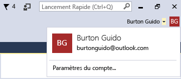
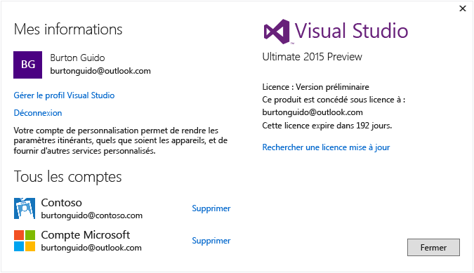

# Utiliser plusieurs comptes d’utilisateur
Si vous avez plusieurs comptes Microsoft et/ou comptes professionnels ou scolaires, vous pouvez les ajouter à Visual Studio. Vous avez ainsi accès aux ressources de n'importe quel compte sans avoir à vous y connecter séparément. Actuellement, Azure, Application Insights, Team Foundation Server et Office 365 prennent en charge l’expérience de connexion simplifiée. D'autres services pourront être rajoutés au fil du temps.

 Après avoir ajouté plusieurs comptes sur un ordinateur, vous pourrez y accéder si vous vous connectez à Visual Studio sur un autre ordinateur. Il est important de noter que, bien que les noms de comptes soient itinérants, les informations d'identification ne le sont pas. Par conséquent, vous devrez entrer les informations d'identification de ces autres comptes la première fois que vous essayerez d'utiliser leurs ressources sur le nouvel ordinateur.  

 Cette procédure pas à pas montre comment ajouter plusieurs comptes à Visual Studio et comment déterminer si les ressources accessibles à partir de ces comptes sont reflétées dans des endroits comme la boîte de dialogue **Ajouter un service connecté** , l' **Explorateur de serveurs**et **Team Explorer**.  

## Connectez-vous à Visual Studio  

- Connectez-vous à Visual Studio avec un compte Microsoft ou un compte professionnel. Votre nom d’utilisateur doit apparaître dans le coin supérieur de la fenêtre, comme ceci :  

       

### Accès à votre compte Azure dans l'Explorateur de serveurs  
 Appuyez sur **Ctrl + Alt + S** pour ouvrir l' **Explorateur de serveurs**. Choisissez l’icône Azure pour la développer. Les ressources disponibles dans le compte Azure associé à l’ID que vous avez utilisé pour vous connecter à Visual Studio s’affichent alors. L’écran doit ressembler à ce qui suit (à ceci près que vous verrez vos propres ressources).

   

 La première fois que vous utilisez Visual Studio sur un appareil spécifique, la boîte de dialogue affiche uniquement les abonnements inscrits sous l'ID avec lequel vous vous êtes connecté à l'IDE. Vous pouvez accéder aux ressources de n'importe lequel de vos autres comptes directement de l' **Explorateur de serveurs** en cliquant avec le bouton droit sur le nœud Azure, en choisissant **Gérer et filtrer les abonnements** , puis en ajoutant vos comptes à partir du contrôle de sélecteur de compte. Si vous le souhaitez, vous pouvez ensuite choisir un autre compte en cliquant sur la flèche déroulante vers le bas et en faisant une sélection dans la liste des comptes. Après avoir choisi le compte, vous pouvez choisir les abonnements inscrits sous ce compte que vous voulez afficher dans l'Explorateur de serveurs.  

   

 La prochaine fois que vous ouvrez l'Explorateur de serveurs, les ressources correspondant à ces abonnements s'affichent.  

### Accès à votre compte Azure via la boîte de dialogue Ajouter un service connecté  

1.  Créez un projet Application universelle en C#.  

2.  Choisissez le nœud du projet dans l’Explorateur de solutions, puis choisissez **Ajouter, Service connecté**. Dans l’Assistant **Ajouter un service connecté** qui apparaît, vous pouvez voir la liste des services dans le compte Azure associé à votre ID de connexion Visual Studio. Notez que vous n'êtes pas obligé de vous connecter séparément à Azure. Vous devez néanmoins vous connecter aux autres comptes la première fois que vous tentez d'accéder à leurs ressources à partir d'un ordinateur donné.  

    > [!WARNING]
    >  Si c’est la première fois que vous créez une application du Store dans Visual Studio sur un ordinateur spécifique, vous devez activer votre appareil pour le mode de développement en accédant à **Paramètres&#124; Mises à jour et sécurité &#124; Pour les développeurs**. Pour plus d’informations, consultez [Activer votre appareil pour le développement](https://msdn.microsoft.com/en-us/library/windows/apps/dn706236.aspx).  

###   Accès à Azure Active Directory dans un projet web  
 Azure AD permet de prendre en charge l'authentification unique des utilisateurs finaux dans les applications web MVC ASP.NET ou l'authentification AD dans les services API web. L'authentification de domaine est différente de l'authentification de comptes d'utilisateurs individuels ; les utilisateurs qui ont accès à votre domaine Active Directory peuvent utiliser leur compte Azure AD existant pour se connecter à vos applications web. Les applications Office 365 peuvent également utiliser l'authentification de domaine. Pour voir à quoi cela ressemble concrètement, créez une application web (**Fichier, Nouveau projet, C#, Cloud, Application web ASP.NET**). Dans la boîte de dialogue Nouveau projet ASP.NET, choisissez **Modifier l'authentification**. L'Assistant Authentification s'affiche et vous permet de choisir le type d'authentification à utiliser dans votre application.  

   

 Pour plus d’informations sur les différents types d’authentification dans ASP.NET, consultez [Creating ASP.NET Web Projects in Visual Studio 2013 (Création de projets web ASP.NET dans Visual Studio 2013)](http://www.asp.net/visual-studio/overview/2013/creating-web-projects-in-visual-studio#orgauth) (les informations relatives à l’authentification sont toujours applicables aux versions actuelles de Visual Studio).  

### Accéder à votre compte Visual Studio Team Services  
 Dans le menu principal, choisissez **Équipe, Se connecter à Team Foundation Server** pour afficher la fenêtre **Team Explorer**. Cliquez sur **Sélectionner les projets d’équipe**puis, dans la zone de liste sous **Sélectionner un serveur Team Foundation Server**, vous devriez voir l’URL de votre compte Visual Studio Team Services. Lorsque vous sélectionnez l'URL, vous êtes connecté sans avoir à entrer une nouvelle fois vos informations d'identification.  

## Ajouter un deuxième compte d'utilisateur à Visual Studio  
 Cliquez sur la flèche bas à côté de votre nom d’utilisateur dans le coin supérieur de Visual Studio. Choisissez ensuite l’élément de menu **Paramètres du compte** . La boîte de dialogue **Gestionnaire de comptes** apparaît et affiche le compte avec lequel vous vous êtes connecté. Choisissez le lien **Ajouter un compte** dans l’angle inférieur de la boîte de dialogue pour ajouter un nouveau compte Microsoft ou un nouveau compte professionnel ou scolaire.  

   

 Suivez les instructions pour entrer les nouvelles informations d'identification du compte. L'illustration suivante montre le Gestionnaire de comptes après l'ajout du compte professionnel Contoso.com par un utilisateur.  

   

## Revisiter l'Assistant lié à la fonctionnalité Ajouter un service connecté et l'Explorateur de serveurs  
 À présent, accédez de nouveau à l' **Explorateur de serveurs** , cliquez avec le bouton droit sur le nœud Azure, puis choisissez **Gérer et filtrer les abonnements**. Choisissez le nouveau compte en cliquant sur la flèche déroulante vers le bas située à côté du compte actif, puis choisissez les abonnements que vous voulez afficher dans l'Explorateur de serveurs. Tous les services associés à l'abonnement spécifié s'affichent alors. Même si vous n'êtes pas connecté à l'IDE de Visual Studio avec le deuxième compte, vous êtes connecté aux services et aux ressources de ce compte. Il en va de même pour **Projet, Ajouter un service connecté** et **Team, Se connecter à Team Foundation Server**.

